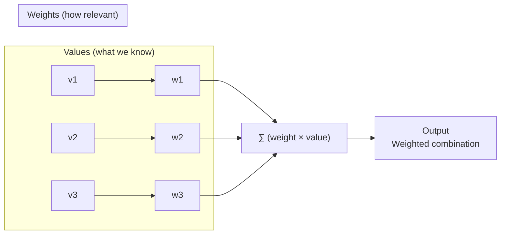
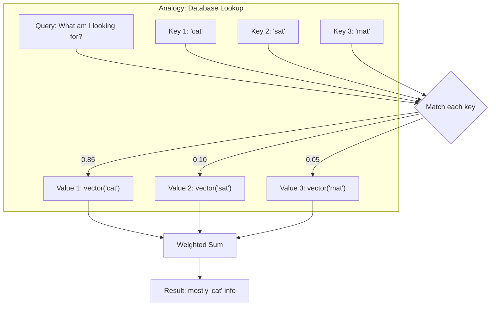
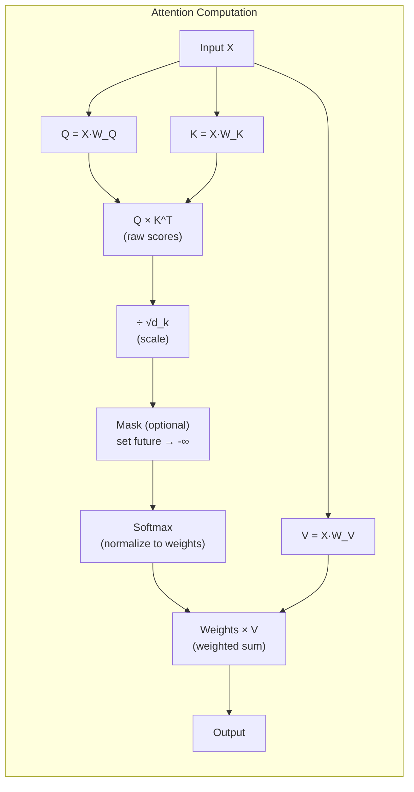
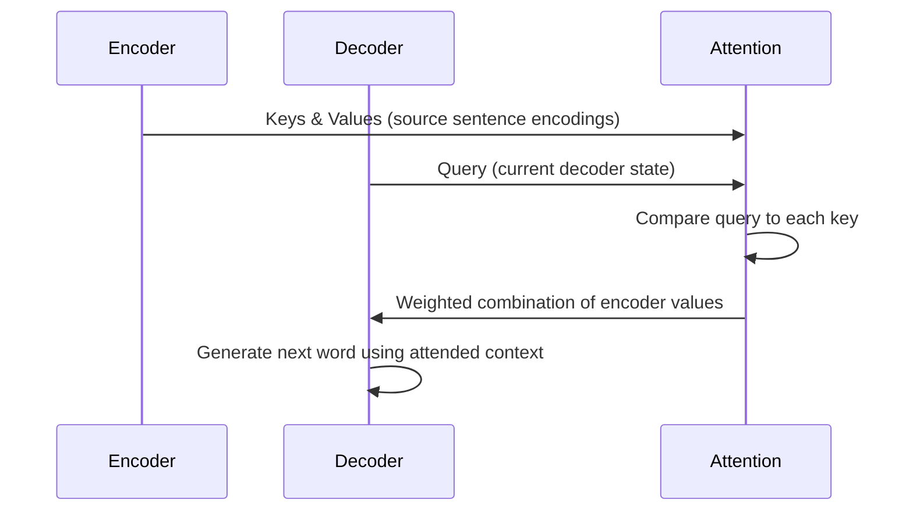
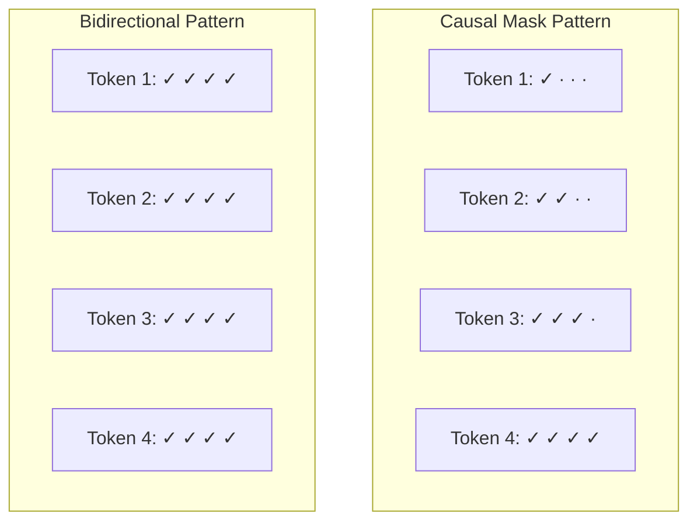
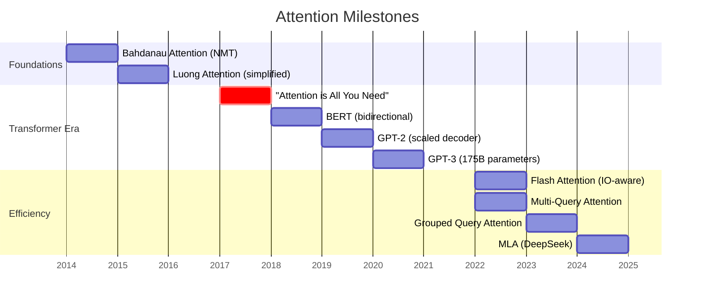

# Attention Mechanism

**Links**: [[Self-Attention]] | [[Multi-Head Attention]] | [[Transformer Architecture]] | [[BERT and Encoder Models]] | [[GPT and Decoder Models]] | [[Sequence-to-Sequence Models]] | [[Scaling Laws]]

---

## The Problem Attention Solves

Before attention, sequence models (RNNs, LSTMs) encoded an entire input sequence into a single fixed-size vector. This created a bottleneck: the model had to compress everything -- every word, every nuance -- into one vector, then decode from it. Long sentences lost details at the beginning.

```
RNN without attention:
  "The cat sat on the mat" → [fixed vector] → "Le chat s'est assis..."
                                               (loses accuracy for long sentences)

  With attention:
  "The cat sat on the mat" → [dynamic focus per output step] → "Le chat s'est assis..."
                                                               (looks back at "cat" when translating "chat")
```

**The insight**: Instead of compressing everything into one vector, let the model look back at the input at each step. Let it decide what matters right now.

---

## The Core Idea: Weighted Averaging

Attention is fundamentally a **weighted average** of values, where the weights are learned dynamically based on relevance.



The weights are not static -- they are computed by comparing a **Query** (what I need) against **Keys** (what I have):

```
weight_i = match(query, key_i)

output = Σ weight_i × value_i
```

where weights sum to 1 (via softmax).

---

## Attention as a Retrieval System

The Query-Key-Value analogy comes from information retrieval:



In a database, you match a query against keys to get one result. In attention, you get a weighted blend -- the model takes a bit of everything, but focuses on what matches best.

---

## The Math Step by Step

### Step 1: Project to Q, K, V

Each input token is projected into three vectors using learned weight matrices:

```
Q = X × W_Q     (Query: what am I looking for?)
K = X × W_K     (Key: what do I contain?)
V = X × W_V     (Value: what information do I carry?)
```

where X is the input matrix (sequence length x d_model), and W_Q, W_K, W_V are learned d_model x d_k matrices.

### Step 2: Compute Attention Scores

```
Scores = Q × K^T
```

This produces a matrix where element (i, j) is the raw similarity between token i's query and token j's key.

### Step 3: Scale

```
Scores = Scores / √d_k
```

Why scale? For large d_k, the dot products grow large in magnitude, pushing softmax into regions with extremely small gradients. Scaling by √d_k keeps the values in a reasonable range.

### Step 4: Mask (if causal)

In decoder self-attention, future tokens are masked out:

```
Scores[i, j] = -∞ for j > i    (can't look ahead)
```

After softmax, these positions become exactly 0.

### Step 5: Softmax

```
Weights = softmax(Scores, dim=-1)
```

Each row now sums to 1, representing a probability distribution over which tokens to attend to.

### Step 6: Weighted Sum

```
Output = Weights × V
```

Each output token is a weighted combination of all value vectors, where the weights come from the query-key match.



---

## Why Attention Works

### Quadratic Advantage on Long-Range Dependencies

RNNs process sequentially: information must travel through many steps to connect distant words. The path length for "The cat... sat" grows linearly with distance.

Attention creates a direct path between any two positions. Path length is always 1.

```
RNN path:         The → cat → ... → sat  (O(n) steps)
Attention path:   The ───────────────→ sat  (1 step, direct)

This is why Transformers handle long-range dependencies better.
```

### Parallelization

RNNs must process tokens sequentially (step 1 depends on RNN state from step 0). Attention computes all positions in parallel (each position attends to all others independently).

```
RNN:         t=1 → t=2 → t=3 → ... (sequential, cannot parallelize)
Attention:   all positions at once   (fully parallelizable on GPU)
```

This parallelization is the primary reason Transformers scaled, not RNNs.

### Dynamic Computation

Attention weights change based on input. The model learns to route information differently depending on context -- this is more flexible than fixed computation paths.

```
"bank" in "river bank" attends to "river"
"bank" in "money bank" attends to "money"
```

The same word gets different context vectors depending on its neighbors.

---

## Types of Attention

### 1. Encoder-Decoder (Cross) Attention

Used in translation models. The decoder queries the encoder's output:



The decoder decides which source words matter for the current output word. When translating "chat", it attends heavily to "cat".

### 2. Self-Attention

Each position attends to all positions in the same sequence. Every token can directly access every other token:

```
Input:  ["The", "cat", "sat", "on", "the", "mat"]

"The" attends to: [The, cat, sat, on, the, mat]
"cat" attends to: [The, cat, sat, on, the, mat]
...
```

Self-attention is how BERT and encoder models understand context bidirectionally.

### 3. Causal (Masked) Self-Attention

Same as self-attention, but each position can only attend to itself and earlier positions:

```
Input:  ["The", "cat", "sat"]

"The"  attends to: [The]             (only itself)
"cat"  attends to: [The, cat]        (past + present)
"sat"  attends to: [The, cat, sat]   (past + present)
```

This is used in all autoregressive decoder models (GPT, LLaMA, Mistral) to prevent "cheating" by looking at future tokens.



---

## Attention Variants Compared

| Variant | Query | Key/Value Source | Mask | Used In |
|---------|-------|-----------------|------|---------|
| Self-attention | Input tokens | Same sequence | None | BERT, encoder blocks |
| Causal self-attention | Input tokens | Same sequence | Causal (future hidden) | GPT, LLaMA, decoder blocks |
| Cross-attention | Decoder tokens | Encoder output | None | T5, BART, translation |
| Encoder-decoder self-attention | Encoder input | Same sequence | None | All encoders |

---

## The Evolution of Attention



| Year | Innovation | Why It Mattered |
|------|-----------|-----------------|
| 2014 | Bahdanau attention | First to add attention to seq2seq, broke the fixed-vector bottleneck |
| 2015 | Luong attention | Simplified score computation (dot product instead of learned) |
| 2017 | Transformer | Removed RNNs entirely, pure attention, fully parallel |
| 2022 | Flash Attention | Made attention 2-4x faster by reducing GPU memory reads/writes |
| 2023 | Grouped Query Attention | Reduced memory in KV cache by sharing K/V across query heads |
| 2024 | Multi-head Latent Attention | Compressed KV cache to near-zero size for long contexts |

---

## Common Misconceptions

| Misconception | Truth |
|--------------|-------|
| Attention is about "understanding" | Attention is weighted averaging -- it knows correlation, not causation |
| Higher attention weight means more important | It means more relevant to the query, not necessarily more important overall |
| Attention visualizations show model reasoning | They show correlation patterns, not reasoning; different runs give different patterns |
| Attention replaces memory entirely | It provides direct access, but the model still needs capacity in its weights |

---

## Practical Implementation

```python
import torch
import torch.nn.functional as F

def scaled_dot_product_attention(Q, K, V, mask=None):
    """
    Q: (batch, seq_len, d_k)
    K: (batch, seq_len, d_k)
    V: (batch, seq_len, d_v)
    mask: (seq_len, seq_len) or broadcastable, True = allowed
    """
    d_k = Q.size(-1)
    scores = torch.matmul(Q, K.transpose(-2, -1))  # (batch, seq, seq)
    scores = scores / (d_k ** 0.5)                  # Scale

    if mask is not None:
        scores = scores.masked_fill(~mask, float("-inf"))

    weights = F.softmax(scores, dim=-1)             # (batch, seq, seq)
    output = torch.matmul(weights, V)               # (batch, seq, d_v)
    return output, weights

# Example: 4 tokens, d_k=8
Q = torch.randn(1, 4, 8)
K = torch.randn(1, 4, 8)
V = torch.randn(1, 4, 8)

output, weights = scaled_dot_product_attention(Q, K, V)
print(weights.shape)  # (1, 4, 4) -- each token's attention to all others
```

## Why Position Matters

Attention on its own is **permutation invariant** -- it treats "cat sat mat" the same as "mat sat cat" because it compares all pairs equally. The model needs positional encoding to know token order. Without it, attention sees a bag of words.

```
"The cat sat" vs "sat cat The"
Without positional encoding: identical attention patterns
With positional encoding: attends differently because positions differ
```

See [[Positional Encoding]] and [[RoPE]] for how modern models solve this.

---

## Key Takeaways

1. Attention is **weighted averaging** based on learned relevance scores
2. The **scaled dot product** is the standard computation: QK^T / sqrt(d_k), then softmax, then weighted sum of V
3. Attention creates **direct paths** between any positions (O(1) path length vs O(n) for RNNs)
4. Attention is **fully parallelizable** across positions, enabling training at scale
5. Without position information, attention is **permutation invariant** -- positional encoding is required
6. The QKV analogy comes from **information retrieval** -- query matches keys to retrieve values

**Next**: [[Self-Attention]] -- A deeper look at how self-attention computes token relationships
