# GPT and Decoder Models

**Links**: [[Transformer Architecture]] | [[Self-Attention]] | [[Multi-Head Attention]] | [[BERT and Encoder Models]] | [[Pre-training and Fine-tuning]] | [[Prompt Engineering for RAG]]

## What is GPT?

GPT (Generative Pre-trained Transformer — Radford et al., 2018) uses only the decoder stack with masked (causal) self-attention for autoregressive text generation. Each token is predicted one at a time, conditioned on all previous tokens in the sequence.

## Autoregressive Generation Flow

```mermaid
graph LR
    subgraph Step1[Step 1]
        B1[BOS] --> M1[Model] --> P1[▸ The]
    end
    subgraph Step2[Step 2]
        B2[BOS The] --> M2[Model] --> P2[▸ cat]
    end
    subgraph Step3[Step 3]
        B3[BOS The cat] --> M3[Model] --> P3[▸ sat]
    end
    subgraph Step4[Step 4]
        B4[BOS The cat sat] --> M4[Model] --> P4[▸ on]
    end
    subgraph Step5[Step 5]
        B5[BOS The cat sat on] --> M5[Model] --> P5[▸ the]
    end
    P1 -->|append| B2
    P2 -->|append| B3
    P3 -->|append| B4
    P4 -->|append| B5
```



Each step feeds the entire generated prefix back into the model. The KV cache stores previous keys/values to avoid recomputation, reducing per-step cost from O(N²) to O(N).

## Architecture

```
Input:   [BOS]  The   cat   sat
            ↓     ↓     ↓     ↓
          ┌──────────────────────────┐
          │  Masked Self-Attention   │ ← Future is masked to -∞
          │  Add & LayerNorm         │
          │  Feed-Forward (MLP)      │
          │  Add & LayerNorm         │
          │  (×N layers)             │
          └──────────────────────────┘
            ↓     ↓     ↓     ↓
Output:   The   cat   sat   on
                           ↑
                    Predicted next token
```

## Causal Attention Mask

Each token can only attend to itself and previous tokens. Future positions are masked to -infinity before the softmax, assigning them zero attention weight:

```
Attention Mask (N=5):
             BOS   The   cat   sat   on
BOS        [  1     0     0     0     0 ] ← only itself
The        [  1     1     0     0     0 ] ← BOS + itself
cat        [  1     1     1     0     0 ] ← first three
sat        [  1     1     1     1     0 ] ← first four
on         [  1     1     1     1     1 ] ← all five
```

Implementation: add a lower-triangular mask filled with 0 (keep) and -1e9 (mask) to the attention scores before softmax: `scores = scores + mask` where masked positions = -inf.

## Pre-training: Next Token Prediction

**Objective**: Maximize log-likelihood of the next token given all previous tokens.

```
Input:  "The cat sat on the"
Target:                  "mat"
Loss:   cross-entropy(softmax(logits[-1]), target_token)
```

Unlike BERT's denoising objective, GPT's autoregressive objective is inherently a generative task — the model learns both representation and generation simultaneously.

## Prompting vs Fine-tuning

| Aspect | Prompting (In-Context Learning) | Fine-tuning |
|--------|-------------------------------|-------------|
| **Data needed** | 0-100 examples in the prompt | 1K-100K+ labeled examples |
| **Compute** | Single forward pass | Full training loop (backprop) |
| **Model weights** | Unchanged (frozen) | Updated via gradient descent |
| **Task switching** | Instant — edit the prompt | Slow — retrain for each task |
| **Performance** | Good for simple/clear patterns | Best for specialized domains |
| **Cost per task** | Low setup, pay-per-token | High setup, low per-inference |
| **Example** | "Classify: great movie → Positive" | Train classifier head on 10K reviews |
| **Generalization** | Zero-shot to new tasks | Task-specific only |
| **Overfitting risk** | None (no training) | Possible with small data |

## Evolution of GPT Models

| Model | Date | Params | Data | Key Innovation |
|-------|------|--------|------|----------------|
| **GPT-1** | Jun 2018 | 117M | BooksCorpus (4.5 GB) | Transformer decoder + generative pre-training |
| **GPT-2** | Feb 2019 | 1.5B | WebText (40 GB) | Zero-shot task transfer without fine-tuning |
| **GPT-3** | Jun 2020 | 175B | Common Crawl (570 GB) | In-context learning via few-shot prompting |
| **GPT-3.5** | Mar 2022 | ~175B | Code + text + instructions | RLHF + instruction tuning (InstructGPT) |
| **GPT-4** | Mar 2023 | ~1.8T | Proprietary multimodal | Text + image input, improved reasoning |
| **GPT-4o** | May 2024 | ~1.8T | Proprietary omni-modal | Real-time audio, vision, text (omni) |

## Modern Decoder Architectures

| Model | Params | Architecture | Key Innovation |
|-------|--------|-------------|----------------|
| **Llama 3** | 8B-405B | Decoder + RoPE + SwiGLU + GQA | Open-source, grouped-query attention for efficiency |
| **Mistral** | 7B-123B | Decoder + Sliding Window + GQA | Efficient long context (32k+ tokens) |
| **DeepSeek-V2** | 236B | MoE Decoder + MLA | Multi-Head Latent Attention, Mixture-of-Experts |
| **Claude 3** | Unknown | Decoder + Constitutional AI | Safety-focused RLHF, long context (200K) |
| **Gemini** | Unknown | Decoder + MoE | Multimodal native (text, image, audio, video) |
| **Command R+** | 104B | Decoder + RAG | Built-in retrieval for grounded generation |
| **Qwen 2** | 0.5B-72B | Decoder + RoPE + GQA | Strong multilingual performance |

## Inference with KV Cache

```python
def generate(prompt, max_tokens=100, temperature=0.7):
    tokens = tokenize(prompt)
    kv_cache = {}
    for _ in range(max_tokens):
        logits, kv_cache = model(tokens, kv_cache=kv_cache)
        logits = logits[-1, :] / temperature
        probs = softmax(logits)
        next_token = sample(probs)
        tokens.append(next_token)
        if next_token == EOS_ID:
            break
    return detokenize(tokens)
```

The KV cache stores keys and values from all previous positions per layer, avoiding O(N²) recomputation at each step. This reduces inference from O(N² × L) to O(N × L) per generation step.

**Next**: [[Attention Mechanism]] — The key idea behind transformers
