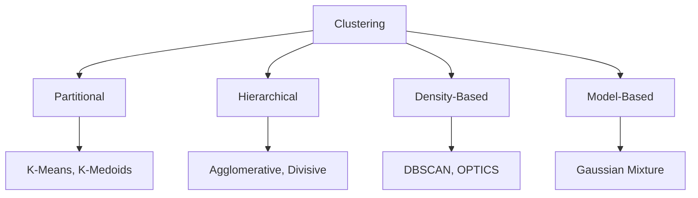

# Clustering Algorithms

## What is Clustering?

Clustering groups similar data points without labels (unsupervised learning). It is used for customer segmentation, anomaly detection, image compression, and exploratory data analysis.



## K-Means

Partitions data into K clusters by minimizing within-cluster variance (inertia). Each cluster is represented by its centroid.

**Algorithm:**
1. Initialize K centroids randomly
2. Assign each point to the nearest centroid
3. Recompute centroids as the mean of assigned points
4. Repeat steps 2-3 until convergence

### Elbow Method for Choosing K

```python
from sklearn.cluster import KMeans

inertias = []
for k in range(1, 11):
    kmeans = KMeans(n_clusters=k, n_init=10, random_state=42)
    kmeans.fit(X)
    inertias.append(kmeans.inertia_)

# Plot k vs inertia — look for the "elbow"
```

The elbow method plots K against inertia. The optimal K is where the rate of decrease sharply changes (the "elbow"). Since the elbow is not always clear, use silhouette analysis as a complement.

```python
kmeans = KMeans(n_clusters=5, random_state=42)
labels = kmeans.fit_predict(X)
centroids = kmeans.cluster_centers_
```

**Limitations:** Assumes spherical clusters, sensitive to scaling, affected by initial centroid placement.

## DBSCAN (Density-Based Spatial Clustering of Applications with Noise)

DBSCAN finds clusters as dense regions separated by sparse regions. It does not require specifying K and can discover arbitrarily shaped clusters.

**Parameters:**
- **`eps`:** Maximum distance between two points to be considered neighbors
- **`min_samples`:** Minimum neighbors to form a dense region

```python
from sklearn.cluster import DBSCAN

dbscan = DBSCAN(eps=0.5, min_samples=5)
labels = dbscan.fit_predict(X)
# label = -1 means outlier/noise
```

**Properties:**
- No need to specify K
- Finds arbitrarily shaped clusters (spirals, moons)
- Identifies outliers automatically
- Struggles with varying densities (use OPTICS instead)
- Sensitive to `eps` — must be tuned

## Hierarchical Clustering

Builds a tree of clusters (dendrogram) by either merging (agglomerative / bottom-up) or splitting (divisive / top-down).

```python
from sklearn.cluster import AgglomerativeClustering

hierarchical = AgglomerativeClustering(
    n_clusters=5,
    linkage='ward'  # Minimizes variance increase
)
labels = hierarchical.fit_predict(X)
```

**Linkage criteria:**
- **Ward:** Minimizes variance increase (default, works well for spherical clusters)
- **Complete:** Minimum of maximum distances (produces compact clusters)
- **Average:** Minimum of average distances (balanced)
- **Single:** Minimum of minimum distances (can produce long chains)

**Dendrogram interpretation:** The vertical axis represents distance. Cutting the dendrogram horizontally at a chosen distance produces a desired number of clusters. Longer vertical lines indicate more distinct cluster separations.

## Gaussian Mixture Models (GMM)

Assumes data is generated from a mixture of Gaussian distributions. Unlike K-Means, GMM provides a **probabilistic** assignment (soft clustering) and can model elliptical clusters.

```python
from sklearn.mixture import GaussianMixture

gmm = GaussianMixture(n_components=5, covariance_type='full')
labels = gmm.fit_predict(X)
probs = gmm.predict_proba(X)  # Soft assignments
```

## Evaluation Metrics

| Metric | Range | Goal | Description |
|--------|-------|------|-------------|
| **Silhouette Score** | [-1, 1] | Higher better | Measures cohesion vs separation |
| **Davies-Bouldin Index** | [0, ∞) | Lower better | Average similarity between clusters |
| **Inertia (WCSS)** | [0, ∞) | Lower better | Sum of squared distances to centroids |
| **Calinski-Harabasz** | [0, ∞) | Higher better | Ratio of between-cluster to within-cluster variance |

## Comparison

| Algorithm | Shape | K needed? | Scalable | Outliers |
|-----------|-------|-----------|----------|----------|
| K-Means | Spherical | Yes | Very high | Sensitive |
| DBSCAN | Arbitrary | No | Medium | Robust |
| Hierarchical | Any | Optional | Low | Moderate |
| Gaussian Mixture | Elliptical | Yes | High | Probabilistic |

**Links**: [[Dimensionality Reduction]] | [[Feature Engineering]] | [[Recommender Systems]] | [[Vector Databases for RAG]] | [[Data Structures]]

**Next**: [[Dimensionality Reduction]] — PCA, t-SNE, UMAP
