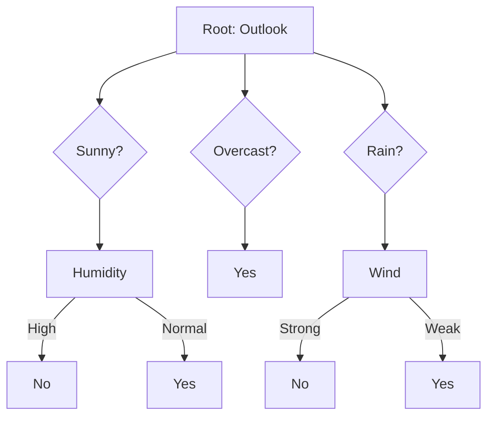

# Decision Trees and Random Forests

## Decision Trees

A decision tree splits data into branches based on feature values, creating if-then-else rules for classification or regression. Each internal node tests a feature, each branch represents an outcome, and each leaf holds a prediction.

### How Splits Are Chosen

At each node, the algorithm evaluates all features and thresholds to find the split that best separates the target classes. Split quality is measured by impurity reduction:



### Impurity Measures

| Measure | Formula | Range | Property |
|---------|---------|-------|----------|
| **Gini Impurity** | $1 - \sum p_i^2$ | [0, 0.5] | Default for CART; faster computation |
| **Entropy** | $-\sum p_i \log_2 p_i$ | [0, 1] | Information gain; more sensitive to distribution |
| **MSE** | $\frac{1}{n}\sum(y_i - \hat{y})^2$ | [0, $\infty$) | Used for regression trees |

Gini and entropy usually produce similar trees; Gini is cheaper and the default in scikit-learn.

```python
from sklearn.tree import DecisionTreeClassifier

tree = DecisionTreeClassifier(
    max_depth=5,
    min_samples_split=10,
    criterion='gini'
)
tree.fit(X_train, y_train)
```

### Pruning Techniques

**Pre-pruning (early stopping):** Halts tree growth when a condition is met to avoid overfitting:
- `max_depth`: Limits tree height
- `min_samples_split`: Minimum samples required to split a node
- `min_samples_leaf`: Minimum samples per leaf node
- `max_features`: Number of features considered per split

**Post-pruning (cost-complexity pruning):** Grows the full tree, then prunes subtrees that provide minimal impurity reduction per additional leaf. Controlled by `ccp_alpha`:

```python
tree = DecisionTreeClassifier(ccp_alpha=0.01)
path = tree.cost_complexity_pruning_path(X_train, y_train)
# Select best alpha from path.ccp_alphas
```

### Overfitting

Decision trees are prone to overfitting without regularization:

```python
tree = DecisionTreeClassifier(
    max_depth=5,
    min_samples_split=20,
    min_samples_leaf=5,
    max_features='sqrt',
    ccp_alpha=0.01,
)
```

## Random Forest

A random forest builds many decision trees and averages their predictions. Randomness is injected in two ways:

1. **Bagging (Bootstrap Aggregating):** Each tree trains on a bootstrap sample (random sample *with replacement*) of the data. Roughly 63% of unique instances appear per sample; the remaining 37% (out-of-bag) serve as a validation set.

2. **Feature Randomness:** At each split, only a random subset of features is considered (`max_features`). This decorrelates individual trees — if all trees used the same features, they would make similar splits and the ensemble would not reduce variance.

```python
from sklearn.ensemble import RandomForestClassifier

rf = RandomForestClassifier(
    n_estimators=500,
    max_depth=10,
    min_samples_split=5,
    max_features='sqrt',
    bootstrap=True,
    oob_score=True,
    n_jobs=-1,
    random_state=42,
)
rf.fit(X_train, y_train)
print(f"OOB Score: {rf.oob_score_:.3f}")
```

### Hyperparameter Tuning

| Parameter | Effect | Typical Range |
|-----------|--------|---------------|
| `n_estimators` | More trees → stable but slower | 100-2000 |
| `max_depth` | Deeper → captures interactions, overfits | 3-50 or None |
| `min_samples_split` | Higher → simpler, more robust | 2-50 |
| `min_samples_leaf` | Higher → smoother decision boundary | 1-20 |
| `max_features` | Lower → more decorrelation | `'sqrt'`, `'log2'`, 0.1-0.5 |
| `bootstrap` | Enable/disable bagging | True / False |

### Feature Importance

```python
importances = rf.feature_importances_
indices = np.argsort(importances)[-10:]
```

## Pros and Cons

| Pros | Cons |
|------|------|
| No feature scaling needed | Can overfit (without tuning) |
| Handles mixed data types | Less interpretable than single tree |
| Built-in feature importance | Slower with many trees |
| Resistant to outliers | Poor at extrapolation |
| Naturally parallel training | Large model size in memory |

**Links**: [[Ensemble Methods]] | [[Gradient Boosting]] | [[Feature Engineering]] | [[Hyperparameter Tuning]]

**Next**: [[Gradient Boosting]] — XGBoost, LightGBM, CatBoost
