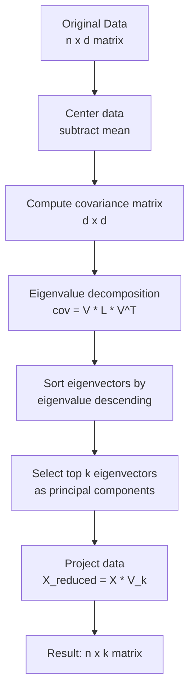

# Dimensionality Reduction

**Links**: [[Feature Engineering]] | [[Clustering Algorithms]] | [[Word Embeddings]] | [[Text Embedding Models]] | [[Data Visualization]]

## What is Dimensionality Reduction?

Reducing the number of features while preserving as much information as possible. Used for visualization (2D/3D plotting), noise reduction (discarding low-variance dimensions), speeding up downstream models (fewer features = faster training), and mitigating the curse of dimensionality.

### Feature Selection vs Feature Extraction

| Approach | Description | Example |
|----------|------------|---------|
| **Feature Selection** | Choose a subset of original features | Chi-squared test, mutual information, L1 regularization |
| **Feature Extraction** | Transform into a lower-dimensional space | PCA, t-SNE, UMAP, autoencoders |

- **Selection** retains interpretability (you know which features matter).
- **Extraction** often yields better compression but loses direct feature meaning.

## PCA (Principal Component Analysis)

Finds orthogonal directions (principal components) that capture maximum variance. The first PC points along the direction of greatest spread; each subsequent PC is orthogonal and captures the next largest residual variance.



### Eigenvalue Decomposition

Each eigenvalue λⱼ represents the variance captured by the j-th principal component. The **explained variance ratio** λⱼ / Σλᵢ tells you how much information each PC retains.

```python
from sklearn.decomposition import PCA
import matplotlib.pyplot as plt
import numpy as np

pca = PCA(n_components=2)
X_reduced = pca.fit_transform(X)

plt.scatter(X_reduced[:, 0], X_reduced[:, 1], c=labels, alpha=0.6)
plt.xlabel(f'PC1 ({pca.explained_variance_ratio_[0]:.1%})')
plt.ylabel(f'PC2 ({pca.explained_variance_ratio_[1]:.1%})')
plt.title('PCA Projection')

# Cumulative explained variance
cumulative = np.cumsum(pca.explained_variance_ratio_)
n_95 = np.argmax(cumulative >= 0.95) + 1
print(f"Components to retain 95% variance: {n_95}")
```

### When to Use PCA

| Scenario | Recommended |
|----------|-------------|
| Linear relationships | ✅ Excellent |
| Preprocessing before modeling | ✅ Standard practice |
| Noise reduction | ✅ Top components filter noise |
| Interpretable components | ⚠️ Loadings are interpretable but not features |
| Non-linear manifolds | ❌ Use t-SNE or UMAP instead |

## t-SNE (t-Distributed Stochastic Neighbor Embedding)

Non-linear method that preserves local structure by modeling pairwise similarities. Converts high-dimensional Euclidean distances into conditional probabilities and minimizes the KL divergence between the high-d and low-d distributions.

### Perplexity Tuning

Perplexity controls the balance between local and global aspects of the data. Roughly, it's the effective number of neighbors each point considers.

| Perplexity | Behavior | Use Case |
|-----------|----------|----------|
| 5-10 | Very local structure, many small clusters | Small datasets (< 500 points) |
| 30-50 | Balanced local-global | Default range for most datasets |
| 50-100 | Smoother, more global structure | Large datasets (> 5000 points) |

```python
from sklearn.manifold import TSNE

def tsne_grid_search(X, perplexities=[5, 30, 50, 80]):
    fig, axes = plt.subplots(1, 4, figsize=(16, 4))
    for i, perp in enumerate(perplexities):
        tsne = TSNE(n_components=2, perplexity=perp, random_state=42)
        X_tsne = tsne.fit_transform(X)
        axes[i].scatter(X_tsne[:, 0], X_tsne[:, 1], c=labels, s=1)
        axes[i].set_title(f'perplexity={perp}')
    return fig
```

**Caveats:**
- Non-deterministic (different runs produce different layouts)
- Cost scales O(n²) — use Barnes-Hut approximation for large datasets
- Global distances are not meaningful (only neighbor relationships)
- Does not generalize to new data (no `transform` method)

## UMAP (Uniform Manifold Approximation and Projection)

Faster than t-SNE, better at preserving global structure, and supports supervised dimensionality reduction.

```python
import umap

reducer = umap.UMAP(
    n_components=2,
    n_neighbors=15,      # balances local vs global (similar to t-SNE perplexity)
    min_dist=0.1,         # minimum distance between points in embedding
    metric='euclidean',   # distance metric
    random_state=42
)
X_umap = reducer.fit_transform(X)

# UMAP supports transform (unlike t-SNE)
X_test_umap = reducer.transform(X_test)
```

### UMAP vs t-SNE vs PCA

| Property | PCA | t-SNE | UMAP |
|----------|-----|-------|------|
| Linear | ✅ | ❌ | ❌ |
| Preserves global structure | ✅ (variance) | ❌ | ✅ (partial) |
| Preserves local structure | ❌ | ✅ | ✅ |
| Speed | O(n·d²) | O(n²) | O(n log n) |
| Deterministic | ✅ | ❌ | ❌ |
| Out-of-sample transform | ✅ | ❌ | ✅ |
| Suitable for preprocessing | ✅ | ❌ | ⚠️ |
| Best for visualization | ❌ | ✅ | ✅ |

## Comprehensive Comparison

| Method | Linear | Preserves | Speed | Scalability | Use Case |
|--------|--------|-----------|-------|-------------|----------|
| PCA | Yes | Global variance | Fast | > 100K rows | Preprocessing, decorrelation, feature extraction |
| t-SNE | No | Local neighborhoods | Slow | < 10K rows | Exploration, visualization |
| UMAP | No | Local + global | Medium | > 100K rows | Visualization + clustering + preprocessing |
| Truncated SVD | Yes | Variance (text) | Fast | > 1M rows | Text (LSA, topic modeling) |
| Autoencoders | No | Non-linear manifold | Slow | Large data | Deep feature learning |

## Practical Guidelines

1. **Start with PCA** — it's fast, deterministic, and often sufficient for preprocessing.
2. **Use t-SNE for exploration** of small-to-medium datasets where cluster visualization is the goal.
3. **Use UMAP for large datasets** or when you need to generalize to new points.
4. **Combine both**: PCA first to 50 dimensions, then t-SNE/UMAP for visualization.
5. **Validate by reconstruction error** or downstream task performance, not just visual appeal.

```python
# Recommended pipeline
from sklearn.pipeline import Pipeline

pipe = Pipeline([
    ('pca', PCA(n_components=50)),
    ('umap', umap.UMAP(n_components=2, random_state=42))
])
X_vis = pipe.fit_transform(X)
```

**Next**: [[Clustering Algorithms]] — Grouping unlabeled data
