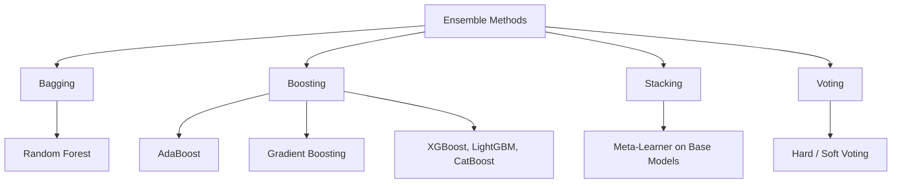

# Ensemble Methods

## What are Ensembles?

Ensemble methods combine multiple models to produce better results than any single model. They exploit the idea that diverse, independent models make different errors, and aggregating them cancels those errors.



## Bagging (Bootstrap Aggregating)

Trains models in **parallel** on random bootstrap subsets (sampling with replacement) and averages predictions.

```
Data → Bootstrap 1 → Model 1 ──┐
     → Bootstrap 2 → Model 2 ──┤→ Average/Vote → Prediction
     → Bootstrap 3 → Model 3 ──┘
```

- **Reduces variance** (overfitting) without increasing bias
- Models are independent — can be trained in parallel
- **Random Forest:** Bagging + random feature selection

```python
from sklearn.ensemble import BaggingClassifier
from sklearn.tree import DecisionTreeClassifier

bag = BaggingClassifier(
    estimator=DecisionTreeClassifier(),
    n_estimators=100,
    max_samples=0.8,
    bootstrap=True,
    n_jobs=-1,
)
```

## Boosting

Trains models **sequentially**, each new model focusing on the errors of the previous one. Pseudo-residuals (negative gradient of the loss) guide each new model.

- **Reduces bias** (underfitting)
- Sequential nature prevents parallelization
- Variants: AdaBoost, Gradient Boosting, XGBoost, LightGBM, CatBoost

## Stacking (Stacked Generalization)

Trains a **meta-learner** on the predictions of diverse base models. The base models are trained on the full data; their outputs become features for the meta-model.

```python
from sklearn.ensemble import StackingClassifier
from sklearn.linear_model import LogisticRegression
from sklearn.svm import SVC

stack = StackingClassifier(
    estimators=[
        ('rf', RandomForestClassifier(n_estimators=200)),
        ('svm', SVC(probability=True)),
        ('gb', GradientBoostingClassifier(n_estimators=100)),
    ],
    final_estimator=LogisticRegression(),
    cv=5,  # Use cross-val predictions to prevent overfitting
)
stack.fit(X_train, y_train)
```

Using cross-validated predictions (rather than training-set predictions) for the meta-learner prevents data leakage.

## Voting

Combines models by averaging their predictions:

- **Hard voting:** Majority vote (class with most votes wins)
- **Soft voting:** Averages predicted probabilities (better when models are well-calibrated)

```python
from sklearn.ensemble import VotingClassifier

voting = VotingClassifier(
    estimators=[
        ('lr', LogisticRegression()),
        ('rf', RandomForestClassifier(n_estimators=200)),
        ('svm', SVC(probability=True)),
    ],
    voting='soft'
)
voting.fit(X_train, y_train)
```

## Bias-Variance Trade-off in Ensembles

| Method | Bias | Variance | Effect |
|--------|------|----------|--------|
| Single model | Moderate | Moderate | Baseline |
| Bagging | Unchanged | **Reduced** | Combats overfitting |
| Boosting | **Reduced** | Increased | Combats underfitting |
| Stacking | Reduced | Slightly increased | Both, depends on meta-learner |

Diverse base models are critical — if all models make the same errors, ensembling provides no benefit.

## Comparison

| Aspect | Bagging | Boosting | Stacking |
|--------|---------|----------|----------|
| Training | Parallel | Sequential | Parallel (base) + single (meta) |
| Goal | Reduce variance | Reduce bias | Combine diverse strengths |
| Base models | Strong (deep trees) | Weak (shallow trees) | Any |
| Overfit risk | Low | High (needs regularization) | Medium |
| Common libs | RandomForest | XGBoost, LightGBM | scikit-learn, ML-Ensemble |

## When to Use

| Method | Scenario |
|--------|----------|
| Bagging | High variance, overfitting |
| Boosting | High bias, underfitting |
| Stacking | Very different model types, need best accuracy |
| Voting | Need robustness, lower risk |

**Links**: [[Decision Trees and Random Forests]] | [[Gradient Boosting]] | [[Hyperparameter Tuning]] | [[Text Classification]] | [[Feature Engineering]]

**Next**: [[Gradient Boosting]] — XGBoost, LightGBM, CatBoost
