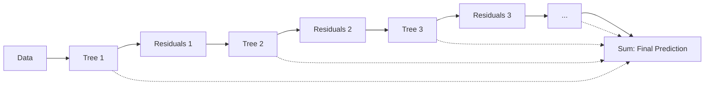

# Gradient Boosting

## What is Gradient Boosting?

Gradient boosting builds an ensemble of weak learners (typically shallow decision trees) **sequentially**, where each new tree fits the **residuals** (negative gradient of the loss function) of the previous ensemble. This reduces bias iteratively.



### Gradient Descent Analogy

Each tree moves the model in the direction of the negative gradient of the loss function. The learning rate $\eta$ controls how much each tree contributes:

$$F_m(x) = F_{m-1}(x) + \eta \cdot h_m(x)$$

where $h_m$ is the tree fitted to residuals. A lower $\eta$ requires more trees but generalizes better.

## Popular Libraries

| Feature | XGBoost | LightGBM | CatBoost |
|---------|---------|----------|----------|
| **Split Strategy** | Level-wise (depth-first) | Leaf-wise (best-first) | Symmetric trees |
| **Categorical Support** | Manual encoding | Native ( categorical features ) | Native with ordered target encoding |
| **GPU Training** | Yes | Yes | Yes |
| **Speed** | Fast | Fastest (histogram-based) | Medium |
| **Default Performance** | Good with tuning | Good with tuning | Excellent out-of-box |
| **Best For** | Competitions, general use | Large datasets, high cardinality | Categorical features, beginner-friendly |
| **Missing Values** | Learned direction | Greedy imputation | Learned direction |

## XGBoost

```python
import xgboost as xgb

model = xgb.XGBClassifier(
    n_estimators=1000,
    max_depth=6,
    learning_rate=0.01,
    subsample=0.8,
    colsample_bytree=0.8,
    eval_metric='logloss',
    early_stopping_rounds=50,
)
model.fit(
    X_train, y_train,
    eval_set=[(X_val, y_val)],
    verbose=100,
)
```

## LightGBM

LightGBM uses **leaf-wise** tree growth and histogram-based binning, making it significantly faster on large datasets:

```python
import lightgbm as lgb

model = lgb.LGBMClassifier(
    num_leaves=31,
    learning_rate=0.05,
    n_estimators=1000,
    feature_fraction=0.8,
    bagging_fraction=0.8,
    bagging_freq=5,
    verbosity=-1,
)
model.fit(
    X_train, y_train,
    eval_set=[(X_val, y_val)],
    callbacks=[lgb.early_stopping(50)],
)
```

## CatBoost

CatBoost uses **ordered boosting** and **symmetric trees**, and handles categorical features natively without encoding:

```python
from catboost import CatBoostClassifier

model = CatBoostClassifier(
    iterations=1000,
    learning_rate=0.01,
    depth=6,
    cat_features=[0, 2, 5],
    verbose=100,
)
model.fit(X_train, y_train, eval_set=(X_val, y_val))
```

## Regularization Parameters

| Parameter | Library | Effect |
|-----------|---------|--------|
| `reg_lambda` (L2) | XGBoost | Penalizes large leaf weights |
| `reg_alpha` (L1) | XGBoost | Prunes leaf weights (sparsity) |
| `min_child_weight` | XGBoost | Minimum sum of instance weight in leaf |
| `lambda_l1` / `lambda_l2` | LightGBM | L1/L2 regularization on leaf weights |
| `min_data_in_leaf` | LightGBM | Minimum samples per leaf |
| `l2_leaf_reg` | CatBoost | L2 regularization coefficient |

## Learning Rate and n_estimators Trade-off

- **Low learning rate + more trees**: Better generalization, longer training time
- **High learning rate + fewer trees**: Faster training, risk of overfitting
- Rule of thumb: halving the learning rate roughly doubles the optimal number of trees
- Use **early stopping** to find the optimal stopping point automatically

## Feature Importance

```python
import matplotlib.pyplot as plt

importance = model.feature_importances_
indices = np.argsort(importance)[-10:]

plt.barh(range(10), importance[indices])
plt.yticks(range(10), [feature_names[i] for i in indices])
```

**Links**: [[Ensemble Methods]] | [[Decision Trees and Random Forests]] | [[Hyperparameter Tuning]] | [[Feature Engineering]]

**Next**: [[Decision Trees and Random Forests]] — Tree-based models
