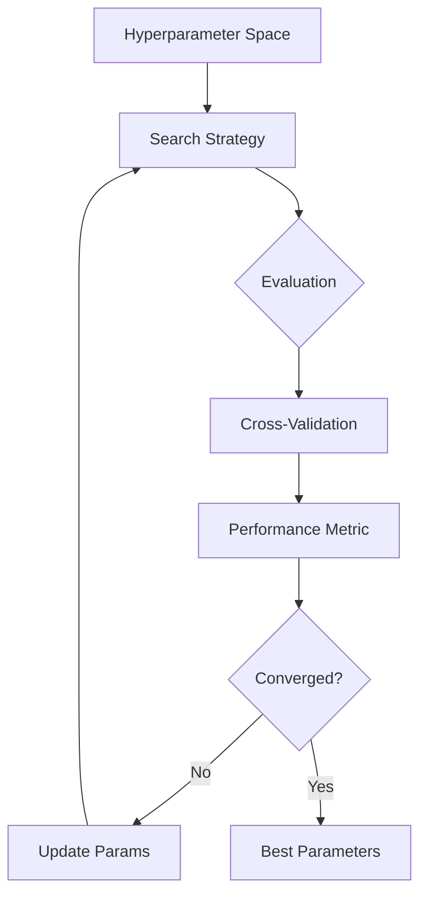

# Hyperparameter Tuning

## What is Hyperparameter Tuning?

Hyperparameters are configuration settings set before training (not learned). Tuning searches for the combination that maximizes validation performance.



## Search Methods Comparison

| Method | Approach | Iterations | Exploration | Best For |
|--------|----------|------------|-------------|----------|
| **Manual** | Trial and error | Few | Poor | Simple models, baseline |
| **Grid Search** | Exhaustive over grid | $\prod$ dims | Systematic | Small search space ($\leq$ 3 dims) |
| **Random Search** | Sample from distributions | Fixed budget | Good | Most practical settings |
| **Bayesian** | Probabilistic surrogate model | Medium | Guided | Expensive evaluations (deep learning) |
| **Population-based** | Evolutionary / genetic | Many | Global | Many hyperparameters |

### Grid Search

```python
from sklearn.model_selection import GridSearchCV

param_grid = {
    'n_estimators': [100, 200, 300],
    'max_depth': [5, 10, None],
    'min_samples_split': [2, 5, 10],
}

grid = GridSearchCV(
    RandomForestClassifier(),
    param_grid,
    cv=5,
    scoring='f1',
    n_jobs=-1,
    verbose=1
)
grid.fit(X_train, y_train)
print(grid.best_params_)
```

### Random Search

Random search samples from distributions and is more efficient than grid search when some hyperparameters are irrelevant:

```python
from sklearn.model_selection import RandomizedSearchCV
from scipy.stats import randint, uniform

param_dist = {
    'n_estimators': randint(50, 500),
    'max_depth': [5, 10, 20, 30, None],
    'learning_rate': uniform(0.01, 0.3),
}
```

### Bayesian Optimization

Builds a probabilistic model (Gaussian Process or TPE) mapping hyperparameters to performance and uses an acquisition function to pick the next promising candidate. More sample-efficient than random search.

## Cross-Validation Strategies

| Strategy | Description | Use Case |
|----------|-------------|----------|
| **k-Fold** | Split into k folds, train on k-1, validate on 1 | General purpose |
| **Stratified k-Fold** | Maintains class proportions per fold | Imbalanced classification |
| **Group k-Fold** | Ensures same group not in train and val | Time series, grouped data |
| **Time Series Split** | Expanding window forward | Temporal data |
| **Leave-One-Out** | k = n samples | Very small datasets |

```python
from sklearn.model_selection import StratifiedKFold

cv = StratifiedKFold(n_splits=5, shuffle=True, random_state=42)
```

## Early Stopping

Halts training when validation performance stops improving for a set number of rounds. This acts as a regularizer and saves computation:

```python
import xgboost as xgb

model = xgb.XGBClassifier(n_estimators=1000, early_stopping_rounds=50)
model.fit(X_train, y_train, eval_set=[(X_val, y_val)], verbose=False)
```

## Automated Tuning Tools

| Tool | Strategy | Key Feature |
|------|----------|-------------|
| **Optuna** | TPE (Tree-structured Parzen Estimator) | Pruning of unpromising trials, define-by-run API |
| **Hyperopt** | TPE, random, annealing | Distributed tuning with MongoDB |
| **Ray Tune** | ASHA, Bayesian, population-based | Distributed execution, integration with Ray |
| **Scikit-Optimize** | Bayesian with Gaussian Processes | Simple scikit-learn interface |
| **SMAC** | Random forest-based Bayesian | Handles categorical and conditional params |

### Optuna Example

```python
import optuna

def objective(trial):
    params = {
        'lr': trial.suggest_float('lr', 1e-5, 1e-1, log=True),
        'layers': trial.suggest_int('layers', 1, 5),
        'dropout': trial.suggest_float('dropout', 0.1, 0.5),
    }
    return train_model(params).accuracy

study = optuna.create_study(direction='maximize')
study.optimize(objective, n_trials=100)
print(study.best_params)
```

## Best Practices

- Start with a **small-scale search** (few trials) to identify promising regions
- Use **log-scale** for positive parameters (learning rate, regularization)
- **Hand-tune one parameter** at a time when you have deep domain knowledge
- Set a **total budget** (time or trials) and compare methods within that budget

**Links**: [[Feature Engineering]] | [[Ensemble Methods]] | [[Gradient Boosting]] | [[Decision Trees and Random Forests]] | [[Pre-training and Fine-tuning]]

**Next**: [[Ensemble Methods]] — Combining models for better results
