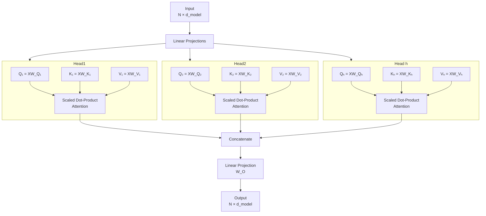

# Multi-Head Attention

**Links**: [[Self-Attention]] | [[Transformer Architecture]] | [[Positional Encoding]] | [[BERT and Encoder Models]] | [[GPT and Decoder Models]]

## Why Multiple Heads?

A single attention distribution averages over all relationship types. Multiple heads allow the model to attend to different aspects simultaneously — syntactic, semantic, positional, and more — each operating in a separate representational subspace without interfering.

## Parallel Head Architecture



## Head Dimension vs Model Dimension

Each head operates on a reduced dimension to keep total computation constant:

```
d_k = d_v = d_model / h
```

| d_model | h (heads) | d_k (per head) | Total compute |
|---------|-----------|----------------|---------------|
| 512 | 8 | 64 | 8 × 64² = 8 × 4096 |
| 768 | 12 | 64 | 12 × 64² = 12 × 4096 |
| 1024 | 16 | 64 | 16 × 64² = 16 × 4096 |
| 4096 | 32 | 128 | 32 × 128² = 32 × 16384 |

Concatenation and projection: Concat([head_1 ... head_h]) restores d_model dimensions, then W_O projects back.

## Mathematical Formulation

```
MultiHead(Q, K, V) = Concat(head_1, ..., head_h) × W_O

where head_i = Attention(Q × W_Q_i, K × W_K_i, V × W_V_i)
```

| Step | Operation | Shape |
|------|-----------|-------|
| 1 | Project Q, K, V for each head via W_Q_i, W_K_i, W_V_i | h × (N × d_k) |
| 2 | Compute scaled dot-product attention per head | h × (N × d_v) |
| 3 | Concatenate all head outputs | N × (h × d_v) = N × d_model |
| 4 | Final output projection W_O | N × d_model |

## Head Count Choices Across Models

| Model | d_model | Heads (h) | d_k | d_ff | Design Notes |
|-------|---------|-----------|-----|------|--------------|
| Transformer Base | 512 | 8 | 64 | 2048 | Original paper — d_k = 64 is standard |
| BERT-base | 768 | 12 | 64 | 3072 | Keeps d_k = 64, scales heads with d_model |
| BERT-large | 1024 | 16 | 64 | 4096 | More heads for larger model |
| GPT-2 | 1600 | 25 | 64 | 6400 | Unusual head count (1600/25 = 64) |
| GPT-3 175B | 12288 | 96 | 128 | 49152 | Larger d_k = 128, fewer heads relative to size |
| Llama 3 70B | 8192 | 64 | 128 | 28672 | Grouped-Query Attention (GQA) |
| Llama 3 8B | 4096 | 32 | 128 | 14336 | GQA with 8 key-value heads |
| DeepSeek-V2 | 7168 | 64 | 128 | 20480 | Multi-Head Latent Attention (MLA) |
| Mistral 7B | 4096 | 32 | 128 | 14336 | Sliding window + GQA |

## Interpretability: What Each Head Learns

Research (Clark et al., 2019; Vig, 2019) shows attention heads specialize in distinct patterns:

| Head Type | Pattern Detected | Example Behavior |
|-----------|-----------------|------------------|
| **Positional** | Adjacent/delimiter tokens | Attends to previous word, next word, [SEP] |
| **Syntactic** | Grammatical relations | Subject-verb agreement, noun-modifier |
| **Semantic** | Related concepts | Coreference (pronoun to noun), synonym linking |
| **Attentional** | Special tokens | Heavy weight on [CLS], [MASK], punctuation |
| **Lexical** | Repeated tokens | Attends to same word elsewhere in sequence |

In practice, many heads are redundant — pruning 30-40% of heads (Michel et al., 2019) can maintain near-original performance. This suggests the model learns a distributed representation with built-in redundancy.

## Benefits Summary

- Each head learns different relationship types (syntax, semantics, position)
- Ensembles over multiple attention patterns for robustness
- More stable training through distributed representations
- Efficient parallel computation across all heads
- Enables richer representations without increasing per-head dimension

**Next**: [[Positional Encoding]] — Giving the model order information
