# 01 — Taxonomy & Overview

Advanced prompting techniques fall into five families:

```mermaid
graph TB
    AP[Advanced Prompting] --> RA[Reasoning & Logic]
    AP --> DE[Decomposition]
    AP --> SE[Self-Improvement]
    AP --> IN[Interaction & Tools]
    AP --> ST[Structure & Format]

    RA --> COT[Chain-of-Thought]
    RA --> ZSC[Zero-Shot CoT]
    RA --> COC[Chain-of-Code]
    RA --> PAL[Program-Aided LLMs]

    DE --> LTM[Least-to-Most]
    DE --> PS[Plan-and-Solve]
    DE --> TOT[Tree-of-Thoughts]
    DE --> GOT[Graph-of-Thoughts]

    SE --> SC[Self-Consistency]
    SE --> SR[Self-Refine]
    SE --> SCC[Self-Critique]
    SE --> MP[Meta-Prompting]

    IN --> REACT[ReAct]
    IN --> FUNC[Function Calling]
    IN --> REFL[Reflexion]

    ST --> FSP[Few-Shot Structured]
    ST --> SEP[Separator Patterns]
    ST --> ROL[Role / Persona]
    ST --> FOR[Format Constraints]
```

| Family | Core Idea | Example |
|--------|-----------|---------|
| **Reasoning & Logic** | Externalize step-by-step reasoning | "Let's think step by step" |
| **Decomposition** | Break complex tasks into subproblems | Solve each subproblem independently |
| **Self-Improvement** | Sample, critique, and refine own outputs | Majority vote across samples |
| **Interaction & Tools** | Interleave reasoning with external actions | Search, calculate, code execution |
| **Structure & Format** | Use delimiters, roles, schemas for reliability | XML tags, JSON mode |

**Links**: [[AI-ML/NLP/Advanced Prompting Techniques/02 Reasoning & Logic]] | [[AI-ML/NLP/Advanced Prompting Techniques/03 Decomposition Techniques]] | [[AI-ML/NLP/Advanced Prompting Techniques/04 Self-Improvement]]
**See also**: [[Prompt Engineering]], [[LLM Agents Framework]]
