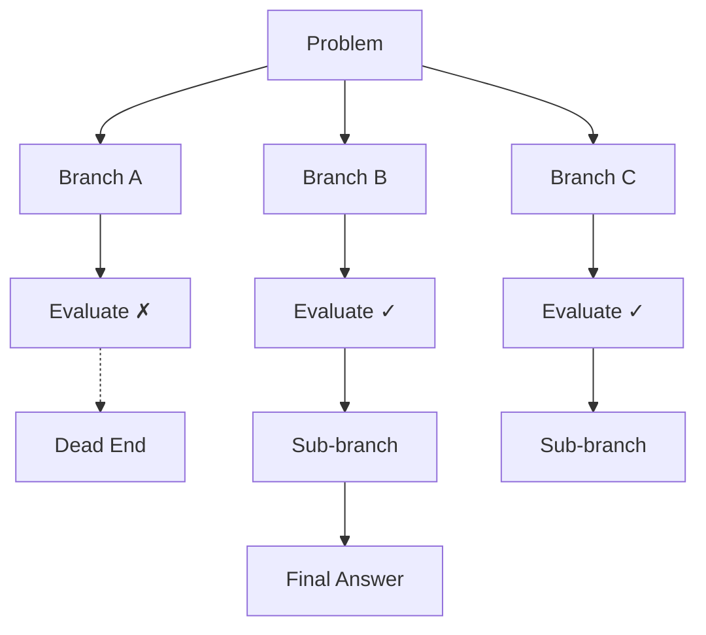

# 03 — Decomposition Techniques

## Least-to-Most Prompting

Decompose the problem into subproblems, solve each independently, then combine.

```
Stage 1 — Decompose:
  Sub-question 1: What is the total before discount?
  Sub-question 2: What is the discount amount?
  ...

Stage 2 — Solve each:
  A1: 3 × $12 = $36
  A2: 15% of $36 = $5.40
  ...
```

## Plan-and-Solve

First generate a plan with all steps, then execute each step. The plan prevents the model from going off-track.

```python
plan_prompt = "Given: {task}. First, devise a step-by-step plan."
execute_prompt = "Now execute step {n}: {step_desc}. Previous: {prev}. Current:"
```

## Tree-of-Thoughts (ToT)

Maintain multiple parallel reasoning paths. Evaluate each path at decision points, prune dead ends, and search for the best solution.



**When to use**: Open-ended problems, planning, puzzles, creative problem-solving.

## Graph-of-Thoughts (GoT)

Generalization of ToT: use an arbitrary directed graph. Thoughts can merge, loop back, and combine.

| Aspect | Tree-of-Thoughts | Graph-of-Thoughts |
|--------|-----------------|-------------------|
| Structure | Tree (no cycles) | Directed graph (cycles allowed) |
| Merging | No | Yes (combine insights) |
| Backtracking | Only forward (prune) | Can revisit and revise |
| Best For | Branching search space | Complex synthesis tasks |

**Links**: [[AI-ML/NLP/Advanced Prompting Techniques/02 Reasoning & Logic]] | [[AI-ML/NLP/Advanced Prompting Techniques/04 Self-Improvement]] | [[AI-ML/NLP/Advanced Prompting Techniques/05 Interaction & Tool-Use]]
**See also**: [[Prompt Engineering]], [[LLM Agents Framework]]
