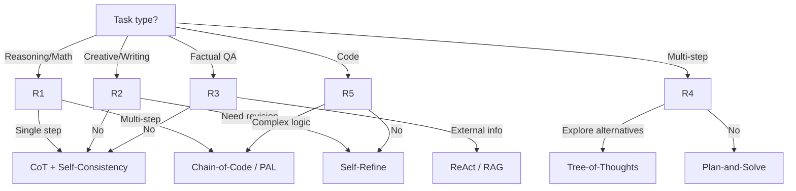
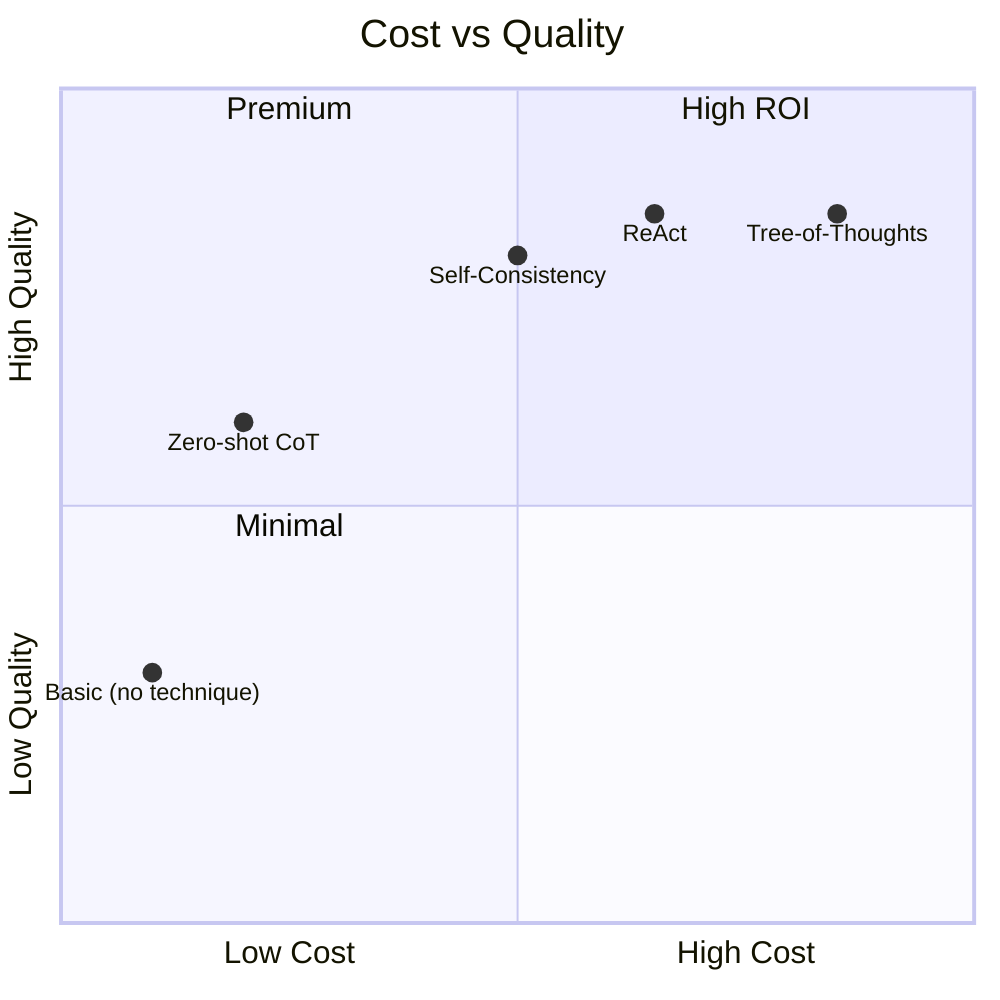

# 07 — Selection Guide

## Decision Tree

## Technique Comparison

| Technique | Cost | Accuracy Gain | Best For |
|-----------|------|---------------|----------|
| **Zero-shot CoT** | Low | +10-20% | Default for reasoning |
| **Few-shot CoT** | Medium | +20-40% | Complex reasoning with examples |
| **Chain-of-Code** | Medium | +15-30% | Math, numerical |
| **PAL** | High | +20-35% | Complex computation |
| **Least-to-Most** | Medium | +20-30% | Multi-step problems |
| **Plan-and-Solve** | Medium | +15-25% | Tasks needing planning |
| **Tree-of-Thoughts** | High | +20-40% | Search-like problems |
| **Self-Consistency** | Low-Med | +5-15% | Any reasoning task |
| **Self-Refine** | Medium | +10-25% | Writing, code, planning |
| **ReAct** | Med-High | +20-50% | Tasks needing external info |

**Links**: [[AI-ML/NLP/Advanced Prompting Techniques/08 Production Prompt & Pitfalls]] | [[AI-ML/NLP/Advanced Prompting Techniques/09 Learning Progression & Quick Reference]] | [[AI-ML/NLP/Advanced Prompting Techniques/01 Taxonomy & Overview]]
**See also**: [[Prompt Engineering]], [[LLM Evaluation and Benchmarks]]
