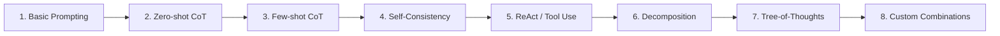

# 09 — Learning Progression & Quick Reference

## Learning Progression



## Always-Use Defaults

```python
# For any reasoning task, start with:
prompt = original_prompt + "\nLet's think step by step."
temperature = 0.3

# If quality matters, add:
final = majority_vote([llm.generate(prompt, temp=0.5) for _ in range(5)])
```

## Per-Task Recommended Config

```python
TASK_CONFIGS = {
    "math": {"technique": "chain_of_code", "temperature": 0.2, "self_consistency": True},
    "creative_writing": {"technique": "self_refine", "temperature": 0.8, "iterations": 2},
    "factual_qa": {"technique": "react", "temperature": 0.1, "tools": ["search"]},
    "code_generation": {"technique": "self_refine + tests", "temperature": 0.3, "iterations": 3},
    "planning": {"technique": "tree_of_thoughts", "temperature": 0.6, "branches": 3},
}
```

**Links**: [[AI-ML/NLP/Advanced Prompting Techniques/01 Taxonomy & Overview]] | [[AI-ML/NLP/Advanced Prompting Techniques/07 Selection Guide]] | [[AI-ML/NLP/Advanced Prompting Techniques/08 Production Prompt & Pitfalls]]
**See also**: [[Prompt Engineering]], [[Prompt Engineering for RAG]]
