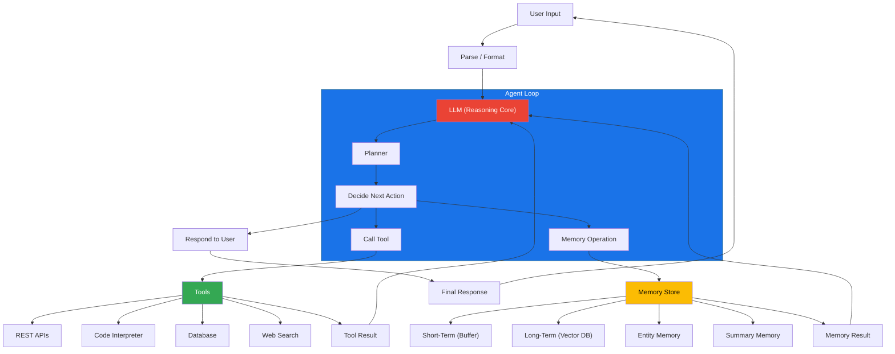

# LLM Agents Framework

LLM agents are autonomous programs that use large language models to reason, plan, and execute tasks. They combine LLMs with tools, memory, and orchestration loops.

## Architecture



## Core Components

- **LLM Core**: The reasoning engine (GPT-4, Claude, Llama, Gemini)
- **Tools**: APIs, code interpreters, database connectors, web search
- **Memory**: Short-term (conversation context) + Long-term (vector stores)
- **Planner**: Decomposes complex tasks into sub-steps

## Agent Architectures

### ReAct (Reasoning + Acting)
The most common pattern. The LLM alternates between reasoning traces and actions in a loop.

```
Thought: I need to find the user's email.
Action: search_user_database("current user")
Observation: { email: "user@example.com" }
Thought: I have the email, now I can send the notification.
Action: send_email("user@example.com", "Your report is ready")
```

**Pros**: Simple, effective, interpretable. **Cons**: Can loop if reasoning drifts.

### Plan-and-Execute
The LLM generates a full plan upfront, then executes steps sequentially.

```
Plan:
1. Query database for active users
2. Filter users with incomplete profiles
3. Send reminder email to each
4. Log results
```

**Pros**: Predictable execution, verifiable plan. **Cons**: Cannot adapt mid-plan without replanning.

### Reflection
The agent critiques its own outputs, iteratively improving.

```
Generate → Self-Critique → Refine → Repeat until quality threshold met
```

**Pros**: Higher quality outputs. **Cons**: Multiple LLM calls per step, costly.

### Multi-Agent Systems
Multiple specialized agents collaborate via a supervisor or message bus.

- **Supervisor Pattern**: One agent delegates subtasks to specialist agents.
- **Debate Pattern**: Agents argue different positions to converge on truth.
- **Pipeline Pattern**: Agents pass outputs sequentially.

**Pros**: Parallel work, specialization. **Cons**: Coordination overhead, higher cost.

## Memory Types

| Type | Storage | Retention | Lookup | Use Case |
|------|---------|-----------|--------|----------|
| Conversation Buffer | In-memory list | Current session only | FIFO | Recent context |
| Sliding Window | Fixed-size buffer | Last N messages | Sequential | Keeping recent context |
| Summary Memory | LLM-generated summary | Across sessions | Keyword | Compressing long conversations |
| Vector Memory | Embedding + Vector DB (Pinecone, Chroma, Qdrant) | Persistent | Semantic search | Retrieving relevant past info |
| Entity Memory | Structured store (JSON, SQLite) | Persistent | Direct key | User preferences, facts |
| Hierarchical Memory | Hybrid (buffer + summary + vector) | Tiered | Multi-level | Infinite context approximation |

## Tool Integration Patterns

| Pattern | Description | When to Use |
|---------|-------------|-------------|
| Function Calling | LLM outputs structured tool call | Native API support (GPT-4, Claude) |
| JSON Mode | LLM outputs JSON action specification | Structured output needed |
| Code Interpreter | LLM writes and executes code | Data analysis, visualization |
| Structured Output | Pydantic/Zod schema enforced | Type safety, validation |
| Tool Chaining | One tool output feeds another | Multi-step workflows |
| Parallel Tools | Multiple tools called simultaneously | Independent sub-tasks |

## Frameworks Comparison

| Framework | Language | Orchestration | Memory | Multi-Agent | Ease of Use | Best For |
|-----------|----------|---------------|--------|-------------|-------------|----------|
| LangGraph | Python/JS | Graph-based state machine | Built-in (checkpoints) | Yes | Medium | Complex stateful agents |
| CrewAI | Python | Role-based delegation | Basic | Yes (native) | Easy | Multi-agent collaboration |
| AutoGPT | Python | Autonomous loop | Basic file-based | Limited | Medium | Goal-driven autonomous tasks |
| Semantic Kernel | Python/C# | Plugin-based pipeline | Connectors | Yes | Medium | Enterprise .NET/Python |
| LlamaIndex Agents | Python | Query engine + tools | Index-based | Yes | Easy | RAG-heavy agents |
| Dify | Visual/Python | Drag-and-drop workflow | Built-in | Yes | Very Easy | Low-code agent building |
| Haystack | Python | Pipeline components | Document stores | Limited | Medium | Search + Q&A agents |

## Simple Agent Example (Python)

```python
import json
from openai import OpenAI

client = OpenAI()

tools = [{
    "type": "function",
    "function": {
        "name": "get_weather",
        "description": "Get current weather for a city",
        "parameters": {
            "type": "object",
            "properties": {
                "location": {"type": "string"}
            },
            "required": ["location"]
        }
    }
}]

def get_weather(location: str) -> str:
    return f"Weather in {location}: sunny, 72°F"

messages = [{"role": "user", "content": "What's the weather in Tokyo?"}]

response = client.chat.completions.create(
    model="gpt-4",
    messages=messages,
    tools=tools,
    tool_choice="auto"
)

msg = response.choices[0].message
if msg.tool_calls:
    for tc in msg.tool_calls:
        args = json.loads(tc.function.arguments)
        result = get_weather(args["location"])
        messages.append(msg)
        messages.append({
            "role": "tool",
            "tool_call_id": tc.id,
            "content": result
        })

final = client.chat.completions.create(
    model="gpt-4",
    messages=messages
)
print(final.choices[0].message.content)
```

## Challenges & Limitations

| Challenge | Description | Mitigation |
|-----------|-------------|------------|
| Hallucination | Agent fabricates tool results or facts | Grounding, constrained decoding, verification loop |
| Cost | Multiple LLM calls per task can be expensive | Caching, smaller models for sub-tasks, rate limiting |
| Latency | Sequential reasoning loops are slow | Parallel tool calls, speculative execution, streaming |
| Error Recovery | Failed tool calls can derail the agent | Retry logic, fallback tools, human-in-the-loop |
| Security | Prompt injection via tool inputs | Strict input sanitization, sandboxed execution |
| Context Window | Long conversations exceed context limit | Memory summarization, sliding window, RAG |
| Tool Discovery | Agent must know which tool to use | Semantic tool search, curated tool list, few-shot examples |
| Evaluation | Hard to measure agent quality objectively | Unit testing individual tools, trajectory evaluation, task completion rate |

## Design Patterns

- **Human-in-the-Loop**: Pause for approval before destructive actions (delete, deploy, pay).
- **Agentic RAG**: Combine retrieval with reasoning — query DB, then synthesize answer.
- **Reflection Loop**: Have the LLM critique its own output before responding.
- **Guardrails**: Pre/post-processing rules to constrain LLM output (format, banned topics, allowed tools).
- **Observability**: Log every thought, action, and observation for debugging (LangSmith, Weights & Biases).

## When to Use Agents vs. Simple LLM

| Scenario | Approach | Reason |
|----------|----------|--------|
| Answer a factual question | Direct LLM call | One-shot, no tools needed |
| Multi-step data analysis | Agent with code interpreter | Needs iteration |
| Fill a structured form | Structured output / function call | Deterministic schema |
| Long-running background task | Agent with persistence | Hours-long workflows |
| Interacting with external APIs | Agent with tool calls | Dynamic API selection |
| Customer support chatbot | Agent with RAG + tools | Knowledge base + actions |

## Agent Evaluation Metrics

| Metric | Description | How to Measure |
|--------|-------------|----------------|
| Task Success Rate | Fraction of tasks completed successfully | Human eval or ground-truth comparison |
| Steps to Completion | Number of agent loop iterations | Log step count per task |
| Tool Call Accuracy | Fraction of tool calls with correct arguments | Parse tool call JSON, compare to expected |
| Hallucination Rate | Fraction of responses containing fabricated facts | LLM-as-judge or human annotation |
| Cost Per Task | Total LLM API cost for one task | Sum of input/output token costs |
| Latency P50/P95 | Median and 95th percentile response time | Instrument each agent loop iteration |
| Recovery Rate | Fraction of failed tool calls leading to successful retry | Parse error + retry patterns from logs |

## Advanced Agent Patterns

### Reflection Loop
```
User Query → Generate → Self-Critique → Refine → Generate → Output
```

The agent generates an initial response, then prompts itself (or a separate critic LLM) to identify flaws, then refines. Useful for code generation, writing, and planning.

### Tree-of-Thoughts (ToT)
Explores multiple reasoning branches simultaneously, evaluating each with a heuristic to prune unpromising paths.

```
Branch A: ... → score 0.8 → continue
Branch B: ... → score 0.3 → prune
Branch C: ... → score 0.6 → continue
```

### ReAct with Retrieval
Augments each reasoning step with relevant context from a vector store:

```
Thought: I need to answer about the 2024 revenue.
Action: retrieve("2024 annual revenue report")
Observation: [relevant chunks from vector DB]
Thought: Based on the document, revenue was $24.5B.
```

### Tool-Use Fine-Tuning
For production agents, fine-tune the LLM on tool-use trajectories to improve:
- Correct tool selection accuracy (up to +15%)
- Proper argument formatting (up to +20%)
- Reduced hallucination of tool outputs (up to -30%)

## Production Considerations

| Consideration | Recommendation |
|---------------|----------------|
| Caching | Cache identical LLM calls (prompt + tool results) to reduce cost and latency |
| Rate Limiting | Implement token bucket per user to prevent runaway costs |
| Observability | Log every thought, action, observation; use LangSmith or LangFuse |
| Fallback Model | Use smaller/cheaper model for simple tasks, escalate to powerful model when needed |
| Human Approval | Require human confirmation for destructive actions (DELETE, deploy, payment) |
| Timeout | Set per-step and total execution timeouts to prevent infinite loops |
| Session Persistence | Store conversation state in Redis/DynamoDB for fault tolerance |
| A/B Testing | Run multiple agent configurations in parallel to compare quality/cost |

## Cross-Domain Links

**Core Agent Links**: [[Multi-Agent Orchestration]] | [[Tool Use and Function Calling]] | [[Advanced RAG Patterns]] | [[Agentic RAG]] | [[RAG Architecture]] | [[NLP Pipeline Design]] | [[Text Embedding Models]] | [[Programming Resources]]

**Architecture Links**: [[Microservices Architecture]] | [[Event-Driven Architecture]] | [[LLM Safety and Guardrails]] | [[LLMOps and AI Observability]] | [[System-Design/Architecture/Event-Driven Architecture]] | [[System-Design/Databases/Message Queues]]

**Memory & Storage Links**: [[System-Design/Databases/Vector Databases]] | [[System-Design/Databases/Redis Deep Dive]] | [[System-Design/Databases/Caching Strategies]]

**Infrastructure Links**: [[AI-ML/Deep-Learning/Machine-Learning/MLOps]] | [[AI-ML/Deep-Learning/Machine-Learning/Model Monitoring in Production]] | [[DevOps/Containers/Docker Containers]] | [[DevOps/Infrastructure/Cloud Computing]]

**Security Links**: [[Security/LLM Prompt Injection]] | [[Security/API Security]] | [[Security/Identity and Access Management]]

**Related Concepts**: [[System-Design/Architecture/Computer Architecture]] | [[System-Design/Architecture/Operating Systems]] | [[System-Design/Algorithms/_MOC|Algorithms MOC]] | [[Web-Dev/HTTP Protocol]] | [[System-Design/Databases/Database Indexing]] | [[System-Design/Databases/Consistent Hashing]]

**Links**: [[Advanced Prompting Techniques]] | [[Context Window Strategies]] | [[Inference Optimization]] | [[LLM Alignment]] | [[LLM Evaluation and Benchmarks]] | [[LLM Safety and Guardrails]] | [[LLM]] | [[Machine Translation]] | [[Model Quantization]] | [[Named Entity Recognition]] | [[NLP Pipeline Design]] | [[Prompt Engineering]] | [[Quantization for LLMs]] | [[Sentiment Analysis]] | [[Structured Output and Grammar]] | [[Text Classification]] | [[Text Embedding Models]] | [[Tokenization]] | [[Tool Use and Function Calling]]
