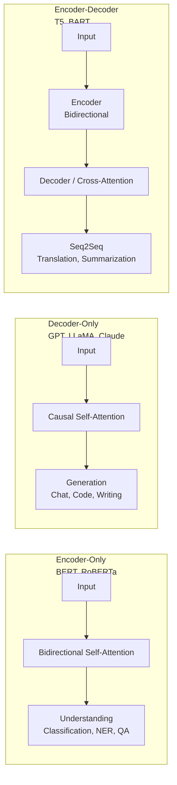
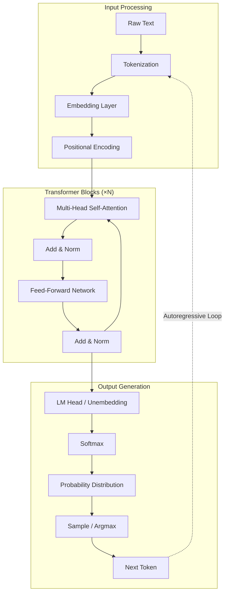
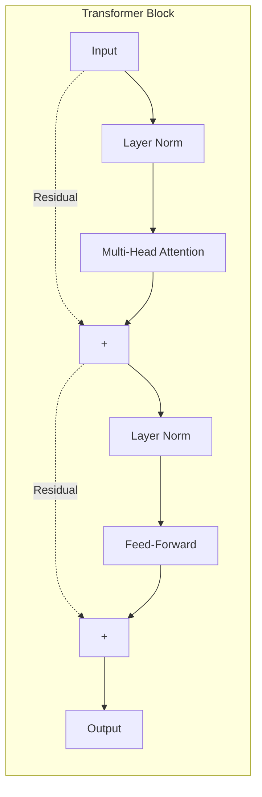

# 01 — Architecture Overview

## What is an LLM?

A **Large Language Model (LLM)** is a neural network trained on massive text corpora to understand and generate human-like text. LLMs use the **transformer architecture** and are trained via **next-token prediction**.

## Architecture Variants

## Core Architecture

## A Single Transformer Block

## Inside Self-Attention

| Step | Operation | Purpose |
|------|-----------|---------|
| 1 | Q, K, V = Linear(X) | Project input into query, key, value spaces |
| 2 | Scores = Q × K^T | Compute pairwise attention scores |
| 3 | Scale by √d_k | Prevent softmax saturation |
| 4 | Softmax (normalize) | Convert to attention weights |
| 5 | Output = Softmax × V | Weighted sum of values |

## Multi-Head Attention

| Head | Focuses On |
|------|------------|
| Head 1 | Syntactic relationships (subject-verb agreement) |
| Head 2 | Positional / distance patterns |
| Head 3 | Semantic similarity (synonyms, antonyms) |
| Head 4 | Coreference resolution (pronouns → nouns) |
| Head 5 | Dependency parsing |
| Head 6+ | Mixed / learned patterns |

## Attention Masks

- **Causal Mask** (Decoder-Only): Token can only attend to itself and previous tokens (GPT, LLaMA)
- **Bidirectional Mask** (Encoder-Only): Token attends to all tokens (BERT)
- **Cross-Attention Mask** (Encoder-Decoder): Decoder tokens attend to all encoder tokens (T5, BART)

**Links**: [[AI-ML/NLP/LLM/02 Tokenization & Generation]] | [[AI-ML/NLP/LLM/03 Training & Data]] | [[AI-ML/NLP/LLM/04 Fine-Tuning]]
**See also**: [[Transformer Architecture]] | [[Attention Mechanism]]
