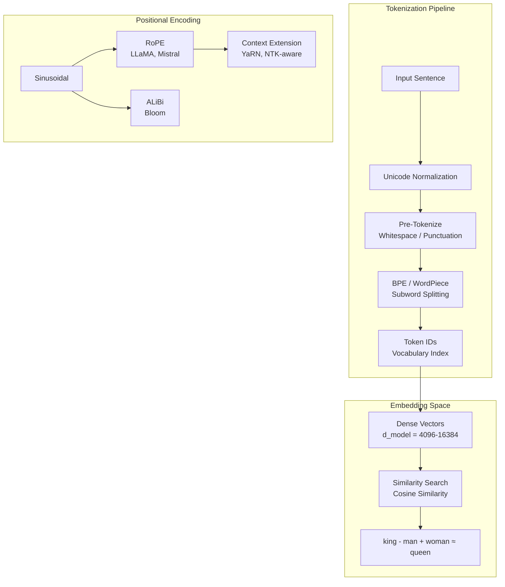

# 02 — Tokenization & Generation

## Tokenization & Embedding Space



## How Autoregressive Generation Works

```mermaid
sequenceDiagram
    participant U as User
    participant LLM as LLM
    participant Cache as KV Cache
    U->>LLM: "The capital of France is"
    LLM->>LLM: Tokenize
    Note over LLM,Cache: Forward pass through all transformer layers
    LLM->>LLM: Predict next token logits
    LLM->>LLM: Softmax → probabilities
    LLM->>U: Token: " Paris"
    Note over Cache: Cache keys/values for faster generation
    U->>LLM: Append: "... Paris."
    LLM->>LLM: Forward pass (reuses KV cache)
    LLM->>LLM: Predict next: "."
    LLM->>LLM: Predict next: "&lt;EOS&gt;"
    Note over U,LLM: Generation stops at end-of-sequence token
```

## Sampling Strategies

| Strategy | Behavior | When to Use |
|----------|----------|-------------|
| **Greedy** | Always pick highest prob token | Deterministic, stable but repetitive |
| **Temperature** | Scale logits by T (low=focused, high=creative) | Control creativity |
| **Top-k** | Sample from k highest probability tokens | Balance quality & diversity |
| **Top-p (nucleus)** | Sample from cumulative probability p | Dynamic vocabulary size |
| **Beam Search** | Keep top b candidate sequences | Best for translation, slower |

### Temperature Effect

| T | Behavior |
|---|----------|
| → 0 | Deterministic, greedy |
| 0.5 | Focused, slight variation |
| 1.0 | Balanced (model default) |
| 1.5 | Creative, may hallucinate |
| → ∞ | Uniform random (gibberish) |

**Links**: [[AI-ML/NLP/LLM/01 Architecture Overview]] | [[AI-ML/NLP/LLM/05 Prompting Strategies]] | [[AI-ML/NLP/LLM/07 RAG & Inference Optimization]]
**See also**: [[Tokenization]] | [[GPT and Decoder Models]]
