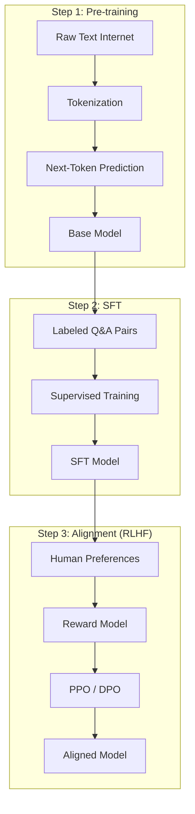

# 03 — Training & Data

## Training Objectives

| Objective | Direction | Training Signal | Use Case |
|-----------|-----------|----------------|----------|
| **Causal LM** | Left → Right | All tokens | Generation (chat, code) |
| **Masked LM** | Bidirectional | 15% masked tokens | Understanding (BERT) |
| **Permuted LM** | All orders | All tokens in order | Mixed (XLNet) |
| **Span Corruption** | Encoder: bi, Decoder: uni | 15% masked spans | Seq2Seq (T5, BART) |
| **Fill-in-Middle (FIM)** | Prefix + suffix → middle | Middle tokens | Code infilling |

## Training Pipeline

## Distributed Training Strategies

| Strategy | How It Works | Best For |
|----------|-------------|----------|
| **Data Parallelism (DDP)** | Same model on N GPUs, gradients averaged | Large batches |
| **Tensor Parallelism (TP)** | Layer split across GPUs | Very large models |
| **Pipeline Parallelism (PP)** | Layers across GPUs, micro-batching | Sequential layers |
| **FSDP** | Shard params/gradients/optimizer states | Largest models |

### Strategy by Model Size

| Size | Recommended Strategy |
|------|---------------------|
| 1-7B | DDP / FSDP |
| 7-20B | FSDP |
| 20-70B | FSDP + TP |
| 70-405B | FSDP + TP + PP |
| 405B+ | 3D Parallelism (FSDP+TP+PP) |

## Training Data Composition

| Source | Proportion |
|--------|-----------|
| CommonCrawl / Web | 50-80% |
| Books / Literature | 10-20% |
| Academic Papers | 5-15% |
| Code Repos | 5-20% |
| Social Media | 2-5% |

### Major Datasets

| Dataset | Size | Used By |
|---------|------|---------|
| CommonCrawl | 400B+ pages | Most LLMs |
| The Pile | 825 GiB | Open-source LLMs |
| C4 | 750 GiB | T5, BERT |
| RedPajama-V2 | 30T tokens | Open-source LLMs |

## Training Compute Cost Estimates

| Model | GPUs | Duration | Est. Cost |
|-------|------|----------|-----------|
| GPT-3 (175B) | 10K V100 | 34 days | ~$4.6M |
| LLaMA 3 (405B) | 30K H100 | ~50 days | ~$30M |
| DeepSeek-V3 (671B) | 2K H800 | ~40 days | ~$5.6M |

**Links**: [[AI-ML/NLP/LLM/04 Fine-Tuning]] | [[AI-ML/NLP/LLM/01 Architecture Overview]] | [[AI-ML/NLP/LLM/09 Models, Trends & Selection]]
**See also**: [[Pre-training and Fine-tuning]] | [[Scaling Laws]]
