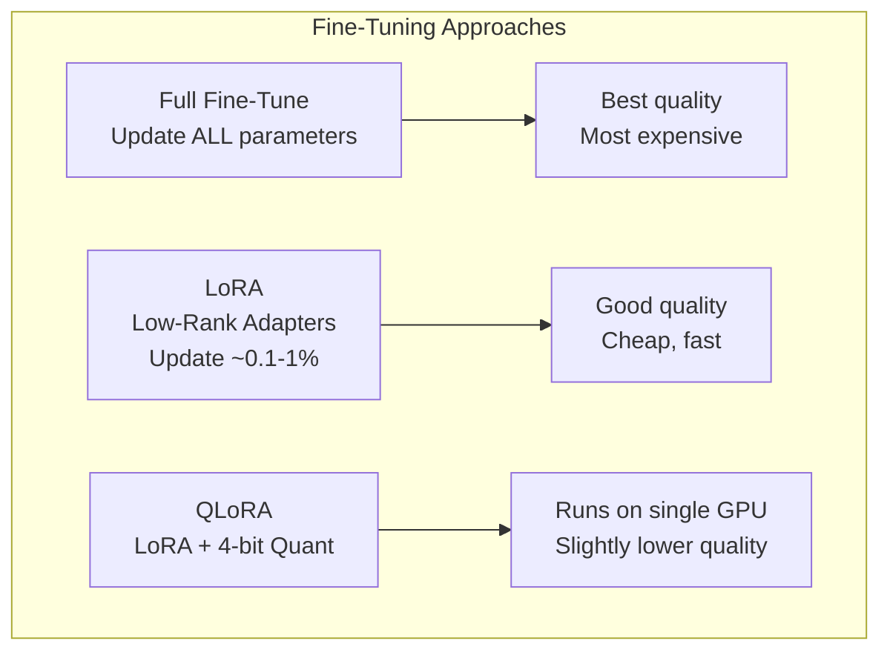

# 04 — Fine-Tuning

## Fine-Tuning Methods

## PEFT Comparison

| Method | Trainable Params | Memory | Quality | Use Case |
|--------|-----------------|--------|---------|----------|
| **Full Fine-Tune** | 100% | ~16× model size | Best | High-budget, production |
| **LoRA (r=16)** | ~0.1-0.5% | ~6× model size | Near-full | Task adaptation |
| **LoRA (r=64)** | ~1-2% | ~8× model size | ~Full | Domain adaptation |
| **QLoRA (4-bit)** | ~0.1-0.5% | ~1.5× model size | ~90-95% | Consumer GPUs |
| **Prompt Tuning** | ~0.01% | ~1× model size | Lower | Quick experiments |
| **IA³** | ~0.01% | ~1× model size | Moderate | Many tasks |

### Training vs Inference

| Phase | Data | Compute | Cost |
|-------|------|---------|------|
| Training | Tera-tokens of text | GPU clusters, weeks-months | $1M - $100M+ |
| Inference | User prompt | Single GPU / API, ms-sec | Pennies per 1M tokens |

**Links**: [[AI-ML/NLP/LLM/03 Training & Data]] | [[AI-ML/NLP/LLM/05 Prompting Strategies]] | [[AI-ML/NLP/LLM/07 RAG & Inference Optimization]]
**See also**: [[Pre-training and Fine-tuning]] | [[LLM Alignment]]
