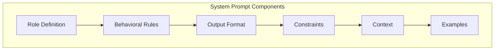
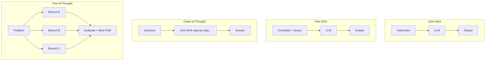

# 05 — Prompting Strategies

## System Prompt Design

### Best Practices
- Be specific and explicit
- Use positive instructions ("Do X" not "Don't do Y")
- Put critical rules at start
- Separate system vs user clearly

### System Prompt Patterns

| Pattern | Effect |
|---------|--------|
| **Persona** | Aligns expertise level |
| **Step-by-Step** | Improves reasoning |
| **Format Enforcer** | Structured output |
| **Few-Shot in System** | Sets pattern, hidden from user |

## Prompting Strategies

| Strategy | When to Use | Quality Gain |
|----------|-------------|--------------|
| **Zero-shot** | Simple, well-known tasks | Baseline |
| **Few-shot** | New format, complex tasks | +10-30% |
| **Chain-of-Thought** | Math, logic, reasoning | +15-40% |
| **Tree-of-Thought** | Planning, puzzles | +20-50% |
| **ReAct** | Multi-step tool use | +30% on agent tasks |
| **Self-Consistency** | High-stakes decisions | +5-15% |

**Links**: [[AI-ML/NLP/LLM/06 Tool Use & Multi-Agent]] | [[AI-ML/NLP/LLM/02 Tokenization & Generation]] | [[AI-ML/NLP/LLM/07 RAG & Inference Optimization]]
**See also**: [[Prompt Engineering]] | [[Advanced Prompting Techniques]]
