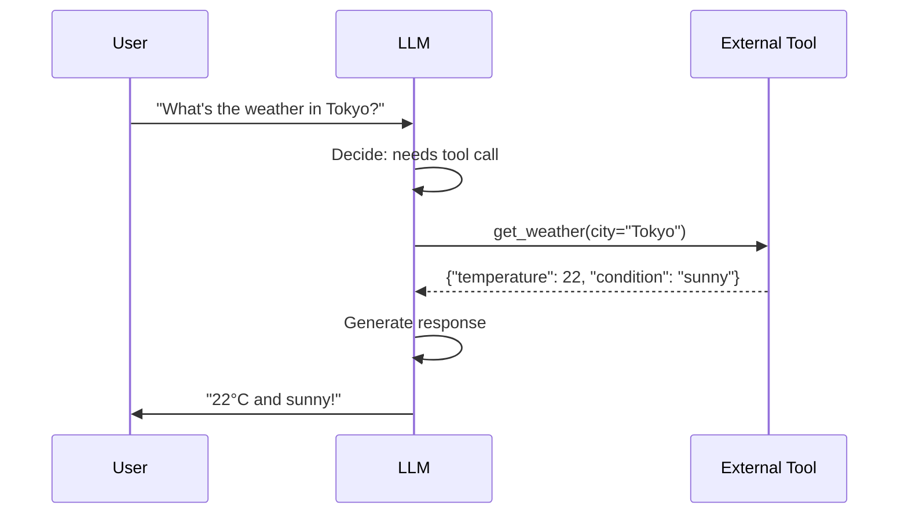
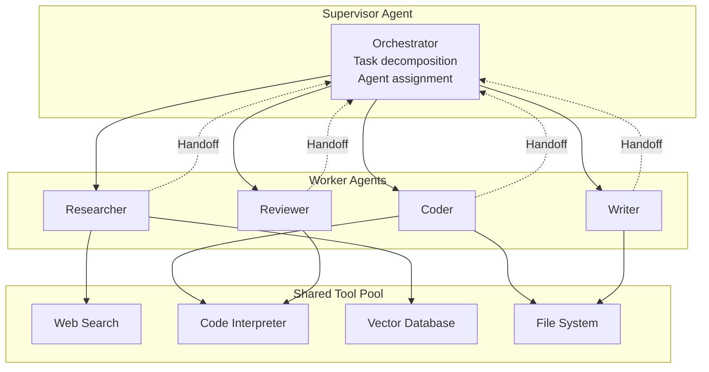

# 06 — Tool Use & Multi-Agent

## Tool Use & Function Calling

### Tool Types

| Tool Type | Examples |
|-----------|----------|
| **Information Retrieval** | Web search, vector DB, SQL |
| **Code Execution** | Python interpreter, bash |
| **APIs** | Calendar, email, Slack |
| **Computation** | Calculator, unit conversion |
| **Multimodal** | Image generation, TTS |

## Multi-Agent Orchestration

**Links**: [[AI-ML/NLP/LLM/05 Prompting Strategies]] | [[AI-ML/NLP/LLM/07 RAG & Inference Optimization]] | [[AI-ML/NLP/LLM/08 Safety, Evaluation & Hallucination]]
**See also**: [[LLM Alignment]] | [[Advanced Prompting Techniques]]
