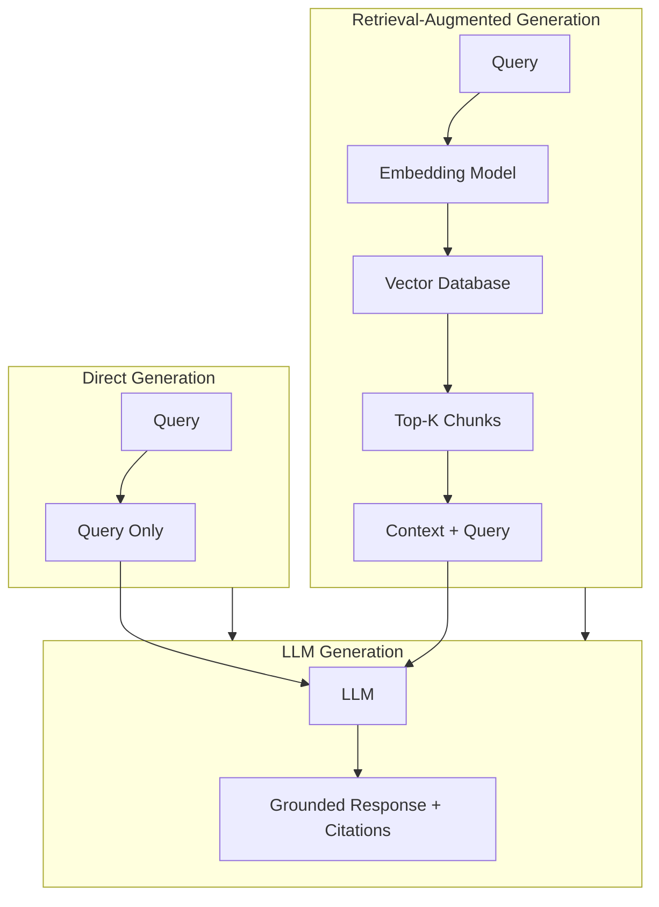
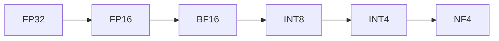

# 07 — RAG & Inference Optimization

## RAG Integration Architecture

| Approach | Best For |
|----------|----------|
| **No RAG** | Casual chat |
| **RAG** | Document QA, support |
| **RAG + Re-rank** | Enterprise search |
| **Agentic RAG** | Research assistants |

## Inference Optimization

| Technique | Speed Gain | Memory Impact |
|-----------|-----------|---------------|
| **KV Cache** | 2-4× faster | Grows with context |
| **Speculative Decoding** | 2-3× faster | +Draft model |
| **Flash Attention** | 2-4× faster | Reduced |
| **Quantization** | 2-4× smaller model | Slightly lower quality |
| **Batching** | Higher throughput | Higher latency |
| **PagedAttention (vLLM)** | 2-4× throughput | Better utilization |

## Quantization Levels

### Memory by Model Size

| Size | FP16 | INT8 | INT4 | Consumer GPU? |
|------|------|------|------|---------------|
| 7B | 14 GB | 7 GB | 3.5 GB | ✅ RTX 3090+ |
| 13B | 26 GB | 13 GB | 6.5 GB | ✅ RTX 4090 |
| 34B | 68 GB | 34 GB | 17 GB | ✅ RTX 4090 (INT4) |
| 70B | 140 GB | 70 GB | 35 GB | ⚠️ Dual GPU |
| 405B | 810 GB | 405 GB | 200 GB | ❌ Cloud only |

**Links**: [[AI-ML/NLP/LLM/04 Fine-Tuning]] | [[AI-ML/NLP/LLM/02 Tokenization & Generation]] | [[AI-ML/NLP/LLM/09 Models, Trends & Selection]]
**See also**: [[RAG]], [[Vector Databases]], [[LLM Evaluation and Benchmarks]]
