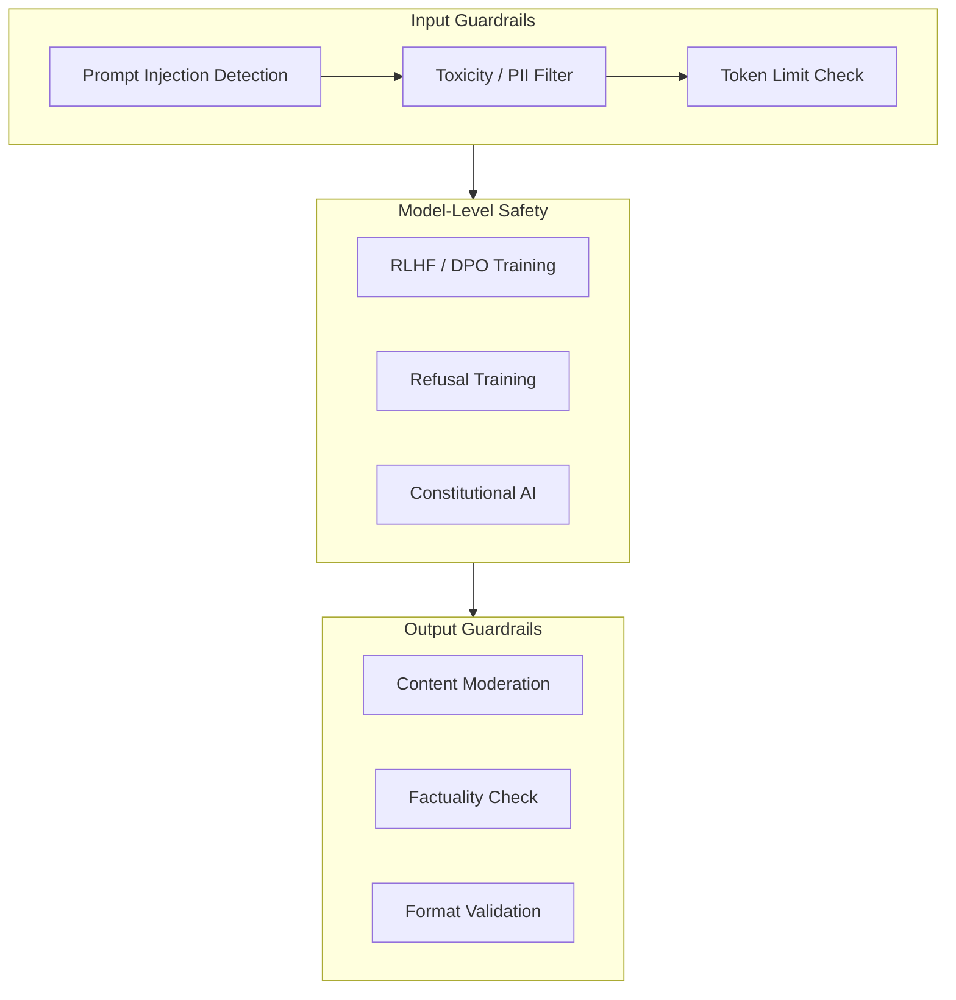
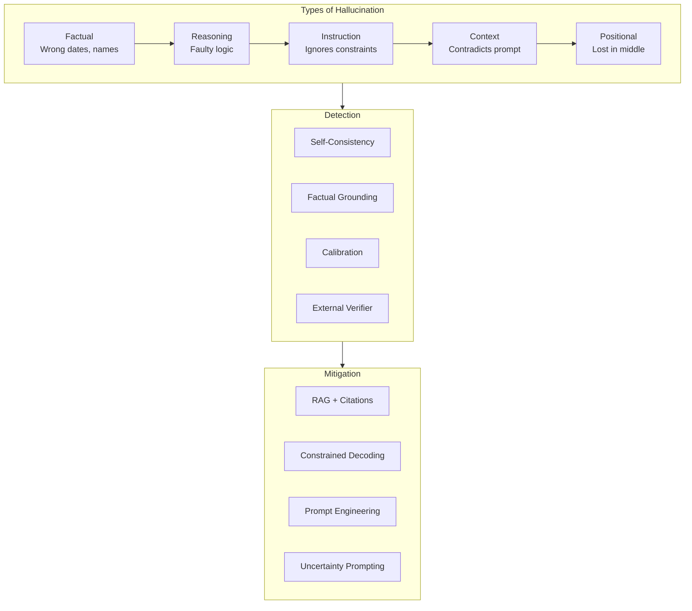

# 08 — Safety, Evaluation & Hallucination

## LLM Safety & Guardrails Stack

## Evaluation Ecosystem

| Method | Examples |
|--------|----------|
| **Automated Benchmarks** | MMLU, GSM8K, HumanEval, MT-Bench |
| **Human Evaluation** | Chatbot Arena (ELO), Red-Teaming |
| **Production Monitoring** | A/B testing, user feedback loops |

### Key Benchmarks

| Benchmark | What It Measures | SOTA (2025) |
|-----------|-----------------|-------------|
| **MMLU** | Multi-task knowledge (57 subjects) | ~90% |
| **GSM8K** | Grade-school math word problems | ~98% |
| **MATH** | Competition-level math | ~85% |
| **HumanEval** | Python code generation (Pass@1) | ~95% |
| **SWE-bench** | Real software engineering | ~50% |
| **Chatbot Arena** | Blind preference ranking | 1400+ ELO |

## Hallucination Taxonomy

**Links**: [[AI-ML/NLP/LLM/09 Models, Trends & Selection]] | [[AI-ML/NLP/LLM/07 RAG & Inference Optimization]] | [[AI-ML/NLP/LLM/05 Prompting Strategies]]
**See also**: [[LLM Evaluation and Benchmarks]] | [[LLM Alignment]]
