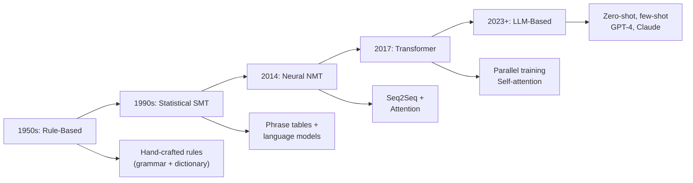

# Machine Translation

**Links**: [[Sequence-to-Sequence Models]] | [[Attention Mechanism]] | [[Transformer Architecture]] | [[Pre-training and Fine-tuning]] | [[NLP Pipeline Design]]

## What is Machine Translation?

Machine translation (MT) automatically converts text from one language to another while preserving meaning. Modern MT uses neural networks to achieve human-level quality on many language pairs.

## Evolution of MT



## Transformer NMT Pipeline

```
Source: "Le chat est sur le tapis"
    ↓
[BPE Tokenization] → Token IDs
    ↓
[Transformer Encoder] → Contextual representations (hidden states)
    ↓
[Transformer Decoder] (autoregressive, cross-attends to encoder)
    ↓
[Output Projection + Softmax] → Token probabilities
    ↓
[Beam Search Decoding] → Best sequence
    ↓
[BPE Detokenization]
    ↓
Target: "The cat is on the mat"
```

## Code Example: Inference

```python
from transformers import MarianMTModel, MarianTokenizer

model_name = "Helsinki-NLP/opus-mt-fr-en"
tokenizer = MarianTokenizer.from_pretrained(model_name)
model = MarianMTModel.from_pretrained(model_name)

def translate(text: str) -> str:
    inputs = tokenizer(text, return_tensors="pt", padding=True)
    translated = model.generate(
        **inputs,
        num_beams=4,           # Beam search width
        max_length=128,
        early_stopping=True,
    )
    return tokenizer.decode(translated[0], skip_special_tokens=True)

print(translate("Le chat est sur le tapis"))
# "The cat is on the mat"
```

## Evaluation Metrics

| Metric | What | Range | Pros | Cons |
|--------|------|-------|------|------|
| **BLEU** | N-gram precision | 0-100 | Fast, standard | Punishes valid paraphrases |
| **TER** | Translation edit rate | 0+ (lower=better) | Intuitive | Sensitive to word order |
| **COMET** | Neural quality score | 0-1 | Correlates with human | Requires reference model |
| **chrF** | Character n-gram F-score | 0-100 | Good for morphologically rich | Less common |
| **METEOR** | Recall-oriented with synonym matching | 0-100 | Handles synonyms | Slower to compute |

```python
from sacrebleu import corpus_bleu, corpus_ter

refs = [["The cat is on the mat", "The cat sits on the mat"]]
hyps = ["The cat is on the mat"]
bleu = corpus_bleu(hyps, refs)
ter = corpus_ter(hyps, refs)
print(f"BLEU: {bleu.score:.1f}, TER: {ter.score:.1f}")
```

## Challenges

| Challenge | Example | Mitigation |
|-----------|---------|------------|
| **Ambiguity** | "bank" (river vs financial) | Context-aware models, domain tags |
| **Idioms** | "It's raining cats and dogs" | Parallel corpus with idiom coverage |
| **Gender** | Translator gender in gendered languages | Gender-specific contexts, debiasing |
| **Low resource** | Languages with little training data | Transfer learning, multilingual models |
| **Domains** | Medical vs legal vs casual | Domain adaptation, fine-tuning |
| **Named entities** | "Apple" (company vs fruit) | Entity-aware tokenization, capitalization |

## Language Coverage

| Model Family | Languages | Size | Best For |
|-------------|-----------|------|----------|
| Helsinki-NLP OPUS-MT | 1000+ pairs | Small-Medium | Specific pairs, edge cases |
| M2M-100 (Meta) | 100 languages | Large | Many-to-many translation |
| NLLB (Meta) | 200 languages | Large | Low-resource languages |
| GPT-4 / Claude | 50+ languages | Very Large | General, few-shot translation |

**Next**: [[Text Summarization]] — Condensing long documents
