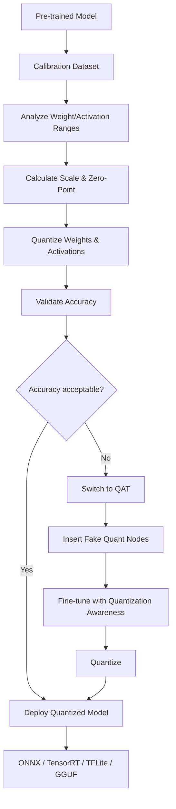
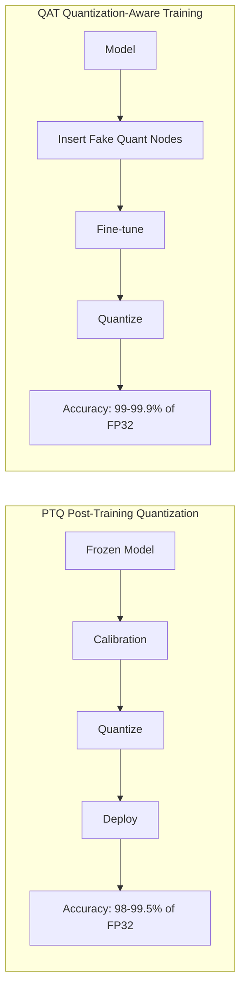
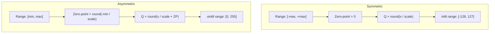
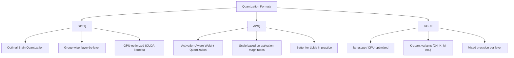
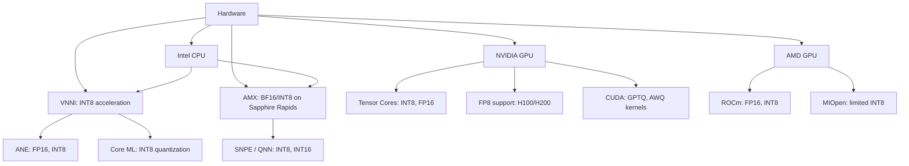
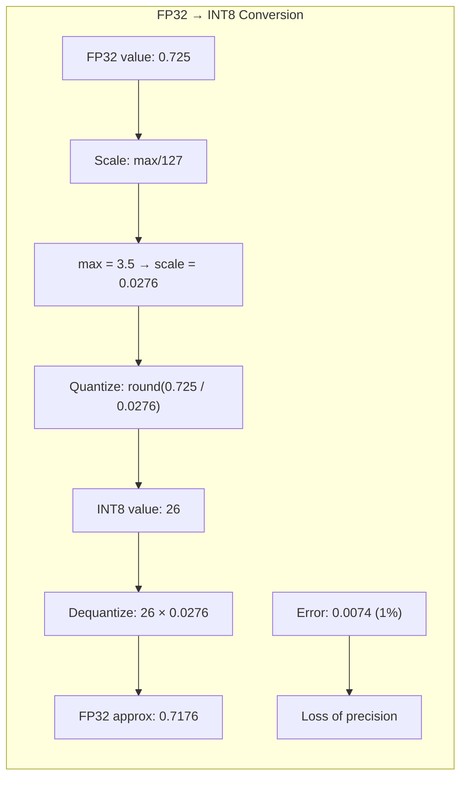

# Model Quantization

**Links**: [[GPT and Decoder Models]] | [[Pre-training and Fine-tuning]] | [[Transformer Architecture]] | [[Inference Optimization]]

## What is Quantization?

Quantization reduces model precision (e.g., 32-bit float → 8-bit integer) to decrease memory usage and increase inference speed with minimal accuracy loss.

## Precision Levels

| Type | Bits | Memory (7B model) | Speed |
|------|------|-------------------|-------|
| FP32 | 32 | 28 GB | 1x |
| FP16 | 16 | 14 GB | ~1.5x |
| INT8 | 8 | 7 GB | ~2x |
| INT4 | 4 | 3.5 GB | ~3x |

## Post-Training Quantization (PTQ)

Quantize a trained model without retraining.

```python
from transformers import AutoModelForCausalLM, BitsAndBytesConfig

quant_config = BitsAndBytesConfig(
    load_in_4bit=True,
    bnb_4bit_compute_dtype=torch.float16,
    bnb_4bit_use_double_quant=True,
)

model = AutoModelForCausalLM.from_pretrained(
    "meta-llama/Llama-2-7b",
    quantization_config=quant_config,
    device_map="auto",
)
```

## Quantization-Aware Training (QAT)

Simulate quantization during training for better accuracy.

## GGUF / llama.cpp

Format for running quantized models on CPU:

```bash
llama-cli -m llama-2-7b.Q4_K_M.gguf -p "Hello, how are you?"
```

**Next**: [[Inference Optimization]] — Making models run faster

---

## Quantization Process Overview



## PTQ vs QAT — Deep Comparison



| Aspect | PTQ | QAT |
|--------|-----|-----|
| Training required | No | Yes (fine-tuning) |
| Time | Minutes | Hours-days |
| Data needed | Small calibration set | Full training data |
| Accuracy (INT8) | 98-99.5% | 99-99.9% |
| Accuracy (INT4) | 95-98% | 97-99% |
| Complexity | Low | High |
| Best for | LLMs, vision models | Deployment-critical tasks |
| Hardware support | Universal | Universal |

### Accuracy vs Compression

| Precision | PTQ Accuracy (% FP32) | QAT Accuracy (% FP32) | Size Reduction | Speed-up |
|-----------|----------------------|----------------------|----------------|----------|
| FP32 | 100% | 100% | 1x | 1x |
| FP16 | 99.9% | 99.95% | 2x | 1.5-2x |
| INT8 | 98.5% | 99.5% | 4x | 2-4x |
| INT4 | 96% | 98% | 8x | 3-5x |
| INT4+FP16 mixed | 97% | 98.5% | ~6x | 3-4x |
| Binary | 70-85% | 85-95% | 32x | 10-20x |

## Symmetric vs Asymmetric Quantization



```python
import numpy as np

def symmetric_quantize(tensor: np.ndarray, bits: int = 8) -> tuple:
    max_val = np.max(np.abs(tensor))
    q_max = 2 ** (bits - 1) - 1
    scale = max_val / q_max
    quantized = np.round(tensor / scale).astype(np.int8)
    return quantized, scale, 0

def asymmetric_quantize(tensor: np.ndarray, bits: int = 8) -> tuple:
    min_val, max_val = np.min(tensor), np.max(tensor)
    q_max = 2**bits - 1
    scale = (max_val - min_val) / q_max
    zero_point = np.round(-min_val / scale).astype(np.int32)
    quantized = np.round(tensor / scale + zero_point).astype(np.uint8)
    return quantized, scale, zero_point

def dequantize(quantized: np.ndarray, scale: float, zero_point: int = 0) -> np.ndarray:
    return (quantized.astype(np.float32) - zero_point) * scale
```

| Aspect | Symmetric | Asymmetric |
|--------|-----------|------------|
| Zero-point | Always 0 | Non-zero |
| Range | Symmetric around 0 | Full range [min, max] |
| Signed/Unsigned | Signed (INT8) | Unsigned (UINT8) |
| Weights | Better (symmetric distribution) | Good |
| Activations | Wasteful (often positive) | Better (ReLU outputs positive) |
| Computation | Simpler (no ZP) | Slightly more complex |

## Per-Tensor vs Per-Channel vs Per-Group

```mermaid
graph TD
    A[Quantization Granularity] --> B[Per-Tensor]
    A --> C[Per-Channel]
    A --> D[Per-Group (Group-Wise)]
    B --> E["1 scale + ZP for entire tensor"]
    B --> F["+ Simple, - Less accurate"]
    C --> G["1 scale + ZP per output channel"]
    C --> H["+ More accurate, - More params"]
    D --> I["1 scale + ZP per group of rows/cols"]
    D --> J["+ Best accuracy, + Most complex"]
```

| Granularity | Scales | Memory Overhead | Accuracy | Hardware Support |
|-------------|--------|-----------------|----------|------------------|
| Per-tensor | 1 | Negligible | Low | All accelerators |
| Per-channel | C (channels) | Very Low | Medium | GPU Tensor Cores |
| Per-group | G (groups) | Low | High | Limited (CUDA, custom) |
| Per-vector | V (vectors) | Medium | Very High | Very limited |

```python
# Conceptual implementation of per-channel quantization
def per_channel_quantize(weight_matrix: np.ndarray, bits: int = 8):
    """
    weight_matrix shape: [out_channels, in_channels]
    """
    scales = np.max(np.abs(weight_matrix), axis=1) / (2**(bits-1) - 1)
    quantized = np.zeros_like(weight_matrix, dtype=np.int8)
    for c in range(weight_matrix.shape[0]):
        quantized[c, :] = np.round(weight_matrix[c, :] / scales[c]).astype(np.int8)
    return quantized, scales

# Per-group quantization (group_size = 32 or 64 or 128)
def per_group_quantize(tensor: np.ndarray, group_size: int = 32, bits: int = 4):
    """
    Divide weights into groups and quantize each independently.
    Used in GPTQ and AWQ.
    """
    orig_shape = tensor.shape
    flat = tensor.flatten()
    num_groups = (len(flat) + group_size - 1) // group_size
    quantized_groups = []

    for g in range(num_groups):
        group = flat[g * group_size : (g + 1) * group_size]
        max_val = np.max(np.abs(group))
        scale = max_val / (2**(bits - 1) - 1) if max_val > 0 else 1.0
        q_group = np.round(group / scale).astype(np.int8)
        quantized_groups.append(q_group)

    return np.concatenate(quantized_groups).reshape(orig_shape)
```

## Calibration Dataset Selection

| Strategy | Description | Samples Needed | Best For |
|----------|-------------|---------------|----------|
| Random sample | Uniform selection from training data | 128-1024 | General purpose |
| Diverse selection | Cluster and sample centroids | 64-512 | Balanced task coverage |
| Task-specific | Focus on task-relevant inputs | 128-512 | Domain-specific |
| Gradient-based | Select high-loss samples | 32-256 | LLM calibration |
| Synthetic | Generated from model distribution | 128-512 | Privacy-sensitive |

```python
from sklearn.cluster import KMeans
import numpy as np

def diverse_calibration_set(embeddings: np.ndarray, n_samples: int = 256):
    """Select diverse samples for calibration via clustering"""
    kmeans = KMeans(n_clusters=min(n_samples, len(embeddings) // 10), random_state=42)
    clusters = kmeans.fit_predict(embeddings)

    selected_indices = []
    for cluster_id in np.unique(clusters):
        cluster_indices = np.where(clusters == cluster_id)[0]
        # Pick closest to centroid
        centroid = kmeans.cluster_centers_[cluster_id]
        distances = np.linalg.norm(embeddings[cluster_indices] - centroid, axis=1)
        n_from_cluster = max(1, n_samples // len(np.unique(clusters)))
        selected = cluster_indices[np.argsort(distances)[:n_from_cluster]]
        selected_indices.extend(selected.tolist())

    return np.array(selected_indices)[:n_samples]
```

## GPTQ, AWQ, GGUF — Format Comparison



| Format | Creator | Precision | Device | Key Feature |
|--------|---------|-----------|--------|-------------|
| GPTQ | Frantar et al. | 2-8 bit | GPU | Optimal Brain Quantization |
| AWQ | Lin et al. | 2-8 bit | GPU | Activation-aware scaling |
| GGUF | Gerganov | 1-8 bit | CPU/MPS | K-quant (mixed precision) |
| AQLM | Egiazarian et al. | 2-4 bit | GPU | Additive quantization |
| QuIP# | Tseng et al. | 2-4 bit | GPU | Lattice-based, incoherence |

### GGUF K-Quant Variants

| Quant | Size (7B) | PPL ↑ | Use Case |
|-------|-----------|-------|----------|
| Q2_K | 2.7 GB | +0.67 | Extreme compression |
| Q3_K_S | 3.0 GB | +0.27 | Ultra low resource |
| Q3_K_M | 3.3 GB | +0.20 | Balanced low resource |
| Q4_K_S | 3.6 GB | +0.10 | Good speed/size |
| Q4_K_M | 3.8 GB | +0.05 | Most popular |
| Q5_K_S | 4.1 GB | +0.03 | High quality |
| Q5_K_M | 4.5 GB | +0.02 | Near FP16 |
| Q6_K | 5.0 GB | +0.01 | Near lossless |
| Q8_0 | 6.7 GB | +0.001 | Almost lossless |

```python
# Example: Using exllamav2 for GPTQ
from transformers import AutoTokenizer, AutoModelForCausalLM

gptq_model = AutoModelForCausalLM.from_pretrained(
    "TheBloke/Llama-2-7B-GPTQ",
    device_map="auto",
    trust_remote_code=False,
)

tokenizer = AutoTokenizer.from_pretrained("TheBloke/Llama-2-7B-GPTQ")

prompt = "The capital of France is"
inputs = tokenizer(prompt, return_tensors="pt").to("cuda")
output = gptq_model.generate(**inputs, max_new_tokens=20)
print(tokenizer.decode(output[0]))
```

## BitsAndBytes Config for 4-bit QLoRA

```python
import torch
from transformers import AutoModelForCausalLM, BitsAndBytesConfig, AutoTokenizer

bnb_config = BitsAndBytesConfig(
    load_in_4bit=True,
    bnb_4bit_quant_type="nf4",           # NormalFloat4 (optimal for normally distributed weights)
    bnb_4bit_compute_dtype=torch.bfloat16, # Compute in bf16 for stability
    bnb_4bit_use_double_quant=True,       # Second-order quantization of scales
)

model = AutoModelForCausalLM.from_pretrained(
    "meta-llama/Llama-2-7b-hf",
    quantization_config=bnb_config,
    device_map="auto",
    torch_dtype=torch.bfloat16,
)

tokenizer = AutoTokenizer.from_pretrained("meta-llama/Llama-2-7b-hf")

# Check memory: ~4-6GB instead of 28GB for FP32
print(f"Model memory: {model.get_memory_footprint() / 1e9:.2f} GB")
# Model memory: 4.15 GB
```

```python
# QLoRA training with 4-bit base model
from peft import LoraConfig, get_peft_model, prepare_model_for_kbit_training

model = prepare_model_for_kbit_training(model)

lora_config = LoraConfig(
    r=16,
    lora_alpha=32,
    target_modules=["q_proj", "v_proj", "k_proj", "o_proj"],
    lora_dropout=0.05,
    bias="none",
    task_type="CAUSAL_LM",
)

model = get_peft_model(model, lora_config)
model.print_trainable_parameters()
# Trainable params: 4,194,304 / 6,738,415,616 = 0.062%
```

## Quantization for Different Architectures

### LLM (Decoder-Only) vs CNN vs Encoder

```mermaid
graph TD
    A[Model Architecture] --> B{Type}
    B --> C[LLM / Decoder-Only]
    B --> D[CNN / Vision]
    B --> E[Encoder (BERT)]
    C --> F[Focus: KV cache, attention]
    C --> G["Sensitive: outlier features"]
    C --> H[Best: GPTQ, AWQ, NF4]
    D --> I[Focus: Convolution weights]
    D --> J[Sensitive: Batch norm stats]
    D --> K[Best: PTQ INT8, QAT]
    E --> L[Focus: Self-attention weights]
    E --> M[Sensitive: LayerNorm scales]
    E --> N[Best: PTQ INT8, Distillation]
```

| Component | LLM | CNN | BERT Encoder |
|-----------|-----|-----|--------------|
| Weight distribution | Heavy-tailed, outliers | Gaussian | Near-Gaussian |
| Sensitivity to quantization | High (generation quality) | Medium | Medium-High |
| Best quantization strategy | GPTQ, AWQ, NF4 | PTQ INT8, QAT | PTQ INT8, Distillation |
| Key challenge | Outlier features | Batch norm | LayerNorm scales |
| Memory bottleneck | KV cache | Feature maps | Sequence length |

## Mixed Precision (FP16 + INT4)

```python
class MixedPrecisionLinear(torch.nn.Module):
    def __init__(self, in_features, out_features, weight_quant_bits=4):
        super().__init__()
        self.weight = torch.nn.Parameter(torch.randn(out_features, in_features))
        self.weight_quant_bits = weight_quant_bits

    def forward(self, x):
        # Quantize weight to INT4, compute in FP16
        q_weight, scale = self._quantize_weight(self.weight)
        # Dequantize for matmul
        deq_weight = q_weight * scale
        return torch.nn.functional.linear(x, deq_weight)

    def _quantize_weight(self, w):
        max_val = w.abs().max(dim=1, keepdim=True).values
        q_max = 2 ** (self.weight_quant_bits - 1) - 1
        scale = max_val / q_max
        q_w = torch.round(w / scale).to(torch.int8)
        return q_w, scale
```

```mermaid
graph LR
    A[Input FP16] --> B[Linear Layer]
    B --> C{Precision}
    C --> D[Weights: INT4 (quantized)]
    C --> E[Activations: FP16]
    D --> F[Dequantize on the fly]
    E --> F
    F --> G[FP16 Compute]
    G --> H[Output FP16]
```

## KV Cache Quantization

```python
import torch
import torch.nn as nn

class QuantizedKVCache:
    def __init__(self, max_batch_size, max_seq_len, n_heads, head_dim, bits=8):
        self.cache_k = torch.zeros(max_batch_size, max_seq_len, n_heads, head_dim)
        self.cache_v = torch.zeros(max_batch_size, max_seq_len, n_heads, head_dim)
        self.bits = bits
        self.max_seq_len = max_seq_len

    def quantize(self, tensor):
        max_val = tensor.abs().max()
        q_max = 2**(self.bits - 1) - 1
        scale = max_val / q_max if max_val > 0 else 1.0
        quantized = torch.round(tensor / scale).to(torch.int8)
        return quantized, scale

    def update(self, key, value, position):
        q_k, s_k = self.quantize(key)
        q_v, s_v = self.quantize(value)
        self.cache_k[position] = q_k
        self.cache_v[position] = q_v
        self.scale_k = s_k
        self.scale_v = s_v

    def get(self):
        return self.cache_k * self.scale_k, self.cache_v * self.scale_v
```

| KV Cache Precision | Memory (7B, 4k ctx) | Memory (70B, 4k ctx) | Quality Impact |
|--------------------|-------------------|-------------------|----------------|
| FP16 | ~1.5 GB | ~15 GB | Baseline |
| INT8 | ~0.75 GB | ~7.5 GB | Negligible |
| INT4 | ~0.375 GB | ~3.75 GB | Slight degradation |
| NF4 | ~0.375 GB | ~3.75 GB | Better than INT4 |

## Impact on Different Tasks

| Task | FP32 | INT8 | INT4 | Notes |
|------|------|------|------|-------|
| Text generation (perplexity) | 5.0 | 5.05 (+1%) | 5.3 (+6%) | INT4 still generates coherent text |
| Translation (BLEU) | 28.5 | 28.3 (-0.7%) | 27.1 (-4.9%) | Degradation for low-resource langs |
| Summarization (ROUGE-L) | 22.1 | 22.0 (-0.5%) | 21.3 (-3.6%) | Abstractive tasks more sensitive |
| Sentiment analysis (F1) | 93.2 | 93.0 (-0.2%) | 91.8 (-1.5%) | Classification is robust |
| NER (F1) | 91.5 | 91.3 (-0.2%) | 90.1 (-1.5%) | Entity boundaries sensitive |
| Math reasoning (GSM8K) | 55.0 | 54.2 (-1.5%) | 49.5 (-10%) | Reasoning tasks degrade faster |
| Code generation (HumanEval) | 28.1 | 27.5 (-2.1%) | 24.0 (-14.6%) | Code quality degrades at 4-bit |

## Hardware Support



| Hardware | INT8 | INT4 | FP16 | BF16 | FP8 |
|----------|------|------|------|------|-----|
| NVIDIA A100 | ✓ Tensor Core | ✗ (emulated) | ✓ | ✓ | ✓ (H100) |
| NVIDIA H100 | ✓ | ✓ (via kernel) | ✓ | ✓ | ✓ Native |
| AMD MI250 | ✓ | ✗ | ✓ | ✓ | ✗ |
| Intel Xeon (VNNI) | ✓ | ✗ | ✓ | ✓ | ✗ |
| Apple M1/M2 (ANE) | ✓ (Core ML) | ✗ | ✓ | ✓ | ✗ |
| Qualcomm Snapdragon | ✓ (QNN) | ✓ | ✓ | ✗ | ✗ |

## Quantization Math — Mermaid Diagram



```python
def quantization_error(tensor: np.ndarray, bits: int = 8) -> float:
    """Measure quantization error (NRMSE)"""
    q_tensor, scale, zp = asymmetric_quantize(tensor, bits)
    deq_tensor = dequantize(q_tensor, scale, zp)
    mse = np.mean((tensor - deq_tensor) ** 2)
    variance = np.var(tensor)
    nrmse = np.sqrt(mse / variance) if variance > 0 else 0
    return nrmse

# Measure error across a model
errors = {}
for name, param in model.named_parameters():
    if param.ndim >= 2:  # Only quantize weights
        errors[name] = quantization_error(param.detach().cpu().numpy(), bits=4)

avg_error = np.mean(list(errors.values()))
print(f"Average NRMSE at INT4: {avg_error:.4f}")
```

## Practical Checklist

- [ ] Choose PTQ for quick deployment, QAT for maximum accuracy
- [ ] Use asymmetric quantization for activations, symmetric for weights
- [ ] Per-channel quantization provides best accuracy-cost trade-off
- [ ] For LLMs: use NF4 via BitsAndBytes or GPTQ/AWQ for GPU
- [ ] For CPU: use GGUF with Q4_K_M for best balance
- [ ] Always validate quantized model on a held-out test set
- [ ] Monitor perplexity or task-specific metrics after quantization
- [ ] KV cache quantization saves significant memory for long contexts
- [ ] Mixed precision (FP16 compute + INT4 weights) is practical for most tasks
- [ ] Use calibration data representative of production distribution