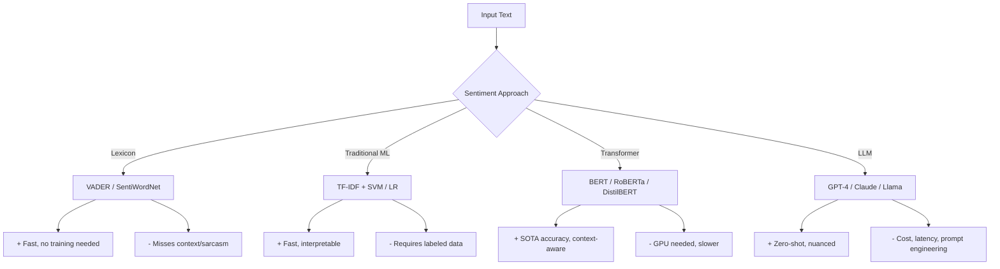
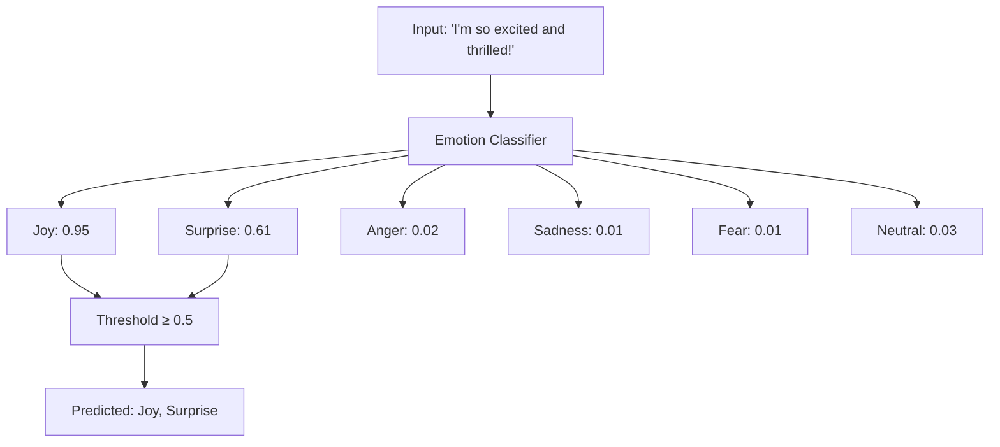
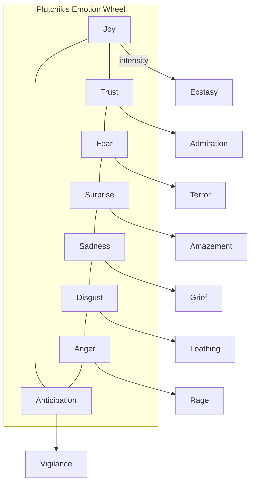
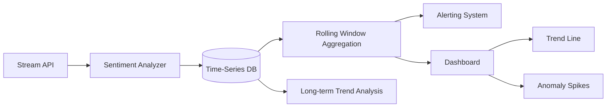
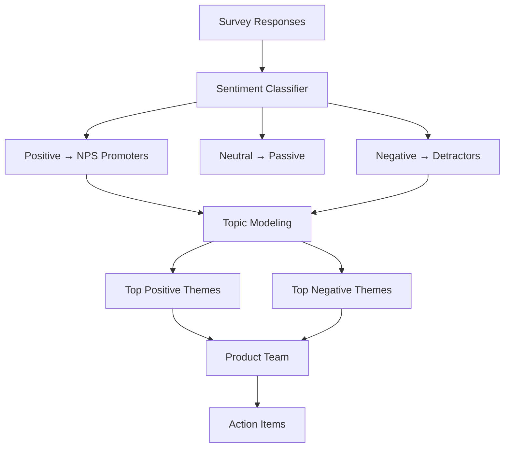
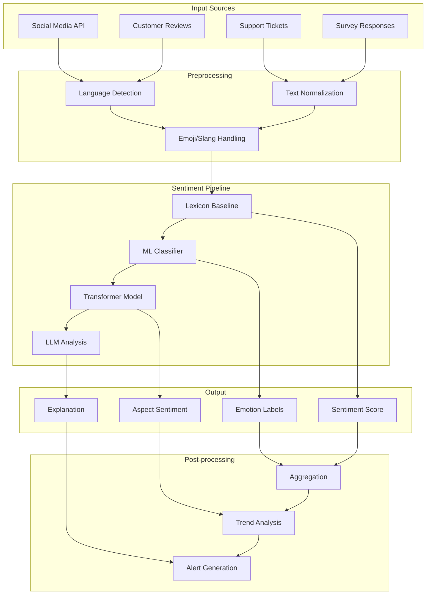

# Sentiment Analysis

**Links**: [[Text Classification]] | [[NLP Pipeline Design]] | [[BERT and Encoder Models]] | [[Prompt Engineering]] | [[Pre-training and Fine-tuning]]

## What is Sentiment Analysis?

Sentiment analysis determines the emotional tone behind text — positive, negative, or neutral. It can also detect specific emotions (anger, joy, sadness) and intensity.

## Levels of Granularity

| Level | Example | Output |
|-------|---------|--------|
| Document-level | Full review | overall rating |
| Sentence-level | "Great food but slow service" | mixed |
| Aspect-based | "Battery life is amazing, screen is dull" | battery:+, screen:- |
| Emotion detection | "I'm absolutely furious!" | anger: 0.92 |

## Lexicon-Based Approach

Uses predefined word→sentiment mappings (VADER, SentiWordNet).

```python
from vaderSentiment.vaderSentiment import SentimentIntensityAnalyzer

analyzer = SentimentIntensityAnalyzer()
scores = analyzer.polarity_scores("This movie was absolutely fantastic!")
# {'neg': 0.0, 'neu': 0.284, 'pos': 0.716, 'compound': 0.8316}
```

Fast, no training needed, but can't handle context/sarcasm.

## Transformer-Based

```python
from transformers import pipeline

classifier = pipeline("sentiment-analysis",
    model="distilbert-base-uncased-finetuned-sst-2-english")

result = classifier("I loved every minute of this film!")
# [{'label': 'POSITIVE', 'score': 0.998}]
```

## Aspect-Based Sentiment

Extracts sentiment toward specific features:

```
"The camera is great but the battery drains fast."
  → camera:  positive (0.92)
  → battery: negative (0.87)
```

## Challenges

- **Sarcasm**: "Great, another meeting." (negative)
- **Negation**: "Not bad" (positive)
- **Emoji/ slang**: "This is lit 🔥" (positive)
- **Code-switching**: Mixing languages

**Next**: [[Machine Translation]] — Translating between languages

---

## Approaches Comparison



| Method | Accuracy | Speed | Training Data | Interpretability | Cost |
|--------|----------|-------|---------------|------------------|------|
| Lexicon (VADER) | 65-75% | ~1ms | None | High | Free |
| Traditional ML | 80-88% | ~5ms | 1k-10k | Medium | Low |
| Fine-tuned BERT | 90-96% | ~20ms | 10k-100k | Low (attention) | Medium |
| LLM (GPT-4) | 92-97% | ~500ms | 0 (few-shot) | High (explanations) | High |

## Datasets Overview

| Dataset | Size | Classes | Domain | Language | Avg Length |
|---------|------|---------|--------|----------|------------|
| SST-2 | 67k | pos/neg | Movie reviews | EN | 19 words |
| SST-5 | 11k | 5 classes | Movie reviews | EN | 18 words |
| IMDB | 50k | pos/neg | Movie reviews | EN | 231 words |
| Amazon Polarity | 4M | pos/neg | Product reviews | EN | 92 words |
| Yelp Polarity | 560k | pos/neg | Business reviews | EN | 141 words |
| Twitter Sentiment | 1.6M | pos/neg/neu | Tweets | EN | 15 words |
| GoEmotions | 58k | 27 emotions | Reddit | EN | 16 words |
| Multilingual Sentiment | 1.2M | pos/neg | Reviews | 14 langs | Varies |

## Fine-Tuning BERT for Sentiment — Full Example

```python
import torch
import torch.nn as nn
from torch.utils.data import Dataset, DataLoader
from transformers import (
    AutoTokenizer,
    AutoModelForSequenceClassification,
    AdamW,
    get_linear_schedule_with_warmup,
)
from sklearn.metrics import classification_report, f1_score
import numpy as np
from tqdm import tqdm

class SentimentDataset(Dataset):
    def __init__(self, texts, labels, tokenizer, max_length=128):
        self.texts = texts
        self.labels = labels
        self.tokenizer = tokenizer
        self.max_length = max_length

    def __len__(self):
        return len(self.texts)

    def __getitem__(self, idx):
        encoding = self.tokenizer(
            self.texts[idx],
            truncation=True,
            padding="max_length",
            max_length=self.max_length,
            return_tensors="pt",
        )
        return {
            "input_ids": encoding["input_ids"].squeeze(),
            "attention_mask": encoding["attention_mask"].squeeze(),
            "label": torch.tensor(self.labels[idx], dtype=torch.long),
        }

def train_epoch(model, dataloader, optimizer, scheduler, device):
    model.train()
    total_loss = 0
    progress = tqdm(dataloader, desc="Training")

    for batch in progress:
        optimizer.zero_grad()
        input_ids = batch["input_ids"].to(device)
        attention_mask = batch["attention_mask"].to(device)
        labels = batch["label"].to(device)

        outputs = model(input_ids, attention_mask=attention_mask, labels=labels)
        loss = outputs.loss
        total_loss += loss.item()

        loss.backward()
        torch.nn.utils.clip_grad_norm_(model.parameters(), max_norm=1.0)
        optimizer.step()
        scheduler.step()

        progress.set_postfix({"loss": loss.item()})

    return total_loss / len(dataloader)

def evaluate(model, dataloader, device):
    model.eval()
    predictions, true_labels = [], []

    with torch.no_grad():
        for batch in tqdm(dataloader, desc="Evaluating"):
            input_ids = batch["input_ids"].to(device)
            attention_mask = batch["attention_mask"].to(device)
            labels = batch["label"].to(device)

            outputs = model(input_ids, attention_mask=attention_mask)
            preds = torch.argmax(outputs.logits, dim=1)

            predictions.extend(preds.cpu().numpy())
            true_labels.extend(labels.cpu().numpy())

    return classification_report(true_labels, predictions, output_dict=True)

def main():
    device = torch.device("cuda" if torch.cuda.is_available() else "cpu")
    model_name = "bert-base-uncased"
    num_labels = 2

    tokenizer = AutoTokenizer.from_pretrained(model_name)
    model = AutoModelForSequenceClassification.from_pretrained(
        model_name, num_labels=num_labels
    ).to(device)

    # Sample data (replace with actual data loading)
    train_texts = ["I loved this movie!", "Terrible experience..."] * 500
    train_labels = [1, 0] * 500
    val_texts = ["Great product!"] * 100
    val_labels = [1] * 100

    train_dataset = SentimentDataset(train_texts, train_labels, tokenizer)
    val_dataset = SentimentDataset(val_texts, val_labels, tokenizer)

    train_loader = DataLoader(train_dataset, batch_size=16, shuffle=True)
    val_loader = DataLoader(val_dataset, batch_size=16)

    optimizer = AdamW(model.parameters(), lr=2e-5, weight_decay=0.01)
    total_steps = len(train_loader) * 3  # 3 epochs
    scheduler = get_linear_schedule_with_warmup(
        optimizer, num_warmup_steps=int(0.1 * total_steps), num_training_steps=total_steps
    )

    for epoch in range(3):
        train_loss = train_epoch(model, train_loader, optimizer, scheduler, device)
        metrics = evaluate(model, val_loader, device)
        print(f"Epoch {epoch + 1}: loss={train_loss:.4f}, f1={metrics['weighted avg']['f1-score']:.4f}")

    model.save_pretrained("./sentiment-bert-model")
    tokenizer.save_pretrained("./sentiment-bert-model")

if __name__ == "__main__":
    main()
```

## Multi-Label Emotion Detection



```python
from transformers import AutoModelForSequenceClassification, AutoTokenizer
import torch
import torch.nn.functional as F

class MultiLabelEmotionDetector:
    def __init__(self, model_name="bhadresh-savani/bert-base-uncased-emotion"):
        self.tokenizer = AutoTokenizer.from_pretrained(model_name)
        self.model = AutoModelForSequenceClassification.from_pretrained(model_name)
        self.emotions = ["anger", "fear", "joy", "love", "sadness", "surprise"]

    def predict(self, text: str, threshold: float = 0.5) -> dict:
        inputs = self.tokenizer(text, return_tensors="pt")
        with torch.no_grad():
            logits = self.model(**inputs).logits
        probs = torch.sigmoid(logits).squeeze().numpy()
        return {
            emotion: float(prob)
            for emotion, prob in zip(self.emotions, probs)
            if prob >= threshold
        }

    def emotion_wheel(self, text: str) -> dict:
        """Returns all emotions with scores regardless of threshold"""
        inputs = self.tokenizer(text, return_tensors="pt")
        with torch.no_grad():
            logits = self.model(**inputs).logits
        probs = F.softmax(logits, dim=1).squeeze().numpy()
        return dict(zip(self.emotions, probs.tolist()))

detector = MultiLabelEmotionDetector()
result = detector.predict("I can't believe you did this! It's amazing!")
# {'joy': 0.82, 'surprise': 0.74}
```

### Basic Emotions (Plutchik's Wheel)



## Cross-Lingual Sentiment

### Zero-Shot Transfer

```python
from transformers import pipeline

# Use a multilingual model for zero-shot sentiment
classifier = pipeline(
    "sentiment-analysis",
    model="nlptown/bert-base-multilingual-uncased-sentiment",
)

english = classifier("This product is excellent!")
french = classifier("Ce produit est excellent!")
spanish = classifier("¡Este producto es excelente!")
german = classifier("Dieses Produkt ist ausgezeichnet!")
# All should return positive with high confidence
```

| Strategy | Labeled Data | Accuracy | Languages | Complexity |
|----------|-------------|----------|-----------|------------|
| Translate + Classify | Target lang only | 85-90% | Any | Medium |
| Multilingual BERT | Mixed | 90-94% | 100+ | Low |
| Cross-lingual transfer | Source lang | 80-88% | Target zero-shot | Low |
| XLM-RoBERTa | Mixed | 91-95% | 100+ | Medium |
| LLM prompt | None | 85-93% | Many | High (cost) |

## Time-Series Sentiment Tracking

```python
import pandas as pd
import numpy as np
from datetime import datetime, timedelta

class TimeSeriesSentiment:
    def __init__(self, model):
        self.model = model
        self.history = []

    def record(self, text: str, timestamp: datetime = None):
        score = self.model(text)
        self.history.append({
            "timestamp": timestamp or datetime.now(),
            "text": text,
            "sentiment": score,
        })

    def rolling_average(self, window: str = "1D") -> pd.DataFrame:
        df = pd.DataFrame(self.history)
        df.set_index("timestamp", inplace=True)
        return df["sentiment"].resample(window).mean()

    def detect_anomaly(self, z_threshold: float = 2.0) -> list:
        scores = np.array([h["sentiment"] for h in self.history])
        mean, std = np.mean(scores), np.std(scores)
        anomalies = []
        for h in self.history:
            z_score = (h["sentiment"] - mean) / std
            if abs(z_score) > z_threshold:
                anomalies.append(h)
        return anomalies
```



## Social Media Sentiment

### Handling Hashtags, Emoji, Slang

```python
import emoji
import re

class SocialMediaPreprocessor:
    def __init__(self):
        self.emoji_sentiment = {
            "😊": 0.8, "😢": -0.7, "😡": -0.9, "🔥": 0.6, "💯": 0.9,
            "❤️": 0.9, "😂": 0.7, "😭": -0.3, "😍": 0.9, "👍": 0.7,
        }
        self.slang_map = {
            "lit": "excellent", "salty": "annoyed", "savage": "bold",
            "cap": "lie", "no cap": "truth", "flex": "show off",
            "slay": "impress", "bussin": "delicious", "mid": "mediocre",
        }

    def preprocess(self, text: str) -> str:
        # Expand hashtags
        text = re.sub(r"#(\w+)", r"\1", text)

        # Convert emoji to text sentiment feature
        def emoji_to_text(match):
            em = match.group()
            sentiment = self.emoji_sentiment.get(em, 0)
            return f" {emoji.demojize(em).replace(':', '').replace('_', ' ')} (emoji_sentiment:{sentiment:.1f}) "

        text = emoji.replace_emoji(text, emoji_to_text)

        # Replace slang
        for slang, replacement in self.slang_map.items():
            text = re.sub(rf"\b{slang}\b", replacement, text, flags=re.IGNORECASE)

        return text
```

## Real-World Applications

### Brand Monitoring

```python
GENERAL_INQUIRY = """
Set up a brand monitoring pipeline:
1. Collect tweets/posts mentioning brand name via API
2. Run sentiment analysis every 15 minutes
3. Alert if sentiment drops below -0.5 threshold
4. Track competitor sentiment for comparison
5. Generate weekly sentiment report
6. Correlate sentiment with sales data
"""
```

### Customer Feedback Analysis



### Financial Sentiment

```python
class FinancialSentimentAnalyzer:
    def __init__(self):
        self.financial_lexicon = {
            "bullish": 0.8, "bearish": -0.8, "outperform": 0.7,
            "underperform": -0.7, "downgrade": -0.6, "upgrade": 0.6,
            "volatile": -0.3, "stable": 0.4, "growth": 0.7,
            "decline": -0.6, "profit": 0.8, "loss": -0.7,
        }

    def analyze_news(self, headline: str) -> dict:
        """Analyze financial news headline"""
        words = headline.lower().split()
        score = sum(self.financial_lexicon.get(w, 0) for w in words)
        return {
            "headline": headline,
            "composite_score": score,
            "sentiment": "positive" if score > 0 else "negative" if score < 0 else "neutral",
            "confidence": min(abs(score) / len(words), 1.0) if words else 0,
        }
```

## Evaluation Metrics for Sentiment

| Metric | Formula | When to Use |
|--------|---------|-------------|
| Accuracy | (TP+TN)/(total) | Balanced classes |
| Macro F1 | avg(F1 per class) | Class imbalance |
| Weighted F1 | weighted avg(F1) | Skewed distribution |
| Cohen's Kappa | (P_o - P_e)/(1 - P_e) | Inter-rater agreement |
| Matthews MCC | Balanced measure | Binary sentiment |
| RMSE | sqrt(mean((y_true - y_pred)²)) | Regression scores |
| Spearman ρ | Rank correlation | Ordered sentiment |

```python
from sklearn.metrics import classification_report, f1_score, cohen_kappa_score, matthews_corrcoef

def evaluate_sentiment(y_true, y_pred, labels=["negative", "neutral", "positive"]):
    print(classification_report(y_true, y_pred, target_names=labels))
    print(f"Macro F1: {f1_score(y_true, y_pred, average='macro'):.4f}")
    print(f"Weighted F1: {f1_score(y_true, y_pred, average='weighted'):.4f}")
    print(f"Cohen's Kappa: {cohen_kappa_score(y_true, y_pred):.4f}")
    print(f"MCC: {matthews_corrcoef(y_true, y_pred):.4f}")
```

## Handling Long Documents

### Chunking Strategies

```python
from transformers import pipeline
from nltk.tokenize import sent_tokenize

class LongDocumentSentiment:
    def __init__(self, max_length=512, stride=128):
        self.classifier = pipeline("sentiment-analysis", model="distilbert-base-uncased-finetuned-sst-2-english")
        self.max_length = max_length
        self.stride = stride

    def sliding_window(self, text: str):
        """Split long text into overlapping windows"""
        sentences = sent_tokenize(text)
        chunks, current_chunk = [], []

        for sent in sentences:
            candidate = " ".join(current_chunk + [sent])
            if len(candidate.split()) <= self.max_length:
                current_chunk.append(sent)
            else:
                chunks.append(" ".join(current_chunk))
                # Keep last sentence for overlap
                current_chunk = [sent]

        if current_chunk:
            chunks.append(" ".join(current_chunk))
        return chunks

    def predict_document(self, text: str) -> dict:
        chunks = self.sliding_window(text)
        results = [self.classifier(c)[0] for c in chunks]

        scores = [r["score"] if r["label"] == "POSITIVE" else -r["score"] for r in results]

        return {
            "overall": "POSITIVE" if np.mean(scores) > 0 else "NEGATIVE",
            "confidence": abs(np.mean(scores)),
            "chunk_scores": scores,
            "num_chunks": len(chunks),
            "aggregation": "mean",
        }
```

| Strategy | Description | Pros | Cons |
|----------|-------------|------|------|
| Truncation | Keep first 512 tokens | Simple | Loses tail information |
| Sliding window | Overlapping chunks | Captures all content | Edge effects |
| Hierarchical | Encode chunks, aggregate | Preserves structure | Complex |
| Longformer/BigBird | Sparse attention natively | Handles 4096+ tokens | Requires special model |
| RAG + Summarize | Summarize first, then classify | Scalable | Summary bias |

## Architecture Flowchart



## Production Deployment Checklist

- [ ] Model exported to ONNX or optimized via torch.compile
- [ ] Batch inference configured (batching improves GPU utilization)
- [ ] Async queue for non-blocking predictions
- [ ] Monitoring: accuracy, latency, throughput, error rate
- [ ] A/B testing framework for model comparison
- [ ] Fallback: rule-based classifier if model fails
- [ ] Data logging: store inputs, outputs, confidence for audit
- [ ] Drift detection: monitor label distribution shifts
- [ ] Cost tracking: tokens processed, inference cost
- [ ] Versioning: track model version per prediction