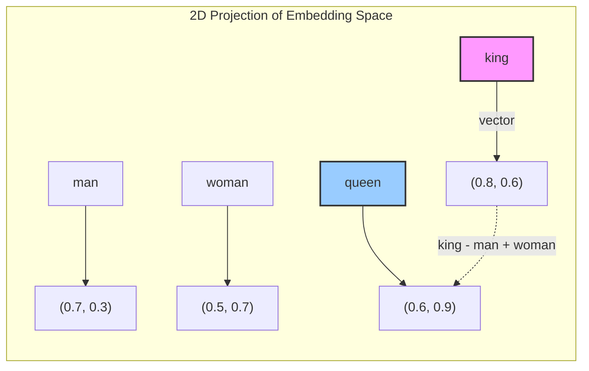
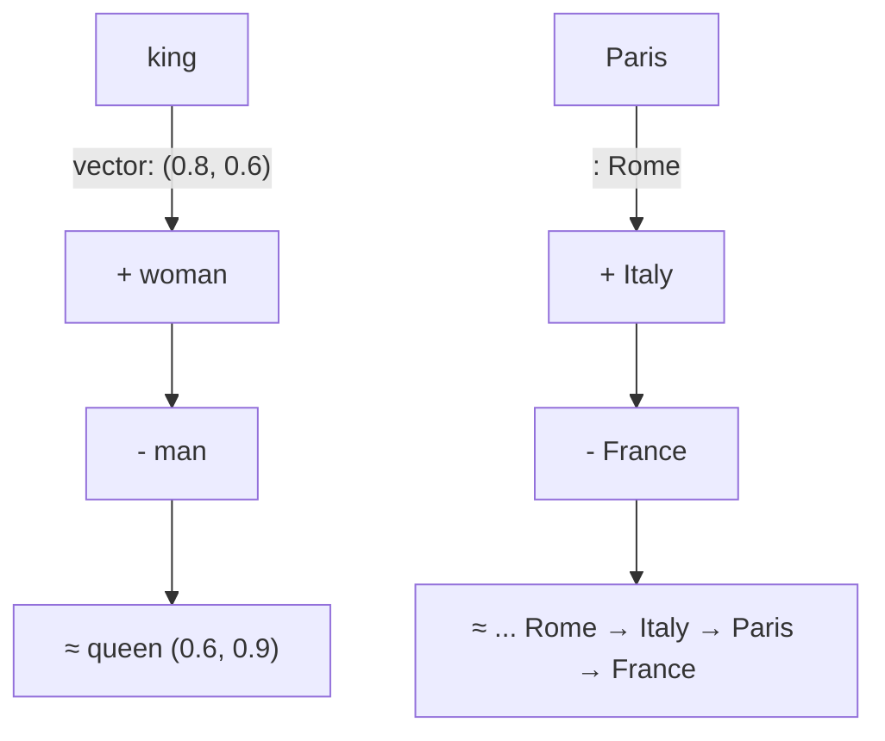
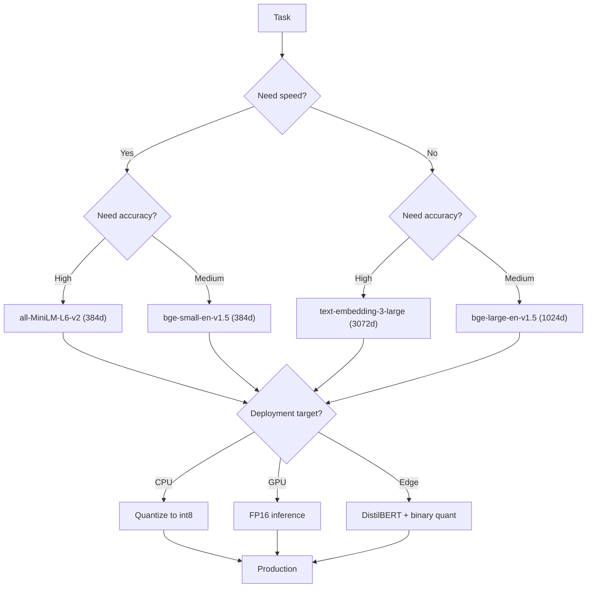

# Text Embedding Models

Text embeddings convert words, sentences, or documents into dense vector representations that capture semantic meaning. They are fundamental to modern NLP, search, and RAG systems.

## Types

| Type | Examples | Characteristics |
|------|----------|-----------------|
| Static | Word2Vec, GloVe, FastText | One vector per word, no context |
| Contextual | BERT, RoBERTa | Context-dependent vectors |
| Sentence | Sentence-BERT, Instructor | Whole-sentence embeddings |

## Dimensionality

| Model | Dimensions |
|-------|-----------|
| Word2Vec | 100–300 |
| BERT Base | 768 |
| BERT Large | 1024 |
| text-embedding-3-small | 1536 |
| text-embedding-3-large | 3072 |

## Use Cases

- Semantic search
- Document clustering
- Recommendation systems
- Retrieval-Augmented Generation (RAG)
- Anomaly detection

**See also**: [[NLP Pipeline Design]], [[LLM Agents Framework]], [[Database Engines Compared]]

---

## Embedding Space Visualization



### Semantic Arithmetic

The classic analogy: **king - man + woman ≈ queen**

```python
import numpy as np
from gensim.models import KeyedVectors

# Load pre-trained Word2Vec
wv = KeyedVectors.load_word2vec_format("GoogleNews-vectors-negative300.bin", binary=True)

def analogy(a, b, c, wv, topn=5):
    """Returns d such that a : b :: c : d"""
    result = wv.most_similar(positive=[c, b], negative=[a], topn=topn)
    return result

# king - man + woman = ?
print(analogy("king", "man", "woman", wv))
# [('queen', 0.852), ...]

def vector_arithmetic(words_positive, words_negative, wv, topn=5):
    result = wv.most_similar(positive=words_positive, negative=words_negative, topn=topn)
    return result
```



## Static Embeddings — Deep Dive

### Word2Vec: CBOW vs Skip-gram

```mermaid
graph LR
    subgraph CBOW
        A1[w(t-2)] --> H1[Hidden]
        A2[w(t-1)] --> H1
        A3[w(t+1)] --> H1
        A4[w(t+2)] --> H1
        H1 --> O1["Predict w(t)"]
    end
    subgraph Skip-gram
        I1["Input w(t)"] --> H2[Hidden]
        H2 --> O2["Predict w(t-2)"]
        H2 --> O3["Predict w(t-1)"]
        H2 --> O4["Predict w(t+1)"]
        H2 --> O5["Predict w(t+2)"]
    end
```

| Aspect | CBOW | Skip-gram |
|--------|------|-----------|
| Task | Predict target from context | Predict context from target |
| Speed | Faster | Slower (more predictions) |
| Rare words | Poorer | Better |
| Training efficiency | Higher per epoch | Lower per epoch |
| Best for | Frequent words, large corpus | Small corpus, rare words |

```python
from gensim.models import Word2Vec

# Skip-gram
model_sg = Word2Vec(sentences, vector_size=300, window=5, sg=1, min_count=5, workers=4)

# CBOW
model_cbow = Word2Vec(sentences, vector_size=300, window=5, sg=0, min_count=5, workers=4)

# Inspect embeddings
word_vec = model_sg.wv["king"]
similar = model_sg.wv.most_similar("king", topn=10)
```

### GloVe — Global Vectors

GloVe (Global Vectors for Word Representation) captures global corpus statistics by factorizing the word co-occurrence matrix.

```python
import numpy as np
from glove import Corpus, Glove

# Build co-occurrence matrix
corpus = Corpus()
corpus.fit(sentences, window=10)

# Train GloVe
glove = Glove(no_components=300, learning_rate=0.05)
glove.fit(corpus.matrix, epochs=30, no_threads=4, verbose=True)
glove.add_dictionary(corpus.dictionary)

embeddings = glove.word_vectors  # shape: (vocab_size, 300)
```

| Property | Word2Vec | GloVe | FastText |
|----------|----------|-------|----------|
| Architecture | Predictive | Count-based | Predictive |
| Context window | Local | Global + Local | Local |
| Subword info | No | No | Yes (character n-grams) |
| OOV handling | None | None | Character n-gram fallback |
| Training data | 100B tokens | 840B tokens | 600B tokens |

### FastText — Subword Information

```python
from gensim.models import FastText

ft_model = FastText(
    sentences=sentences,
    vector_size=300,
    window=5,
    min_count=5,
    min_n=3,      # min character n-gram length
    max_n=6,      # max character n-gram length
    workers=4
)

# OOV handling — FastText can embed unseen words
oov_vector = ft_model.wv["novelword123"]  # works!
```

## Contextual Embeddings

### BERT Family Comparison

| Model | Parameters | Layers | Hidden Dim | Heads | Pretraining Data | Key Innovation |
|-------|-----------|--------|------------|-------|-----------------|----------------|
| BERT Base | 110M | 12 | 768 | 12 | 3.3B words | Masked LM + NSP |
| BERT Large | 340M | 24 | 1024 | 16 | 3.3B words | Larger = better |
| RoBERTa | 355M | 24 | 1024 | 16 | 160GB | Removed NSP, dynamic masking |
| ALBERT | 12M-235M | 12 | 768 | 12 | 160GB | Parameter sharing |
| DeBERTa | 1.5B | 48 | 1600 | 25 | 160GB | Disentangled attention |
| ELECTRA | 335M | 24 | 1024 | 16 | 160GB | Replaced token detection |

```python
from transformers import AutoTokenizer, AutoModel
import torch

def get_bert_embeddings(text: str, model_name: str = "bert-base-uncased"):
    tokenizer = AutoTokenizer.from_pretrained(model_name)
    model = AutoModel.from_pretrained(model_name)

    inputs = tokenizer(text, return_tensors="pt")
    with torch.no_grad():
        outputs = model(**inputs)

    # Last hidden state: [batch, seq_len, hidden_dim]
    last_hidden = outputs.last_hidden_state

    # CLS token embedding (pooled representation)
    cls_embedding = last_hidden[:, 0, :]

    # Mean pooling over all tokens
    mean_embedding = last_hidden.mean(dim=1)

    return {
        "cls": cls_embedding.squeeze().numpy(),
        "mean": mean_embedding.squeeze().numpy(),
        "tokens": tokenizer.convert_ids_to_tokens(inputs["input_ids"][0])
    }
```

### How Contextual Embeddings Differ

```mermaid
graph TD
    A[Input: "I bank at the river bank"] --> B[BERT Tokenizer]
    B --> C[bank → token 1]
    B --> D[bank → token 2]
    C --> E[Self-Attention]
    D --> E
    E --> F[bank₁ vector]
    E --> G[bank₂ vector]
    F -.->|Different!| G
    subgraph Static
        H[bank vector]
        H --> I[Always the same]
    end
    style F fill:#f96
    style G fill:#9cf
    style H fill:#ccc
```

### DeBERTa — Disentangled Attention

```python
from transformers import DebertaModel, DebertaTokenizer

tokenizer = DebertaTokenizer.from_pretrained("microsoft/deberta-large")
model = DebertaModel.from_pretrained("microsoft/deberta-large")

inputs = tokenizer("The bank manager went to the bank of the river.", return_tensors="pt")
outputs = model(**inputs)
```

## Sentence Embeddings

### Sentence-BERT (SBERT)

```python
from sentence_transformers import SentenceTransformer, util

model = SentenceTransformer("all-MiniLM-L6-v2")

sentences = [
    "A man is eating food.",
    "A man is eating a piece of bread.",
    "A woman is eating a sandwich.",
]

embeddings = model.encode(sentences)
similarities = util.cos_sim(embeddings, embeddings)
# similarity[0][1] ≈ 0.92  (same topic)
# similarity[0][2] ≈ 0.78  (different subject)
```

| SBERT Model | Dim | Speed (sent/s) | NLI Acc | STS Benchmark |
|-------------|-----|----------------|---------|---------------|
| all-MiniLM-L6-v2 | 384 | 14,200 | 84.2 | 82.6 |
| all-mpnet-base-v2 | 768 | 2,800 | 86.3 | 85.7 |
| multi-qa-MiniLM-L6-cos-v1 | 384 | 14,200 | — | 83.4 (QA) |
| gtr-t5-large | 768 | 1,200 | — | 89.0 |

### Instructor Model

```python
from sentence_transformers import SentenceTransformer

# Instructor uses instruction prefixes for task-specific embeddings
model = SentenceTransformer("hkunlp/instructor-base")

# For classification tasks
emb = model.encode(
    sentences=["Represent the sentence for classification: ", "This product is amazing!"],
)

# For retrieval tasks
query_emb = model.encode("Represent the query for retrieval: ", "How to fix a leaky faucet?")
doc_emb = model.encode("Represent the document for retrieval: ", "Step 1: Turn off the water supply.")
```

### Angle-Optimized Embeddings

```python
from anglesent import AngleModel

model = AngleModel.from_pretrained("WhereIsAI/UAE-Large-V1")
embeddings = model.encode(sentences)
```

## Matryoshka Embeddings

Matryoshka embeddings support flexible dimensionality — you can truncate the vector and still get useful representations.

```python
from sentence_transformers import SentenceTransformer

model = SentenceTransformer("nomic-ai/nomic-embed-text-v1.5")

full_embedding = model.encode("Example text")
# Full dim = 768

# Use subset of dimensions
small_embed = full_embedding[:256]    # 256-dim
medium_embed = full_embedding[:512]   # 512-dim
full = full_embedding                  # 768-dim

# Trade-off: dim vs speed vs accuracy
# At dim=64: 95% of full accuracy, 10x faster search
```

| Dim | Relative Accuracy | Search Speed | Storage |
|-----|------------------|--------------|---------|
| 768 | 100% | 1x | 3 KB/vec |
| 512 | 99.2% | 1.5x | 2 KB/vec |
| 256 | 97.8% | 3x | 1 KB/vec |
| 128 | 95.1% | 6x | 0.5 KB/vec |
| 64 | 90.3% | 12x | 0.25 KB/vec |

## MTEB Benchmark Deep Dive

The Massive Text Embedding Benchmark evaluates embeddings across 8 tasks.

```mermaid
graph TD
    A[MTEB] --> B[Classification]
    A --> C[Clustering]
    A --> D[Pair Classification]
    A --> E[Reranking]
    A --> F[Retrieval]
    A --> G[STS]
    A --> H[Summarization]
    A --> I[Bi task classification]
    B --> J[Average across 12 datasets]
    F --> K[Recall@k, MAP, nDCG]
    G --> L[Sentence similarity correlation]
```

| Rank | Model | Dim | Avg | Classification | Clustering | PairClass | Reranking | Retrieval | STS | Summarization |
|------|-------|-----|-----|---------------|------------|-----------|-----------|-----------|-----|---------------|
| 1 | intfloat/e5-mistral-7b-instruct | 4096 | 66.63 | 73.36 | 54.91 | 87.70 | 58.73 | 50.43 | 84.82 | 31.26 |
| 2 | BAAI/bge-large-en-v1.5 | 1024 | 64.23 | 75.08 | 48.67 | 87.26 | 60.04 | 53.25 | 83.03 | 31.11 |
| 3 | cohere-embed-v3-english | 1024 | 64.03 | 75.61 | 49.40 | 87.30 | 59.18 | 52.70 | 83.21 | 30.61 |
| 4 | openai/text-embedding-3-large | 3072 | 64.00 | 73.12 | 51.34 | 86.99 | 59.16 | 52.12 | 82.51 | 28.91 |
| 5 | sentence-transformers/all-mpnet-base-v2 | 768 | 61.88 | 71.94 | 46.84 | 86.83 | 58.50 | 48.90 | 82.38 | 31.78 |

## Embedding Quantization

### Binary Quantization

```python
import numpy as np

def binary_quantize(embeddings: np.ndarray) -> np.ndarray:
    """Convert float embeddings to binary (0/1)"""
    median = np.median(embeddings, axis=1, keepdims=True)
    return (embeddings > median).astype(np.uint8)

def binary_to_float(binary: np.ndarray, original_float: np.ndarray) -> np.ndarray:
    """Reconstruct approximate float from binary"""
    return binary.astype(np.float32) * 2 - 1

# Storage: float32 = 4 bytes per dim, binary = 0.125 bytes per dim
# 768-dim: float = 3KB, binary = 96 bytes → 32x smaller
```

### Scalar Quantization

```python
def scalar_quantize(embeddings: np.ndarray, bits: int = 8) -> np.ndarray:
    """Quantize to 8-bit integers"""
    mins = embeddings.min(axis=1, keepdims=True)
    maxs = embeddings.max(axis=1, keepdims=True)
    scaled = (embeddings - mins) / (maxs - mins)  # [0, 1]
    return (scaled * (2**bits - 1)).astype(np.uint8)
```

| Method | Compression | Accuracy Loss | Speed-up |
|--------|-------------|---------------|----------|
| Float32 | 1x | 0% | 1x |
| Float16 | 2x | <0.1% | 1.5x |
| Int8 | 4x | 0.5-1% | 2-3x |
| Binary | 32x | 2-5% | 10-20x |

## Embedding Caching and Storage

### Cache Strategy

```python
from functools import lru_cache
import hashlib
import redis

class EmbeddingCache:
    def __init__(self, model, redis_url="redis://localhost:6379"):
        self.model = model
        self.redis = redis.from_url(redis_url)
        self.lru = lru_cache(maxsize=10000)(self._compute)

    def _hash_key(self, text: str) -> str:
        return f"emb:{hashlib.md5(text.encode()).hexdigest()}"

    def _compute(self, text: str):
        return self.model.encode(text).tobytes()

    def get_embedding(self, text: str):
        key = self._hash_key(text)
        cached = self.redis.get(key)
        if cached:
            return np.frombuffer(cached)
        embedding = self.model.encode(text)
        self.redis.setex(key, 86400, embedding.tobytes())  # TTL 24h
        return embedding
```

### Storage Options

| Storage | Latency | Capacity | Persistence | Best For |
|---------|---------|----------|-------------|----------|
| In-memory dict | 0.01ms | Limited | No | Small apps |
| Redis | 1ms | RAM-bound | Optional | Production |
| FAISS index | 10ms | 1B+ vectors | On disk | Similarity search |
| PostgreSQL+pgvector | 5ms | 100M+ | Full ACID | Hybrid queries |
| Pinecone/Pinecone | 5ms | Unlimited | Managed | Serverless |
| Qdrant | 3ms | 1B+ | On disk | Self-hosted |

## Similarity Measures

```python
import numpy as np
from scipy.spatial.distance import cosine, euclidean, cityblock

def cosine_similarity(a, b):
    return 1 - cosine(a, b)

def dot_product(a, b):
    return np.dot(a, b)

def euclidean_distance(a, b):
    return np.linalg.norm(a - b)

def manhattan_distance(a, b):
    return np.sum(np.abs(a - b))

# Comparison on normalized vs unnormalized vectors
a = np.array([1, 2, 3])
b = np.array([4, 5, 6])

print(f"Cosine: {cosine_similarity(a, b):.4f}")
print(f"Dot: {dot_product(a, b):.4f}")
print(f"Euclidean: {euclidean_distance(a, b):.4f}")
print(f"Manhattan: {cityblock(a, b):.4f}")
```

| Metric | Range | Normalized? | Speed | Use Case |
|--------|-------|-------------|-------|----------|
| Cosine | [-1, 1] | Yes | Fast | Semantic similarity |
| Dot | (-∞, ∞) | No | Fastest | Embedding search |
| Euclidean | [0, ∞) | Yes if normed | Fast | Clustering |
| Manhattan | [0, ∞) | Yes if normed | Medium | Sparse vectors |
| Hamming | [0, dim] | N/A | Fast | Binary embeddings |
| Inner Product | (-∞, ∞) | No | Fastest | MaxSim in ColBERT |

## Fine-Tuning Embeddings for Domain-Specific Tasks

```python
from sentence_transformers import SentenceTransformer, InputExample, losses, datasets
from torch.utils.data import DataLoader

model = SentenceTransformer("all-MiniLM-L6-v2")

# Prepare training data (anchor, positive, negative)
train_examples = [
    InputExample(texts=["What is Python?", "Python is a programming language", "Python is a snake"]),
    InputExample(texts=["How to bake cake?", "Mix flour and eggs", "The sky is blue"]),
]

# Create a dataloader
train_dataset = datasets.NoDuplicatesDataLoader(train_examples, batch_size=16)

# Use MultipleNegativesRankingLoss
loss = losses.MultipleNegativesRankingLoss(model)

# Fine-tune
model.fit(
    train_objectives=[(train_dataset, loss)],
    epochs=5,
    warmup_steps=100,
    output_path="./domain-embedding-model"
)
```


## Embedding Model Selection



## Practical Checklist

- [ ] Choose static vs contextual based on task requirements
- [ ] For RAG, prefer sentence embeddings (SBERT, Instructor)
- [ ] Normalize embeddings before storing (improves search)
- [ ] Cache embeddings for repeated queries
- [ ] Benchmark top-5 models on MTEB for your task
- [ ] Quantize embeddings if latency is critical
- [ ] Fine-tune on domain data for >5% accuracy gains
- [ ] Monitor embedding drift in production
- [ ] Use Matryoshka embeddings for flexible deployment

**Links**: [[Advanced Prompting Techniques]] | [[Context Window Strategies]] | [[Inference Optimization]] | [[LLM Agents Framework]] | [[LLM Alignment]] | [[LLM Evaluation and Benchmarks]] | [[LLM Safety and Guardrails]] | [[LLM]] | [[Machine Translation]] | [[Model Quantization]] | [[Named Entity Recognition]] | [[NLP Pipeline Design]] | [[Prompt Engineering]] | [[Quantization for LLMs]] | [[Sentiment Analysis]] | [[Structured Output and Grammar]] | [[Text Classification]] | [[Tokenization]] | [[Tool Use and Function Calling]]
