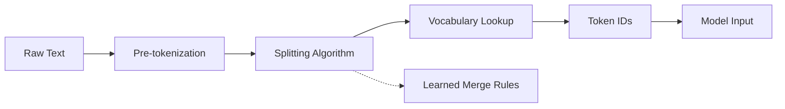

# Tokenization

## What is Tokenization?

Tokenization splits text into smaller units (tokens) that a model can process. It is the first step in any NLP pipeline — the quality of tokenization directly impacts vocabulary size, out-of-vocabulary (OOV) handling, and downstream task performance.



## Tokenization Methods Comparison

| Method | Example | Vocab Size | OOV Handling | Language Agnostic |
|--------|---------|------------|--------------|-------------------|
| **Word-level** | "playing" → ["playing"] | 100k-500k | ❌ No (UNK token) | ❌ No |
| **Character-level** | "playing" → ["p","l","a","y","i","n","g"] | ~100-200 | ✅ Yes | ✅ Yes |
| **BPE (subword)** | "playing" → ["play", "ing"] | 30k-100k | ✅ Yes | ⚠️ Mostly |
| **WordPiece** | "playing" → ["play", "##ing"] | 30k | ✅ Yes | ⚠️ Mostly |
| **Unigram** | Probabilistic subword | 30k-50k | ✅ Yes | ⚠️ Mostly |
| **SentencePiece** | Raw bytes → subword | 32k-256k | ✅ Yes | ✅ Yes |

### Vocab Size

The vocabulary is the set of all tokens the model knows. Size is a fundamental tradeoff:

| Size | Range | Example Models | Tradeoff |
|------|-------|----------------|----------|
| **Small** | 8k-16k | Few | Compact embeddings, fast softmax, but longer sequences (more tokens per word) |
| **Medium** | 30k-50k | BERT, GPT-2, LLaMA | Sweet spot — balance between sequence length and representation quality |
| **Large** | 100k-500k | Word-level models | Short sequences but huge embedding table, sparse gradients, higher memory |
| **Character** | ~100-200 | ByT5, CANINE | Minimal vocab, no OOV, but sequences 5-7× longer than subword |

Smaller vocab → more tokens per word → longer context windows needed → more compute at inference (inflated by quadratic attention). Larger vocab → bigger embedding and LM head → more parameters but shorter sequences. Every model family picks a vocab based on this tradeoff (GPT-2: 50k, LLaMA: 32k, GPT-4: ~100k).

### OOV (Out-of-Vocabulary)

OOV is what happens when the tokenizer encounters a token it has never seen:

- **Word-level**: Any unseen word becomes `[UNK]` — information is **lost**. The model has no way to guess the meaning. Frequent in morphologically rich languages (Turkish, Finnish) and domains with specialized terminology (medical, legal).
- **Character-level**: Every character is in the vocab, so **zero OOV**. But the model must learn word boundaries and morphology from scratch — no built-in linguistic priors.
- **Subword (BPE/WordPiece/Unigram)**: Novel words are decomposed into known subword pieces. "tokenization" with a 50k vocab might become ["token", "ization"] — the model can infer meaning from pieces it already knows. **Rare words get more tokens** but never become UNK.
- **SentencePiece (bytes)**: Falls back to raw byte-level encoding. Every possible byte sequence is representable — **true zero OOV** even for emoji, Unicode corruption, or arbitrary binary.

### Language Agnostic

A tokenizer is language agnostic if it works equally well across all languages without language-specific preprocessing.

| Method | Why (Not)? |
|--------|------------|
| **Word-level** | Requires whitespace/sentence splitting per language. Tokenizers Chinese by characters, Turkish by words with heavy morphology — both fail. Real-world: Arabic prefixes, German compound nouns explode the vocab. |
| **Character-level** | Fully agnostic. Every language is just a sequence of Unicode codepoints. But favors character-rich languages (Chinese, Japanese) by having shorter sequences than subword (each character ≈ 1 token vs 2-3 subword units). |
| **BPE / WordPiece / Unigram** | Mostly agnostic on the algorithm, but tied to a **pre-tokenizer** (typically whitespace + punctuation splitting). This fails on CJK languages (no spaces), Thai (no spaces, complex script), and code-switched text. You'd need a different pre-tokenizer per language group. |
| **SentencePiece** | Fully agnostic. It treats input as a raw byte sequence with **no pre-tokenization step**. Spaces are just byte 0x20. This means it handles Japanese, Chinese, Arabic, emoji, and source code identically — the subword units emerge purely from byte-level statistics. Used by T5, XLNet, ALBERT. |

## Byte-Pair Encoding (BPE)

BPE is a data compression algorithm adapted for tokenization. It iteratively merges the most frequent pair of adjacent tokens:

1. Start with individual characters as tokens
2. Count frequency of every adjacent pair
3. Merge the most frequent pair into a new token
4. Repeat step 2-3 until target vocabulary size is reached

### BPE Example

```
Initial tokens: ["l", "o", "w", "e", "r", "l", "o", "w"]
Counts: ("l","o")=2, ("o","w")=2, ("w","e")=1, ("e","r")=1, ...
Merge "l"+"o" → ["lo", "w", "e", "r", "lo", "w"]
Counts: ("lo","w")=2, ("w","e")=1, ("e","r")=1, ...
Merge "lo"+"w" → ["low", "e", "r", "low"]
Counts: ("low","e")=1, ("e","r")=1, ("r","low")=1
Merge "r"+"low" → ["low", "er", "low"]
```

Final vocabulary: original chars + learned merges. At inference, the same merges are applied greedily to new text.

## WordPiece

WordPiece (used by BERT) is similar to BPE but merges pairs based on **likelihood increase** rather than frequency:

$$\text{score}(a, b) = \frac{\text{count}(ab)}{\text{count}(a) \cdot \text{count}(b)}$$

It also uses the `##` prefix to indicate subword continuation (e.g., "play" + "##ing").

## SentencePiece

SentencePiece treats the input as a raw byte sequence, removing the need for language-specific pre-tokenization (whitespace splitting, etc.). It supports both BPE and Unigram algorithms and is used by T5, XLNet, and ALBERT. It handles all languages uniformly and can even tokenize without spaces (e.g., Japanese, Chinese).

## Vocabulary Size Trade-offs

| Vocab Size | Pros | Cons |
|------------|------|------|
| **Small (8k-16k)** | Compact model, faster inference | Longer sequences, harder to represent rare words |
| **Medium (30k-50k)** | Good balance, common in BERT/GPT | Moderate embedding table size |
| **Large (100k+)** | Short sequences, rare words preserved | Large embeddings, risk of data sparsity, more parameters |
| **Character-level** | No OOV, universal | Very long sequences, loses word-level meaning |

## Hands-On Playground

Run these snippets locally to explore tokenization interactively:

### 1. Compare Tokenizers Head-to-Head

```python
from transformers import AutoTokenizer

models = ["bert-base-uncased", "gpt2", "meta-llama/Llama-2-7b-hf", "t5-small"]
text = "The embedding layer of BERT tokenizes subword units efficiently."

for model in models:
    tokenizer = AutoTokenizer.from_pretrained(model)
    tokens = tokenizer.tokenize(text)
    ids = tokenizer.encode(text)
    print(f"{model:40s} | {len(tokens):2d} tokens | {tokens}")
```

Observe: same sentence → different number of tokens. GPT-2 uses more tokens for rare words (no UNK, just more subword splits). BERT prepends `[CLS]` and appends `[SEP]`.

### 2. See How OOV Words Get Decomposed

```python
tokenizer = AutoTokenizer.from_pretrained("gpt2")

oov_words = ["antidisestablishment",
             "hippopotomonstrosesquippedaliophobia",
             "floccinaucinihilipilification",
             "pseudopseudohypoparathyroidism"]

for word in oov_words:
    tokens = tokenizer.tokenize(word)
    print(f"{word:50s} → {tokens}")
```

Subword tokenizers never produce `[UNK]` — they decompose rare words into known pieces. The more unfamiliar the word, the more pieces it gets.

### 3. Explore the Vocabulary

```python
tokenizer = AutoTokenizer.from_pretrained("bert-base-uncased")
vocab = tokenizer.get_vocab()

# Find tokens by length
long_tokens = sorted(vocab.keys(), key=len, reverse=True)[:10]
print("10 longest tokens:", long_tokens)

# Find tokens by frequency (lower ID = more common)
freq_tokens = list(vocab.keys())[:20]
print("20 most frequent tokens:", freq_tokens)

# Search vocab by pattern
chemistry = [t for t in vocab if t.startswith("##chem")]
print(f"Chemistry-related subwords ({len(chemistry)}):", chemistry[:10])
```

The vocab is just a `dict[str, int]`. Lower IDs = more common tokens. The `##` prefix means "continuation of previous word" (WordPiece convention). BPE does not use `##` — it keeps spaces as tokens instead.

### 4. Language Agnostic Test

```python
tokenizer_gpt2 = AutoTokenizer.from_pretrained("gpt2")
tokenizer_sp = AutoTokenizer.from_pretrained("t5-small")  # SentencePiece

sentences = [
    "Hello, how are you?",                  # English (spaces)
    "Bonjour, comment allez-vous ?",        # French (spaces, punctuation)
    "今天天气怎么样",                         # Chinese (no spaces)
    "こんにちは、お元気ですか",                 # Japanese (no spaces)
]

for name, tok in [("GPT-2 (BPE)", tokenizer_gpt2), ("T5 (SentencePiece)", tokenizer_sp)]:
    print(f"\n--- {name} ---")
    for s in sentences:
        tokens = tok.tokenize(s)
        print(f"  {len(tokens):2d} tokens: {tokens[:12]}{'...' if len(tokens) > 12 else ''}")
```

GPT-2 (BPE) splits CJK text character-by-character since whitespace pre-tokenization fails. SentencePiece handles all languages uniformly — Chinese and Japanese get meaningful subword splits because it byte-encodes from raw input.

### 5. Vocab Size vs Sequence Length Tradeoff

```python
models_sizes = {
    "bert-base-uncased": 30522,
    "gpt2": 50257,
    "google/flan-t5-small": 32100,
    "facebook/bart-base": 50265,
}

text = "The quick brown fox jumps over the lazy dog near the riverbank."
for model, vocab_size in models_sizes.items():
    tokenizer = AutoTokenizer.from_pretrained(model)
    tokens = tokenizer.tokenize(text)
    print(f"Vocab {vocab_size:>5d} | {len(tokens):2d} tokens | {tokens}")
```

Smaller vocab → more tokens per sentence → longer context windows needed. This directly impacts max sequence length and GPU memory (quadratic in attention).

## Special Tokens

| Token | BERT | GPT | Meaning |
|-------|------|-----|---------|
| `[CLS]` | ✅ | ❌ | Start of sequence (classification embedding) |
| `[SEP]` | ✅ | ❌ | Separator between sentences |
| `[PAD]` | ✅ | ✅ | Padding to equalize batch lengths |
| `[UNK]` | ✅ | ✅ | Unknown token (not in vocabulary) |
| `[MASK]` | ✅ | ❌ | Masked token for MLM pre-training |
| `<|endoftext|>` | ❌ | ✅ | End of sequence in GPT |
| `<|im_start|>` | ❌ | ✅ | Start of chat message (ChatGPT) |

**Links**: [[NLP Pipeline Design]] | [[Pre-training and Fine-tuning]] | [[BERT and Encoder Models]] | [[GPT and Decoder Models]] | [[Transformer Architecture]]

**Next**: [[Attention Mechanism]] — The key idea
