# 📝 NLP / LLMs — Map of Content

Natural language processing enables machines to understand, generate, and manipulate human language. This folder covers the full NLP stack: tokenization strategies, LLM architectures (GPT, LLaMA, Mistral), prompt engineering techniques, alignment methods (RLHF, DPO), and production considerations (quantization, caching, evaluation). These notes trace the pipeline from raw text to deployed language applications.

**Parent**: [[AI-ML/_MOC|AI/ML]]

```mermaid
graph TD
  NLP["NLP / LLMs"] --> FUND["Fundamentals"]
  NLP --> PROMPT["Prompting"]
  NLP --> TRAIN["Training & Optimization"]
  NLP --> TASKS["Tasks"]
  NLP --> AGENTS["Agents & Safety"]
  NLP --> INFER["Inference"]

  FUND --> LLM["Large Language Model"]
  FUND --> TOK["Tokenization"]
  FUND --> TEM["Text Embedding Models"]
  FUND --> NLPIP["NLP Pipeline Design"]

  PROMPT --> PE["Prompt Engineering"]
  PROMPT --> APT["Advanced Prompting Techniques"]
  PROMPT --> CWS["Context Window Strategies"]

  TRAIN --> ALIGN["LLM Alignment"]
  TRAIN --> QNT["Quantization for LLMs"]
  TRAIN --> EVAL["LLM Evaluation & Benchmarks"]

  TASKS --> MT["Machine Translation"]
  TASKS --> SA["Sentiment Analysis"]
  TASKS --> TC["Text Classification"]
  TASKS --> NER["Named Entity Recognition"]

  AGENTS --> AGENTS2["LLM Agents Framework"]
  AGENTS --> SAFE["LLM Safety & Guardrails"]
  AGENTS --> TUF["Tool Use & Function Calling"]
  AGENTS --> SOG["Structured Output & Grammar"]

  INFER --> IO["Inference Optimization"]
  INFER --> QNT2["Model Quantization"]
```

## Topics

| Category | Notes |
|----------|-------|
| **Fundamentals** | [[LLM|Large Language Model (LLM)]], [[Tokenization]], [[Text Embedding Models]], [[NLP Pipeline Design]] |
| **Prompting** | [[Prompt Engineering]], [[Advanced Prompting Techniques]], [[Context Window Strategies]] |
| **Training** | [[LLM Alignment]], [[Quantization for LLMs]], [[LLM Evaluation and Benchmarks]] |
| **Tasks** | [[Machine Translation]], [[Sentiment Analysis]], [[Text Classification]], [[Named Entity Recognition]] |
| **Agents & Safety** | [[LLM Agents Framework]], [[LLM Safety and Guardrails]], [[Tool Use and Function Calling]], [[Structured Output and Grammar]] |
| **Inference** | [[Inference Optimization]], [[Model Quantization]] |

## Cross-Domain Links

- [[AI-ML/NLP/Text Embedding Models]] → [[AI-ML/RAG/Embedding Models for RAG]]
- [[AI-ML/NLP/LLM Agents Framework]] → [[AI-ML/RAG/Agentic RAG]], [[Security/API Security]]
- [[AI-ML/NLP/Inference Optimization]] → [[AI-ML/Deep-Learning/KV Cache and Inference]], [[AI-ML/Deep-Learning/Speculative Decoding]], [[AI-ML/Deep-Learning/Flash Attention]]
- [[AI-ML/NLP/LLM Safety and Guardrails]] → [[Security/Web Security]], [[Security/Secure Coding Practices]]
