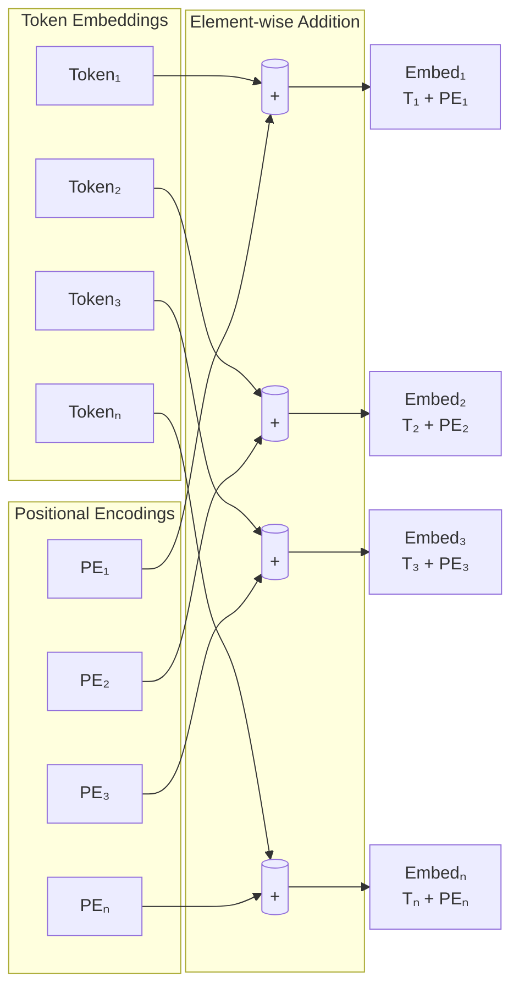

# Positional Encoding

**Links**: [[Self-Attention]] | [[Transformer Architecture]] | [[Multi-Head Attention]] | [[BERT and Encoder Models]] | [[GPT and Decoder Models]]

## Why Positional Encoding?

Self-attention is permutation-invariant — it treats the input as an unordered bag of tokens. Without position information, "cat sat" and "sat cat" would produce identical representations. Positional encodings inject sequence order into the otherwise order-agnostic attention mechanism.

## Sinusoidal Encoding (Original Transformer)

Uses sine and cosine functions of different frequencies to create a unique encoding for each position:

```
PE(pos, 2i)     = sin(pos / 10000^(2i / d_model))
PE(pos, 2i + 1) = cos(pos / 10000^(2i / d_model))
```

| Symbol | Meaning |
|--------|---------|
| pos | Position in sequence (0, 1, 2, ...) |
| i | Dimension index (0, 1, 2, ..., d_model/2) |
| d_model | Embedding dimension |

### Why Sinusoidal Patterns Work

- Each position receives a unique encoding (no two positions share the same pattern)
- Relative positions can be expressed as linear combinations of absolute positions via trig identities: sin(a+b) = sin(a)cos(b) + cos(a)sin(b) — the model easily learns relative attention
- No learned parameters — can handle sequences longer than any training example
- Low-frequency dimensions encode coarse position, high-frequency dimensions encode fine-grained offsets

## Learned Positional Encoding (BERT, GPT-2)

Treats position IDs as regular embeddings and learns them during training:

```
self.position_embeddings = nn.Embedding(max_seq_len, d_model)
positions = torch.arange(seq_len, device=device)
pos_embeds = self.position_embeddings(positions)
output = token_embeds + pos_embeds  # Element-wise add
```

## Position Encoding Visualization



## Learned vs Fixed Encoding Comparison

| Aspect | Learned | Sinusoidal (Fixed) |
|--------|---------|-------------------|
| **Parameters** | d_model × max_len | None |
| **Extrapolation** | Poor beyond max_len | Good — infinite sequence support |
| **Relative positions** | Must be learned implicitly | Linear combinations of absolute |
| **Training flexibility** | Adapts to data distribution | Fixed, data-independent |
| **Used by** | BERT, GPT-2, T5 | Original Transformer, some T5 variants |

## RoPE (Rotary Position Embedding) — Modern Standard

Used by Llama, Mistral, GPT-NeoX, DeepSeek. Applies a rotation to query and key vectors based on absolute position, making the attention score naturally depend on relative position.

```
Q_rotated = RoPE(Q, pos)
K_rotated = RoPE(K, pos)

score = Q_rotated · K_rotated  # Naturally decays with distance
```

Benefits: relative position awareness baked into the dot product, natural decay for distant tokens (locality prior), better length generalization than learned embeddings, zero parameter overhead.

## ALiBi (Attention with Linear Biases)

Adds a linear bias to attention scores based on distance. Used in BLOOM, MPT.

```
score = Q·K + bias_matrix
bias[i][j] = -m × |i - j|   (m = slope per head, different for each head)
```

## Comparison Table

| Method | Parameters | Relative Awareness | Extrapolation | Compute Overhead | Used By |
|--------|------------|-------------------|---------------|------------------|---------|
| **Sinusoidal** | None | Implicit (linear combos) | Good | None | Original Transformer |
| **Learned** | d_model × max_len | None | Poor | None | BERT, GPT-2, T5 |
| **RoPE** | None | Explicit (rotation) | Good | 2 complex multiplies per Q/K | Llama 3, Mistral, GPT-NeoX |
| **ALiBi** | None | Explicit (bias) | Best (tested to 2× training length) | Negligible | BLOOM, MPT |
| **xPos** | None | Explicit | Excellent (tested 8×) | Slight (> RoPE) | Some rotary variants |
| **NoPE** | None | None (relies on causal mask) | N/A | None | Some modern papers |

**Next**: [[BERT and Encoder Models]] — Understanding transformers
