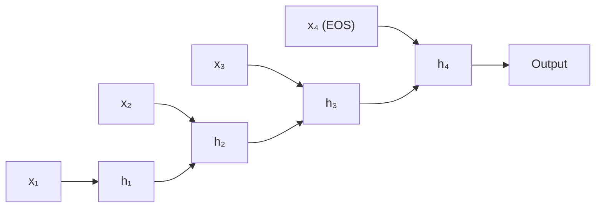
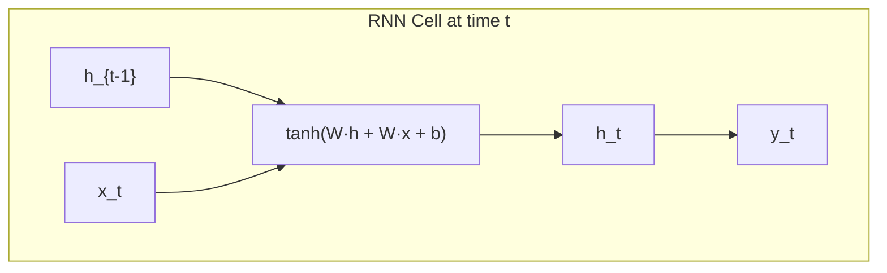
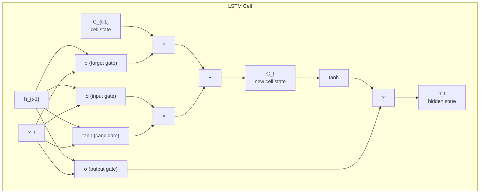
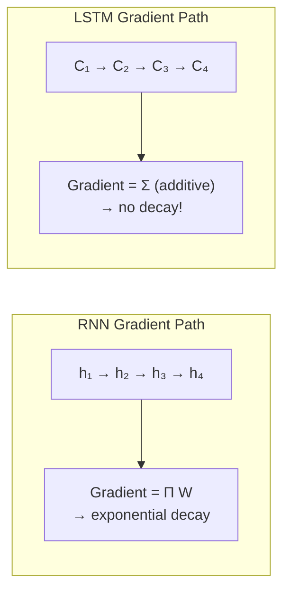
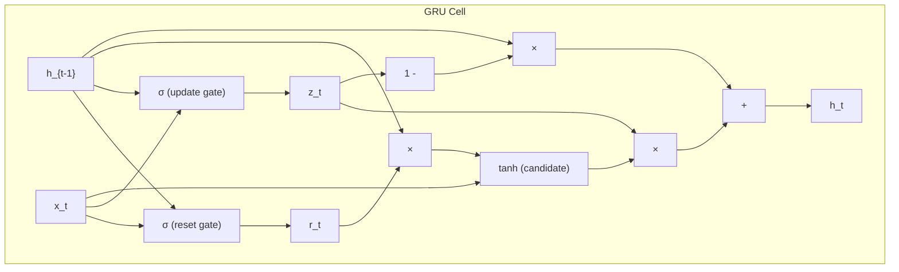
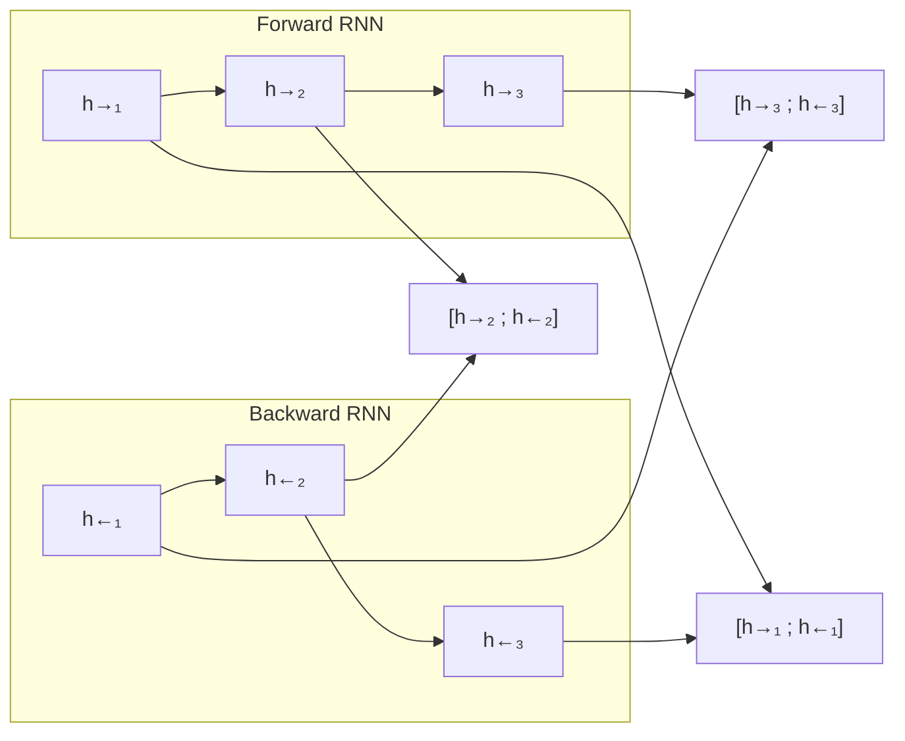

# RNNs and LSTMs

**Links**: [[Transformer Architecture]] | [[Attention Mechanism]] | [[Sequence-to-Sequence Models]] | [[NLP Pipeline Design]] | [[Pre-training and Fine-tuning]] | [[Encoder-Decoder Architecture]]

---

## The Sequential Processing Problem

Before Transformers, there was no parallelization for sequence data. Every token had to be processed one at a time, in order. RNNs were the standard tool for this.



Each token updates the hidden state: `h_t = f(W_h · h_{t-1} + W_x · x_t + b)`. The hidden state is supposed to carry all relevant information from the past.

---

## The Core RNN Equation

A simple RNN cell:

```
h_t = tanh(W_hh · h_{t-1} + W_xh · x_t + b_h)
y_t = W_hy · h_t + b_y
```

- `x_t`: input at time step t (e.g., word embedding)
- `h_{t-1}`: previous hidden state
- `h_t`: current hidden state (the "memory")
- `y_t`: output at time step t



The same weight matrices (W_hh, W_xh, W_hy) are reused at every time step — this is **weight sharing**, which keeps the parameter count manageable.

---

## The Vanishing Gradient Problem

### Why It Happens

RNNs use the same weight matrix at every time step. During backpropagation through time (BPTT), the gradient is multiplied by W_hh at each step:

```
∂L/∂W = ∂L/∂h_T · (Π_{k=2..T} ∂h_k/∂h_{k-1}) · ∂h_1/∂W
       = ∂L/∂h_T · W_hh^(T-1) · activation_derivatives
```

If the eigenvalues of W_hh are < 1, the gradient **vanishes** (approaches 0). If > 1, the gradient **explodes** (approaches infinity).

```
Example: "The cat, which was fluffy and orange and loved to sit on the mat, was hungry."
         ↑                                                              ↑
         token 1                                                    token 15

RNN must propagate "cat" (singular) through 14 time steps to match "was" (singular).
Gradient after 14 steps ≈ W^14 → either 0 or ∞.
```

### The Consequence

The model can't learn long-range dependencies. It becomes **short-sighted**, mostly attending to the last 5-10 tokens. This is fatal for language understanding, where important context can be far away.

### Fixes That Partially Work

| Fix | How It Helps | Limitation |
|-----|-------------|------------|
| Gradient clipping | Caps exploding gradients | Doesn't fix vanishing |
| ReLU activation | Gradient = 1 for positive inputs | Can die (dead neurons) |
| Better initialization | Start in a good regime | Doesn't prevent drift |
| Truncated BPTT | Only backprop through last N steps | Ignores long-range dependencies |

The real fix: **LSTMs**.

---

## LSTM (Long Short-Term Memory)

### Intuition

Instead of a single hidden state, LSTMs maintain a **cell state** (C_t) that acts like a conveyor belt. Information flows along it with minimal transformation. Gates decide what to add, remove, or output.



### The Three Gates in Detail

#### 1. Forget Gate

Decides what to discard from the cell state. Looks at `h_{t-1}` and `x_t`, outputs a number between 0 (forget everything) and 1 (keep everything) for each dimension:

```
f_t = σ(W_f · [h_{t-1}, x_t] + b_f)
```

Example: The cat was fluffy. [New sentence] **She**... → Forget gate should drop "cat" info and prepare for new subject.

#### 2. Input Gate

Decides what new information to store in the cell state:

```
i_t = σ(W_i · [h_{t-1}, x_t] + b_i)        # which values to update
C̃_t = tanh(W_c · [h_{t-1}, x_t] + b_c)     # candidate values
C_t = f_t * C_{t-1} + i_t * C̃_t            # old × forget + new × input
```

The cell state update is **additive**: new information is added, old information is forgotten. This is why LSTMs don't suffer from vanishing gradients — the gradient can flow through the addition operation without repeated multiplication by W.

#### 3. Output Gate

Decides what to output based on the cell state:

```
o_t = σ(W_o · [h_{t-1}, x_t] + b_o)
h_t = o_t * tanh(C_t)
```

### Why LSTMs Fix Vanishing Gradients



The cell state update is: `C_t = f_t * C_{t-1} + i_t * C̃_t`. The derivative of C_t with respect to C_{t-1} is just `f_t` (a value between 0 and 1), not a full matrix multiplication. If `f_t ≈ 1` (keep everything), the gradient flows through almost unchanged.

---

## GRU (Gated Recurrent Unit)

A simplified LSTM with two gates instead of three:

### Reset Gate

How much of the past to forget:

```
r_t = σ(W_r · [h_{t-1}, x_t] + b_r)
```

### Update Gate

How much of the past to keep (combines LSTM's forget and input gates):

```
z_t = σ(W_z · [h_{t-1}, x_t] + b_z)
```

### Candidate Hidden State

```
h̃_t = tanh(W · [r_t * h_{t-1}, x_t] + b)
```

### Final Hidden State

```
h_t = (1 - z_t) * h_{t-1} + z_t * h̃_t
```

### LSTM vs GRU

| Aspect | LSTM | GRU |
|--------|------|-----|
| Gates | 3 (forget, input, output) | 2 (reset, update) |
| Cell state | Yes (C_t + h_t separate) | No (h_t only) |
| Parameters | ~4x hidden_size² | ~3x hidden_size² |
| Representational power | Higher (separate memory + output) | Lower (single state) |
| Training speed | Slower (more params) | Faster (~25% less compute) |
| Long-range dependencies | Excellent | Very good |
| When to use | Complex sequences, long context | Simpler tasks, need speed |



---

## Bidirectional RNNs

Standard RNNs only see past context. Bidirectional RNNs process the sequence in both directions and concatenate the hidden states:



Each output token has context from both sides. Essential for:
- **Named entity recognition**: "Paris" in "Paris is beautiful" vs "Paris Hilton"
- **Part-of-speech tagging**
- **Question answering** where the answer is in the middle

Note: bidirectional RNNs can't be used for generation (you can't see future tokens). They're for **encoding** tasks.

---

## Practical Implementation

```python
import torch
import torch.nn as nn

class LSTMModel(nn.Module):
    def __init__(self, vocab_size, embed_dim, hidden_dim, num_layers, num_classes):
        super().__init__()
        self.embedding = nn.Embedding(vocab_size, embed_dim)
        self.lstm = nn.LSTM(
            input_size=embed_dim,
            hidden_size=hidden_dim,
            num_layers=num_layers,
            batch_first=True,
            bidirectional=True,   # use bidirectional for encoding
            dropout=0.3 if num_layers > 1 else 0
        )
        self.classifier = nn.Linear(hidden_dim * 2, num_classes)  # *2 for bidirectional
    
    def forward(self, x):
        # x: (batch, seq_len)
        emb = self.embedding(x)                     # (batch, seq_len, embed_dim)
        lstm_out, (h_n, c_n) = self.lstm(emb)       # lstm_out: (batch, seq_len, hidden*2)
        
        # Use the final hidden state (concatenated forward + backward)
        last_hidden = torch.cat((h_n[-2], h_n[-1]), dim=1)  # (batch, hidden*2)
        logits = self.classifier(last_hidden)        # (batch, num_classes)
        return logits

# Training loop
model = LSTMModel(vocab_size=50000, embed_dim=256, hidden_dim=512, num_layers=2, num_classes=10)
criterion = nn.CrossEntropyLoss()
optimizer = torch.optim.Adam(model.parameters(), lr=1e-3)

for epoch in range(10):
    for batch in dataloader:
        inputs, labels = batch
        outputs = model(inputs)
        loss = criterion(outputs, labels)
        
        optimizer.zero_grad()
        loss.backward()
        torch.nn.utils.clip_grad_norm_(model.parameters(), max_norm=1.0)  # gradient clipping!
        optimizer.step()
```

---

## Why Transformers Replaced RNNs

| Limitation | RNN/LSTM | Transformer |
|-----------|----------|-------------|
| **Parallelization** | Sequential — step t must wait for step t-1 | All positions computed in parallel |
| **Long-range dependencies** | Clinical maximum ~200 tokens (even LSTM) | Unlimited (direct attention path) |
| **Training stability** | Gradient clipping required, careful LR | More stable (LayerNorm + residual) |
| **Context length** | Grows with hidden size (expensive) | Explicit O(n²) but tunable via sparsity |
| **Bidirectional** | Must use two RNNs (costly) | Native (no mask) |

```
RNN:    GPU utilization = 10-30% (sequential, small matrix ops)
Transformer: GPU utilization = 80-95% (big parallel matmuls)

At 100M+ parameters scale, the Transformer trains 10-100x faster.
```

---

## Where RNNs Still Win

Despite Transformers dominating, RNNs have niches:

| Use Case | Why RNN Still Works |
|----------|-------------------|
| **Real-time streaming** | O(1) memory per step, no context window limit |
| **Tiny devices (edge)** | GRU/LSTM fits in MB, Transformer needs GB |
| **Low-latency inference** | No quadratic attention, O(n) per step |
| **Anomaly detection** | One-step-ahead prediction, local patterns |
| **Audio processing** | Long audio (30s+) × 16kHz = 480k tokens — impractical for attention |

---

## Key Takeaways

1. **RNNs** process tokens sequentially with weight-shared recurrence — simple but suffer from vanishing gradients
2. **Vanishing gradients** happen because the same weight matrix is multiplied at every time step during backprop
3. **LSTMs** solve vanishing gradients with a cell state and additive updates — gradient flows through the "conveyor belt" without repeated multiplication
4. **GRUs** simplify LSTMs to two gates (reset + update) with fewer parameters but slightly less power
5. **Bidirectional RNNs** see past and future context — essential for encoding tasks but not usable for generation
6. **Transformers** replaced RNNs primarily because of **parallelization** — not because attention is inherently more powerful, but because it trains orders of magnitude faster on modern hardware
7. RNNs still matter for **streaming, edge devices, low-latency inference, and long audio** where quadratic attention is impractical

**Next**: [[CNNs for NLP]] — Convolutional networks for text tasks
