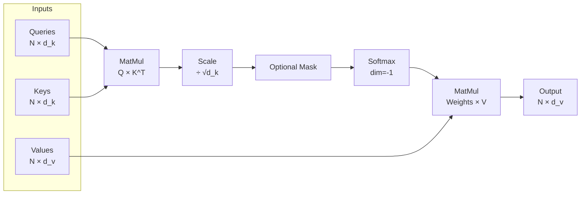

# Self-Attention

**Links**: [[Transformer Architecture]] | [[Multi-Head Attention]] | [[Positional Encoding]] | [[Attention Mechanism]] | [[BERT and Encoder Models]] | [[GPT and Decoder Models]]

## What is Self-Attention?

Self-attention computes a weighted sum of all elements in a sequence, where weights depend on pairwise compatibility. Each token can directly attend to every other token, creating a fully connected graph of interactions in a single layer — no recurrence needed.

## Scaled Dot-Product Attention Flow



## The Attention Equation

```
Attention(Q, K, V) = softmax(Q × K^T / √d_k) × V
```

## Query, Key, Value in Detail

Each input token x_i is projected into three spaces using learned weight matrices W_Q, W_K, W_V:

```
Q = X × W_Q    — "What am I looking for?"   (learned projection)
K = X × W_K    — "What do I contain?"        (learned projection)
V = X × W_V    — "What should I output?"     (learned projection)
```

| Symbol | Name | Shape | Role |
|--------|------|-------|------|
| Q | Queries | N × d_k | Represents the token seeking information from others |
| K | Keys | N × d_k | Represents what each token offers as context |
| V | Values | N × d_v | Represents the actual content to aggregate |
| d_k | Key dimension | scalar | Dimension of query/key vectors |
| d_v | Value dimension | scalar | Dimension of value vectors (often = d_k) |
| N | Sequence length | scalar | Number of tokens in the input sequence |

## Step-by-Step Walkthrough

### Step 1: Compute Attention Scores

```
Scores = Q × K^T    Shape: N × N
```

Row i, column j encodes the compatibility (dot product similarity) between token i and token j. Higher scores mean stronger attention.

### Step 2: Scale

```
Scores = Scores ÷ √d_k
```

Scaling by √d_k prevents dot products from growing large (variance of ~d_k), which would push softmax into regions with extremely small gradients and hinder training.

### Step 3: Softmax

```
Weights = softmax(Scores, dim=-1)
```

Each row now sums to 1, forming a probability distribution over the sequence. This determines how much each token contributes to the output of token i.

### Step 4: Weighted Sum

```
Output = Weights × V    Shape: N × d_v
```

Each output token is a convex combination of all value vectors, weighted by the attention distribution from step 3.

## Intuition Example

```
"The cat sat on the mat because it was comfortable."
                                    └── "it" attends to "cat" (high weight)
                                    └── "it" attends to "mat" (medium weight)
                                    └── "it" attends to "sat"  (low weight)
```

## Multi-Head Concatenation Flow

Single-head attention is limited to one distribution. In practice, multiple heads run in parallel and are concatenated:

```
head_i = Attention(X × W_Q_i, X × W_K_i, X × W_V_i)

MultiHead(Q, K, V) = Concat(head_1, ..., head_h) × W_O
```

Each head captures different relational patterns (syntax, semantics, position). With h=12 heads and d_model=768, each head works in d_k=64 dimensions.

## Computational Complexity Comparison

| Aspect | Self-Attention | RNN | CNN |
|--------|---------------|-----|-----|
| **Computation** | O(N² × d) | O(N × d²) | O(k × N × d) |
| **Path Length** | O(1) — direct | O(N) — sequential | O(log_k(N)) — hierarchical |
| **Parallelization** | Full across N | None — sequential | Full across N |
| **Max Context** | N (attention window) | N (hidden state decay) | k (kernel size) |
| **Memory** | O(N²) attention matrix | O(N × d) hidden states | O(N × d) features |

Self-attention's O(N²) cost limits very long sequences. Mitigations include sparse attention patterns (Longformer), sliding windows (Mistral), linear attention (Performer), and FlashAttention (memory-efficient GPU kernels).

**Next**: [[Multi-Head Attention]] — Multiple perspectives
