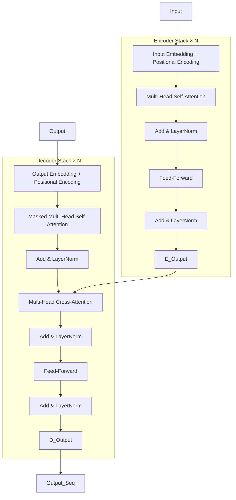

# Transformer Architecture

**Links**: [[Self-Attention]] | [[Multi-Head Attention]] | [[Positional Encoding]] | [[BERT and Encoder Models]] | [[GPT and Decoder Models]] | [[Attention Mechanism]] | [[Pre-training and Fine-tuning]]

## Overview

The Transformer (Vaswani et al., 2017) replaced RNNs with pure attention mechanisms, enabling parallel computation and better long-range dependencies. It introduced an encoder-decoder architecture built entirely from stacked attention layers, eliminating recurrence and convolutions.

## Encoder-Decoder Architecture

## Component Table

| Component | Role | Details |
|-----------|------|---------|
| **Self-Attention** | Captures pairwise token relationships | Scaled dot-product, O(N²) complexity per layer |
| **Cross-Attention** | Decoder attends to encoder output | Queries from decoder, K,V from encoder |
| **Feed-Forward (FFN)** | Per-token nonlinear transformation | Two linear layers with ReLU/GELU, d_ff = 4× d_model |
| **Layer Normalization** | Stabilizes activations | Applied after each sub-layer (Post-LN or Pre-LN) |
| **Residual Connection** | Gradient flow around sub-layers | x + Sublayer(x), prevents vanishing gradients |
| **Positional Encoding** | Injects sequence order | Sinusoidal or learned embeddings added to input |
| **Dropout** | Regularization | Applied to attention weights and FFN activations |

## Encoder Block Detail

Each encoder layer processes the full sequence bidirectionally:
- Multi-Head Self-Attention: each token attends to all other tokens
- Residual connection + LayerNorm: stabilizes training
- Position-wise Feed-Forward: two linear layers with non-linearity

## Decoder Block Detail

Each decoder layer has three sub-layers:
1. **Masked Self-Attention**: causal mask prevents looking ahead at future tokens
2. **Cross-Attention**: queries from decoder, keys/values from encoder output
3. **Feed-Forward**: identical to encoder FFN

Both sub-layers use residual connections and layer normalization.

## Training vs Inference

| Aspect | Training | Inference |
|--------|----------|-----------|
| **Teacher Forcing** | Decoder gets ground-truth input shifted right | Decoder gets its own previous output token |
| **Masking** | Causal mask prevents looking ahead | Same causal mask, plus padding mask |
| **Parallelism** | Full sequence processed in one forward pass | Tokens generated one at a time (autoregressive) |
| **Cache** | No key-value cache (full recompute) | KV cache stores past keys/values per layer |
| **Batch Size** | Large batches (GPU memory permitting) | Often batch size = 1 (latency-critical) |
| **Beam Search** | Not used during training | Optional: beam search for higher quality |
| **Gradient Computation** | Full backward pass through all layers | No gradients — forward pass only |
| **Memory Usage** | O(N² × d) for attention scores matrix | O(N × d) with KV cache |

## Model Size Configurations

| Variant | d_model | d_ff | Layers | Heads | Params | Typical Use |
|---------|---------|------|--------|-------|--------|-------------|
| **Tiny** | 128 | 512 | 4 | 4 | ~4M | Toy experiments |
| **Base** | 512 | 2048 | 6 | 8 | 65M | Original Transformer |
| **Large** | 1024 | 4096 | 12 | 16 | 213M | Machine translation SOTA |
| **XL** | 2048 | 8192 | 24 | 32 | ~1.7B | Large-scale generation |
| **XXL / Huge** | 4096 | 16384 | 48 | 64 | ~13B | Scaling law experiments |

Scaling laws (Kaplan et al., 2020) show performance improves predictably with compute, data, and parameter count. Larger models are more sample-efficient.

## Key Innovations

| Innovation | Why It Matters |
|------------|---------------|
| **Self-Attention** | Captures all pairwise relationships in one step |
| **Multi-Head** | Attends to different representation subspaces |
| **Positional Encoding** | Injects sequence order information |
| **Residual Connections** | Enables training very deep networks |
| **Layer Normalization** | Stabilizes training |
| **Parallel Processing** | Much faster than sequential RNNs |

## Model Variants

| Model | Encoder | Decoder | Params | Use |
|-------|---------|---------|--------|-----|
| BERT | ✅ | ❌ | 110M-340M | Understanding (classification, NER, QA) |
| GPT | ❌ | ✅ | 125M-1.8T | Generation (text, code, chat) |
| T5 | ✅ | ✅ | 60M-11B | Text-to-text (translation, summarization) |

**Next**: [[Self-Attention]] — The core mechanism
