# 🧠 Deep Learning — Map of Content

**Parent**: [[AI-ML/_MOC|AI/ML]]
**Children**: [[AI-ML/Deep-Learning/Machine-Learning/_MOC|Machine Learning]]

Deep learning is the engine behind modern AI — from transformers that power LLMs to diffusion models that generate images. This folder traces the full stack: foundational mechanisms (attention, positional encoding), major architectures (transformer, BERT, GPT, RNN), training techniques (RLHF, LoRA, scaling laws), and inference optimization (Flash Attention, KV cache, speculative decoding). Start with [[Attention Mechanism]] if you're new.

```mermaid
graph TD
  DL["Deep Learning"] --> CORE["Core Concepts"]
  DL --> ARCH["Architectures"]
  DL --> ADV["Advanced"]
  DL --> INFER["Inference"]
  DL --> MLSUB["Machine Learning"]

  CORE --> ATT["Attention Mechanism"]
  CORE --> SA["Self-Attention"]
  CORE --> MHA["Multi-Head Attention"]
  CORE --> PE["Positional Encoding"]

  ARCH --> TF["Transformer Architecture"]
  ARCH --> BERT["BERT & Encoder Models"]
  ARCH --> GPT["GPT & Decoder Models"]
  ARCH --> S2S["Seq2Seq Models"]
  ARCH --> ED["Encoder-Decoder Architecture"]
  ARCH --> RNN["RNNs & LSTMs"]
  ARCH --> CNN["CNNs for NLP"]
  ARCH --> CV["Computer Vision"]

  ADV --> MOE["Mixture of Experts"]
  ADV --> SL["Scaling Laws"]
  ADV --> LCT["Long Context Transformers"]
  ADV --> PT["Pre-training & Fine-tuning"]
  ADV --> LORA["LoRA & PEFT"]
  ADV --> MD["Model Distillation"]

  INFER --> FA["Flash Attention"]
  INFER --> KV["KV Cache & Inference"]
  INFER --> SPD["Speculative Decoding"]

  DL --> RLHF["RLHF & Preference Optimization"]
  DL --> MAO["Multi-Agent Orchestration"]
  DL --> DM["Diffusion Models"]
  DL --> LMOPS2["LLMOps & AI Observability"]
```

## Core Concepts

| Concept | Links To |
|---------|----------|
| [[Transformer Architecture]] | [[Self-Attention]], [[Multi-Head Attention]], [[Positional Encoding]] |
| [[Attention Mechanism]] | [[Self-Attention]], [[Multi-Head Attention]] |
| [[Sequence-to-Sequence Models]] | [[Encoder-Decoder Architecture]], [[Attention Mechanism]] |
| [[Encoder-Decoder Architecture]] | [[Sequence-to-Sequence Models]], [[Transformer Architecture]] |
| [[Pre-training and Fine-tuning]] | [[LoRA and Parameter-Efficient Fine-Tuning]], [[AI-ML/RAG/RAG vs Fine-tuning]] |
| [[Scaling Laws]] | [[Mixture of Experts]], [[AI-ML/NLP/Quantization for LLMs]] |

## Architectures

| Architecture | Type | Tasks |
|-------------|------|-------|
| [[BERT and Encoder Models]] | Encoder-only | Classification, NER, QA |
| [[GPT and Decoder Models]] | Decoder-only | Generation, chat, code |
| [[Transformer Architecture]] | Encoder-Decoder | Translation, summarization |
| [[RNNs and LSTMs]] | Recurrent | Sequence modeling (legacy) |

## Inference Optimization

| Technique | Speedup | Quality Impact |
|-----------|---------|----------------|
| [[Flash Attention]] | 2-4x | None |
| [[KV Cache and Inference]] | 10-100x | None |
| [[Speculative Decoding]] | 2-3x | None |
| [[Model Distillation]] | Variable | Small |
| [[Mixture of Experts]] | 2-5x | None |

## New Advanced Topics

| Topic | Description | Bridges |
|-------|-------------|---------|
| [[RLHF and Preference Optimization]] | Aligning LLMs with human preferences via RL | ML + NLP + Safety |
| [[Multi-Agent Orchestration]] | Coordinating multiple LLM agents for complex tasks | AI + Architecture + DevOps |
| [[Diffusion Models]] | Generative AI through denoising (Stable Diffusion, DALL-E) | CV + Transformers + GenAI |
| [[LLMOps and AI Observability]] | Monitoring, cost-tracking, and evaluation for LLMs | AI + Monitoring + DevOps |
