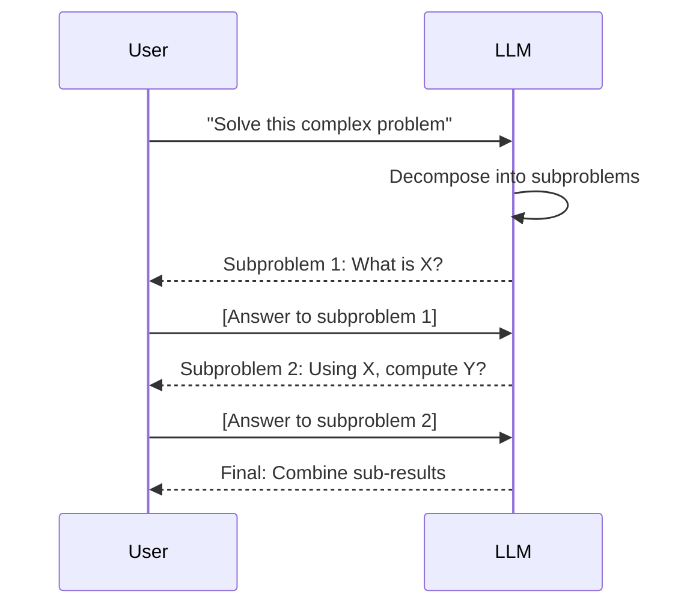
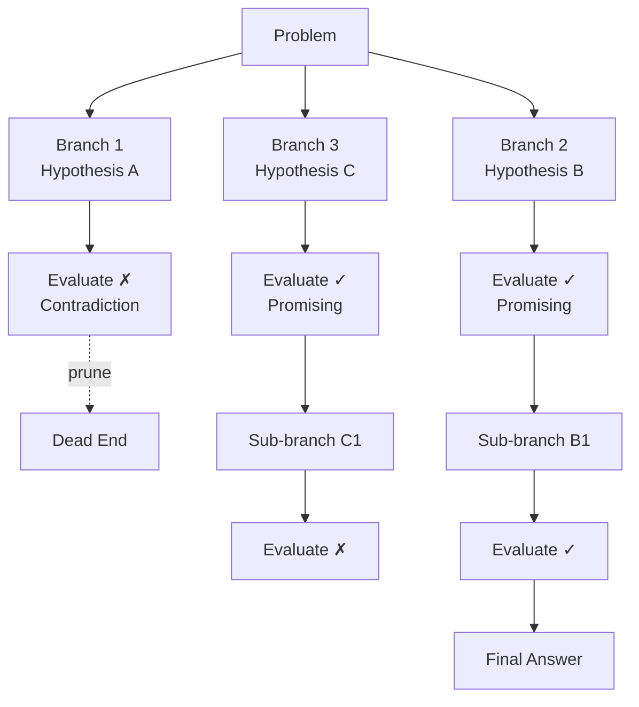
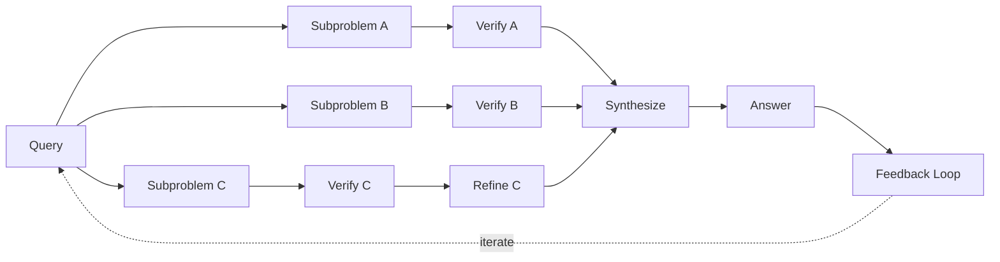
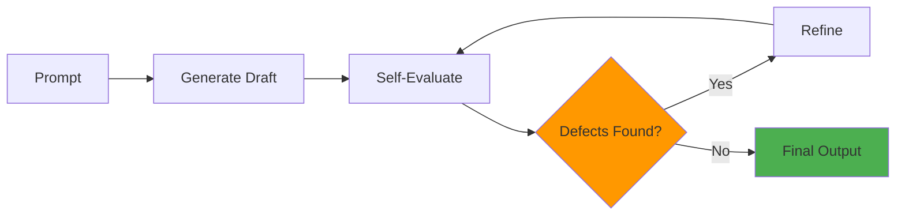
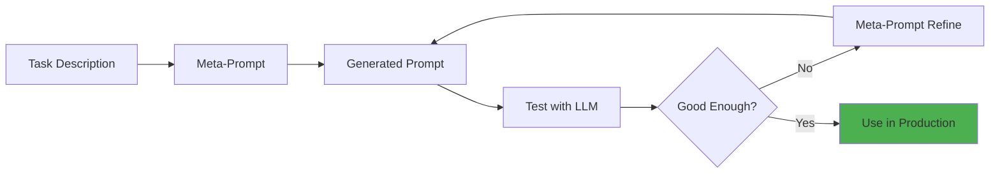
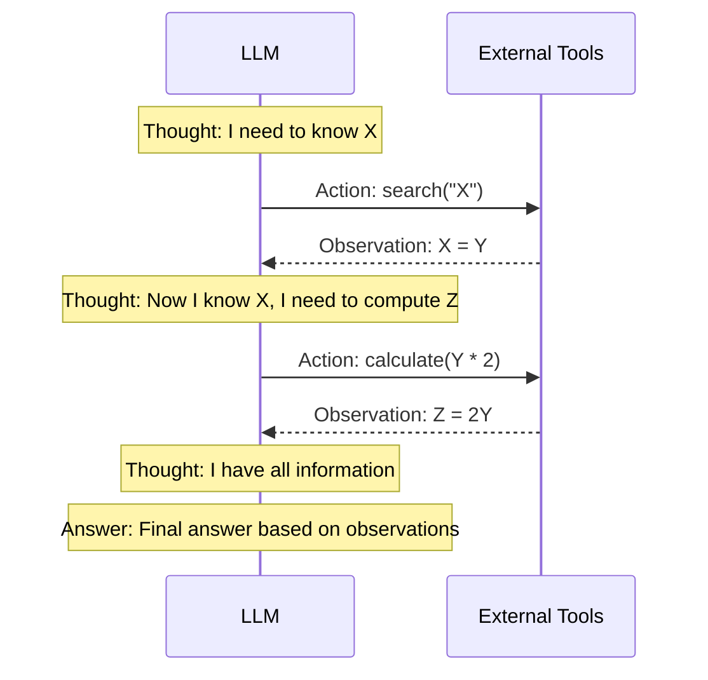
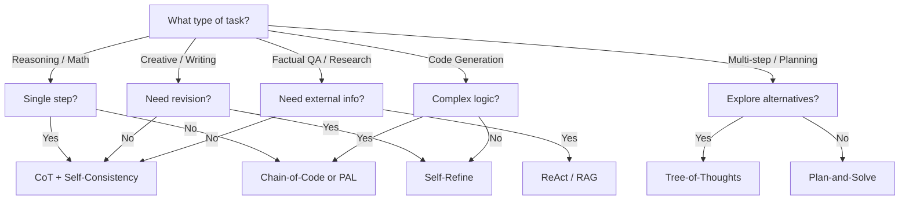
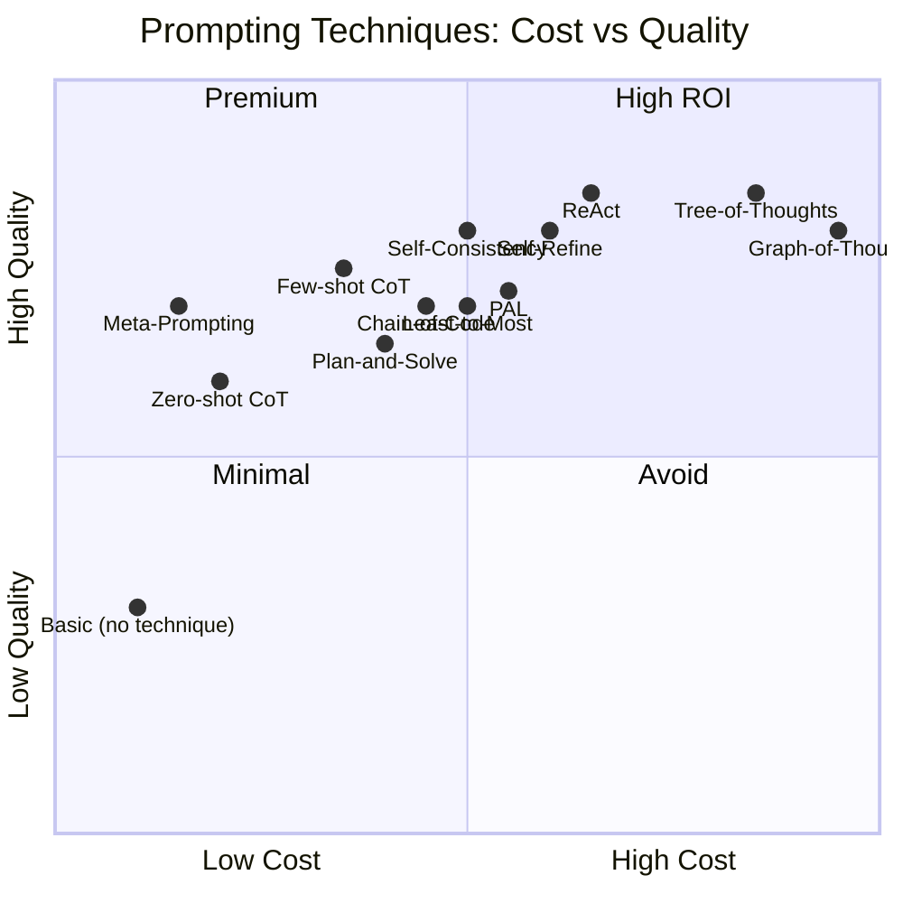

# Advanced Prompting Techniques

**Links**: [[Prompt Engineering]] | [[Prompt Engineering for RAG]] | [[LLM Agents Framework]] | [[Agentic RAG]] | [[Reinforcement Learning]] | [[LLM Evaluation and Benchmarks]]

Advanced prompting techniques go beyond basic instruction following — they elicit reasoning, decomposition, self-correction, and tool use from LLMs. As models grow more capable, the quality of prompting often matters more than the model itself.

---

## Taxonomy of Prompting Techniques

```mermaid
graph TB
    AP[Advanced Prompting] --> RA[Reasoning & Logic]
    AP --> DE[Decomposition]
    AP --> SE[Self-Improvement]
    AP --> IN[Interaction & Tools]
    AP --> ST[Structure & Format]

    RA --> COT[Chain-of-Thought]
    RA --> ZSC[Zero-Shot CoT]
    RA --> COC[Chain-of-Code]
    RA --> PAL[Program-Aided LLMs]

    DE --> LTM[Least-to-Most]
    DE --> PS[Plan-and-Solve]
    DE --> DEP[Decomposed Prompting]
    DE --> TOT[Tree-of-Thoughts]
    DE --> GOT[Graph-of-Thoughts]

    SE --> SC[Self-Consistency]
    SE --> SR[Self-Refine]
    SE --> SCC[Self-Critique / Constitutional]
    SE --> MP[Meta-Prompting]

    IN --> REACT[ReAct]
    IN --> FUNC[Function Calling]
    IN --> REFL[Reflexion]
    IN --> MUL[MuSiQue / Multi-Step QA]

    ST --> FSP[Few-Shot Structured]
    ST --> SEP[Separator Patterns]
    ST --> ROL[Role / Persona]
    ST --> FOR[Format Constraints]
```



---

## 1. Reasoning & Logic Techniques

### 1.1 Chain-of-Thought (CoT)

**Core idea**: Force the model to show its work. Instead of jumping to an answer, the model generates intermediate reasoning steps. This converts a problem that the model answers incorrectly 50% of the time into one it answers correctly 90%+ of the time.

**Why it works**: LLMs are better at reasoning when they externalize the process. The attention mechanism can focus on each intermediate state, and errors are localized to specific steps rather than hidden in a single forward pass.

```python
# Zero-shot CoT — simplest, often surprisingly effective
prompt = """Q: A store has 15 apples. It sells 7. Then receives 10 more. How many now?
A: Let's think step by step.
15 - 7 = 8
8 + 10 = 18
The answer is 18.

Q: A train leaves at 9 AM traveling 60 mph. Another leaves at 10 AM traveling 80 mph on the same track heading the same direction. When do they meet?
A: Let's think step by step."""

# Few-shot CoT — provide full reasoning examples for more complex domains
prompt = """Calculate the total interest paid on a $30,000 loan at 5% APR for 3 years with monthly payments.

Step 1: Monthly rate = 5% / 12 = 0.4167% = 0.004167
Step 2: Number of payments = 3 × 12 = 36
Step 3: Payment = 30000 × [0.004167(1.004167)^36] / [(1.004167)^36 - 1]
Step 4: Payment ≈ $899.33
Step 5: Total paid = 36 × $899.33 = $32,375.88
Step 6: Interest = $32,375.88 - $30,000 = $2,375.88
Answer: $2,375.88"""
```

| Variant | Method | Best For | Quality Gain vs Base |
|---------|--------|----------|---------------------|
| **Zero-shot CoT** | Append "Let's think step by step" | General reasoning | +10-20% |
| **Few-shot CoT** | Provide 2-5 reasoning examples | Math, logic, science | +20-40% |
| **Auto-CoT** | LLM generates its own CoT examples automatically | Zero-shot setup, diverse domains | +15-25% |
| **Structured CoT** | Enforce numbered steps or JSON reasoning | Auditability, parsing | +10-15% |
| **Contrastive CoT** | Show both wrong and correct reasoning | Teaching the model what NOT to do | +5-15% |

### 1.2 Chain-of-Code

**Key insight**: For numerical/symbolic reasoning, have the LLM write and execute code instead of doing arithmetic in natural language. LLMs are far better at generating correct code than at arithmetic.

```
Q: If a train travels 340 miles in 5 hours, what is its average speed?
# Python code to solve:
speed = 340 / 5
print(f"The average speed is {speed} mph")

Execution result: The average speed is 68 mph
Answer: 68 mph
```

### 1.3 Program-Aided Language Models (PAL)

**Extension of Chain-of-Code**: The LLM generates code for ALL computation, including intermediate reasoning steps. Only natural language is left to the LLM.

```python
# PAL approach: LLM generates program, external runtime executes it
# The LLM never does arithmetic itself
prompt = """Q: Roger has 5 tennis balls. He buys 2 more cans of tennis balls.
Each can has 3 balls. How many tennis balls does he have now?

def solution():
    roger_balls = 5
    cans_bought = 2
    balls_per_can = 3
    total_balls = roger_balls + (cans_bought * balls_per_can)
    return total_balls

Q: {new_question}

def solution():"""
```

| Technique | Reasoning Method | Computation | Best For |
|-----------|-----------------|-------------|----------|
| **CoT** | Natural language step-by-step | LLM does it | General, qualitative |
| **Chain-of-Code** | Code generation + mental | LLM generates, may execute | Math, numerical |
| **PAL** | Full code generation | External Python execution | Complex math, data analysis |
| **Program of Thoughts** | Code-like pseudocode | Neither (structured reasoning) | Logic, planning |

---

## 2. Decomposition Techniques

### 2.1 Least-to-Most Prompting

**Problem**: Some tasks have too many steps for CoT to handle in one pass. The model loses track.

**Solution**: Decompose the problem into subproblems, solve each independently, then combine.



```
Problem: "A customer bought 3 items at $12 each with a 15% discount.
Then returned 1 item. What's the net charge?"

Stage 1 — Decompose:
  Sub-question 1: What is the total before discount?
  Sub-question 2: What is the discount amount?
  Sub-question 3: What is the total after discount?
  Sub-question 4: What is the refund for the returned item?
  Sub-question 5: What is the net charge?

Stage 2 — Solve each:
  A1: 3 × $12 = $36
  A2: 15% of $36 = $5.40
  A3: $36 - $5.40 = $30.60
  A4: (1/3) of $30.60 = $10.20
  A5: $30.60 - $10.20 = $20.40
```

### 2.2 Plan-and-Solve

**Extension of Least-to-Most**: First generate a plan with all steps, THEN execute each step. The plan serves as a roadmap that prevents the model from going off-track.

```python
plan_prompt = """
Given the task: {task}
First, devise a step-by-step plan to solve it.
Output the plan as numbered steps.

Plan:
1.
2.
3.
...
"""

execute_prompt = """
Task: {task}
Plan:
{plan}

Now execute step {step_number}: {step_description}
Previous results: {previous_results}
Current step result:"""
```

### 2.3 Tree-of-Thoughts (ToT)

**Core idea**: Instead of a single chain of reasoning, maintain multiple parallel reasoning paths. Evaluate each path at decision points, prune dead ends, and search for the best solution — like a game AI exploring the game tree.



**When to use ToT**:
- Open-ended problems with multiple plausible approaches
- Planning tasks (travel, event, project)
- Puzzles and game strategy
- Creative problem-solving

**When NOT to use ToT**:
- Simple factual questions (wastes tokens)
- Tasks with a single correct approach
- When latency matters (ToT is expensive)

### 2.4 Graph-of-Thoughts (GoT)

**Generalization of ToT**: Instead of a tree, use an arbitrary directed graph. Thoughts can merge, loop back, and combine — enabling more expressive reasoning structures.



**GoT vs ToT**:

| Aspect | Tree-of-Thoughts | Graph-of-Thoughts |
|--------|-----------------|-------------------|
| Structure | Tree (no cycles) | Directed graph (cycles allowed) |
| Merging | No (branches stay separate) | Yes (can combine insights) |
| Backtracking | Only forward (prune) | Can revisit and revise |
| Best For | Branching search space | Complex synthesis tasks |
| Complexity | Moderate | High |

---

## 3. Self-Improvement Techniques

### 3.1 Self-Consistency

**Core idea**: Sample multiple reasoning paths from the same prompt (using temperature > 0), then aggregate the answers. The most common answer is more likely to be correct.

**Why it works**: LLM reasoning is stochastic. Different paths may make different errors but the correct answer tends to appear more consistently across samples.

```mermaid
graph LR
    P[Prompt] --> S1[Sample 1 → Answer A]
    P --> S2[Sample 2 → Answer B]
    P --> S3[Sample 3 → Answer A]
    P --> S4[Sample 4 → Answer A]
    P --> S5[Sample 5 → Answer C]

    S1 --> VOTE{Majority Vote}
    S2 --> VOTE
    S3 --> VOTE
    S4 --> VOTE
    S5 --> VOTE

    VOTE --> FINAL[Answer: A<br/>(3/5 votes)]
```

```python
import statistics
from collections import Counter

def self_consistency(llm, prompt, n_samples=5, temperature=0.7):
    answers = []
    for i in range(n_samples):
        response = llm.generate(prompt, temperature=temperature)
        answer = extract_answer(response)
        answers.append(answer)

    # Majority vote
    counter = Counter(answers)
    final_answer, confidence = counter.most_common(1)[0]
    agreement = counter.most_common(1)[1] / n_samples

    return {
        "answer": final_answer,
        "confidence": agreement,
        "all_answers": dict(counter),
        "samples": n_samples,
    }
```

**Aggregation Methods**:

| Method | Description | Best For |
|--------|-------------|----------|
| **Majority vote** | Most common answer | Classification, multiple choice |
| **Weighted vote** | Weight by model confidence (logit score) | Open-ended generation |
| **Marginal** | Aggregate token probabilities across samples | Short-form answers |
| **Rank-based** | Rank answers by self-evaluation | Writing, creative tasks |

**Practical recommendations**:
- Use 3-5 samples for a good cost/quality tradeoff
- Use temperature 0.5-0.7 for diversity without chaos
- Combine with CoT (CoT-SC) for best results
- Self-consistency adds 5-15% accuracy on reasoning tasks

### 3.2 Self-Refine

**Core idea**: Generate → Evaluate → Refine in a loop. The LLM critiques its own output and iteratively improves it.



**Evaluation prompts**:
```python
evaluate_prompt = """
You are a quality reviewer. Given the task and the response, identify:
1. Factual errors
2. Missing elements
3. Clarity issues
4. Format violations

Task: {task}
Response: {draft}

Issues found (be specific):"""
```

**Refine prompt**:
```python
refine_prompt = """
Improve the following response based on the evaluation feedback.
Preserve what's correct, fix what's not.

Task: {task}
Original: {draft}
Issues: {feedback}

Improved version:"""
```

| Task Type | Iterations | What to Evaluate | Convergence |
|-----------|-----------|------------------|-------------|
| Creative writing | 2-3 | Coherence, style, tone | Slow (subjective) |
| Code generation | 3-5 | Correctness, edge cases | Fast (deterministic) |
| Planning | 2-4 | Feasibility, completeness | Medium |
| Summarization | 1-2 | Coverage, conciseness | Fast |

### 3.3 Self-Critique / Constitutional AI

**Core idea**: The model critiques its own response against a set of rules or principles, then revises to align with those principles.

```python
prompt = """
You are a helpful assistant. Before answering, consider:

CONSTITUTION:
1. Be accurate — if unsure, say so
2. Be harmless — refuse harmful requests
3. Be unbiased — present balanced views
4. Cite sources when possible

Now answer the following question.
After your answer, evaluate it against the constitution and revise if needed.

Question: {question}
Answer:
"""

# Two-stage approach
stage1 = llm.generate(prompt.format(question=question))
stage2_prompt = f"""
Evaluate the following answer against these principles:
1. Accuracy: Are there any factual errors?
2. Harmlessness: Could this cause harm?
3. Bias: Is the perspective balanced?
4. Citations: Are sources needed?

Answer: {stage1}

Evaluation and revision:"""
final = llm.generate(stage2_prompt)
```

### 3.4 Meta-Prompting

**Core idea**: Use the LLM to generate prompts. The LLM acts as a prompt engineer, designing the most effective prompt structure for a given task.



```python
meta_prompt = """
You are a world-class prompt engineer. Given a task, design the optimal prompt.

Task: Classify customer support emails into: billing, technical, account, or other.

Design a prompt that includes:
- System role definition
- Clear task description
- Output format specification (JSON)
- 3 few-shot examples with edge cases
- Handling uncertainty

Output only the prompt, ready to use:
"""
```

---

## 4. Interaction & Tool-Use Techniques

### 4.1 ReAct (Reasoning + Acting)

**Core idea**: Interleave reasoning traces with actions. The model thinks about what it needs, acts (calls a tool), observes the result, and continues reasoning.

Why it beats pure CoT: The model can correct itself when it doesn't know something. Instead of guessing, it retrieves information.



```
Thought: I need to find the current population of Tokyo and compare it to New York.
Action: search("Tokyo population 2026")
Observation: Tokyo population is approximately 14 million.
Thought: Now I need New York's population.
Action: search("New York population 2026")
Observation: New York population is approximately 8.5 million.
Thought: So Tokyo has 14M - 8.5M = 5.5M more people.
Answer: Tokyo (14M) is larger than New York (8.5M) by 5.5 million people.
```

**ReAct Loop Implementation**:
```python
def react_loop(llm, question, max_steps=10):
    messages = [
        {"role": "system", "content": "You reason step by step and call tools when needed."},
        {"role": "user", "content": question},
    ]

    for step in range(max_steps):
        response = llm.generate(messages)

        if has_answer(response):
            return extract_answer(response)

        if has_action(response):
            action = parse_action(response)
            result = execute_tool(action["name"], action["args"])
            messages.append({"role": "user", "content": f"Observation: {result}"})

    return "Max steps reached"
```

### 4.2 Function Calling / Tool Use

**Structured version of ReAct**: Instead of free-form text actions, the LLM outputs a structured function call (JSON schema). This is more reliable and parseable.

```python
tools = [
    {
        "type": "function",
        "function": {
            "name": "get_weather",
            "parameters": {
                "type": "object",
                "properties": {
                    "location": {"type": "string"},
                    "units": {"type": "string", "enum": ["celsius", "fahrenheit"]},
                },
                "required": ["location"],
            },
        },
    },
    {
        "type": "function",
        "function": {
            "name": "search_web",
            "parameters": {
                "type": "object",
                "properties": {
                    "query": {"type": "string"},
                },
                "required": ["query"],
            },
        },
    },
]

response = client.chat.completions.create(
    model="gpt-4o",
    messages=[{"role": "user", "content": "What's the weather in Tokyo and latest news?"}],
    tools=tools,
    tool_choice="auto",
)
```

| Pattern | Description | Example |
|---------|-------------|---------|
| **Tool call** | LLM outputs function name + args | `{"name": "search", "args": {"q": "..."}}` |
| **Multi-tool** | LLM calls multiple tools in one turn | Parallel search, calculate, DB query |
| **Tool chaining** | Output of one tool feeds another | Search → scrape → summarize |
| **Conditional** | LLM decides tool based on prior result | If search fails, try different query |

### 4.3 Reflexion

**Core idea**: Add an explicit memory of past failures. When the model makes a mistake, it records the error and tries to avoid similar mistakes in the future.

```
Attempt 1:
  Action: search("population of Tokyo")
  Observation: Tokyo population 14M
  Action: search("population of New York")
  Observation: New York population 8.5M
  Answer: Tokyo has 14M people
  Evaluation: WRONG — didn't answer the comparison question

Memory: "Forgot to compare both cities. Must include comparison in final answer."

Attempt 2:
  Action: search("population of Tokyo")
  Observation: Tokyo population 14M
  Action: search("population of New York")
  Observation: New York population 8.5M
  Answer: Tokyo (14M) has 5.5M more people than New York (8.5M)
  Evaluation: CORRECT
```

---

## 5. Structure & Format Techniques

### 5.1 Separator Patterns

Use clear delimiters to help the LLM distinguish different parts of the input:

```python
# XML-style tags
prompt = """
<system>
You are a medical Q&A assistant. Only use provided context.
</system>

<context>
{retrieved_documents}
</context>

<question>
{user_question}
</question>

<instructions>
- Answer based ONLY on the context
- If context doesn't answer, say "I don't know"
- Cite sources with [1], [2] referencing the context index
</instructions>
"""

# Or use markdown headers, --- separators, etc.
```

**Why separators matter**: LLMs pay more attention to the start and end of prompts. Separators create clear boundaries that reduce context blending, where the model confuses instruction with data.

### 5.2 Role / Persona Prompting

```python
roles = {
    "senior_engineer": "You are a senior software engineer with 15 years of experience at FAANG companies.",
    "science_teacher": "You are a high school science teacher who explains complex topics simply.",
    "legal_advisor": "You are a corporate lawyer specializing in data privacy regulations.",
    "socratic_tutor": "You are a Socratic tutor who answers questions with guiding questions.",
}
```

**Effectiveness by task**:

| Persona | When It Helps | When It Hurts |
|---------|--------------|---------------|
| Expert | Technical deep dives, code review | Simple explanations (too verbose) |
| Teacher | Explanations, tutorials | Expert-level tasks (oversimplifies) |
| Skeptic | Fact-checking, critical analysis | Creative tasks (too negative) |
| Socratic | Learning, debugging | Efficiency (too many questions) |

### 5.3 Format Constraints

```python
# JSON mode
prompt = """
Extract the following information from the text.
Respond in valid JSON with exactly these keys:
{
    "entities": [{"name": str, "type": str, "relevance": float}],
    "summary": str,
    "sentiment": str,  // one of: positive, negative, neutral
    "confidence": float  // 0.0 to 1.0
}

Text: {input_text}
"""

# Schema-enforced (using Pydantic + structured output)
from pydantic import BaseModel

class Entity(BaseModel):
    name: str
    type: str
    relevance: float

class Extraction(BaseModel):
    entities: list[Entity]
    summary: str
    sentiment: str
    confidence: float

# Many LLM providers now support structured output natively
response = client.beta.chat.completions.parse(
    model="gpt-4o",
    messages=[{"role": "user", "content": prompt}],
    response_format=Extraction,
)
```

---

## 6. Technique Selection Guide

### Decision Tree



### Technique Comparison Table

| Technique | Complexity | Token Cost | Accuracy Gain | Latency | When to Use |
|-----------|-----------|------------|---------------|---------|-------------|
| **Zero-shot CoT** | Low | +5-20% | +10-20% | +Minimal | Default for any reasoning |
| **Few-shot CoT** | Medium | +50-200% | +20-40% | +Low | Complex reasoning with similar examples |
| **Chain-of-Code** | Medium | +100-300% | +15-30% | +Medium | Math, numerical computation |
| **PAL** | High | +200-400% | +20-35% | +High | Complex computation, data analysis |
| **Least-to-Most** | Medium | +200-500% | +20-30% | +Medium | Multi-step problems |
| **Plan-and-Solve** | Medium | +100-300% | +15-25% | +Medium | Tasks needing explicit planning |
| **Tree-of-Thoughts** | High | 5-10× base | +20-40% | +Very High | Open-ended, search-like problems |
| **Graph-of-Thoughts** | Very High | 10-20× base | +15-30% | +Very High | Complex synthesis |
| **Self-Consistency** | Low-Medium | 3-5× base | +5-15% | +3-5× | Any reasoning task |
| **Self-Refine** | Medium | 2-4× base | +10-25% | +2-4× | Writing, code, planning |
| **ReAct** | Medium-High | 2-10× base | +20-50% | +High | Tasks needing external info |
| **Meta-Prompting** | Low (one-time) | +Minimal | +10-30% | None | Designing prompts for new tasks |

### Cost-Quality Tradeoff Map



---

## 7. Putting It All Together: A Production Prompt

```python
system_prompt = """
You are a senior data analyst assistant. Follow this process for every query:

1. UNDERSTAND: Rephrase the question in your own words
2. PLAN: Identify what data/steps are needed
3. EXECUTE: Use tools (search, calculate, code) when needed
4. VERIFY: Check your answer for consistency
5. RESPOND: Provide the final answer with reasoning

FORMAT:
Reasoning: <step-by-step thinking>
Answer: <concise answer>
Confidence: <high/medium/low>
Sources: <if any>

CONSTRAINTS:
- If uncertain, say "I don't know"
- Cite all sources
- Use code for any numerical computation
"""

def advanced_query(llm, question, context=None):
    prompt = f"{system_prompt}\n\nQuestion: {question}"
    if context:
        prompt += f"\nContext:\n{context}"

    # First pass
    response = llm.generate(prompt, temperature=0.3)

    # Self-consistency for verification
    if needs_verification(response):
        alternatives = []
        for _ in range(3):
            alt = llm.generate(prompt, temperature=0.5)
            alternatives.append(extract_answer(alt))
        if not is_consistent(extract_answer(response), alternatives):
            response = llm.generate(prompt + "\n\nRe-check your reasoning carefully.")
            response += "\n\nNote: Response was verified via self-consistency."

    return response
```

---

## 8. Common Pitfalls & Antipatterns

| Pitfall | What Happens | Fix |
|---------|-------------|-----|
| **Over-prompting** | Model gets confused by contradictory instructions | Keep prompts focused, one task at a time |
| **Under-specifying** | Model makes wrong assumptions | Be explicit about format, scope, constraints |
| **Priming bias** | LLM repeats patterns from your examples | Use diverse examples, include counter-examples |
| **Over-confidence** | Model claims certainty it doesn't have | Force confidence expression, use CoT |
| **Context stuffing** | Too many tokens → lost-in-middle | Put critical instructions at start AND end |
| **Negation confusion** | "Don't mention X" → LLM mentions X more | Frame positively: "Focus on Y" instead |
| **Format drift** | Output degrades over long conversations | Refresh system prompt periodically |
| **Circular reasoning** | CoT loops without progress | Limit steps, force "I don't know" option |

## 9. Learning Progression

```mermaid
graph LR
    L1["1. Basic Prompting<br/>Instruction + Format"] --> L2["2. Zero-shot CoT<br/>'Think step by step'"]
    L2 --> L3["3. Few-shot CoT<br/>Examples + Reasoning"]
    L3 --> L4["4. Self-Consistency<br/>Sample + Vote"]
    L4 --> L5["5. ReAct / Tool Use<br/>Reason + Act + Observe"]
    L5 --> L6["6. Decomposition<br/>Least-to-Most / Plan"]
    L6 --> L7["7. Tree-of-Thoughts<br/>Search + Evaluate"]
    L7 --> L8["8. Custom Combinations<br/>Tailored to your task"]

    style L1 fill:#f9f9f9
    style L8 fill:#4caf50
```



## 10. Quick Reference Cards

### Always-Use Defaults
```python
# For any reasoning task, start with:
prompt = original_prompt + "\nLet's think step by step."
temperature = 0.3  # Balances creativity with consistency

# If quality matters, add:
n_samples = 5
final = majority_vote([llm.generate(prompt, temp=0.5) for _ in range(n_samples)])
```

### Per-Task Recommended Config
```python
TASK_CONFIGS = {
    "math": {
        "technique": "chain_of_code",
        "temperature": 0.2,
        "self_consistency": True,
        "n_samples": 5,
    },
    "creative_writing": {
        "technique": "self_refine",
        "temperature": 0.8,
        "iterations": 2,
        "n_samples": 1,
    },
    "factual_qa": {
        "technique": "react",
        "temperature": 0.1,
        "tools": ["search", "read_webpage"],
        "self_consistency": True,
    },
    "code_generation": {
        "technique": "self_refine + tests",
        "temperature": 0.3,
        "iterations": 3,
        "test_cases": True,
    },
    "planning": {
        "technique": "tree_of_thoughts",
        "temperature": 0.6,
        "branches": 3,
        "depth": 3,
    },
}
```

**Next**: [[Prompt Engineering for RAG]] — Adapting prompts for retrieval-augmented systems
