# Large Language Model (LLM)

**Links**: [[Tokenization]] | [[Transformer Architecture]] | [[Attention Mechanism]] | [[GPT and Decoder Models]] | [[Pre-training and Fine-tuning]] | [[Prompt Engineering]] | [[LLM Alignment]] | [[LLM Evaluation and Benchmarks]] | [[Scaling Laws]]

---

## What is an LLM?

A **Large Language Model (LLM)** is a neural network trained on massive text corpora to understand and generate human-like text. LLMs use the **transformer architecture** and are trained via **next-token prediction** — given a sequence of tokens, predict the next one.

---

## Architecture Variants

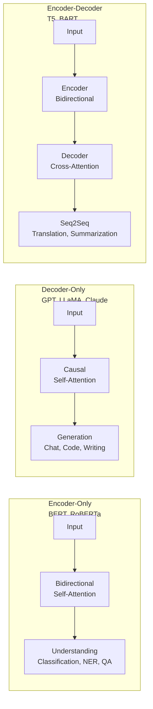

---

## Core Architecture

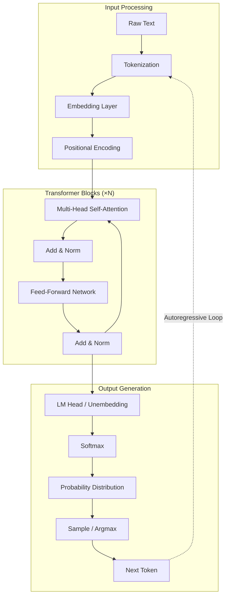

### A Single Transformer Block

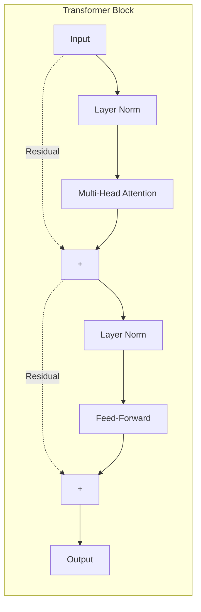

### Inside Self-Attention

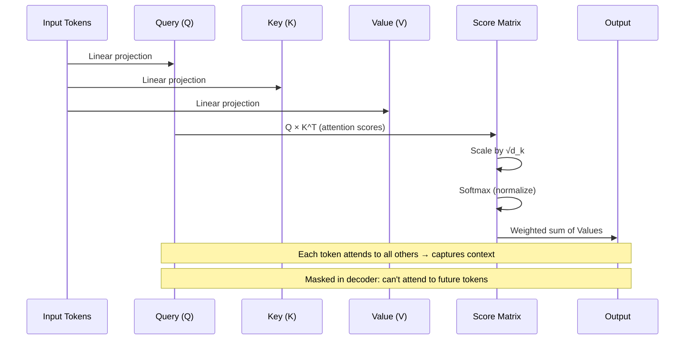

### Multi-Head Attention

| Head | Focuses On |
|------|------------|
| Head 1 | Syntactic relationships (subject-verb agreement) |
| Head 2 | Positional / distance patterns |
| Head 3 | Semantic similarity (synonyms, antonyms) |
| Head 4 | Coreference resolution (pronouns → nouns) |
| Head 5 | Dependency parsing (modifier relationships) |
| Head 6+ | Mixed / learned patterns |

---

## Tokenization & Embedding Space

```mermaid
graph TB
    subgraph TokenizationFlow["Tokenization Pipeline"]
        SENT[Input Sentence] --> NORM[Unicode Normalization]
        NORM --> PRETOKENIZE[Pre-Tokenize<br/>Whitespace / Punctuation]
        PRETOKENIZE --> BPE[BPE / WordPiece<br/>Subword Splitting]
        BPE --> IDS[Token IDs<br/>Vocabulary Index]
    end

    subgraph EmbeddingSpace["Embedding Space"]
        IDS --> VEC[Dense Vectors<br/>d_model = 4096-16384]
        VEC --> SIM[Similarity Search<br/>Cosine Similarity]
        SIM --> CLOSE["king - man + woman ≈ queen"]
    end

    subgraph PositionalEncoding["Positional Encoding"]
        POS1[Sinusoidal<br/>(original transformer)] --> RoPE[RoPE<br/>(LLaMA, Mistral)]
        POS1 --> ALIBI[ALiBi<br/>(Mosaic, Bloom)]
        RoPE --> EXT[Supports Context Extension<br/>YaRN, NTK-aware]
    end
```

---

## Attention Masks

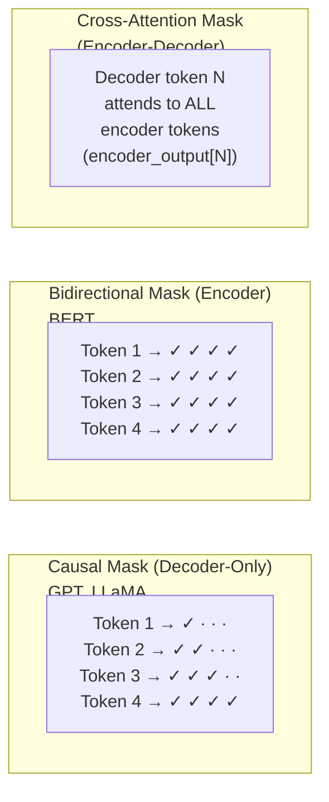

---

## How Autoregressive Generation Works

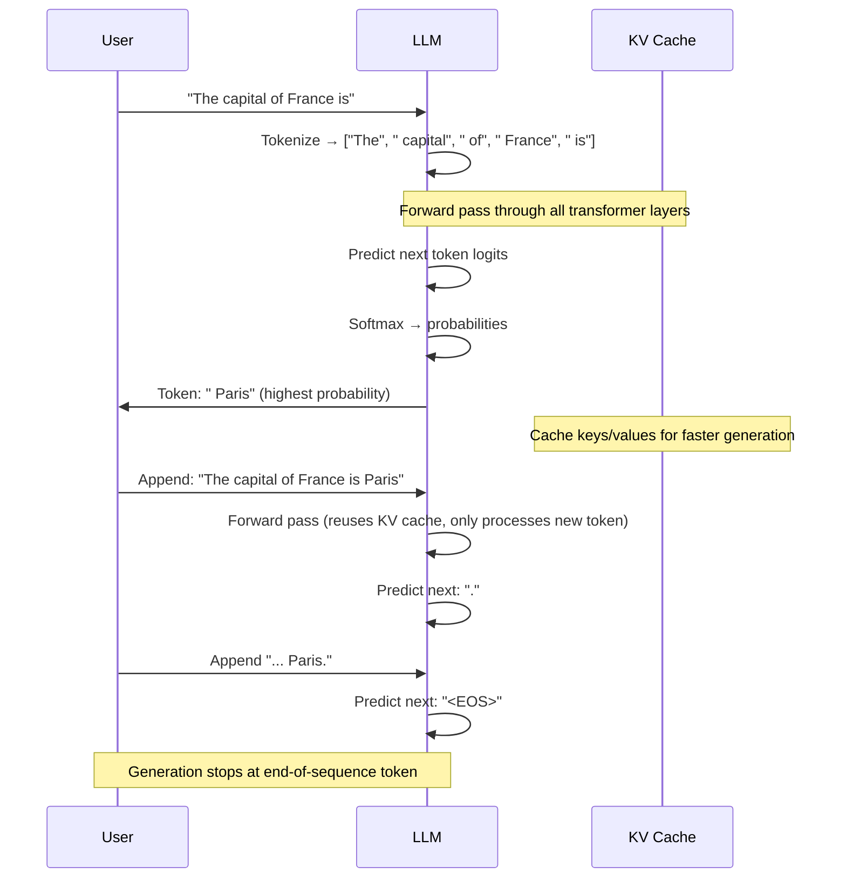

---

## Training Objectives

```mermaid
graph TB
    subgraph Objectives["Pre-Training Objectives"]
        CLM[Causal Language Modeling<br/>Predict next token → → →<br/>GPT, LLaMA, Mistral] --> CLMD[Auto-regressive<br/>Left-to-right only<br/>Best for generation]
        MLM[Masked Language Modeling<br/>Predict [MASK] tokens<br/>BERT, RoBERTa] --> MLMD[Bidirectional context<br/>Best for understanding<br/>Classification, NER]
        PLM[Permuted Language Modeling<br/>Predict in random order<br/>XLNet] --> PLMD[Bidirectional + autoregressive<br/>Combines both benefits]
        T5[Span Corruption<br/>Mask → predict span<br/>T5, BART] --> T5D[Encoder-decoder<br/>Best for translation, summarization]
    end
```

| Objective | Direction | Training Signal | Use Case |
|-----------|-----------|----------------|----------|
| **Causal LM** | Left → Right | All tokens | Generation (chat, code, writing) |
| **Masked LM** | Bidirectional | 15% masked tokens | Understanding (classification, NER) |
| **Permuted LM** | All orders | All tokens in order | Mixed understanding + generation |
| **Span Corruption** | Encoder: bi, Decoder: uni | 15% masked spans | Seq2Seq (summarization, translation) |
| **Fill-in-Middle (FIM)** | Prefix + suffix → middle | Middle tokens | Code infilling (CodeGen, StarCoder) |

---

## Distributed Training Strategies

```mermaid
graph TB
    subgraph DP["Data Parallelism"]
        DP1[Same model on N GPUs<br/>Each gets different batch] --> DP2[Gradients averaged<br/>across GPUs]
        DP2 --> DP3["Good for: large batches<br/>Bad for: single large model<br/>that doesn't fit on 1 GPU"]
    end

    subgraph TP["Tensor Parallelism"]
        TP1[Layer split across GPUs<br/>Each GPU holds part of weights] --> TP2[Attention heads split<br/>FFN columns split]
        TP2 --> TP3["Good for: very large models<br/>Requires fast GPU interconnect<br/>(NVLink, InfiniBand)"]
    end

    subgraph PP["Pipeline Parallelism"]
        PP1[Layer N on GPU 1 →<br/>Layer N+1 on GPU 2 →<br/>Layer N+2 on GPU 3] --> PP2[Micro-batching<br/>to reduce bubble]
        PP2 --> PP3["Good for: sequential layers<br/>Bottleneck: pipeline bubble"]
    end

    subgraph FSDP["Fully Sharded Data Parallel"]
        FSDP1[Shard all params,<br/>gradients, optimizer states<br/>across GPUs] --> FSDP2[All-gather on demand<br/>Forward: gather weights<br/>Backward: gather + reduce]
        FSDP2 --> FSDP3["Good for: largest models<br/>Best memory efficiency"]
    end
```

### Parallelism Strategy Decision

| Model Size | Single GPU | Multi-Node | Recommended Strategy |
|-----------|-----------|------------|---------------------|
| 1-7B | ✅ 1 GPU | — | DDP / FSDP |
| 7-20B | ✅ 1 GPU (maybe quantized) | — | FSDP |
| 20-70B | ❌ | 2-8 GPUs | FSDP + TP |
| 70B-405B | ❌ | 8-32 GPUs | FSDP + TP + PP |
| 405B+ | ❌ | 32+ GPUs (cluster) | 3D Parallelism (FSDP+TP+PP) |

---

## Open Source vs. Closed Source

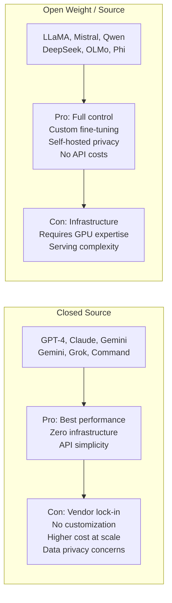

### When to Choose What

| Factor | Go Closed Source | Go Open Source |
|--------|-----------------|----------------|
| **Budget** | Low upfront, high variable | High upfront, low variable |
| **Customization** | Limited (prompting only) | Full (fine-tuning, architecture) |
| **Data Privacy** | Depends on provider | Full control |
| **Latency** | Network-dependent | Optimizable |
| **Team Skills** | No ML expertise needed | ML/infra engineering team |
| **Scale** | Prototyping, low-to-mid volume | High volume, production |

---

## Multi-Modal LLMs

```mermaid
graph TB
    subgraph InputModalities["Input Modalities"]
        TXT["Text"] --> ENC[Encoder Fusion]
        IMG["Images"] --> VIS[Vision Encoder<br/>CLIP, SigLIP]
        AUD["Audio"] --> AUDIO[Audio Encoder<br/>Whisper]
        VID["Video"] --> VIDENC[Video Encoder<br/>Frame + Temporal]
        CODE["Code"] --> CODENC["Code Encoder<br/>(tokenized as text)"]
    end

    subgraph Fusion["Fusion Methods"]
        F1[<b>Early Fusion</b><br/>Project all modalities<br/>into shared embedding space<br/>GPT-4V, Gemini]
        F2[<b>Late Fusion</b><br/>Process separately,<br/>merge at reasoning layer]
        F3[<b>Cross-Attention</b><br/>LLM attends to<br/>encoded representations<br/>Flamingo, LLaVA]
    end

    subgraph Output["Output Modalities"]
        O1[Text Generation]
        O2[Image Generation<br/>(via tool use)]
        O3[Code Execution]
        O4[Function Calls]
    end

    InputModalities --> Fusion
    Fusion --> Output
```

| Model | Text | Image In | Image Out | Audio | Video | 
|-------|------|----------|-----------|-------|-------|
| **GPT-4V / GPT-4o** | ✅ | ✅ | ❌ (via DALL-E) | ✅ | ✅ |
| **Claude 3.5** | ✅ | ✅ | ❌ | ❌ | ❌ |
| **Gemini 1.5 Pro** | ✅ | ✅ | ❌ | ✅ | ✅ |
| **LLaVA** | ✅ | ✅ | ❌ | ❌ | ❌ |
| **CogVLM** | ✅ | ✅ | ❌ | ❌ | ❌ |
| **ImageBind (Meta)** | ✅ | ✅ | ❌ | ✅ | ✅ (embedding) |

---

## LLM Evaluation Ecosystem

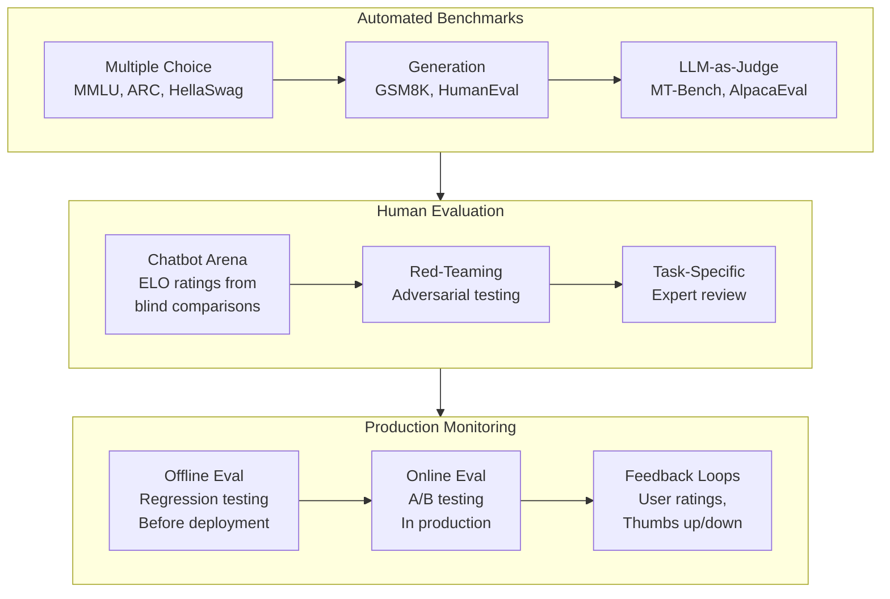

---

## Training Data Composition

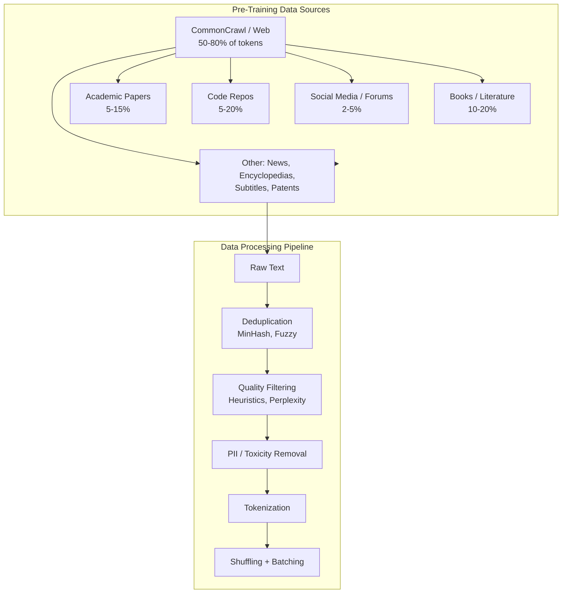

| Dataset | Size | Source | Used By |
|---------|------|--------|---------|
| **CommonCrawl** | 400B+ pages | Web crawl | Most LLMs (filtered) |
| **Books3** | ~200B tokens | Bibliotik | GPT-3, LLaMA |
| **ArXiv** | ~30B tokens | Academic papers | LLaMA, Galactica |
| **Stack Exchange** | ~10B tokens | Q&A forums | LLaMA |
| **GitHub Code** | ~200B tokens | Public repos | CodeGen, StarCoder, LLaMA |
| **The Pile** | 825 GiB | Curated mix | Open-source LLMs |
| **C4** | 750 GiB | Cleaned CommonCrawl | T5, BERT |
| **RedPajama-V2** | 30T tokens | Quality-filtered web | Open-source LLMs |
| **Dolma** | 3T tokens | Mixed curated | OLMo |

---

## Training Pipeline

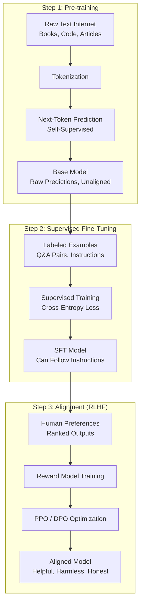

### Training vs Inference

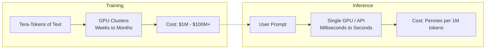

### Training Compute Cost Estimates

| Model | GPUs | Duration | Est. Cost | Energy |
|-------|------|----------|-----------|--------|
| **GPT-3 (175B)** | 10,000 V100 | 34 days | ~$4.6M | 1,300 MWh |
| **LLaMA 3 (405B)** | 30,000 H100 | ~50 days | ~$30M | ~8,000 MWh |
| **DeepSeek-V3 (671B)** | 2,048 H800 | ~40 days | ~$5.6M (efficient MoE) | ~2,000 MWh |
| **Gemini Ultra** | Unknown | Unknown | ~$200M (est.) | Unknown |

---

## Fine-Tuning Methods

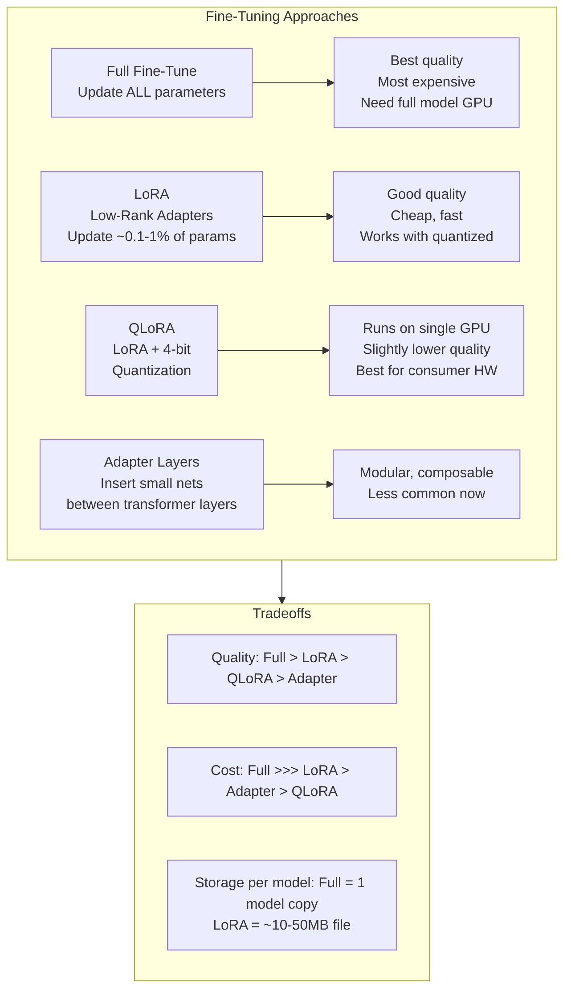

### Parameter-Efficient Fine-Tuning (PEFT) Comparison

| Method | Trainable Params | Memory | Quality | Use Case |
|--------|-----------------|--------|---------|----------|
| **Full Fine-Tune** | 100% of model | ~16× model size | Best | High-budget, production |
| **LoRA (r=16)** | ~0.1-0.5% | ~6× model size | Near-full | Task adaptation |
| **LoRA (r=64)** | ~1-2% | ~8× model size | ~Full | Domain adaptation |
| **QLoRA (4-bit)** | ~0.1-0.5% | ~1.5× model size | ~90-95% | Consumer GPUs |
| **Prompt Tuning** | ~0.01% | ~1× model size | Lower | Quick experiments |
| **IA³** | ~0.01% | ~1× model size | Moderate | Scaling to many tasks |

---

## System Prompt Design

```mermaid
graph TB
    subgraph Components["System Prompt Components"]
        ROLE[Role Definition<br/>"You are a helpful assistant"] --> RULES[Behavioral Rules<br/>"Be concise, cite sources"]
        RULES --> FORMAT[Output Format<br/>"Respond in JSON"]
        FORMAT --> CONST[Constraints<br/>"Refuse harmful requests"]
        CONST --> CTX[Context<br/>"Today's date: 2025-06-14"]
        CTX --> EXAMPLES[Examples<br/>"Q: ... A: ..."]
    end

    subgraph BestPractices["Best Practices"]
        BP1[Be specific and explicit<br/>"Write in markdown" NOT "Format nicely"]
        BP2[Use positive instructions<br/>"Do X" NOT "Don't do Y"]
        BP3[Put critical rules at start<br/>Most attention at beginning]
        BP4[Separate system vs user<br/>Clear boundary markers]
    end

    Components --> BestPractices
```

### System Prompt Patterns

| Pattern | Example | Effect |
|---------|---------|--------|
| **Persona** | "You are a senior software engineer" | Aligns expertise level |
| **Chain-of-Density** | "Summarize in 1 sentence, then 2, then 3" | Progressive detail |
| **Step-by-Step** | "Think step by step before answering" | Improves reasoning |
| **Format Enforcer** | "Output valid JSON with keys: answer, reasoning" | Structured output |
| **Few-Shot in System** | "Examples: Q1... A1... Q2... A2..." | Sets pattern, not visible to user |

---

## Tool Use & Function Calling

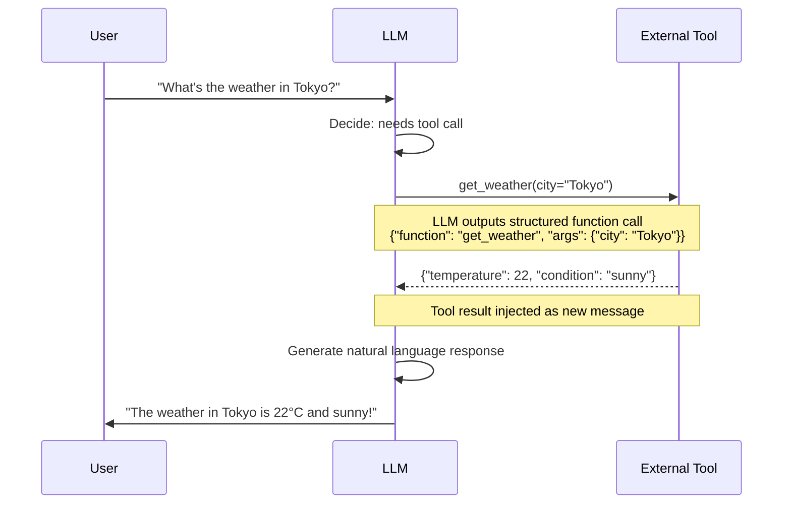

| Tool Type | Examples | Integration |
|-----------|----------|-------------|
| **Information Retrieval** | Web search, vector DB, SQL | RAG pipeline |
| **Code Execution** | Python interpreter, bash | Code Interpreter, Jupyter |
| **APIs** | Calendar, email, Slack | Function calling schema |
| **Computation** | Calculator, unit conversion | Math tool |
| **Multimodal** | Image generation, text-to-speech | API calls to Gen models |

---

## Multi-Agent Orchestration

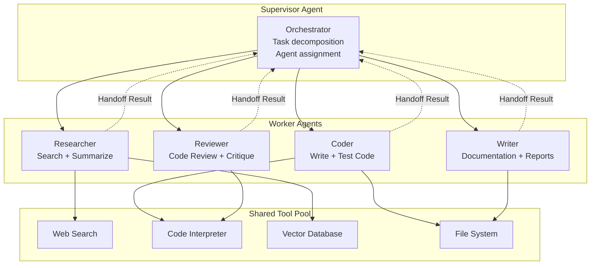

---

## Prompting Strategies

```mermaid
graph TB
    subgraph ZeroShot["Zero-Shot"]
        Z1[Instruction<br/>"Translate to French: Hello"] --> Z2[LLM]
        Z2 --> Z3[Output<br/>"Bonjour"]
    end

    subgraph FewShot["Few-Shot"]
        F1[Examples + Query<br/>"English: Hello → French: Bonjour<br/>English: Goodbye → French: Au revoir<br/>English: Thank you → French:"]
        F1 --> F2[LLM]
        F2 --> F3["Merci"]
    end

    subgraph CoT["Chain-of-Thought"]
        C1["Q: Roger has 5 balls. He buys 2 more.<br/>How many does he have?"] --> C2["Let's think step-by-step:<br/>Roger starts with 5 balls.<br/>He buys 2 more: 5 + 2 = 7."]
        C2 --> C3["Answer: 7"]
    end

    subgraph TreeOfThought["Tree-of-Thought"]
        T1[Problem] --> T2[Branch 1<br/>Hypothesis A]
        T1 --> T3[Branch 2<br/>Hypothesis B]
        T1 --> T4[Branch 3<br/>Hypothesis C]
        T2 --> T5[Evaluate + Backtrack]
        T3 --> T5
        T4 --> T5
        T5 --> T6[Best Path]
    end
```

| Strategy | When to Use | Works Best With | Quality Gain |
|----------|-------------|-----------------|--------------|
| **Zero-shot** | Simple, well-known tasks | Instruction-tuned models | Baseline |
| **Few-shot** | New format, complex tasks | Any model | +10-30% accuracy |
| **Chain-of-Thought** | Math, logic, reasoning | 70B+ models | +15-40% on reasoning |
| **Tree-of-Thought** | Planning, puzzles | Frontier models | +20-50% on search problems |
| **ReAct** | Multi-step tool use | Agent-capable models | +30% on agent tasks |
| **Self-Consistency** | High-stakes decisions | Any model (sample multiple) | +5-15% reliability |

---

## Sampling Strategies

```mermaid
graph TB
    subgraph Strategies["Token Selection Strategies"]
        GREEDY[Greedy Decoding<br/>Always pick highest prob] --> DET[Deterministic<br/>Stable but repetitive]
        TEMP[Temperature Sampling<br/>Scale logits by T] --> CON[Low T: focused<br/>High T: creative]
        TOPK[Top-k Sampling<br/>Only sample from k tokens] --> BAL[Balances quality & diversity]
        TOPP[Top-p (Nucleus)<br/>Sample from cumulative p] --> DYN[Dynamic vocabulary size]
        BEAM[Beam Search<br/>Keep top b sequences] --> BEST[Best for translation<br/>Slow for chat]
    end

    subgraph Effect["Temperature Effect"]
        T0["T → 0<br/>Deterministic<br/>Greedy choice"]
        T05["T = 0.5<br/>Focused<br/>Slight variation"]
        T1["T = 1.0<br/>Balanced<br/>Model default"]
        T15["T = 1.5<br/>Creative<br/>May hallucinate"]
        T2["T → ∞<br/>Uniform random<br/>Gibberish"]
    end
```

---

## Inference Optimization

```mermaid
graph TB
    subgraph Techniques["Optimization Techniques"]
        I1[KV Cache<br/>Store past keys/values<br/>Avoid recomputation] --> I1P[2-4× faster<br/>Memory grows with context]
        I2[Speculative Decoding<br/>Draft model predicts k tokens<br/>LLM verifies in parallel] --> I2P[2-3× faster<br/>Lossless quality]
        I3[Flash Attention<br/>IO-aware exact attention<br/>Tiling, recomputation] --> I3P[2-4× faster<br/>Less memory]
        I4[Quantization<br/>FP16 → INT4/INT8<br/>Smaller, faster math] --> I4P[2-4× smaller<br/>Slightly lower quality]
        I5[Batching<br/>Process multiple prompts<br/>Together on GPU] --> I5P[Higher throughput<br/>Higher latency]
        I6[PagedAttention / vLLM<br/>Manage KV cache like OS pages<br/>No fragmentation] --> I6P[2-4× throughput<br/>Better memory utilization]
    end
```

### Inference Speed Comparison (70B Model, 1 GPU)

| Technique | Tokens/sec | Memory | Quality Impact |
|-----------|-----------|--------|----------------|
| FP16 (baseline) | 5-8 | 140 GB | — |
| FP16 + KV Cache | 12-18 | 140 GB + context | None |
| INT8 Quant | 15-25 | 70 GB | Negligible |
| INT4 Quant (GPTQ) | 20-35 | 40 GB | Minimal |
| + Flash Attention | 2-4× over baseline | Reduced | None |
| + Speculative Decode | 2-3× over baseline | +Draft model | None |
| + PagedAttention (vLLM) | 2-4× throughput | Better util | None |

---

## Quantization Levels

```mermaid
graph LR
    subgraph Precision["Precision Levels"]
        FP32["FP32<br/>32-bit<br/>Full precision<br/>Training only"] --> FP16["FP16<br/>16-bit<br/>Most training<br/>& inference"]
        FP16 --> BF16["BF16<br/>16-bit<br/>Same range as FP32<br/>Preferred for training"]
        BF16 --> INT8["INT8<br/>8-bit<br/>Fast inference<br/>Minimal loss"]
        INT8 --> INT4["INT4<br/>4-bit<br/>Consumer GPUs<br/>Slight quality loss"]
        INT4 --> NF4["NF4<br/>4-bit NormalFloat<br/>QLoRA<br/>Optimized for LLMs"]
        INT4 --> INT3["INT3 / INT2<br/>Extreme compression<br/>Significant quality loss<br/>Experimental"]
    end

    subgraph Hardware["Typical GPU Fit"]
        H1[LLaMA 3 70B FP16:<br/>5× H100 80GB] --> H2[INT8:<br/>2× H100 80GB]
        H2 --> H3[INT4:<br/>1× H100 80GB]
        H3 --> H4[QLoRA INT4:<br/>1× RTX 4090 24GB]
    end
```

### Memory Required by Model Size

| Model Size | FP16 | INT8 | INT4 | Fits on Consumer? |
|-----------|------|------|------|-------------------|
| 1B | 2 GB | 1 GB | 0.5 GB | ✅ Any GPU |
| 7B | 14 GB | 7 GB | 3.5 GB | ✅ RTX 3090+ |
| 13B | 26 GB | 13 GB | 6.5 GB | ✅ RTX 4090 (INT4) |
| 34B | 68 GB | 34 GB | 17 GB | ✅ RTX 4090 (INT4) |
| 70B | 140 GB | 70 GB | 35 GB | ⚠️ Dual GPU (INT4) |
| 405B | 810 GB | 405 GB | 200 GB | ❌ Cloud only |

---

## RAG Integration Architecture

```mermaid
graph TB
    subgraph UserInput["User Input"]
        Q[User Query] --> R[Router]
    end

    subgraph RAG["Retrieval-Augmented Generation"]
        Q2[Query] --> E[Embedding Model]
        E --> VS[Vector Database<br/>Chroma, Pinecone, Qdrant]
        VS --> DOCS[Relevant Documents<br/>Top-K chunks]
        DOCS --> CTX[Context + Query<br/>Assembled Prompt]
    end

    subgraph Direct["Direct Generation"]
        Q3[Query] --> CTX2[Query Only]
    end

    subgraph Generation["LLM Generation"]
        CTX --> LLM[LLM]
        CTX2 --> LLM
        LLM --> RESP["Grounded Response<br/>+ Citations"]
    end

    R --> RAG
    R --> Direct
```

| Approach | Pros | Cons | Best For |
|----------|------|------|----------|
| **No RAG** | Simple, fast | Knowledge cutoff, hallucination | Casual chat |
| **RAG** | Grounded, up-to-date, cite sources | Retrieval latency, chunk quality | Document QA, support |
| **RAG + Re-rank** | Higher precision | Extra latency, cost | Enterprise search |
| **Agentic RAG** | Multi-step, tool use | Complex, slower | Research assistants |

---

## LLM Safety & Guardrails Stack

```mermaid
graph TB
    subgraph InputGuard["Input Guardrails"]
        G1[Prompt Injection Detection] --> G2[Toxicity / PII Filter]
        G2 --> G3[Input Budget<br/>Token Limit Check]
    end

    subgraph ModelGuard["Model-Level Safety"]
        M1[RLHF / DPO Training<br/>Harmlessness] --> M2[Refusal Training<br/>Decline harmful requests]
        M2 --> M3[Constitutional AI<br/>Self-critique principles]
    end

    subgraph OutputGuard["Output Guardrails"]
        O1[Content Moderation<br/>API / Classifier] --> O2[Factuality Check<br/>Grounding / Entailment]
        O2 --> O3[Format Validation<br/>JSON schema, length]
    end

    subgraph Monitoring["Monitoring & Logging"]
        MO1[Hallucination Rate] --> MO2[Refusal Rate]
        MO2 --> MO3[User Feedback Scores]
        MO3 --> MO4[Red-Teaming Logs]
    end

    InputGuard --> ModelGuard
    ModelGuard --> OutputGuard
    OutputGuard --> Monitoring
```

---

```mermaid
graph TD
    subgraph Laws["Key Empirical Findings (Kaplan et al., Chinchilla)"]
        L1[Loss decreases<br/>predictably with<br/>more parameters]
        L2[Loss decreases<br/>predictably with<br/>more training data]
        L3[Compute-optimal:<br/>20 tokens per parameter]
    end

    subgraph Implications["Implications"]
        I1[Bigger models + more data<br/>= better performance]
        I2[Most models are<br/>undertrained<br/>(Chinchilla paper)]
        I3[Diminishing returns<br/>past optimal compute]
    end

    Laws --> Implications
```

### Compute-Optimal Frontier

| Metric | Small | Medium | Large | Frontier |
|--------|-------|--------|-------|----------|
| **Parameters** | 7B | 70B | 400B | 1T+ |
| **Training Tokens** | 140B | 1.4T | 8T | 20T+ |
| **Compute (FLOPs)** | 6e22 | 6e24 | 1e26 | 1e27+ |
| **Typical Use** | On-device, fine-tuning | API, self-host | Research, frontier | Cutting-edge |

---

## Emergent Abilities

LLMs exhibit capabilities that **were not explicitly trained for** and only appear at sufficient scale:

```mermaid
graph LR
    subgraph Scale["Model Scale →"]
        S1[<b>Small (≤7B)</b><br/>Basic language<br/>Simple Q&A<br/>Translation] --> S2[<b>Medium (7B-70B)</b><br/>Chain-of-thought<br/>Code generation<br/>Summarization]
        S2 --> S3[<b>Large (70B-400B)</b><br/>Multi-step reasoning<br/>Math problem solving<br/>Tool use]
        S3 --> S4[<b>Frontier (400B+)</b><br/>In-context learning<br/>Instruction following<br/>Creative writing]
    end
```

---

## Notable Models Timeline

```mermaid
gantt
    title LLM Evolution
    dateFormat  YYYY-MM
    axisFormat  %Y

    section GPT Family
    GPT-1             :2018-06, 3M
    GPT-2             :2019-02, 6M
    GPT-3             :2020-06, 6M
    GPT-3.5 / ChatGPT :2022-03, 6M
    GPT-4             :2023-03, 12M

    section Open Source
    BERT              :2018-10, 3M
    T5                :2019-10, 3M
    LLaMA             :2023-02, 3M
    LLaMA 2           :2023-07, 6M
    LLaMA 3           :2024-04, 6M
    Mistral           :2023-09, 3M
    Mixtral (MoE)     :2023-12, 3M
    DeepSeek-V2       :2024-05, 6M
    Qwen 2.5          :2024-09, 6M
    DeepSeek-V3       :2024-12, 3M

    section Anthropic
    Claude 1          :2023-03, 6M
    Claude 2          :2023-07, 6M
    Claude 3          :2024-03, 6M

    section Google
    T5                :2019-10, 3M
    PaLM              :2022-04, 6M
    Gemini            :2023-12, 6M
```

---

## Model Comparison

| Model | Developer | Params | Context | Open? | Standout Feature |
|-------|-----------|--------|---------|-------|------------------|
| **GPT-4** | OpenAI | ~1.8T (est.) | 128K | No | Broad capability, ecosystem |
| **Claude 3.5** | Anthropic | Unknown | 200K | No | Long context, safety |
| **LLaMA 3** | Meta | 8B — 405B | 128K | Yes | Strong open-weight |
| **Mistral** | Mistral AI | 7B — 8×22B | 32K — 128K | Yes | Efficient, MoE |
| **Gemini** | Google | Unknown | 1M+ | No | Massive context window |
| **DeepSeek-V3** | DeepSeek | 671B (MoE) | 128K | Yes | Cost-efficient training |
| **Qwen 2.5** | Alibaba | 0.5B — 72B | 32K — 128K | Yes | Multilingual strength |
| **Command R+** | Cohere | 104B | 128K | Yes | RAG-optimized |

---

## Key Capabilities

```mermaid
quadrantChart
    title LLM Capabilities by Maturity
    x-axis Low Maturity --> High Maturity
    y-axis Low Quality --> High Quality
    quadrant-1 Mature & High Quality
    quadrant-2 Emerging & High Quality
    quadrant-3 Emerging & Low Quality
    quadrant-4 Mature & Low Quality
    Translation: [0.8, 0.8]
    Summarization: [0.85, 0.75]
    Code Generation: [0.7, 0.7]
    Creative Writing: [0.6, 0.75]
    Long-Form Reasoning: [0.4, 0.6]
    Multimodal Understanding: [0.5, 0.5]
    Tool Use: [0.6, 0.65]
    Planning: [0.3, 0.4]
    Causal Reasoning: [0.25, 0.35]
    Mathematical Proof: [0.2, 0.3]
```

---

## Limitations & Challenges

| Limitation | Description | Mitigation |
|------------|-------------|------------|
| **Hallucination** | Confidently generates false information | RAG, grounding, factual consistency checks |
| **Context Window** | Limited attention span (4K — 1M+ tokens) | Context window strategies, RAG |
| **Recency Bias** | Overfits to recent tokens in context | Attention re-weighting |
| **Knowledge Cutoff** | Only knows data up to training date | Web search, RAG |
| **Cost** | Expensive to train and serve | Quantization, distillation, caching |
| **Latency** | Autoregressive decoding is sequential | Speculative decoding, KV cache |
| **Safety** | Can generate harmful content | Guardrails, RLHF, content filters |

---

## Common Use Cases

```
┌─────────────────────────────────────────────────┐
│                  LLM Applications                 │
├──────────┬──────────┬──────────┬─────────────────┤
│  Chatbot │  Content │   Code   │   Analysis       │
│  / Ass't │  Gen     │  Assist  │   & RAG          │
├──────────┼──────────┼──────────┼─────────────────┤
│ Q&A      │ Articles │ Autocomp │ Document QA      │
│ Planning │ Emails   │ Refactor │ Data Extraction  │
│ Brainstrm│ Social   │ Debug    │ Summarization    │
│          │ Posts    │ Explain  │ Sentiment        │
├──────────┴──────────┴──────────┴─────────────────┤
│              + Tool Use, Function Calling          │
│              + Multi-Agent Orchestration           │
│              + Structured Output / JSON            │
└──────────────────────────────────────────────────┘
```

---

## LLM Application Stack

```mermaid
graph TB
    subgraph AppLayer["Application Layer"]
        A1[Chat UI<br/>Gradio, Next.js] --> A2[API Gateway<br/>Rate Limit, Auth]
        A2 --> A3[Orchestration<br/>LangChain, LlamaIndex]
    end

    subgraph ModelLayer["Model Layer"]
        O1[Proprietary API<br/>OpenAI, Anthropic, Google] --> O2[Serving Framework<br/>vLLM, TGI, Ollama]
        O2 --> O3[Self-Hosted<br/>Hugging Face, Custom]
    end

    subgraph InfraLayer["Infrastructure Layer"]
        I1[Vector DB<br/>Pinecone, Qdrant, Weaviate] --> I2[Monitoring<br/>LangSmith, Weights & Biases]
        I2 --> I3[Caching<br/>Redis, GPTCache]
        I3 --> I4[Fine-Tuning Platform<br/>Axolotl, Unsloth]
    end

    AppLayer --> ModelLayer
    ModelLayer --> InfraLayer
```

---

## Context Window Evolution

```mermaid
gantt
    title Context Window Growth (log scale)
    dateFormat  YYYY-MM
    axisFormat  %Y

    section Transformer
    Original Transformer<br/>(512 tokens)    :crit, 2017-06, 1M

    section GPT
    GPT-1 (512)           :2018-06, 1M
    GPT-2 (1024)          :2019-02, 1M
    GPT-3 (2048)          :2020-06, 1M
    GPT-3.5 (4096)        :2022-03, 1M
    GPT-4 (8192→32K→128K) :2023-03, 2M

    section Open Source
    LLaMA (2048)          :2023-02, 1M
    LLaMA 2 (4096)        :2023-07, 1M
    Mistral (8192→32K)    :2023-09, 1M
    Yi-34B (200K)         :2023-11, 1M
    LLaMA 3 (8192→128K)   :2024-04, 1M

    section Long Context
    Claude 2.1 (200K)     :2023-11, 1M
    Gemini 1.5 (1M→10M)   :2024-02, 1M
    GPT-4 Turbo (128K)    :2023-11, 1M
    Claude 3 (200K)       :2024-03, 1M
    Gemini 1.5 Pro (2M)   :2024-05, 1M
```

### Context Window vs. Effective Usage

| Context Length | Paper Test | Real-World Practical | Cost per Query |
|----------------|-----------|---------------------|----------------|
| 4K | ✅ Perfect | ✅ All use cases | $ |
| 8K | ✅ Perfect | ✅ Most cases | $$ |
| 32K | ✅ Perfect | ⚠️ Lost-in-middle | $$$ |
| 128K | ✅ Good | ⚠️ Degrades at long range | $$$$ |
| 200K+ | ⚠️ Partial | ❌ Many models underperform | $$$$$ |

---

## Evaluation Benchmarks

```mermaid
graph TB
    subgraph Knowledge["Knowledge & Reasoning"]
        M1[MMLU<br/>57 subjects<br/>Knowledge] --> M2[BIG-bench<br/>200+ tasks<br/>Reasoning]
        M2 --> M3[ARC<br/>Science Q&A<br/>Grade-school]
        M3 --> M4[GPQA<br/>Expert-level<br/>Graduate science]
    end

    subgraph Code["Code Generation"]
        C1[HumanEval<br/>Python functions<br/>Pass@1] --> C2[MBPP<br/>Basic Python<br/>Short programs]
        C2 --> C3[SWE-bench<br/>Real GitHub issues<br/>End-to-end]
        C3 --> C4[BigCodeBench<br/>Multi-language<br/>Tool use]
    end

    subgraph Math["Mathematical Reasoning"]
        MTH1[GSM8K<br/>Grade-school math<br/>Chain-of-thought] --> MTH2[MATH<br/>Competition math<br/>Challenging]
        MTH2 --> MTH3[TheoremQA<br/>STEM theorem<br/>Expert]
    end

    subgraph Safety["Safety & Alignment"]
        S1[TruthfulQA<br/>Misconceptions<br/>Honesty] --> S2[BBQ<br/>Bias measurement<br/>Fairness]
        S2 --> S3[Red-teaming<br/>Adversarial<br/>Harmfulness]
    end

    Knowledge --> Code
    Code --> Math
    Math --> Safety
```

### Key Benchmark Descriptions

| Benchmark | What It Measures | Format | SOTA Score (2025) |
|-----------|-----------------|--------|-------------------|
| **MMLU** | Multi-task knowledge (57 subjects) | 4-choice QA | ~90% (human = 89%) |
| **GSM8K** | Grade-school math word problems | Free-form answer | ~98% |
| **MATH** | Competition-level math | Free-form with reasoning | ~85% |
| **HumanEval** | Python code generation | Pass@1 | ~95% |
| **SWE-bench** | Real software engineering | Patch correctness | ~50% (hard) |
| **MT-Bench** | Multi-turn chat quality | LLM-as-judge (1-10) | ~9.5/10 |
| **Chatbot Arena** | Blind preference ranking | ELO rating | 1400+ ELO |

---

## Hallucination Taxonomy

```mermaid
graph TB
    subgraph Hallucination["Types of Hallucination"]
        H1[Factual<br/>Wrong dates, names,<br/>quantities, events] --> H2[Reasoning<br/>Faulty logic,<br/>wrong math steps]
        H2 --> H3[Instruction<br/>Ignoring/I misinterpreting<br/>user constraints]
        H3 --> H4[Context<br/>Contradicts information<br/>provided in prompt]
        H4 --> H5[Positional<br/>Lost in middle<br/>of long context]
    end

    subgraph Detection["Detection Methods"]
        D1[Self-Consistency<br/>Sample multiple times<br/>Check agreement]
        D2[Factual Grounding<br/>Retrieve evidence<br/>Check claims]
        D3[P(True) Calibration<br/>Model confidence<br/>Score thresholding]
        D4[External Verifier<br/>Separate model<br/>Evaluates output]
    end

    subgraph Mitigation["Mitigation Strategies"]
        M1[RAG + Citations<br/>Force grounded generation]
        M2[Constrained Decoding<br/>Limit to known facts]
        M3[Prompt Engineering<br/>"Say I don't know"]
        M4[Uncertainty Prompting<br/>Express confidence level]
    end

    Hallucination --> Detection
    Detection --> Mitigation
```

---

## Scaling Efficiency: Model Size vs. Performance

```mermaid
graph LR
    subgraph Params["Parameter Scale"]
        P1["1-7B<br/>On-device<br/>Fast, cheap"] --> P2["7-20B<br/>Consumer GPU<br/>Good quality"]
        P2 --> P3["20-70B<br/>Server GPU<br/>High quality"]
        P3 --> P4["70B-400B<br/>Multi-GPU<br/>Frontier"]
        P4 --> P5["400B+<br/>Cluster<br/>SOTA"]
    end

    subgraph Diminishing["Diminishing Returns"]
        DR1["Quality gap<br/>7B → 70B: +15-25%"] --> DR2["70B → 405B: +5-10%"]
        DR2 --> DR3["405B → 1T+: +2-5%"]
        DR3 --> DR4["Smaller + longer training<br/>often beats larger + undertrained"]
    end
```

---

## Model Selection Decision Tree

```mermaid
graph TD
    Q1["What's your budget?"] -->|"Free / Low"| Q2
    Q1 -->|"Medium"| Q3
    Q1 -->|"High"| Q4

    Q2["What hardware?"] -->|"Consumer GPU (24GB)"| S1["LLaMA 3 8B / Mistral 7B<br/>Qwen 2.5 7B"]
    Q2 -->|"CPU / Mobile"| S2["Phi-3 / Gemma 2B<br/>Llama 3.2 1B-3B"]
    Q2 -->|"No GPU (API)"| S3["DeepSeek-V3 (cheap)<br/>Mistral Large (mid)"]

    Q3["Need customization?"] -->|"Yes"| S4["LLaMA 3 70B / Qwen 72B<br/>Fine-tune with QLoRA"]
    Q3 -->|"No"| S5["Claude 3.5 Sonnet<br/>GPT-4o mini"]

    Q4["Need data privacy?"] -->|"Yes (self-host)"| S6["LLaMA 3 405B<br/>DeepSeek-V3"]
    Q4 -->|"No (API)"| S7["GPT-4o / Claude 3.5<br/>Gemini 1.5 Pro"]

    Q5["Task type?"] -->|"Chat / Assistant"| S5
    Q5 -->|"Code"| S8["Claude 3.5 / GPT-4o<br/>DeepSeek-Coder"]
    Q5 -->|"Reasoning / Math"| S9["GPT-4o / Claude 3.5<br/>DeepSeek-R1"]
    Q5 -->|"RAG / Knowledge"| S10["Command R+ / Gemini<br/>Any + good RAG pipeline"]
    Q5 -->|"Multilingual"| S11["Qwen 2.5 / GPT-4o<br/>Aya (Cohere)"]

    S1 --> Q5
    S2 --> Q5
    S3 --> Q5
    S4 --> Q5
    S5 --> Q5
    S6 --> Q5
    S7 --> Q5
```

---

## 2025-2026 Frontier: Key Trends

```mermaid
graph TB
    subgraph Trends["Current Trends Shaping LLMs"]
        T1[<b>Reasoning Models</b><br/>OpenAI o1/o3, DeepSeek-R1<br/>Chain-of-thought at inference<br/>More compute = better reasoning] --> T2[<b>Long Context</b><br/>Gemini 2M, Claude 200K<br/>Context as "working memory"<br/>Entire codebases in context]
        T2 --> T3[<b>Small + Efficient</b><br/>Phi-3, Gemma, Llama 3.2<br/>1-3B models rivaling 7B<br/>On-device inference]
        T3 --> T4[<b>Agentic Systems</b><br/>Multi-agent, tool use<br/>Autonomous task completion<br/>Computer use (Claude)]
        T4 --> T5[<b>Multimodal Native</b><br/>GPT-4o, Gemini<br/>Text + Image + Audio + Video<br/>Native, not bolted-on]
        T5 --> T6[<b>Open-Weight Race</b><br/>LLaMA, Qwen, DeepSeek, Mistral<br/>Frontier capability approaching<br/>closed-source models]
    end
```

| Trend | Impact | Who's Leading | Maturity |
|-------|--------|---------------|----------|
| **Reasoning (o1-style)** | Better math/code, more inference compute | OpenAI, DeepSeek | Early |
| **Extreme Long Context** | "Infinite" context windows | Google, Anthropic | Early-Mid |
| **Small Language Models** | On-device AI, lower cost | Microsoft, Google, Meta | Mature |
| **Agentic Workflows** | Autonomous task completion | Anthropic, OpenAI | Early |
| **Native Multimodal** | Unified understanding | OpenAI, Google | Mid |
| **Test-Time Compute** | Spend compute at inference for quality | OpenAI, DeepSeek | Early |

---

## The LLM Cost Equation

| Factor | Cost Driver | Optimize By |
|--------|-------------|-------------|
| **Pre-training** | GPU-hours × GPU cost | MoE, data quality, smaller+longer |
| **Fine-tuning** | Training steps × model size | LoRA, QLoRA, freezing layers |
| **Input tokens** | Context length × batch size | Caching, shorter prompts |
| **Output tokens** | Generation length | Early stopping, shorter answers |
| **Serving infra** | GPU count × uptime | Batching, quantization, serverless |
| **API calls** | Per-token pricing | Caching, prompt compression |

### API Pricing Comparison (per 1M tokens, 2025)

| Provider | Model | Input | Output |
|----------|-------|-------|--------|
| **OpenAI** | GPT-4o | $2.50 | $10.00 |
| **Anthropic** | Claude 3.5 Sonnet | $3.00 | $15.00 |
| **Google** | Gemini 1.5 Pro | $3.50 | $10.50 |
| **Mistral** | Mistral Large | $2.00 | $6.00 |
| **DeepSeek** | DeepSeek-V3 | $0.27 | $1.10 |
| **Open-source** | Llama 3 70B (self-host) | ~$0.10 (GPU cost) | ~$0.10 |

---

## Glossary

| Term | Definition |
|------|------------|
| **Token** | Atomic unit of text (word or subword) the model processes |
| **Context Window** | Maximum number of tokens the model can attend to |
| **KV Cache** | Cached key-value pairs from attention layers to speed generation |
| **Temperature** | Controls randomness of output (low = deterministic, high = creative) |
| **Top-p / Top-k** | Sampling strategies to filter low-probability tokens |
| **Logits** | Raw unnormalized scores from the LM head |
| **Softmax** | Converts logits into a probability distribution |
| **Autoregressive** | Generating one token at a time, feeding each back as input |
| **In-Context Learning** | Learning from examples in the prompt (no weight updates) |
| **MoE (Mixture of Experts)** | Sparse architecture where only a subset of parameters activates per token |
| **RoPE** | Rotary Position Embedding — encodes position via rotation matrices |
| **Flash Attention** | IO-aware exact attention algorithm (faster, less memory) |
| **Speculative Decoding** | Draft model predicts tokens; LLM verifies in parallel for speed |
| **SFT (Supervised Fine-Tuning)** | Training on labeled instruction-response pairs |
| **RLHF** | Reinforcement Learning from Human Feedback — alignment via preferences |
| **DPO** | Direct Preference Optimization — RLHF without separate reward model |
| **LoRA / QLoRA** | Low-Rank Adaptation — parameter-efficient fine-tuning (QLoRA = LoRA + 4-bit) |
| **PagedAttention** | OS-like page management for KV cache (used in vLLM) |
| **Perplexity** | How surprised the model is by text (lower = better) |
| **Beam Search** | Keeps top-b candidate sequences during generation |
| **Embedding** | Dense vector representation of a token in high-dimensional space |
| **Attention Mask** | Controls which tokens can attend to which (causal vs. bidirectional) |
| **Residual Connection** | Skip connection that lets gradients flow directly through the network |
| **Layer Norm** | Normalizes activations across feature dimension (stabilizes training) |
| **SWA (Sliding Window Attention)** | Attention limited to a local window of N tokens |
| **GQA (Grouped Query Attention)** | Multiple query heads share fewer key/value heads (fast, memory-efficient) |
| **MLA (Multi-head Latent Attention)** | Compresses KV cache via latent vectors (used in DeepSeek) |

**Next**: [[Tokenization]] — How text becomes numbers
