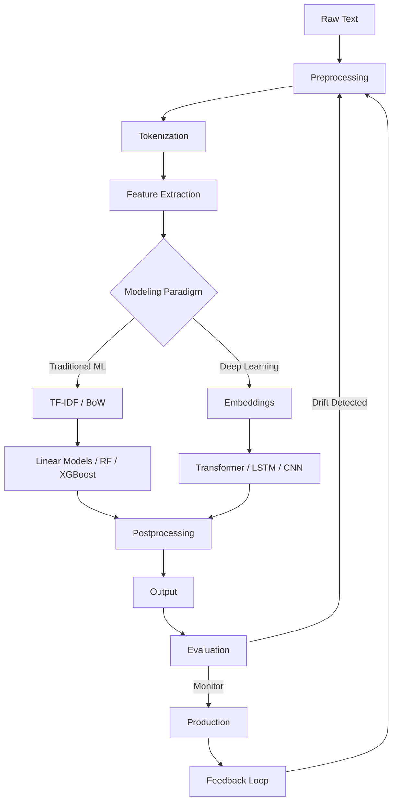
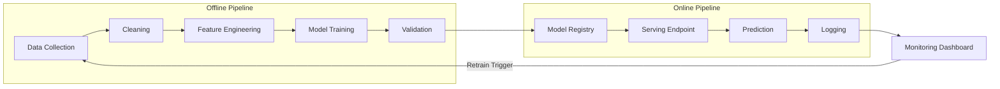
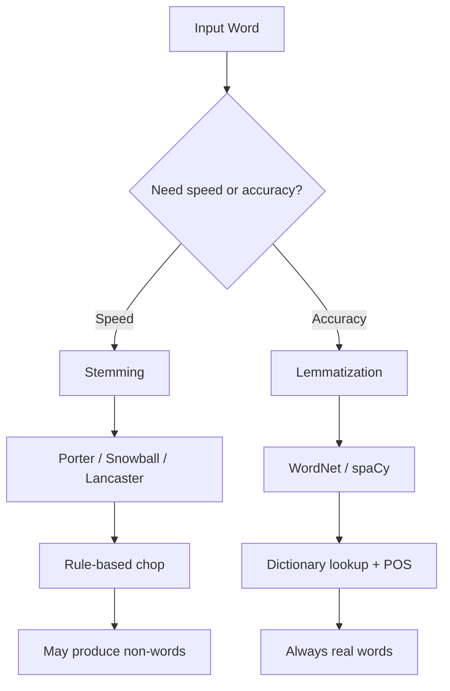
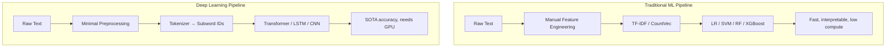
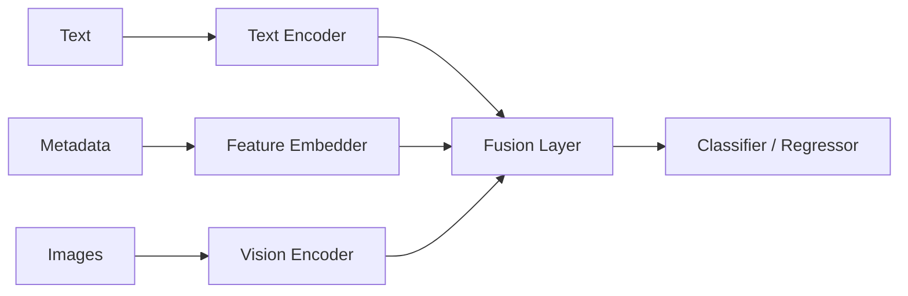
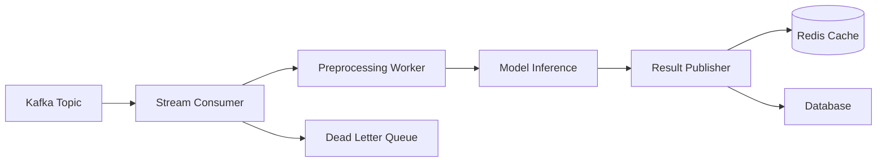
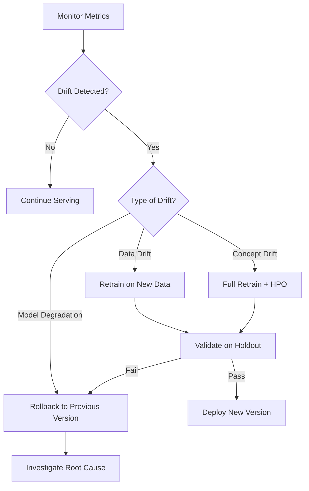
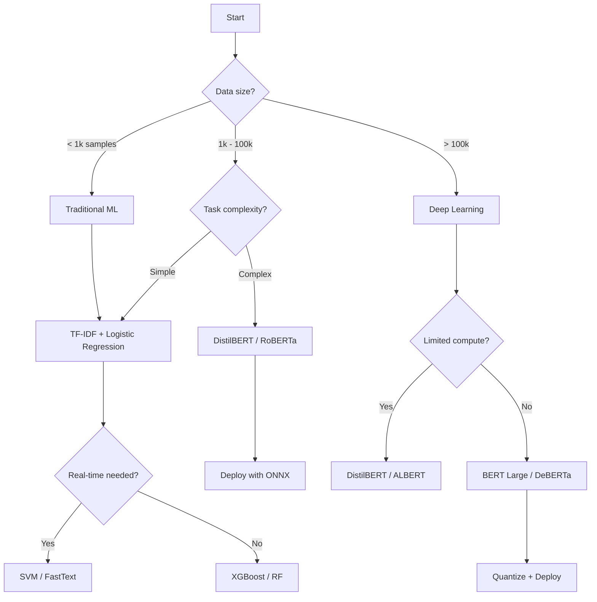

# NLP Pipeline Design

An NLP pipeline transforms raw text into structured insights through a series of processing stages.

## Pipeline Stages

```
Raw Text → Preprocessing → Feature Extraction → Modeling → Postprocessing → Output
```

### 1. Preprocessing
- Tokenization: split text into tokens
- Lowercasing: normalize case
- Stopword removal: filter noise words
- Stemming/Lemmatization: reduce to root form
- Noise removal: strip HTML, punctuation

### 2. Feature Extraction
- Bag of Words (BoW)
- TF-IDF
- Word embeddings (Word2Vec, GloVe)
- Contextual embeddings (BERT)

### 3. Modeling
| Task | Approach |
|------|----------|
| Classification | Naive Bayes, BERT |
| NER | BiLSTM-CRF, Transformers |
| Translation | Seq2Seq + Attention |
| Summarization | BART, Pegasus, GPT |
| Sentiment | DistilBERT, RoBERTa |

### 4. Evaluation
- Accuracy, Precision, Recall, F1
- BLEU (translation), ROUGE (summarization)
- Perplexity (language models)

**See also**: [[Text Embedding Models]], [[LLM Agents Framework]], [[Programming Resources]]

---

## Full Pipeline Architecture





## Preprocessing — Deep Dive

### Normalization

| Technique | Description | Example |
|-----------|-------------|---------|
| Unicode NFKC | Canonical unicode normalization | ℌ → fi, ² → 2 |
| Lowercasing | Case folding | "Hello" → "hello" |
| Accent stripping | Remove diacritics | "café" → "cafe" |
| Expanding contractions | Full form | "don't" → "do not" |
| URL/email removal | Regex patterns | Remove http://... |
| Whitespace normalization | Collapse spaces | "a   b" → "a b" |

```python
import re
import unicodedata

def normalize_text(text: str) -> str:
    text = unicodedata.normalize("NFKC", text)
    text = text.lower()
    text = re.sub(r"http\S+|www\S+|https\S+", "", text)
    text = re.sub(r"\S+@\S+", "", text)
    text = re.sub(r"[^\w\s]", "", text)
    text = re.sub(r"\s+", " ", text).strip()
    return text
```

### Noise Removal Patterns

```python
NOISE_PATTERNS = {
    "html_tags": r"<[^>]+>",
    "markdown_links": r"\[.*?\]\(.*?\)",
    "code_blocks": r"```[\s\S]*?```",
    "mentions": r"@\w+",
    "hashtags": r"#\w+",
    "repeated_chars": r"(.)\1{2,}",
    "numbers": r"\b\d+\b",
}
```

## Tokenization — Comparison

```mermaid
graph TD
    A[Input Text] --> B{Tokenization Strategy}
    B -->|Word| C["The cat sat" → ['The', 'cat', 'sat']]
    B -->|Subword| D["The cat sat" → ['The', 'cat', 'sat']]
    B -->|Character| E["The cat" → ['T','h','e',' ','c','a','t']]
    B -->|Sentence| F["Hi. How are you?" → ['Hi.', 'How are you?']]
    C --> G[WordPiece / BPE]
    D --> G
```

| Tokenizer | Algorithm | Vocab Size | Handles OOV | Languages |
|-----------|-----------|------------|-------------|-----------|
| Word | Whitespace/Split | Unlimited | No | Single |
| WordPiece | Greedy merge | 30k-50k | Yes | Single |
| BPE | Frequency merge | 32k-100k | Yes | Multi |
| SentencePiece | Unigram LM | 8k-64k | Yes | Multi |
| Character | — | 26-200 | Yes | Any |
| Morpheme | Linguistic | Varies | Partial | Specific |

### Sentence Tokenization Challenges

```python
import nltk
# nltk.download("punkt_tab")

text = "Dr. Smith went to Washington, D.C. He arrived at 4 p.m."
sentences = nltk.sent_tokenize(text)
# ['Dr. Smith went to Washington, D.C.', 'He arrived at 4 p.m.']
```

## Stopword Handling

### Custom Stopword Lists

```python
from sklearn.feature_extraction.text import ENGLISH_STOP_WORDS

DOMAIN_STOP_WORDS = {"click", "here", "read", "more", "subscribe"}
CUSTOM_STOP_WORDS = ENGLISH_STOP_WORDS - {"not", "no", "never", "nor"}  # keep negation

def get_stopwords(domain: str) -> set:
    base = set(ENGLISH_STOP_WORDS)
    if domain == "medical":
        return base - {"patient", "treatment", "diagnosis"}
    if domain == "legal":
        return base - {"court", "plaintiff", "defendant"}
    return base
```

| Strategy | Use Case | Trade-off |
|----------|----------|-----------|
| Global list | General text | Removes signal words |
| Domain-specific | Medical/Legal | Preserves domain vocab |
| Frequency-based | Large corpus | Removes very common words |
| Contextual (BERT) | Transformer | No removal needed |
| Minimal list | Sentiment analysis | Keep negation words |

## Stemming vs Lemmatization

| Aspect | Stemming | Lemmatization |
|--------|----------|---------------|
| Output | "running" → "run" (or "runn") | "running" → "run" |
| Speed | Fast (rule-based) | Slower (dictionary-based) |
| Accuracy | Lower | Higher |
| Vocabulary | Can produce non-words | Always real words |
| Algorithms | Porter, Snowball, Lancaster | WordNet, spaCy, Stanford CoreNLP |

### Algorithms Comparison

```python
from nltk.stem import PorterStemmer, SnowballStemmer, LancasterStemmer
from nltk.stem import WordNetLemmatizer

words = ["better", "running", "studies", "mice", "was"]

porter = PorterStemmer()
snowball = SnowballStemmer("english")
lancaster = LancasterStemmer()
lemmatizer = WordNetLemmatizer()

for w in words:
    print(f"{w:10} | {porter.stem(w):10} | {snowball.stem(w):10} | {lancaster.stem(w):10} | {lemmatizer.lemmatize(w):10}")
# better     | better     | better     | bet        | good
# running    | run        | run        | run        | running
```



## Feature Extraction — Comparison Table

| Method | Dim | Sparsity | Semantics | OOV | Speed | Use Case |
|--------|-----|----------|-----------|-----|-------|----------|
| Bag of Words | V | High | None | No | Very Fast | Baseline |
| TF-IDF | V | High | Term importance | No | Fast | IR, keywords |
| N-grams (1-3) | V | High | Phrase context | No | Fast | Intent detection |
| Word2Vec | 100-300 | Dense | Shallow semantics | No | Medium | Similarity |
| GloVe | 100-300 | Dense | Global stats | No | Medium | Analogy tasks |
| FastText | 100-300 | Dense | Subword info | Yes | Medium | OOV handling |
| BERT | 768-1024 | Dense | Deep context | Yes | Slow | SOTA tasks |
| SBERT | 384-768 | Dense | Sentence meaning | Yes | Medium | Semantic search |

```python
from sklearn.feature_extraction.text import TfidfVectorizer
from gensim.models import Word2Vec, FastText
from sentence_transformers import SentenceTransformer

# TF-IDF
tfidf = TfidfVectorizer(ngram_range=(1, 2), max_features=5000)
X_tfidf = tfidf.fit_transform(corpus)

# Word2Vec
w2v = Word2Vec(sentences=[s.split() for s in corpus], vector_size=100, window=5, min_count=2)

# FastText
ft = FastText(sentences=[s.split() for s in corpus], vector_size=100, window=5, min_count=2)

# SBERT
sbert = SentenceTransformer("all-MiniLM-L6-v2")
embeddings = sbert.encode(corpus)
```

## Traditional ML vs Deep Learning Pipeline



| Dimension | Traditional ML | Deep Learning |
|-----------|---------------|---------------|
| Data needed | Hundreds-thousands | Thousands-millions |
| Feature engineering | Manual (TF-IDF, n-grams) | Learned automatically |
| Training speed | Minutes | Hours-days |
| Inference | <1ms | 1-100ms |
| Interpretability | High (coefficients) | Low (attention helps) |
| Hardware | CPU only | GPU recommended |
| Maintenance | Easy | Complex (versions, deps) |
| SOTA reach | Limited | State-of-the-art |

## Handling Imbalanced Text Data

### Techniques

```python
from imblearn.over_sampling import RandomOverSampler, SMOTE
from imblearn.under_sampling import RandomUnderSampler
from sklearn.utils.class_weight import compute_class_weight
import numpy as np

# Method 1: Class weights
class_weights = compute_class_weight("balanced", classes=np.unique(y), y=y)
weights_dict = dict(zip(np.unique(y), class_weights))

# Method 2: Oversampling
ros = RandomOverSampler(random_state=42)
X_resampled, y_resampled = ros.fit_resample(X_tfidf, y)

# Method 3: SMOTE (after vectorization)
smote = SMOTE(random_state=42)
X_smote, y_smote = smote.fit_resample(X_tfidf, y)
```

| Technique | Pros | Cons | Best For |
|-----------|------|------|----------|
| Class weighting | No data change | May underfit | All classifiers |
| Oversampling | Simple | Overfitting | Small datasets |
| Undersampling | Fast | Info loss | Large datasets |
| SMOTE | Synthetic variants | Text feature space | Medium datasets |
| Data augmentation | Diverse samples | Quality control | Transformers |
| Focal loss | Hard-sample focus | Tuning gamma | Deep learning |

## Multi-Modal Pipelines



```python
# Text + metadata fusion example
import torch
import torch.nn as nn

class MultiModalClassifier(nn.Module):
    def __init__(self, text_dim=768, meta_dim=10, hidden_dim=256, num_classes=3):
        super().__init__()
        self.text_encoder = nn.Linear(text_dim, hidden_dim)
        self.meta_encoder = nn.Linear(meta_dim, hidden_dim)
        self.fusion = nn.Linear(hidden_dim * 2, hidden_dim)
        self.classifier = nn.Linear(hidden_dim, num_classes)

    def forward(self, text_emb, meta_feats):
        t = torch.relu(self.text_encoder(text_emb))
        m = torch.relu(self.meta_encoder(meta_feats))
        fused = torch.cat([t, m], dim=-1)
        out = torch.relu(self.fusion(fused))
        return self.classifier(out)
```

## Production Pipeline

### Batching

```python
from typing import List
from torch.utils.data import DataLoader, Dataset

class TextDataset(Dataset):
    def __init__(self, texts: List[str]):
        self.texts = texts

    def __len__(self):
        return len(self.texts)

    def __getitem__(self, idx):
        return self.texts[idx]

def collate_fn(batch, tokenizer, max_length=512):
    return tokenizer(batch, padding=True, truncation=True,
                     max_length=max_length, return_tensors="pt")

dataset = TextDataset(incoming_texts)
loader = DataLoader(dataset, batch_size=32, collate_fn=lambda b: collate_fn(b, tokenizer))
```

### Streaming Architecture



```python
# Pseudo-code for streaming pipeline
import asyncio
from aiokafka import AIOKafkaConsumer

async def consume_and_predict():
    consumer = AIOKafkaConsumer("text-input", bootstrap_servers="localhost:9092")
    await consumer.start()
    async for msg in consumer:
        text = msg.value.decode("utf-8")
        features = preprocess(text)
        prediction = model.predict(features)
        await store_result(msg.key, prediction)
```

## Pipeline Monitoring

### Drift Detection

```python
from scipy.stats import ks_2samp
from alibi_detect.cd import ChiSquareDrift
import numpy as np

class DriftMonitor:
    def __init__(self, reference_data: np.ndarray, threshold: float = 0.05):
        self.reference = reference_data
        self.threshold = threshold

    def detect_drift(self, current_data: np.ndarray) -> dict:
        stat, p_value = ks_2samp(self.reference, current_data)
        drifted = p_value < self.threshold
        return {
            "drifted": drifted,
            "p_value": p_value,
            "statistic": stat
        }

    def feature_drift(self, current_data: np.ndarray, feature_names: list) -> dict:
        drift_detector = ChiSquareDrift(
            self.reference, p_val=self.threshold
        )
        return drift_detector.predict(current_data)
```

| Metric | Description | Alert Threshold |
|--------|-------------|-----------------|
| Accuracy drift | Drop in prediction accuracy | > 5% decline |
| Label distribution | Shift in class priors | KL divergence > 0.1 |
| Feature drift | Input distribution change | PSI > 0.2 |
| Prediction confidence | Avg softmax score drop | > 10% drop |
| Latency p99 | Inference slowdown | > 500ms |
| Throughput | Predictions/second | < 80% baseline |

### Performance Decay Recovery



## A/B Testing NLP Pipelines

```python
import random
from hashlib import md5

class ABTestRouter:
    def __init__(self, model_a, model_b, traffic_split=0.5):
        self.model_a = model_a
        self.model_b = model_b
        self.split = traffic_split

    def route(self, text: str, user_id: str) -> dict:
        hash_val = int(md5(user_id.encode()).hexdigest(), 16) / 2**128
        if hash_val < self.split:
            return {"model": "A", "result": self.model_a.predict(text)}
        else:
            return {"model": "B", "result": self.model_b.predict(text)}

    def evaluate_metrics(self, logs: list) -> dict:
        a_results = [l for l in logs if l["model"] == "A"]
        b_results = [l for l in logs if l["model"] == "B"]
        return {
            "accuracy_a": sum(l["correct"] for l in a_results) / len(a_results),
            "accuracy_b": sum(l["correct"] for l in b_results) / len(b_results),
            "count_a": len(a_results),
            "count_b": len(b_results),
        }
```

### Experiment Design

| Component | Recommendation |
|-----------|---------------|
| Split method | User-level hashing (avoid leakage) |
| Minimum sample | 1000 per variant per metric |
| Duration | 1-2 full business cycles |
| Metrics | Accuracy, latency, business KPI |
| Stopping rule | 95% confidence, min 7 days |
| Guardrails | Latency p99 < threshold, error rate < 1% |

## Algorithm Selection Decision Tree



## Enterprise Pipeline Checklist

- [ ] Raw data ingestion validated (schema, nulls, duplicates)
- [ ] PII/PHI detection and redaction
- [ ] Text normalization rules documented
- [ ] Tokenization strategy aligned with language(s)
- [ ] Feature store versioned and cached
- [ ] Model registered with experiment tracker (MLflow)
- [ ] Prediction logging enabled (input, output, latency)
- [ ] Drift detection thresholds configured
- [ ] Rollback plan documented
- [ ] Cost per inference tracked
