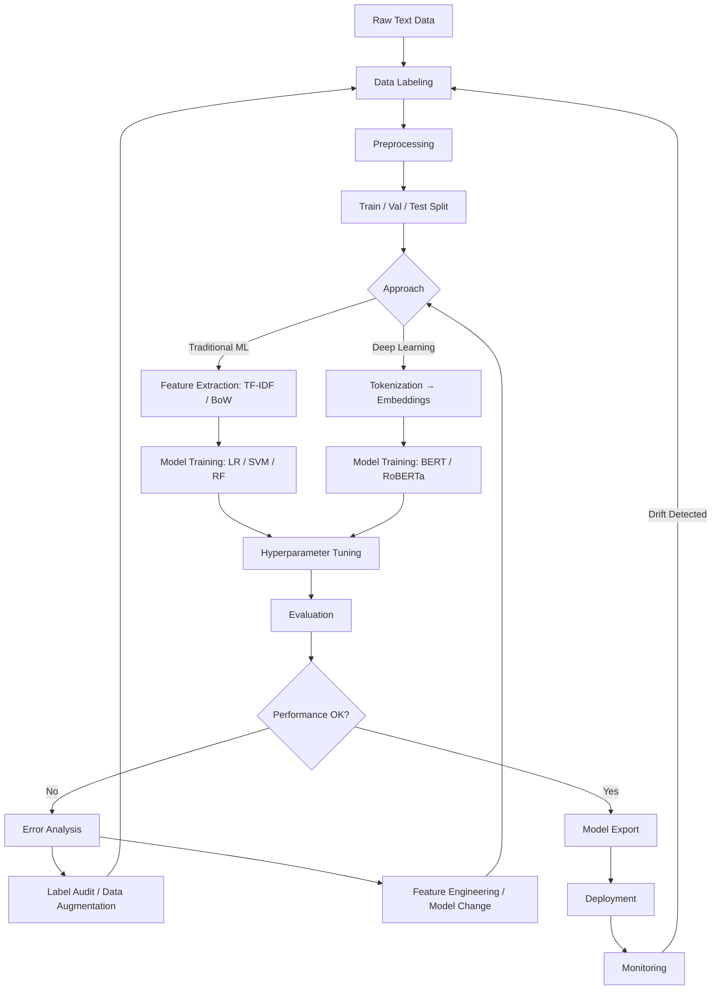
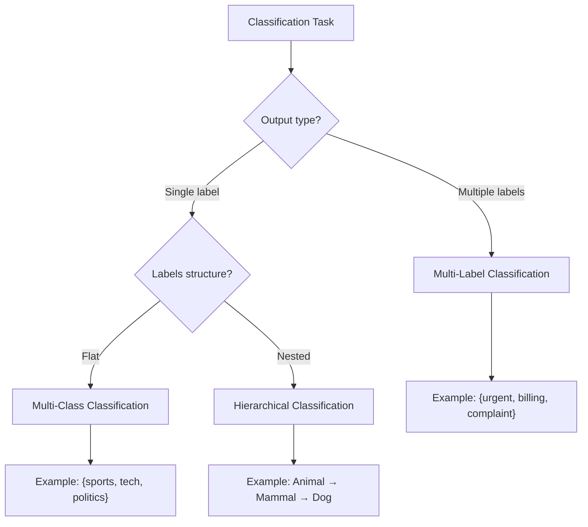
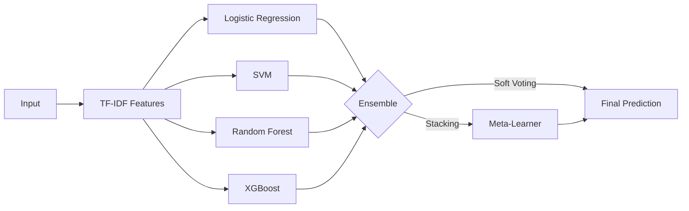
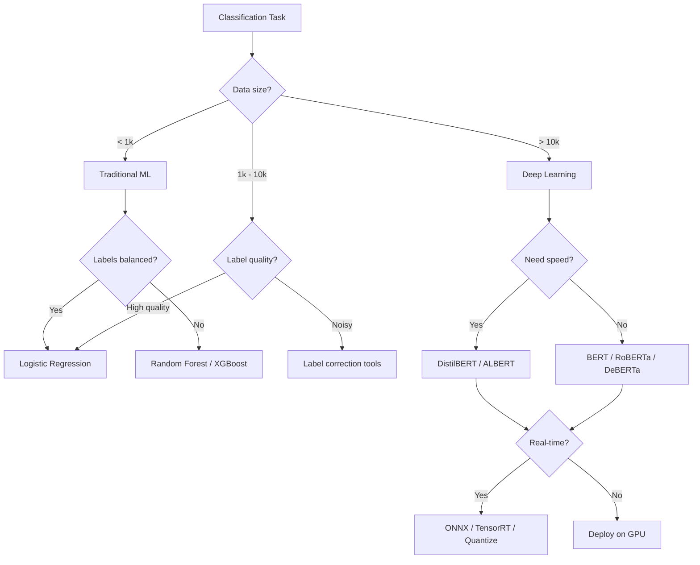

# Text Classification

**Links**: [[NLP Pipeline Design]] | [[BERT and Encoder Models]] | [[Tokenization]] | [[Pre-training and Fine-tuning]] | [[Prompt Engineering]] | [[Evaluation of RAG Systems]]

## What is Text Classification?

Text classification assigns predefined categories to text documents. It's one of the most widely applied NLP tasks.

## Common Applications

| Task | Input | Output |
|------|-------|--------|
| Spam detection | Email | spam / not-spam |
| Sentiment analysis | Review | positive / negative / neutral |
| Topic labeling | Article | sports, tech, politics |
| Intent detection | User query | book_flight, cancel_order |
| Language ID | Text | en, fr, de, es |
| Urgency triage | Support ticket | low, medium, critical |

## Approaches

### Traditional ML

```python
from sklearn.feature_extraction.text import TfidfVectorizer
from sklearn.linear_model import LogisticRegression

vectorizer = TfidfVectorizer(max_features=10000, ngram_range=(1, 2))
X = vectorizer.fit_transform(documents)
model = LogisticRegression()
model.fit(X, labels)
```

Fast, cheap, interpretable. Best for simple categories and limited data.

### Deep Learning (BERT)

```python
from transformers import AutoTokenizer, AutoModelForSequenceClassification
import torch

model = AutoModelForSequenceClassification.from_pretrained(
    "bert-base-uncased", num_labels=3
)
tokenizer = AutoTokenizer.from_pretrained("bert-base-uncased")

inputs = tokenizer(texts, padding=True, truncation=True, return_tensors="pt")
outputs = model(**inputs)
predictions = torch.argmax(outputs.logits, dim=1)
```

Best for complex semantics, but requires more data and compute.

## Evaluation

| Metric | Formula | When |
|--------|---------|------|
| Accuracy | correct / total | Balanced classes |
| Precision | TP / (TP + FP) | Minimize false positives |
| Recall | TP / (TP + FN) | Minimize false negatives |
| F1 | 2 × P × R / (P + R) | Imbalanced classes |

**Next**: [[Sentiment Analysis]] — Understanding opinions in text

---

## Text Classification Workflow



## Data Labeling Strategies

### Manual Labeling

| Method | Quality | Cost | Speed | Best For |
|--------|---------|------|-------|----------|
| Expert annotation | Very High | $$$ | Slow | Medical, legal |
| Crowdsourcing | Medium | $ | Fast | General topics |
| Active learning | High | $$ | Medium | Large unlabeled pool |
| Programmatic (weak supervision) | Medium | $ | Very fast | High-volume noisy labels |
| LLM labeling | Medium-High | $$ | Fast | Zero-shot, general |

### Active Learning

```python
import numpy as np
from sklearn.ensemble import RandomForestClassifier
from modAL.models import ActiveLearner

class ActiveLearningPipeline:
    def __init__(self, X_pool, y_pool_unlabeled, estimator=None):
        self.X_pool = X_pool
        self.y_pool = y_pool_unlabeled  # all -1 initially
        if estimator is None:
            estimator = RandomForestClassifier()
        self.learner = ActiveLearner(
            estimator=estimator,
            query_strategy=self.uncertainty_sampling,
        )

    def uncertainty_sampling(self, classifier, X):
        probs = classifier.predict_proba(X)
        uncertainty = 1 - np.max(probs, axis=1)
        return np.argmax(uncertainty)

    def active_learning_loop(self, n_queries=100, batch_size=10):
        queried_indices = []
        for i in range(n_queries // batch_size):
            query_idx, _ = self.learner.query(self.X_pool, n_instances=batch_size)
            # Human labels these
            self.learner.teach(
                self.X_pool[query_idx],
                self.y_true[query_idx],  # from oracle
            )
            queried_indices.extend(query_idx)
            print(f"Round {i+1}: labeled {len(queried_indices)} samples")
        return queried_indices
```

### Weak Supervision (Snorkel)

```python
# Defining labeling functions
import re

def label_positive(text):
    return 1 if any(w in text.lower() for w in ["amazing", "excellent", "love"]) else -1

def label_negative(text):
    return 0 if any(w in text.lower() for w in ["terrible", "awful", "hate"]) else -1

def label_has_exclamation(text):
    return 1 if "!" in text else -1

def label_short_text(text):
    return -1 if len(text.split()) < 5 else -1  # abstain
```

## Multi-Class vs Multi-Label vs Hierarchical



| Aspect | Multi-Class | Multi-Label | Hierarchical |
|--------|-------------|-------------|--------------|
| Labels per sample | Exactly 1 | 0 to many | 1 (any level) |
| Output activation | Softmax | Sigmoid | Softmax per level |
| Loss function | Cross-entropy | BCE | Sum of CE |
| Example | News category | Tags/categories | Taxonomy |
| Evaluation | Accuracy, F1 | Macro F1, hamming | Precision@k |
| Model head | Single linear | Multi-head | Multi-head |

```python
import torch.nn as nn

# Multi-class head
class MultiClassHead(nn.Module):
    def __init__(self, hidden_dim, num_classes):
        super().__init__()
        self.classifier = nn.Linear(hidden_dim, num_classes)

    def forward(self, x):
        return torch.softmax(self.classifier(x), dim=-1)

# Multi-label head
class MultiLabelHead(nn.Module):
    def __init__(self, hidden_dim, num_labels):
        super().__init__()
        self.classifier = nn.Linear(hidden_dim, num_labels)

    def forward(self, x):
        return torch.sigmoid(self.classifier(x))

# Hierarchical head
class HierarchicalHead(nn.Module):
    def __init__(self, hidden_dim, hierarchy):
        super().__init__()
        self.classifiers = nn.ModuleList([
            nn.Linear(hidden_dim, num_classes)
            for num_classes in hierarchy
        ])

    def forward(self, x):
        return [torch.softmax(c(x), dim=-1) for c in self.classifiers]
```

## Zero-Shot Text Classification

```python
from transformers import pipeline

class ZeroShotClassifier:
    def __init__(self, model="facebook/bart-large-mnli"):
        self.classifier = pipeline("zero-shot-classification", model=model)

    def classify(self, text: str, candidate_labels: list, multi_label=False):
        result = self.classifier(
            text,
            candidate_labels,
            multi_label=multi_label,
        )
        return result

classifier = ZeroShotClassifier()

# Single label
result = classifier.classify(
    "The stock market hit an all-time high today",
    ["finance", "sports", "technology", "politics"],
)
# {'labels': ['finance', 'technology', 'politics', 'sports'],
#  'scores': [0.85, 0.08, 0.05, 0.02]}

# Multi-label
result = classifier.classify(
    "Python is great for data science and web development",
    ["programming", "data science", "cooking", "travel"],
    multi_label=True,
)
```

| Approach | Model | Accuracy | Inferences/sec | Cost |
|----------|-------|----------|----------------|------|
| NLI-based | BART-large-MNLI | 85-92% | ~20 | Medium |
| NLI-based | DeBERTa-large-MNLI | 88-95% | ~10 | High |
| Embedding similarity | SBERT + label emb | 80-88% | ~1000 | Low |
| LLM prompt | GPT-4 | 90-97% | ~2 | Very High |

## Dealing with Label Imbalance

### Techniques Comparison

```python
import torch
import torch.nn as nn
import numpy as np
from sklearn.utils.class_weight import compute_class_weight
from imblearn.over_sampling import RandomOverSampler, SMOTE
from imblearn.under_sampling import RandomUnderSampler

def get_class_weights(labels):
    classes = np.unique(labels)
    weights = compute_class_weight("balanced", classes=classes, y=labels)
    return {c: w for c, w in zip(classes, weights)}

class FocalLoss(nn.Module):
    def __init__(self, alpha=None, gamma=2.0):
        super().__init__()
        self.alpha = alpha
        self.gamma = gamma

    def forward(self, inputs, targets):
        ce_loss = nn.functional.cross_entropy(inputs, targets, reduction="none")
        pt = torch.exp(-ce_loss)
        focal_loss = ((1 - pt) ** self.gamma * ce_loss)
        if self.alpha is not None:
            focal_loss = self.alpha[targets] * focal_loss
        return focal_loss.mean()
```

| Technique | Pros | Cons | Best When |
|-----------|------|------|-----------|
| Class weights | No data change | May cause underfitting | Any classifier |
| Oversampling | Simple | Overfitting risk | Small datasets |
| Undersampling | Fast | Loses data | Very large datasets |
| SMOTE | Creates synthetic | Text needs vector space | BoW/TF-IDF models |
| Focal loss | Focuses on hard | Tuning gamma needed | Deep learning |
| Data augmentation | Diverse samples | Quality control | Transformers |

## Threshold Tuning

```python
import numpy as np
from sklearn.metrics import f1_score, precision_recall_curve

def find_optimal_threshold(y_true, y_probs, metric="f1"):
    precisions, recalls, thresholds = precision_recall_curve(y_true, y_probs)

    if metric == "f1":
        f1_scores = 2 * (precisions * recalls) / (precisions + recalls + 1e-9)
        optimal_idx = np.argmax(f1_scores)
        return thresholds[optimal_idx], f1_scores[optimal_idx]

    elif metric == "youden":
        return thresholds[np.argmax(precisions[:-1] + recalls[:-1] - 1)]

    return 0.5

# Multi-class threshold tuning
def tune_thresholds_per_class(y_true, y_probs, classes):
    thresholds = {}
    for i, cls in enumerate(classes):
        y_true_binary = (y_true == i).astype(int)
        y_probs_binary = y_probs[:, i]
        best_threshold, best_f1 = find_optimal_threshold(y_true_binary, y_probs_binary)
        thresholds[cls] = {"threshold": best_threshold, "best_f1": best_f1}
    return thresholds
```

| Class | Default (0.5) F1 | Tuned Threshold | Tuned F1 | Improvement |
|------|------------------|-----------------|----------|-------------|
| Rare A | 0.45 | 0.28 | 0.62 | +17% |
| Common B | 0.91 | 0.53 | 0.92 | +1% |
| Medium C | 0.78 | 0.42 | 0.83 | +5% |

## Interpretability — LIME & SHAP

### LIME

```python
import lime
import lime.lime_text
from sklearn.pipeline import Pipeline

class LimeExplainer:
    def __init__(self, pipeline: Pipeline, class_names: list):
        self.explainer = lime.lime_text.LimeTextExplainer(class_names=class_names)
        self.pipeline = pipeline

    def explain(self, text: str, num_features: int = 10):
        exp = self.explainer.explain_instance(
            text,
            self.pipeline.predict_proba,
            num_features=num_features,
        )
        return exp.as_list()

    def show_html(self, text: str):
        exp = self.explainer.explain_instance(text, self.pipeline.predict_proba)
        exp.show_in_notebook(text=True)

lime_exp = LimeExplainer(
    pipeline=Pipeline([("tfidf", TfidfVectorizer()), ("clf", LogisticRegression())]),
    class_names=["negative", "positive"],
)
print(lime_exp.explain("This product exceeded my expectations!"))
```

### SHAP

```python
import shap
from transformers import AutoTokenizer, AutoModelForSequenceClassification

class ShapExplainer:
    def __init__(self, model_name: str, num_labels: int):
        self.tokenizer = AutoTokenizer.from_pretrained(model_name)
        self.model = AutoModelForSequenceClassification.from_pretrained(model_name, num_labels=num_labels)
        self.explainer = shap.Explainer(self._predict, self.tokenizer)

    def _predict(self, texts):
        inputs = self.tokenizer(texts, padding=True, truncation=True, return_tensors="pt")
        with torch.no_grad():
            logits = self.model(**inputs).logits
        return torch.softmax(logits, dim=-1).numpy()

    def explain(self, text: str):
        shap_values = self.explainer([text])
        return shap_values
```

## Error Analysis

```python
import pandas as pd
import seaborn as sns
from sklearn.metrics import confusion_matrix, classification_report
import matplotlib.pyplot as plt

class ErrorAnalyzer:
    def __init__(self, y_true, y_pred, texts, class_names):
        self.y_true = y_true
        self.y_pred = y_pred
        self.texts = texts
        self.class_names = class_names

    def confusion_matrix(self):
        cm = confusion_matrix(self.y_true, self.y_pred)
        cm_df = pd.DataFrame(cm, index=self.class_names, columns=self.class_names)
        print(cm_df)

    def misclassification_report(self):
        errors = []
        for i, (true, pred, text) in enumerate(zip(self.y_true, self.y_pred, self.texts)):
            if true != pred:
                errors.append({
                    "index": i,
                    "true": self.class_names[true] if true < len(self.class_names) else true,
                    "predicted": self.class_names[pred] if pred < len(self.class_names) else pred,
                    "text": text[:200],
                })
        return pd.DataFrame(errors)

    def error_by_length(self, max_len=500):
        errors_df = self.misclassification_report()
        errors_df["text_length"] = errors_df["text"].str.len()
        bins = pd.cut(errors_df["text_length"], bins=10, labels=[f"{i*max_len//10}-{(i+1)*max_len//10}" for i in range(10)])
        return errors_df.groupby(bins).size()

    def class_wise_errors(self):
        report = classification_report(
            self.y_true, self.y_pred,
            target_names=self.class_names,
            output_dict=True,
        )
        return pd.DataFrame(report).T
```

## Ensemble Methods

```python
import numpy as np
from sklearn.ensemble import VotingClassifier, StackingClassifier

# Voting Ensemble (hard / soft)
from sklearn.linear_model import LogisticRegression
from sklearn.svm import SVC
from sklearn.ensemble import RandomForestClassifier

class TextEnsemble:
    def __init__(self):
        self.models = {
            "lr": LogisticRegression(max_iter=1000),
            "svm": SVC(probability=True),
            "rf": RandomForestClassifier(n_estimators=200),
        }
        self.voting = VotingClassifier(
            estimators=[(name, model) for name, model in self.models.items()],
            voting="soft",
        )

    def ensemble_predict(self, X):
        # Individual predictions
        predictions = {}
        for name, model in self.models.items():
            predictions[name] = model.predict_proba(X)

        # Average probabilities
        avg_probs = np.mean(list(predictions.values()), axis=0)
        return np.argmax(avg_probs, axis=1)
```



## Model Serving & Deployment

### Batch Inference

```python
def batch_predict(model, texts, batch_size=64):
    results = []
    for i in range(0, len(texts), batch_size):
        batch = texts[i : i + batch_size]
        batch_results = model(batch)
        results.extend(batch_results)
    return results
```

### Real-Time API

```python
from fastapi import FastAPI, HTTPException
from pydantic import BaseModel
import uvicorn

app = FastAPI(title="Text Classification API")

class PredictRequest(BaseModel):
    text: str
    threshold: float = 0.5

class PredictResponse(BaseModel):
    label: str
    confidence: float
    probabilities: dict

@app.post("/predict", response_model=PredictResponse)
async def predict(request: PredictRequest):
    if not request.text.strip():
        raise HTTPException(status_code=400, detail="Empty text")
    logits = model.predict_proba([request.text])[0]
    pred_idx = np.argmax(logits)
    confidence = logits[pred_idx]

    if confidence < request.threshold:
        return PredictResponse(
            label="uncertain",
            confidence=confidence,
            probabilities={},
        )

    return PredictResponse(
        label=class_names[pred_idx],
        confidence=confidence,
        probabilities={name: float(p) for name, p in zip(class_names, logits)},
    )

if __name__ == "__main__":
    uvicorn.run(app, host="0.0.0.0", port=8000)
```

| Deployment | Latency | Throughput | Cost | When to Use |
|-----------|---------|------------|------|-------------|
| Batch (scheduled) | Hours | Very high | Low | Overnight classification |
| Real-time API | <100ms | 100s/sec | Medium | Interactive apps |
| Streaming | <1s | Thousands/sec | High | Real-time monitoring |
| Edge/on-device | <10ms | Fast | Minimal | Mobile, offline |
| Serverless | <1s | Variable | Pay-per-use | Low traffic |

## Monitoring & Drift Detection

```python
from scipy.stats import wasserstein_distance
from alibi_detect.cd import ChiSquareDrift
import numpy as np

class Monitor:
    def __init__(self, reference_probs: np.ndarray, threshold: float = 0.05):
        self.reference = reference_probs
        self.threshold = threshold

    def accuracy_drift(self, y_true: np.ndarray, y_pred: np.ndarray) -> float:
        return 1.0 - np.mean(y_true == y_pred)

    def data_drift(self, current_probs: np.ndarray) -> dict:
        cd = ChiSquareDrift(self.reference, p_val=self.threshold)
        result = cd.predict(current_probs)
        return {
            "drift_detected": bool(result["data"]["is_drift"]),
            "p_value": float(result["data"]["p_val"]),
        }

    def label_distribution_shift(self, current_labels: np.ndarray) -> dict:
        ref_dist = np.bincount(self.reference.argmax(axis=1), minlength=10)
        cur_dist = np.bincount(current_labels, minlength=10)
        ref_dist = ref_dist / ref_dist.sum()
        cur_dist = cur_dist / cur_dist.sum()

        ws_dist = wasserstein_distance(ref_dist, cur_dist)
        return {
            "wasserstein_distance": ws_dist,
            "shift_detected": ws_dist > 0.1,
            "reference_distribution": ref_dist.tolist(),
            "current_distribution": cur_dist.tolist(),
        }
```

### Dashboard Metrics

| Metric | Method | Alert Condition |
|--------|--------|-----------------|
| Accuracy | Compare pred vs ground truth | < 90% baseline |
| Data drift | Feature distribution (PSI) | PSI > 0.2 |
| Label drift | Label proportion change | KL > 0.1 |
| Prediction confidence | Mean softmax score | < 0.7 |
| Latency p99 | Inference time | > 200ms |
| Error rate | Failed predictions | > 1% |

## Decision Trees for Algorithm Selection



## Practical Checklist

- [ ] Define clear label taxonomy with examples
- [ ] Measure inter-annotator agreement during labeling
- [ ] Split data: train 80% / val 10% / test 10%
- [ ] Establish baseline (majority class, simple TF-IDF)
- [ ] Handle label imbalance (weighted loss or sampling)
- [ ] Tune classification threshold on validation set
- [ ] Run error analysis to find systematic issues
- [ ] Test both traditional ML and transformer approaches
- [ ] Export model to ONNX for faster inference
- [ ] Set up monitoring before production deployment
- [ ] Document edge cases and known failure modes