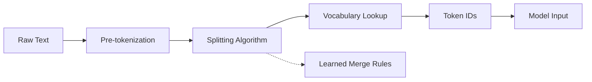

# Tokenization

## What is Tokenization?

Tokenization splits text into smaller units (tokens) that a model can process. It is the first step in any NLP pipeline — the quality of tokenization directly impacts vocabulary size, out-of-vocabulary (OOV) handling, and downstream task performance.



## Tokenization Methods Comparison

| Method | Example | Vocab Size | OOV Handling | Language Agnostic |
|--------|---------|------------|--------------|-------------------|
| **Word-level** | "playing" → ["playing"] | 100k-500k | No (UNK token) | No |
| **Character-level** | "playing" → ["p","l","a","y","i","n","g"] | ~100-200 | Yes | Yes |
| **BPE (subword)** | "playing" → ["play", "ing"] | 30k-100k | Yes | Mostly |
| **WordPiece** | "playing" → ["play", "##ing"] | 30k | Yes | Mostly |
| **Unigram** | Probabilistic subword | 30k-50k | Yes | Mostly |
| **SentencePiece** | Raw bytes → subword | 32k-256k | Yes | Yes (no pretokenizer) |

## Byte-Pair Encoding (BPE)

BPE is a data compression algorithm adapted for tokenization. It iteratively merges the most frequent pair of adjacent tokens:

1. Start with individual characters as tokens
2. Count frequency of every adjacent pair
3. Merge the most frequent pair into a new token
4. Repeat step 2-3 until target vocabulary size is reached

### BPE Example

```
Initial tokens: ["l", "o", "w", "e", "r", "l", "o", "w"]
Counts: ("l","o")=2, ("o","w")=2, ("w","e")=1, ("e","r")=1, ...
Merge "l"+"o" → ["lo", "w", "e", "r", "lo", "w"]
Counts: ("lo","w")=2, ("w","e")=1, ("e","r")=1, ...
Merge "lo"+"w" → ["low", "e", "r", "low"]
Counts: ("low","e")=1, ("e","r")=1, ("r","low")=1
Merge "r"+"low" → ["low", "er", "low"]
```

Final vocabulary: original chars + learned merges. At inference, the same merges are applied greedily to new text.

## WordPiece

WordPiece (used by BERT) is similar to BPE but merges pairs based on **likelihood increase** rather than frequency:

$$\text{score}(a, b) = \frac{\text{count}(ab)}{\text{count}(a) \cdot \text{count}(b)}$$

It also uses the `##` prefix to indicate subword continuation (e.g., "play" + "##ing").

## SentencePiece

SentencePiece treats the input as a raw byte sequence, removing the need for language-specific pre-tokenization (whitespace splitting, etc.). It supports both BPE and Unigram algorithms and is used by T5, XLNet, and ALBERT. It handles all languages uniformly and can even tokenize without spaces (e.g., Japanese, Chinese).

## Vocabulary Size Trade-offs

| Vocab Size | Pros | Cons |
|------------|------|------|
| **Small (8k-16k)** | Compact model, faster inference | Longer sequences, harder to represent rare words |
| **Medium (30k-50k)** | Good balance, common in BERT/GPT | Moderate embedding table size |
| **Large (100k+)** | Short sequences, rare words preserved | Large embeddings, risk of data sparsity, more parameters |
| **Character-level** | No OOV, universal | Very long sequences, loses word-level meaning |

## Hugging Face Tokenizer

```python
from transformers import AutoTokenizer

tokenizer = AutoTokenizer.from_pretrained("bert-base-uncased")

tokens = tokenizer("Hello, how are you?")
print(tokens.input_ids)
# [101, 7592, 1010, 2129, 2024, 2017, 1029, 102]
#  [CLS] Hello  ,   how   are   you    ?  [SEP]

# Decode back
text = tokenizer.decode(tokens.input_ids)
# "[CLS] hello, how are you? [SEP]"
```

## Special Tokens

| Token | BERT | GPT | Meaning |
|-------|------|-----|---------|
| `[CLS]` | ✅ | ❌ | Start of sequence (classification embedding) |
| `[SEP]` | ✅ | ❌ | Separator between sentences |
| `[PAD]` | ✅ | ✅ | Padding to equalize batch lengths |
| `[UNK]` | ✅ | ✅ | Unknown token (not in vocabulary) |
| `[MASK]` | ✅ | ❌ | Masked token for MLM pre-training |
| `<|endoftext|>` | ❌ | ✅ | End of sequence in GPT |
| `<|im_start|>` | ❌ | ✅ | Start of chat message (ChatGPT) |

**Links**: [[NLP Pipeline Design]] | [[Pre-training and Fine-tuning]] | [[BERT and Encoder Models]] | [[GPT and Decoder Models]] | [[Transformer Architecture]]

**Next**: [[Attention Mechanism]] — The key idea
