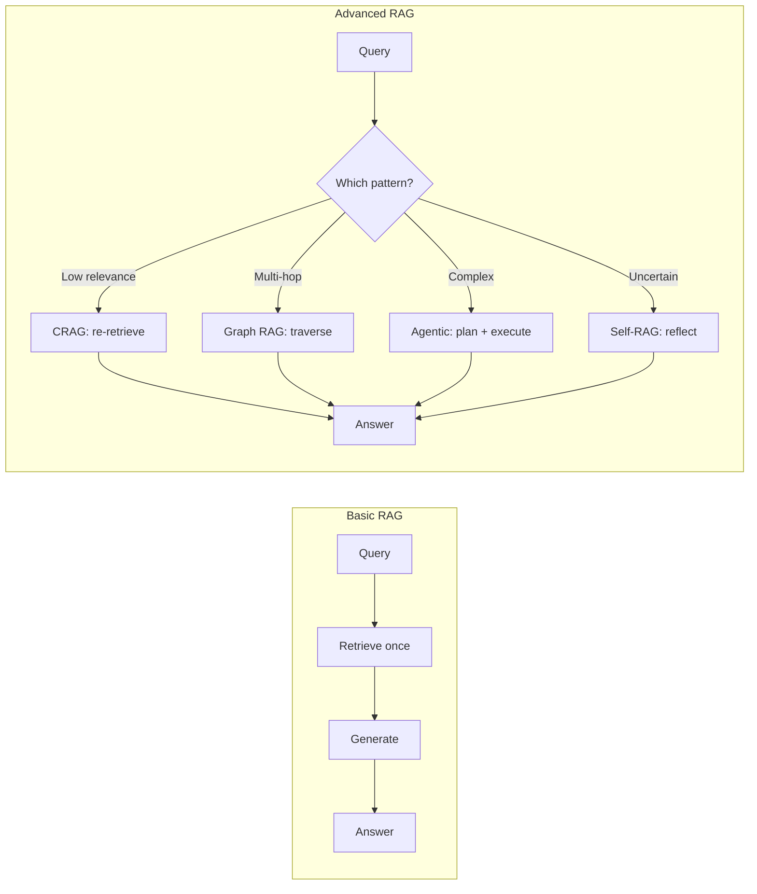
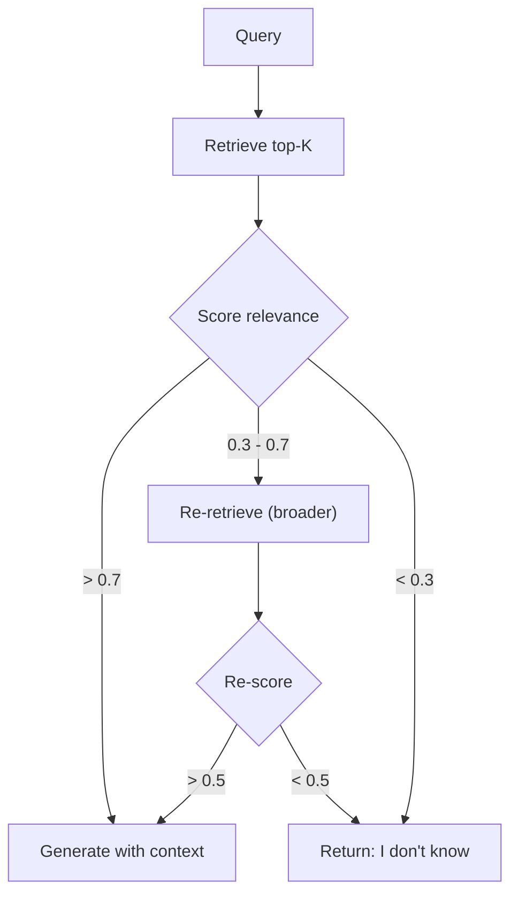
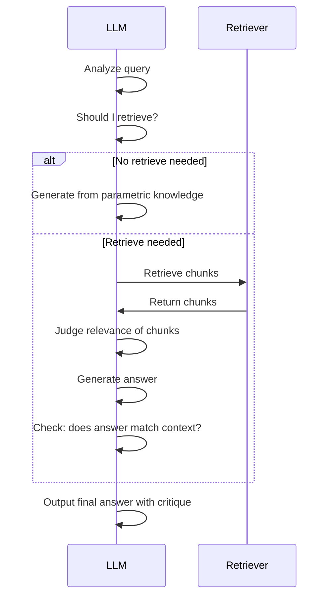
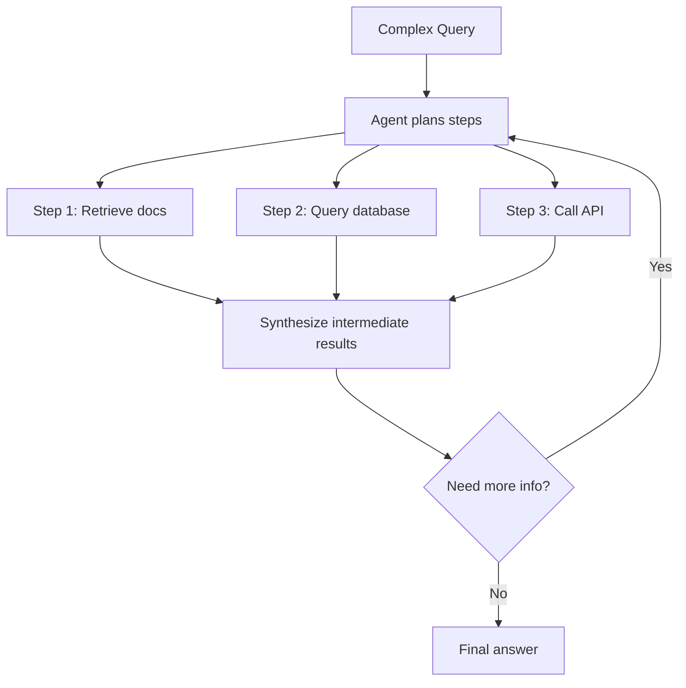
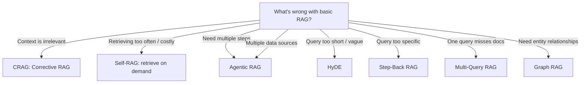

# Advanced RAG Patterns

**Links**: [[RAG Architecture]] | [[Prompt Engineering for RAG]] | [[Retrieval Strategies]] | [[Reranking]] | [[Evaluation of RAG Systems]] | [[LLM Agents Framework]] | [[Graph RAG]] | [[Agentic RAG]]

---

## Why Basic RAG Isn't Enough

Basic RAG (retrieve → generate) fails on common real-world scenarios:

| Scenario | Basic RAG Failure | Advanced Pattern |
|----------|------------------|------------------|
| Query mentions a date ("events in 2023") | Retrieved docs might talk about 2024 | **HyDE**: hallucinate a hypothetical doc from 2023, then retrieve |
| Query needs multi-hop ("founder of company that built GPT") | One retrieval can't connect two hops | **Graph RAG**: traverse entity relationships |
| Retrieved docs are irrelevant | LLM generates hallucination from bad context | **CRAG**: check relevance, re-retrieve if low |
| Query is ambiguous ("best framework") | Retrieved docs are scattered | **Agentic RAG**: decompose into sub-queries, plan |
| LLM needs to verify its own answer | No self-reflection, may hallucinate | **Self-RAG**: retrieve on demand, reflect on output |



---

## 1. Corrective RAG (CRAG)

### The Problem

Basic RAG retrieves once and hopes for the best. If the retrieved context is irrelevant, the LLM hallucinates confident-sounding nonsense.

### How CRAG Works

```
1. Retrieve top-K chunks
2. Score each chunk for relevance to the query (0.0 - 1.0)
3. If max score > threshold T1 → generate using those chunks
4. If max score < T1 but > T2 → re-retrieve with broader search
5. If max score < T2 → return "I don't know"
```



### Implementation

```python
from sentence_transformers import CrossEncoder

relevance_model = CrossEncoder("cross-encoder/ms-marco-MiniLM-L6-v2")

def corrective_rag(query, retriever, llm, threshold=0.7, fallback_threshold=0.3):
    chunks = retriever.retrieve(query, k=5)
    
    # Score relevance using cross-encoder (more accurate than dot product)
    pairs = [(query, chunk) for chunk in chunks]
    scores = relevance_model.predict(pairs)
    max_score = max(scores)
    
    if max_score >= threshold:
        return llm.generate(query, context=chunks)
    
    elif max_score >= fallback_threshold:
        # Broader retrieval: remove filters, increase k
        broader = retriever.retrieve(query, k=10, filters=None)
        broader_scores = relevance_model.predict([(query, c) for c in broader])
        if max(broader_scores) >= threshold * 0.8:
            return llm.generate(query, context=broader)
        return "I don't have enough information."
    
    else:
        return "I don't have enough information."
```

### When to Use CRAG

- **High-stakes apps** where hallucination is costly (medical, legal, finance)
- **Noisy document collections** where many irrelevant docs exist
- **User-facing chatbots** where "I don't know" is better than a wrong answer

### CRAG vs Self-RAG

| Aspect | CRAG | Self-RAG |
|--------|------|----------|
| Who judges relevance? | External classifier (cross-encoder) | The LLM itself |
| When to retrieve? | Always, then correct if bad | Only when LLM decides it needs info |
| Reflection | No | Yes (LLM critiques own output) |
| Complexity | Lower | Higher |
| Reliability | Higher (dedicated judge) | Depends on LLM's self-awareness |

---

## 2. Self-RAG

### The Problem

RAG retrieves on every query, even for simple questions the LLM already knows. This wastes time and money, and occasionally injects irrelevant context.

### How Self-RAG Works

The LLM is trained (or prompted) with special tokens to decide:
- `<retrieve>` — I need external knowledge
- `<no-retrieve>` — I can answer from memory
- `<relevant>` — The retrieved context is useful
- `<irrelevant>` — Ignore the retrieved context
- `<support>` — My answer is supported by the context
- `<no-support>` — My answer contradicts the context



### Implementation (via prompting — no fine-tuning needed)

```python
def self_rag(query, retriever, llm):
    # Step 1: Does the LLM think retrieval is needed?
    need_retrieval = llm.generate(
        f"Query: {query}\n\nDo you need to look up external information to answer this? Yes/No."
    )
    
    if "no" in need_retrieval.lower():
        return llm.generate(query)
    
    # Step 2: Retrieve
    chunks = retriever.retrieve(query, k=3)
    
    # Step 3: Have the LLM judge each chunk
    relevant_chunks = []
    for chunk in chunks:
        judgement = llm.generate(
            f"Query: {query}\n\nContext: {chunk}\n\nIs this context relevant to answering the query? Yes/No."
        )
        if "yes" in judgement.lower():
            relevant_chunks.append(chunk)
    
    # Step 4: Generate with relevant chunks
    answer = llm.generate(query, context="\n".join(relevant_chunks))
    
    # Step 5: Self-reflection — does the answer match the context?
    reflection = llm.generate(
        f"Query: {query}\nAnswer: {answer}\nContext: {chunks}\n\n"
        f"Is the answer fully supported by the context? If not, explain what's unsupported."
    )
    
    return answer, reflection
```

### When to Use Self-RAG

- **Cost-sensitive apps** (reducing unnecessary retrieval saves $)
- **Latency-sensitive apps** (skip retrieval for simple queries)
- **Quality-critical apps** (the reflection step catches errors)

---

## 3. Agentic RAG

### The Problem

Complex queries need multiple steps: decompose the question, retrieve different types of data, compute aggregations, then synthesize.

### How Agentic RAG Works

An LLM-powered agent plans a sequence of tool calls, executes them, and iterates based on results.



### Implementation

```python
class AgenticRAG:
    def __init__(self, vector_db, sql_db, llm):
        self.vector_db = vector_db
        self.sql_db = sql_db
        self.llm = llm
        self.tools = {
            "search_docs": self.search_docs,
            "query_database": self.query_database,
            "calculate": self.calculate,
            "web_search": self.web_search,
        }
    
    def search_docs(self, query, k=5):
        return self.vector_db.similarity_search(query, k=k)
    
    def query_database(self, sql):
        return self.sql_db.run(sql)
    
    def calculate(self, expression):
        return eval(expression)
    
    def web_search(self, query):
        # ... external API call
        pass
    
    def answer(self, query):
        # The agent plans and executes tool calls
        # In practice, use LangChain, CrewAI, or similar
        plan = self.llm.generate(
            f"Query: {query}\nTools: {list(self.tools.keys())}\n"
            f"Plan the steps needed. Return a JSON array of tool calls."
        )
        
        results = {}
        for step in parse_plan(plan):
            tool = self.tools[step["tool"]]
            results[step["id"]] = tool(**step["args"])
        
        return self.llm.generate(
            f"Query: {query}\n\nResults: {results}\n\nAnswer the query."
        )

# Usage
agent = AgenticRAG(vector_db, sql_db, llm)
answer = agent.answer("What was the total revenue last quarter for our top 3 products?")
# Steps: query SQL for top products → search docs for each product → calculate total
```

### Patterns Within Agentic RAG

| Sub-pattern | Description | Use Case |
|-------------|-------------|----------|
| **Router** | LLM routes query to the right tool | "Calculate X" → calculator, "Find X" → vector DB |
| **Decomposer** | Split query into sub-questions | "Compare A and B" → search A, search B, then compare |
| **ReACT** | Reason + Act loop with thought traces | Multi-step reasoning with intermediate observations |
| **Plan-and-Execute** | Full plan first, then execute step by step | Complex data analysis pipelines |

---

## 4. HyDE (Hypothetical Document Embeddings)

### The Problem

The query and the documents live in different semantic spaces. A short query ("cat videos") is far from a long document ("comprehensive guide to recording feline behavior for YouTube"). Direct embedding similarity is suboptimal.

### How HyDE Works

```
Query: "cat videos"     → LLM generates hypothetical answer
                          "A video showing cats playing, sleeping, and meowing..."

Hypothetical answer is MORE similar to actual documents than the query is:
  query_embedding · doc_embedding      = 0.65
  hyde_embedding · doc_embedding       = 0.85  ← better!
```

```python
def hyde_search(query, llm, embedder, vector_db, k=5):
    # Step 1: Generate a hypothetical document
    hypo_doc = llm.generate(
        f"Write a passage that would answer: {query}"
    )
    
    # Step 2: Embed the hypothetical document
    hypo_vec = embedder.embed(hypo_doc)
    
    # Step 3: Search using the hypothetical document's embedding
    results = vector_db.search(hypo_vec, top_k=k)
    return results
```

### When HyDE Helps

| Query Type | Without HyDE | With HyDE |
|-----------|-------------|-----------|
| Short queries ("Python async") | Low similarity — keyword mismatch | HyDE generates full doc about async |
| Abstract queries ("best practices") | Matches generic "best practice" docs | HyDE adds domain-specific context |
| Questions ("How do I sort in SQL?") | Poor match to answer docs | HyDE generates an answer, matches perfectly |

### When HyDE Hurts

- **Factual precision** — the hypothetical document might contain errors, leading retrieval astray
- **Out-of-domain queries** — the LLM generates a bad hypothetical, making things worse
- **Latency** — adds one LLM call before retrieval (200-500ms)

---

## 5. Step-Back Prompting + RAG

### The Problem

Some queries are too specific for direct retrieval. The documents you need are about the *general concept*, not the specific detail.

```
Query: "Why did the 2023 physics Nobel go to attosecond physics?"
Better to retrieve: "What is attosecond physics?" (the general concept)
Then answer: "Because attosecond physics enables observing electron motion..."
```

### How It Works

```python
def step_back_rag(query, retriever, llm):
    # Step back: ask a more general question
    step_back = llm.generate(
        f"Given the specific question: '{query}'\n"
        f"What is the more general concept or background knowledge needed to answer this?"
    )
    
    # Retrieve on BOTH the original query and the step-back query
    specific_docs = retriever.retrieve(query, k=3)
    general_docs = retriever.retrieve(step_back, k=3)
    
    # Combine and generate
    context = specific_docs + general_docs
    return llm.generate(query, context=context)
```

---

## 6. Multi-Query RAG

### The Problem

A single query might miss the optimal retrieval because the "right" search terms are ambiguous. Different phrasings match different documents.

### How It Works

```python
def multi_query_rag(query, retriever, llm, n_queries=3):
    # Generate multiple perspectives on the same query
    variations = llm.generate(
        f"Generate {n_queries} different phrasings of the query: '{query}'\n"
        f"Each should emphasize a different aspect."
    )
    
    all_docs = []
    for q in variations:
        all_docs.extend(retriever.retrieve(q, k=5))
    
    # Deduplicate and rerank
    unique_docs = deduplicate(all_docs)
    reranked = rerank(query, unique_docs)
    
    return llm.generate(query, context=reranked[:5])
```

---

## Pattern Selection Guide



---

## Combining Patterns

These patterns compose. Here are common combinations:

| Combination | Use Case |
|-------------|----------|
| **HyDE + CRAG** | Short user queries with hallucination-critical answers |
| **Agentic + Graph RAG** | Complex multi-hop questions about connected entities |
| **Multi-Query + Self-RAG** | Broad queries where you want to minimize retrieval calls |
| **Step-Back + Agentic** | Deep research questions requiring background knowledge then specific docs |

```python
# Example: HyDE + CRAG + Self-Reflection combined
def advanced_rag_pipeline(query):
    hyde_docs = hyde_search(query)          # Better retrieval via hypothetical doc
    relevant = filter_relevance(query, hyde_docs)  # CRAG: check relevance
    if not relevant:
        relevant = re_retrieve_broader(query)
    answer = generate(query, relevant)
    reflection = self_reflect(query, answer, relevant)  # Self-RAG reflection
    if "unsupported" in reflection:
        return generate(query, relevant, instruction="Be more careful with facts")
    return answer
```

---

## Key Takeaways

1. **Basic RAG** retrieves once and generates — fails on ambiguity, irrelevance, multi-hop needs
2. **CRAG** adds a relevance checkpoint and re-retrieval loop
3. **Self-RAG** lets the LLM decide when to retrieve and reflect on its own output
4. **Agentic RAG** decomposes complex queries into multi-tool plans
5. **HyDE** bridges the query-document gap by generating hypothetical documents
6. **Step-Back RAG** retrieves general context when queries are too specific
7. **Multi-Query RAG** generates multiple query variations for broader coverage
8. Patterns **compose** — use HyDE + CRAG + Self-RAG together for production systems

**Next**: [[Evaluation of RAG Systems]] — How to measure and improve your RAG pipeline
