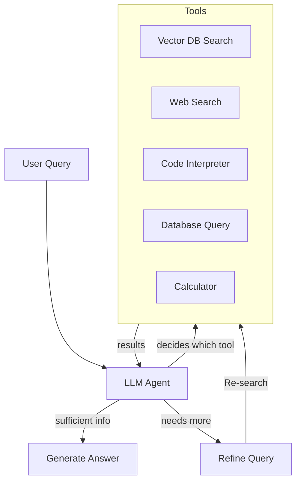
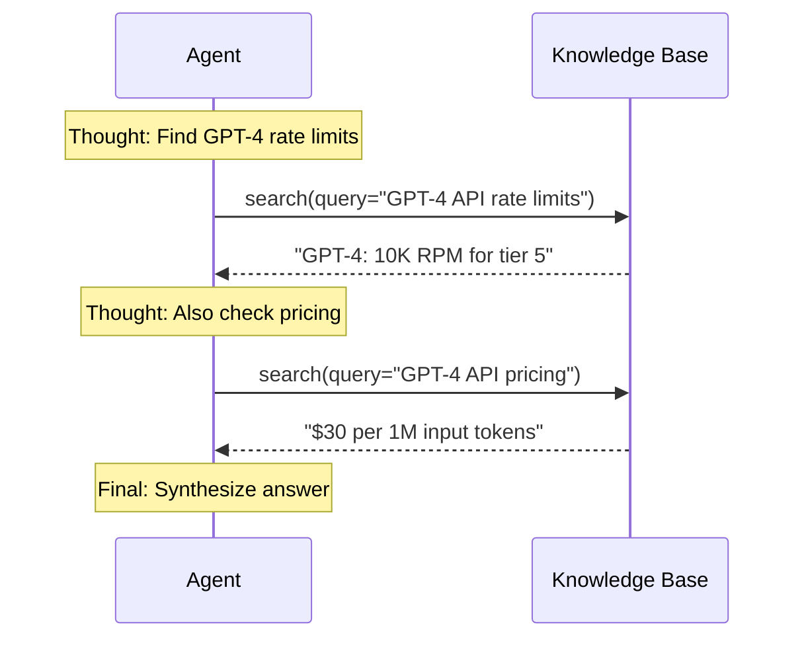

# Agentic RAG

Agentic RAG gives LLM agents autonomous access to retrieval tools — deciding when to retrieve, what to retrieve, and how to use the results to accomplish a task.

## What Makes it Agentic?

Agentic RAG differs from traditional RAG in four key ways: it retrieves iteratively instead of once, dynamically refines its queries instead of using fixed top-K chunks, reasons across multiple turns instead of a single shot, and actively decides when to search rather than always retrieving passively.

| Traditional RAG | Agentic RAG |
|-----------------|-------------|
| Single retrieve → generate | Iterative retrieval loop |
| Fixed top-k chunks | Dynamic query refinement |
| One-shot context | Multi-turn reasoning |
| Passive retrieval | Active decision to search |

## Architecture

The agent receives a user query and decides which tool to invoke. Each tool (vector search, web search, code interpreter, database query, calculator) returns results to the agent. If the agent has enough information, it generates the final answer. If not, it refines the query and re-searches — forming an iterative retrieval loop instead of the one-shot retrieve-and-generate of traditional RAG.



## Tool Use Pattern

Agents expose retrieval as a callable tool via OpenAI-compatible function calling. The tool is defined with a name, description (the LLM uses this to decide when to call it), and a JSON schema for parameters. The LLM responds with a tool call — the application executes the search and returns results to the model.

```python
tools = [
    {
        "type": "function",
        "function": {
            "name": "search_knowledge_base",
            "description": "Search technical documentation",
            "parameters": {
                "type": "object",
                "properties": {
                    "query": {"type": "string"},
                    "filters": {"type": "object"}
                },
                "required": ["query"]
            }
        }
    }
]

response = client.chat.completions.create(
    model="gpt-4",
    messages=messages,
    tools=tools,
    tool_choice="auto"
)
```

## Retrieval Strategies an Agent Can Use

Instead of a single vector search, an agent can apply multiple retrieval strategies depending on the question. It may decompose a complex query into sub-queries, iteratively refine search terms based on initial results, chain from one retrieved document to the next, compare multiple sources, or filter by time.

| Strategy | Agent Action |
|----------|-------------|
| Query decomposition | Break complex question into sub-queries |
| Iterative refinement | Search, read, refine search terms |
| Multi-hop retrieval | Use result A to craft query B |
| Comparative search | Search multiple sources for comparison |
| Time-aware retrieval | Filter by recency, search historical versions |

## ReAct Loop (Reasoning + Acting)

The ReAct pattern interleaves reasoning (Thought) with tool calls (Action → Observation). The agent thinks about what it needs, calls a tool, observes the result, then decides whether to answer or take another action. This loop continues until the agent has enough context to produce a final response.



## Memory in Agentic RAG

Agents maintain three tiers of memory: ephemeral (the current query context), working (multi-turn conversation history), and long-term (persistent knowledge about the user or past sessions). This hierarchy lets the agent track context across multiple retrieval steps and conversations.

| Memory Type | Duration | Scope |
|-------------|----------|-------|
| Ephemeral | Single turn | Current query context |
| Working | Multi-turn | Conversation history |
| Long-term | Persistent | User preferences, past retrievals |

## Guardrails

Agentic RAG systems need safety constraints to prevent runaway behaviour. These guardrails limit how many retrieval steps the agent can take, how much context it can consume, require source citation for every claim, and define a minimum confidence threshold below which the agent must abstain rather than guess.

- **Max iterations**: Prevent infinite loops
- **Token budget**: Limit total context consumption
- **Source tracking**: Always cite retrieved chunks
- **Confidence threshold**: Don't answer if retrieval quality is low

## Frameworks

Several frameworks support building agentic RAG systems. LangGraph provides stateful graphs with human-in-the-loop support, AutoGen enables multi-agent conversations, CrewAI offers role-based agent teams, Semantic Kernel integrates with the Microsoft ecosystem, and OpenAI Assistants provides a hosted solution with built-in file search.

| Framework | Language | Features |
|-----------|----------|----------|
| LangGraph | Python | Stateful graphs, human-in-loop |
| AutoGen | Python | Multi-agent conversations |
| CrewAI | Python | Role-based agent teams |
| Semantic Kernel | C#/Python | Microsoft ecosystem |
| OpenAI Assistants | API | Hosted, file search built-in |

## Use Cases

Agentic RAG excels where a single lookup isn't enough. A research assistant may need to synthesise across multiple sources and ask follow-up questions. Code migration requires reading patterns across many files. Customer support agents need to check a knowledge base, look up an account, and escalate. Data analysis requires querying a database, transforming results, and visualising them.

| Use Case | Why Agentic? |
|----------|--------------|
| Research assistant | Multi-source synthesis, follow-up queries |
| Code migration | Read multiple files, understand patterns |
| Customer support | Access KB, check account, escalate |
| Data analysis | Query DB, transform, visualize |

**Links**: [[LLM Agents Framework]] | [[Advanced RAG Patterns]] | [[Tool Use and Function Calling]] | [[RAG Architecture]] | [[Prompt Engineering for RAG]]


