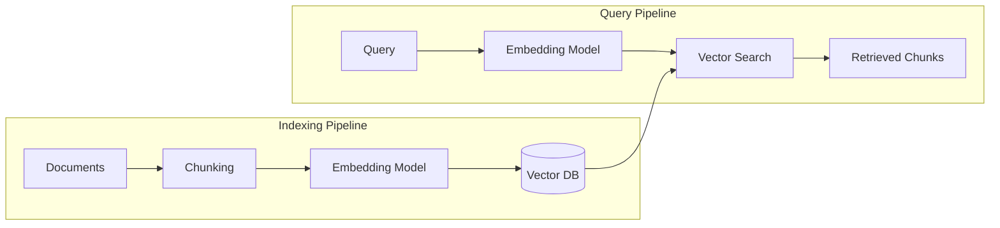
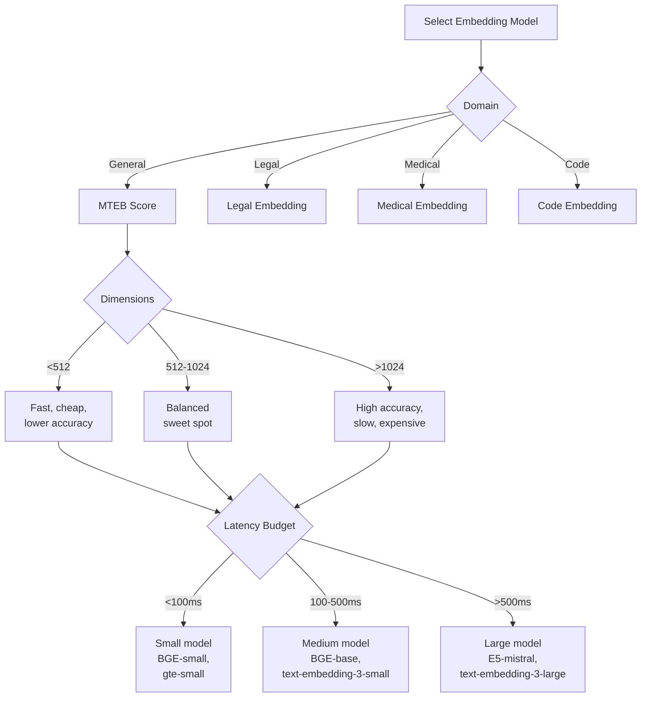
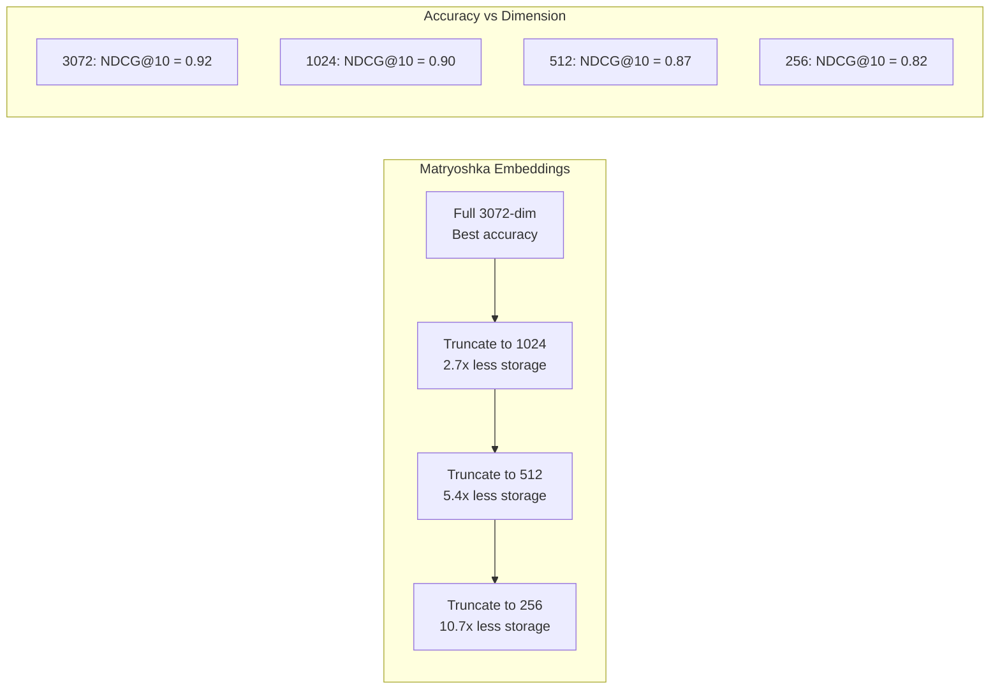
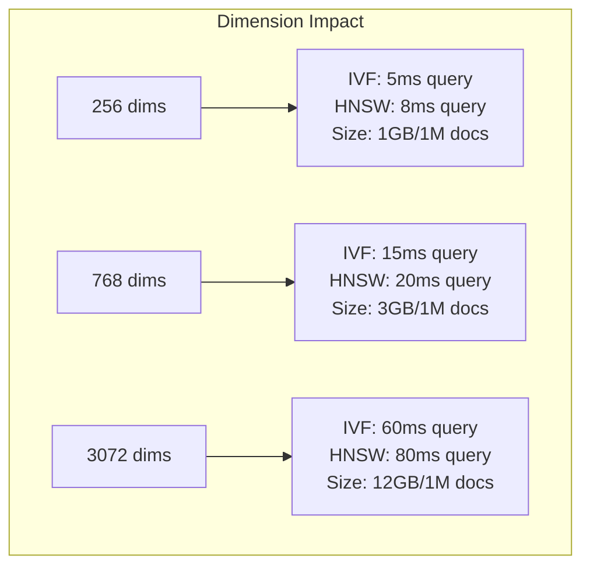

# Embedding Models for RAG

**Links**: [[Text Embedding Models]] | [[RAG Architecture]] | [[Vector Databases for RAG]] | [[Retrieval Strategies]] | [[Reranking]] | [[NLP Pipeline Design]]

## Comparison

| Model | Dims | Max Tokens | MTEB | Size |
|-------|------|------------|------|------|
| text-embedding-3-small | 1536 | 8191 | 62.3 | API |
| text-embedding-3-large | 3072 | 8191 | 64.6 | API |
| BGE-base-en-v1.5 | 768 | 512 | 63.7 | 440MB |
| BGE-large-en-v1.5 | 1024 | 512 | 64.2 | 1.3GB |
| E5-mistral-7b | 4096 | 32768 | 66.6 | 14GB |
| jina-embeddings-v3 | 1024 | 8192 | 64.2 | 1.3GB |

## Usage

```python
from openai import OpenAI
import numpy as np

client = OpenAI()

def get_embedding(text: str) -> list[float]:
    response = client.embeddings.create(
        model="text-embedding-3-small",
        input=text,
        dimensions=768
    )
    return response.data[0].embedding

def cosine_similarity(a, b):
    return np.dot(a, b) / (np.linalg.norm(a) * np.linalg.norm(b))
```

## BGE with Sentence-Transformers

```python
from sentence_transformers import SentenceTransformer
model = SentenceTransformer("BAAI/bge-base-en-v1.5")

docs = ["Document 1 text...", "Document 2 text..."]
query = "Search query text"

doc_embeddings = model.encode(docs, normalize_embeddings=True)
query_embedding = model.encode(query, normalize_embeddings=True)

similarities = query_embedding @ doc_embeddings.T
```

---

## Embedding Model Role in RAG Pipeline



The embedding model is the bridge between unstructured text and semantic search. It appears twice: once at indexing time (offline, batch) and once at query time (online, real-time).

## Embedding Model Selection Criteria



### Key Selection Criteria

| Criterion | Range | Impact |
|-----------|-------|--------|
| **Dimensions** | 256–4096 | Higher = more expressive, slower queries, more storage |
| **Max tokens** | 128–8192 | Longer = handle full docs without chunking |
| **MTEB Score** | 55–68 | Higher = better cross-task generalization |
| **Latency (batch 100)** | 10ms–2s | Directly impacts query time |
| **Indexing speed** | 100–10K docs/sec | Impacts time-to-first-index |
| **Memory (loading)** | 100MB–14GB | Determines hosting requirements |
| **Cost** | Free (open) / $0.10–$1.00/1M tokens (API) | Budget constraint |

## Expanded Model Comparison

| Model | Dims | Max Tokens | MTEB | Latency (100 docs) | Size | Cost | Open Source |
|-------|------|------------|------|-------------------|------|------|:-----------:|
| `text-embedding-3-small` | 1536 | 8191 | 62.3 | 100ms (API) | API | $0.02/1M tokens | No |
| `text-embedding-3-large` | 3072 | 8191 | 64.6 | 200ms (API) | API | $0.13/1M tokens | No |
| `text-embedding-ada-002` | 1536 | 8191 | 61.0 | 100ms (API) | API | $0.10/1M tokens | No |
| `BAAI/bge-small-en-v1.5` | 384 | 512 | 59.8 | 20ms | 110MB | Free | Yes |
| `BAAI/bge-base-en-v1.5` | 768 | 512 | 63.7 | 50ms | 440MB | Free | Yes |
| `BAAI/bge-large-en-v1.5` | 1024 | 512 | 64.2 | 120ms | 1.3GB | Free | Yes |
| `BAAI/bge-m3` | 1024 | 8192 | 64.9 | 150ms | 2.2GB | Free | Yes |
| `intfloat/e5-mistral-7b-instruct` | 4096 | 32768 | 66.6 | 2s | 14GB | Free | Yes |
| `intfloat/e5-base-v2` | 768 | 512 | 63.2 | 50ms | 440MB | Free | Yes |
| `intfloat/multilingual-e5-large` | 1024 | 512 | 65.0 | 120ms | 1.3GB | Free | Yes |
| `Alibaba-NLP/gte-large-en-v1.5` | 1024 | 8192 | 64.7 | 120ms | 1.3GB | Free | Yes |
| `Alibaba-NLP/gte-Qwen2-7B-instruct` | 4096 | 32768 | 67.2 | 2.5s | 14GB | Free | Yes |
| `jina-embeddings-v3` | 1024 | 8192 | 64.2 | 150ms | 1.3GB | Free | Yes |
| `cohere-embed-english-v3.0` | 1024 | 512 | 64.0 | 150ms (API) | API | $0.10/1M tokens | No |
| `voyage-2` | 1024 | 4000 | 63.5 | 100ms (API) | API | $0.10/1M tokens | No |
| `sentence-transformers/all-MiniLM-L6-v2` | 384 | 256 | 56.8 | 10ms | 80MB | Free | Yes |
| `sentence-transformers/all-mpnet-base-v2` | 768 | 384 | 61.1 | 40ms | 420MB | Free | Yes |

## MTEB Benchmark: Full Breakdown

MTEB (Massive Text Embedding Benchmark) evaluates across 7 task categories.

| Task Category | # Datasets | Description | Top Model Score |
|---------------|-----------|-------------|-----------------|
| Classification | 11 | Zero-shot text classification | 82.3 (GTE-Qwen2) |
| Clustering | 4 | Document clustering quality | 52.1 (E5-mistral) |
| Pair Classification | 3 | Semantic similarity between pairs | 87.5 (E5-mistral) |
| Reranking | 4 | Ranking documents by relevance | 61.4 (GTE-Qwen2) |
| Retrieval | 15 | Search and retrieval accuracy | 58.5 (GTE-Qwen2) |
| STS | 10 | Semantic Textual Similarity | 85.2 (E5-mistral) |
| Summarization | 1 | Summary classification accuracy | 32.5 (E5-mistral) |

```mermaid
radarChar
    title MTEB Task Scores (Best Models)
    x-axis ["Classification", "Clustering", "Pair Class.", "Reranking", "Retrieval", "STS", "Summarization"]
    "text-embedding-3-large": [74.2, 46.5, 85.3, 58.7, 54.9, 81.2, 30.1]
    "E5-mistral-7b": [78.1, 52.1, 87.5, 60.2, 56.3, 85.2, 32.5]
    "GTE-Qwen2-7B": [82.3, 50.8, 86.9, 61.4, 58.5, 84.1, 31.8]
    "BGE-base-v1.5": [72.5, 43.2, 83.1, 57.5, 52.8, 78.4, 28.9]
```

```python
def interpret_mteb_score(overall_mteb: float) -> str:
    """Interpret what an MTEB score means for your use case."""
    if overall_mteb >= 66:
        return "Excellent: State-of-the-art, suitable for any task"
    elif overall_mteb >= 64:
        return "Very good: SOTA for compact models, great for production"
    elif overall_mteb >= 62:
        return "Good: Solid performance for most use cases"
    elif overall_mteb >= 60:
        return "Adequate: Works well with large chunk sizes or reranking"
    else:
        return "Baseline: Consider upgrading for better retrieval quality"
```

## Matryoshka Embeddings

Matryoshka embeddings encode information at multiple granularities, allowing you to truncate dimensions at inference time without retraining.

```python
import numpy as np
from openai import OpenAI

client = OpenAI()

def get_matryoshka_embedding(text: str, dimensions: int = 768) -> list[float]:
    """Get a flexible-dimension embedding from text-embedding-3 models."""
    response = client.embeddings.create(
        model="text-embedding-3-large",
        input=text,
        dimensions=dimensions  # Can be 256, 512, 768, 1024, 1536, 2048, 3072
    )
    return response.data[0].embedding

def demonstrate_dimension_tradeoff():
    query = "What is retrieval augmented generation?"

    for dims in [256, 512, 1024, 2048, 3072]:
        emb = get_matryoshka_embedding(query, dimensions=dims)
        print(f"Dimensions: {dims:5d} | Size: {len(emb)*4/1024:.2f}KB | "
              f"First 3 values: {emb[:3]}")
```



### Dimension vs Performance Tradeoff

| Dimensions | Storage (1M docs) | Query Latency | Recall@10 Drop | Use Case |
|-----------|------------------|---------------|----------------|----------|
| 3072 | 12 GB | 50ms | Baseline | Maximum accuracy |
| 1536 | 6 GB | 30ms | -1% | Cost-sensitivity |
| 1024 | 4 GB | 20ms | -2% | Good balance |
| 512 | 2 GB | 12ms | -5% | Fast queries |
| 256 | 1 GB | 8ms | -10% | Mobile / Edge |

## Binary Embeddings

Binary embeddings pack each float dimension into a single bit, enabling 32x storage reduction and fast Hamming distance computation.

```python
import numpy as np

def binarize_embedding(embedding: np.ndarray) -> np.ndarray:
    """Convert float embeddings to binary (0/1)."""
    return (embedding > 0).astype(np.int8)

def hamming_distance(a: np.ndarray, b: np.ndarray) -> int:
    """Fast Hamming distance between binary embeddings."""
    return np.sum(a != b)

def binary_search(query_emb: np.ndarray, index: np.ndarray, top_k: int = 10):
    """Search using binary embeddings."""
    query_binary = binarize_embedding(query_emb)
    distances = np.array([hamming_distance(query_binary, doc_bin)
                          for doc_bin in index])
    top_indices = np.argsort(distances)[:top_k]
    return top_indices
```

| Method | Storage (1M @ 768d) | Search Speed | Recall@10 Drop vs Float32 |
|--------|--------------------|--------------|--------------------------|
| Float32 | 3 GB | 50ms | Baseline |
| Float16 | 1.5 GB | 35ms | <0.5% |
| Int8 | 768 MB | 20ms | -1% |
| Binary | 96 MB | 5ms | -5% to -10% |
| Binary + Rescoring | 96 MB + full embeds | 8ms | -1% |

### Binary + Rescoring Strategy

```python
def binary_rescore_search(query_emb, binary_index, float_index, top_k: int = 100, final_k: int = 10):
    """Fast binary pre-filter, then rerank with float precision."""
    # Stage 1: Binary search (very fast)
    rough_candidates = binary_search(query_emb, binary_index, top_k=top_k)

    # Stage 2: Rescore with float embeddings
    float_candidates = [float_index[i] for i in rough_candidates]
    scores = [cosine_similarity(query_emb, emb) for emb in float_candidates]

    top_indices = np.argsort(scores)[-final_k:][::-1]
    return [rough_candidates[i] for i in top_indices]
```

## Domain-Specific Fine-Tuning of Embeddings

```python
from sentence_transformers import SentenceTransformer, InputExample, losses
from torch.utils.data import DataLoader

def fine_tune_embedder(base_model: str = "BAAI/bge-base-en-v1.5",
                       train_pairs: list[tuple[str, str, float]] = None):
    """Fine-tune an embedding model on domain-specific data."""

    model = SentenceTransformer(base_model)

    train_examples = [
        InputExample(texts=[query, doc], label=score)
        for query, doc, score in train_pairs
    ]
    train_dataloader = DataLoader(train_examples, shuffle=True, batch_size=32)
    train_loss = losses.CosineSimilarityLoss(model)

    model.fit(
        train_objectives=[(train_dataloader, train_loss)],
        epochs=5,
        warmup_steps=100,
        output_path="./fine-tuned-embedder",
        show_progress_bar=True,
    )
    return model
```

### When to Fine-Tune

| Scenario | Fine-Tune? | Expected Lift |
|----------|-----------|---------------|
| General domain with MTEB > 63 | No | — |
| Legal/Medical/Finance | Yes | +5-15% Recall |
| Code or Technical Docs | Yes | +10-20% Recall |
| Multilingual + specialization | Yes | +15-25% Recall |
| Non-English primary | Yes (multilingual model) | +20-30% Recall |

### Data Requirements

| Training Data Size | Expected Improvement | Minimum Quality |
|-------------------|---------------------|-----------------|
| 100 pairs | +2-3% | High (expert curated) |
| 1,000 pairs | +5-8% | High |
| 10,000 pairs | +8-15% | Medium |
| 100,000+ pairs | +10-20% | Medium (noisy OK) |

### Synthetic Data Generation for Fine-Tuning

```python
def generate_training_pairs(domain_docs: list[str], llm, num_pairs: int = 1000):
    """Generate (query, relevant_doc, hard_negative) triples using an LLM."""
    pairs = []
    for doc in domain_docs[:num_pairs]:
        # Generate a plausible query for this doc
        prompt = f"Generate a search query that would be answered by this text:\n{doc}\n\nQuery:"
        query = llm.generate(prompt)

        # Relevant pair
        pairs.append((query, doc, 1.0))

        # Find a hard negative (different topic, same domain)
        hard_neg = find_hard_negative(doc, domain_docs)
        pairs.append((query, hard_neg, 0.0))

    return pairs
```

## Embedding Dimensionality Impact on Vector DB Performance



| Dimensions | HNSW Recall@10 | IVF Recall@10 | Storage (1M docs) | Approx NN (ms) |
|-----------|---------------|---------------|-------------------|----------------|
| 256 | 0.95 | 0.93 | 1 GB | 5 |
| 384 | 0.95 | 0.93 | 1.5 GB | 8 |
| 768 | 0.94 | 0.92 | 3 GB | 15 |
| 1024 | 0.93 | 0.91 | 4 GB | 25 |
| 1536 | 0.92 | 0.90 | 6 GB | 40 |
| 3072 | 0.90 | 0.88 | 12 GB | 80 |
| 4096 | 0.88 | 0.85 | 16 GB | 120 |

### Index Type Selection by Dimension

```python
def suggest_index_type(dim: int, num_docs: int, recall_target: float = 0.95):
    """Suggest the best ANN index type based on dimension and scale."""
    if dim <= 384:
        if num_docs < 100_000:
            return "Flat (brute force)"
        elif num_docs < 1_000_000:
            return "IVF with 256 centroids"
        else:
            return "HNSW (ef_construction=200, M=16)"
    elif dim <= 1024:
        if num_docs < 1_000_000:
            return "IVF with 1024 centroids"
        else:
            return "HNSW or DiskANN"
    else:
        if num_docs < 100_000:
            return "IVF with PQ compression"
        else:
            return "DiskANN or HNSW with PQ"
```

## Key Considerations

### Document Length Handling

| Max Token Limit | Document Strategy | Impact |
|----------------|-------------------|--------|
| 128 | Must chunk aggressively | Loss of context |
| 512 | Standard chunk size | Good for most use cases |
| 2048 | Larger chunks possible | Better for full paragraphs |
| 8192 | Full pages or articles | Best recall but slower |
| 32768 | Full documents | Maximum context but high latency |

```python
def select_chunk_size(embed_model_max_tokens: int, doc_avg_tokens: int) -> int:
    """Determine optimal chunk size for an embedding model."""
    return min(embed_model_max_tokens, doc_avg_tokens,
               max_tokens_for_recall(embed_model_max_tokens))

def max_tokens_for_recall(max_tokens: int) -> int:
    """Empirical heuristic: don't use more than 75% of max tokens."""
    return int(max_tokens * 0.75)
```

### Multilingual Support

| Model | Languages | Quality |
|-------|-----------|---------|
| `BAAI/bge-m3` | 100+ | Excellent |
| `intfloat/multilingual-e5-large` | 100+ | Excellent |
| `jina-embeddings-v3` | 30+ | Very good |
| `text-embedding-3-small` | 50+ | Good |
| `cohere-embed-multilingual-v3.0` | 100+ | Excellent |
| `sentence-transformers/paraphrase-multilingual-MiniLM-L12-v2` | 50+ | Good |

### Cross-Encoder Distillation

Knowledge distillation from cross-encoders improves embedding quality:

```python
from sentence_transformers import CrossEncoder, SentenceTransformer

def distill_from_cross_encoder(teacher_ce: CrossEncoder, student_bi: SentenceTransformer,
                                corpus: list[str], queries: list[str]):
    """Use a cross-encoder to generate soft labels for embedding training."""

    for query in queries:
        # Generate scores using cross-encoder
        pairs = [(query, doc) for doc in corpus]
        ce_scores = teacher_ce.predict(pairs)

        # Train bi-encoder to predict cross-encoder scores
        student_bi.fit([
            (query, doc, score) for doc, score in zip(corpus, ce_scores)
        ])
```

## Cost Analysis: API vs Self-Hosted

| Scenario | API Cost (1M queries) | Self-Hosted Cost | Break-Even Point |
|----------|----------------------|-----------------|------------------|
| OpenAI text-embedding-3-small | $20 | $50/month (GPU) | 2.5M queries/month |
| OpenAI text-embedding-3-large | $130 | $150/month (GPU) | 1.15M queries/month |
| Cohere embed-english-v3.0 | $100 | Free (open model) | Always cheaper self-hosted |
| BGE-base via API (Replicate) | $10 | $50/month (GPU) | 5M queries/month |

```python
def cost_analysis(queries_per_month: int, model_type: str = "bge-base"):
    """Compare API vs self-hosted costs."""
    costs = {
        "openai-small": {"api_per_1m": 0.13, "self_hosted_monthly": 50},
        "openai-large": {"api_per_1m": 0.13, "self_hosted_monthly": 150},
        "bge-base":     {"api_per_1m": 0.02, "self_hosted_monthly": 50},
        "bge-large":    {"api_per_1m": 0.05, "self_hosted_monthly": 100},
    }

    c = costs[model_type]
    api_total = (queries_per_month / 1_000_000) * c["api_per_1m"] * 1_000_000
    self_total = c["self_hosted_monthly"]

    print(f"API cost: ${api_total:.2f}/month")
    print(f"Self-hosted cost: ${self_total:.2f}/month")

    if api_total < self_total:
        print(f"API is cheaper by ${self_total - api_total:.2f}/month")
    else:
        print(f"Self-hosted is cheaper by ${api_total - self_total:.2f}/month")
        print(f"Break-even: ~{self_total / c['api_per_1m']:.0f} queries")
```

## Monitoring Embedding Drift

Embedding drift occurs when the distribution of embeddings shifts over time, degrading retrieval quality.

```python
import numpy as np
from scipy.spatial.distance import jensenshannon

class EmbeddingDriftMonitor:
    def __init__(self, reference_embeddings: np.ndarray, window_size: int = 1000):
        self.reference = reference_embeddings
        self.reference_mean = np.mean(reference_embeddings, axis=0)
        self.reference_cov = np.cov(reference_embeddings.T)
        self.window = []
        self.window_size = window_size

    def add_embedding(self, emb: np.ndarray):
        self.window.append(emb)
        if len(self.window) > self.window_size:
            self.window.pop(0)

    def drift_score(self) -> float:
        if len(self.window) < 100:
            return 0.0
        window_embeddings = np.array(self.window)
        window_mean = np.mean(window_embeddings, axis=0)
        # Jensen-Shannon divergence between mean embeddings
        return jensenshannon(self.reference_mean, window_mean)

    def detect_drift(self, threshold: float = 0.05) -> bool:
        score = self.drift_score()
        if score > threshold:
            print(f"⚠️ Embedding drift detected: {score:.4f} > {threshold}")
            return True
        print(f"✅ Embedding stable: {score:.4f}")
        return False

    def retrain_trigger(self):
        """Trigger re-indexing or model update if drift is significant."""
        drift = self.drift_score()
        if drift > 0.1:
            return "CRITICAL: Re-index all documents with updated model"
        elif drift > 0.05:
            return "WARNING: Monitor closely, consider re-indexing"
        else:
            return "OK: No action needed"
```

### Drift Causes and Mitigations

| Drift Cause | Detection Method | Mitigation |
|-------------|-----------------|------------|
| New document domain | Mean embedding shift | Periodic re-indexing |
| Embedding model update | Metric change | A/B test old vs new |
| Data distribution shift | Classification accuracy drop | Retrain or fine-tune |
| Chunking strategy change | Recall@k change | Re-index with new chunks |
| Multilingual population change | Language cluster analysis | Add language-specific models |

---

**Next**: [[Retrieval Strategies]] — Dense, sparse, and hybrid