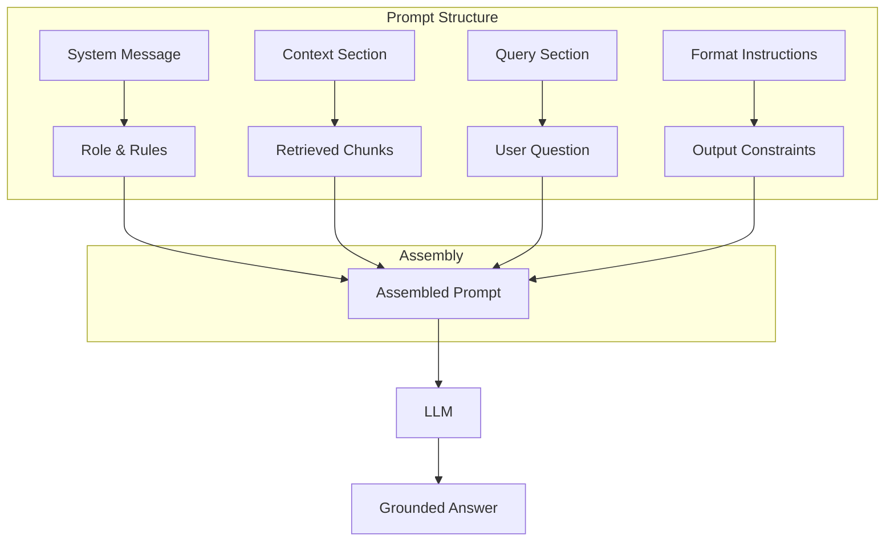

# Prompt Engineering for RAG

**Links**: [[RAG Architecture]] | [[Advanced RAG Patterns]] | [[Evaluation of RAG Systems]] | [[LLM Agents Framework]] | [[Attention Mechanism]]

## Why Prompt Engineering Matters for RAG

The prompt is the bridge between retrieved context and the generated answer. A well-structured prompt reduces hallucination, improves citation accuracy, and handles edge cases gracefully.

## Prompt Architecture



## Basic RAG Prompt

```
System:
You are a helpful assistant. Use the provided context to answer the question.
If the context doesn't contain enough information, say so.
Do not make up information.

Context:
{context}

Question: {question}
Answer:
```

## Structured with Citations

```
System:
Rules:
1. Answer ONLY using the provided context
2. If insufficient, say "I don't have enough information"
3. Cite sources as [1], [2] at the end of each sentence
4. Be concise and direct

Context:
[1] {chunk_1}
[2] {chunk_2}

Question: {question}
Answer:
```

## Prompt Strategies

| Strategy | When | Example |
|----------|------|---------|
| Zero-shot | Simple Q&A | "Answer based on context:" |
| Few-shot | Complex format | "Example 1: Q: ... A: ..." |
| Chain-of-thought | Multi-step reasoning | "Think step by step using the context" |
| Constrained | Structured output | "Return JSON with fields: answer, confidence" |
| Conditional | Edge case handling | "If context is empty, say 'I don't know'" |

## Handling Edge Cases

```python
def build_rag_prompt(query: str, chunks: list[str]) -> str:
    if not chunks:
        return f"I don't have information about: {query}"

    context = "\n\n".join(f"[{i+1}] {chunk}" for i, chunk in enumerate(chunks))

    system = """You are a precise assistant. Follow these rules:
1. Answer only from the provided context
2. If context partially answers, state what you know and note gaps
3. If chunks conflict, present both views and explain the conflict
4. Cite sources as [1], [2] etc.
5. Never invent citations or facts"""

    return f"{system}\n\nContext:\n{context}\n\nQuestion: {query}\nAnswer:"
```

## Prompt Comparison

| Approach | Hallucination Rate | Citation Accuracy | Complexity |
|----------|-------------------|-------------------|------------|
| Basic: "Answer from context" | Medium | Low | Minimal |
| Structured with citations | Low | High | Medium |
| Conditional + few-shot | Very low | High | High |
| Self-RAG (model reflects) | Lowest | Highest | Complex |

## Best Practices

| Practice | Why | Example |
|----------|-----|---------|
| Place context before question | LLM attends better to recent tokens | Context first, then question |
| Number chunks explicitly | Enables citeable sources | `[1]`, `[2]` per chunk |
| Set strict failover behavior | Prevents hallucination on missing info | "Say 'I don't know'" |
| Keep instructions concise | LLMs follow clear, short rules better | Bullet points > paragraphs |
| Use consistent formatting | Reduces parsing errors | Same separator every time |

```
## Optimal Prompt Template

System:
You are a precise Q&A assistant. Rules:
- Answer ONLY from the provided context
- Cite every factual claim as [source_index]
- If unsure, respond: "I don't have enough information"
- Be concise: 2-3 sentences max

Context:
[1] {chunk_1}
[2] {chunk_2}

Question: {question}
Answer:
```

**Next**: [[Advanced RAG Patterns]] — Corrective, agentic, self-RAG
