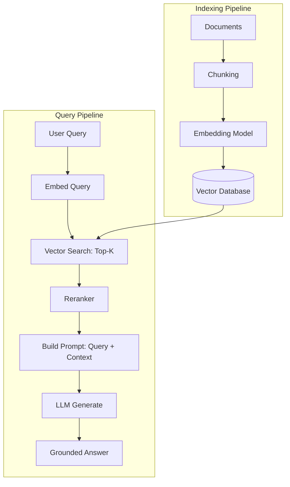
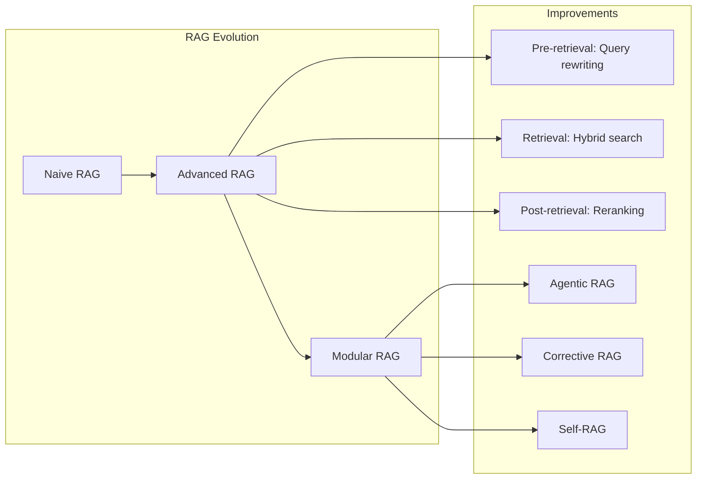

# RAG Architecture

**Links**: [[Text Embedding Models]] | [[Chunking Strategies]] | [[Vector Databases for RAG]] | [[Retrieval Strategies]] | [[Reranking]] | [[Prompt Engineering for RAG]] | [[Advanced RAG Patterns]] | [[Evaluation of RAG Systems]]

## What is RAG?

Retrieval-Augmented Generation (RAG) combines information retrieval with a generative language model. Instead of relying solely on the model's parametric knowledge, RAG fetches relevant documents from an external knowledge base and feeds them as context to the LLM.

## Basic RAG Flow



## Core Components

| Component | Role | Technologies |
|-----------|------|--------------|
| **Embedding Model** | Converts text to vectors | text-embedding-3-small, BGE, E5, Instructor |
| **Vector Database** | Stores and searches embeddings | Qdrant, Pinecone, pgvector, Weaviate, Chroma |
| **Retriever** | Fetches relevant documents | Dense, Sparse (BM25), Hybrid |
| **Reranker** | Re-ranks retrieved docs | Cohere Rerank, Cross-encoders, monoBERT |
| **LLM** | Generates final answer | GPT-4, Claude, Llama, Mistral, Gemma |

## Why RAG?

| Approach | Knowledge Currency | Hallucination | Customization | Cost |
|----------|-------------------|----------------|---------------|------|
| Base LLM | Static (training cutoff) | High | None | Low |
| Fine-tuning | Static + expensive | Medium | High | High |
| **RAG** | **Dynamic** | **Low** | **Medium** | **Medium** |
| Agent + Tools | Fully dynamic | Low | Very high | High |

## Code Example: Minimal RAG Pipeline

```python
from openai import OpenAI
import chromadb

# 1. Index documents
client = chromadb.Client()
collection = client.create_collection("docs")
collection.add(
    documents=["Paris is the capital of France.", "The Eiffel Tower is in Paris."],
    ids=["doc1", "doc2"],
)

# 2. Retrieve
query = "What is the capital of France?"
results = collection.query(query_texts=[query], n_results=2)

# 3. Generate
llm = OpenAI()
context = "\n".join(results["documents"][0])
prompt = f"Answer based on context:\n\nContext:\n{context}\n\nQuestion: {query}\nAnswer:"
answer = llm.chat.completions.create(
    model="gpt-4",
    messages=[{"role": "user", "content": prompt}],
)
print(answer.choices[0].message.content)  # "Paris is the capital of France."
```

## Design Decisions

| Decision | Typical Range | Tradeoff |
|----------|---------------|----------|
| **Chunk size** | 256-1024 tokens | Smaller = more precise, larger = more context |
| **Top-K** | 3-10 chunks | Higher K = more context, potentially more noise |
| **Embedding dimensions** | 768-1536 | Higher = more expressive, slower |
| **Search type** | Dense / Sparse / Hybrid | Hybrid = best recall, more infrastructure |
| **Prompt template** | Structured context + instructions | Determines output format and quality |

## Advanced RAG Patterns



**See also**: [[RAG Evaluation Metrics]], [[RAG Pipeline Optimization]], [[Multi-Modal RAG]], [[Graph RAG]], [[Hybrid Search for RAG]]

**Next**: [[Chunking Strategies]] — How to split documents
