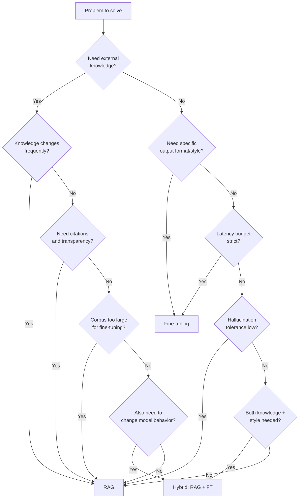
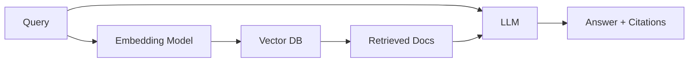
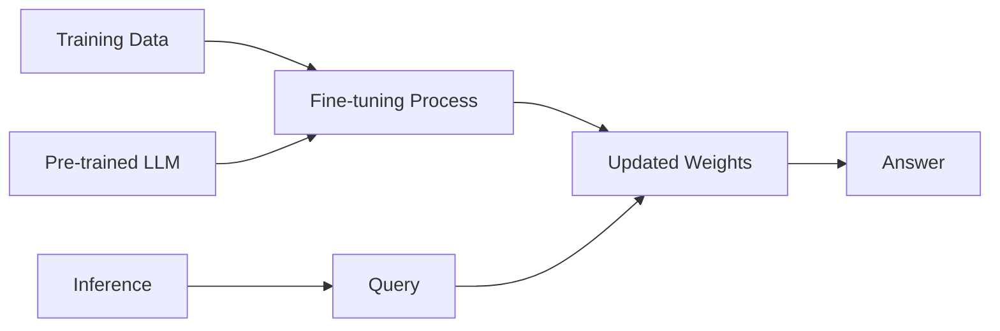
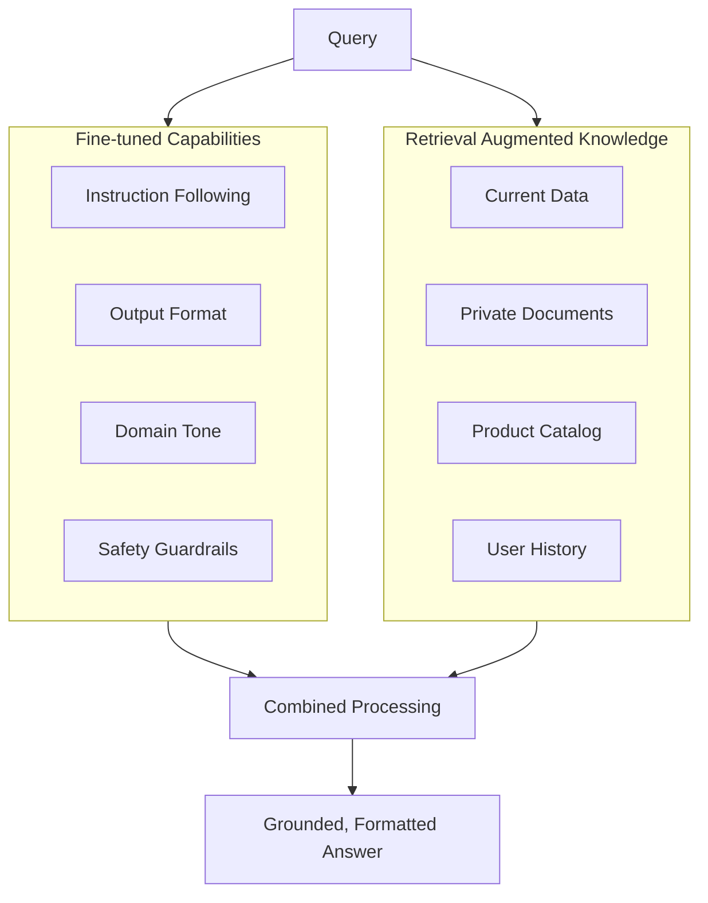
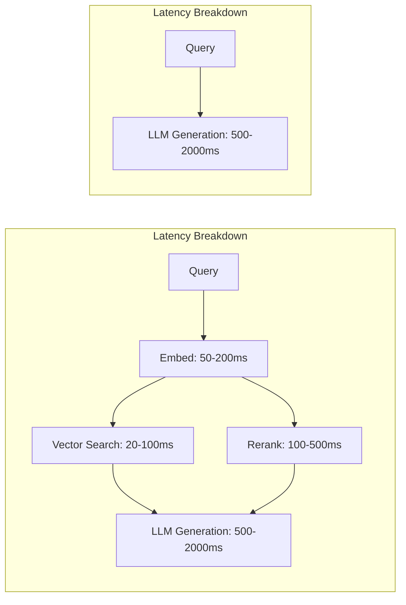
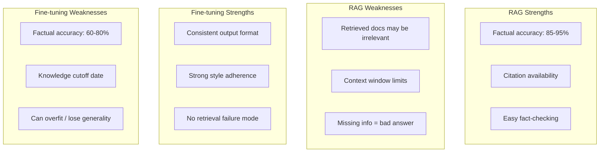
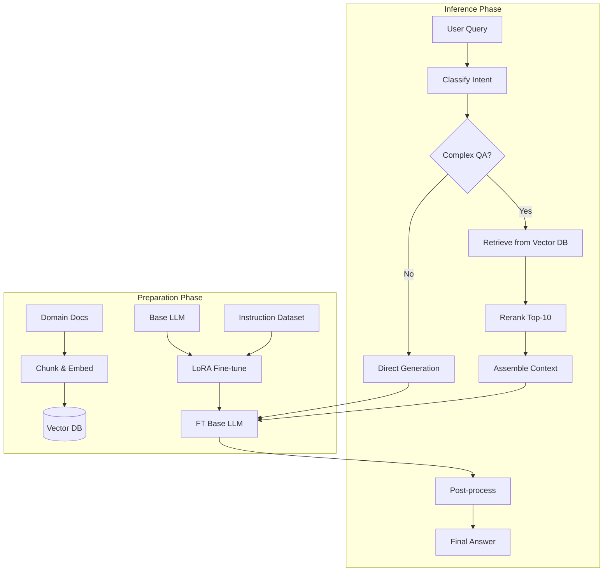
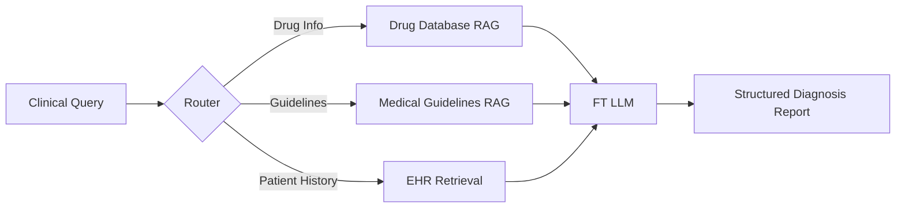
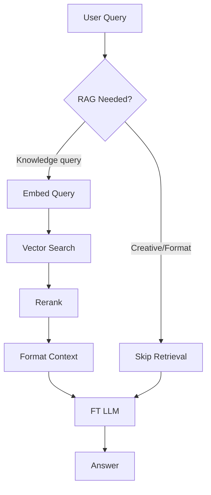

# RAG vs Fine-tuning

**Links**: [[RAG Architecture]] | [[Advanced RAG Patterns]] | [[Evaluation of RAG Systems]] | [[Pre-training and Fine-tuning]] | [[LLM Agents Framework]]

## Comparison

| Aspect | RAG | Fine-tuning |
|--------|-----|-------------|
| Knowledge | External, dynamic | Internal, static |
| Updates | Re-index, instant | Re-train, slow |
| Hallucination | Lower | Higher |
| Citations | Yes | No |
| Data needs | Document corpus | Task examples |
| Latency | + retrieval | Same as base |

## When RAG Wins

- Constantly changing information
- Need source citations
- Large corpus of documents
- Low hallucination tolerance
- Domain-specific but not task-specific

## When Fine-tuning Wins

- Specific output format/style
- Latency-critical applications
- Limited compute budget for retrieval
- Teaching new capabilities

## Hybrid

Use both: fine-tune for instruction following, RAG for knowledge grounding.

---

## Decision Tree: RAG vs Fine-tuning vs Both



## Architecture Comparison

### RAG Architecture



No training required. The LLM weights stay frozen — knowledge lives in the external index.

### Fine-tuning Architecture



Knowledge is baked into model weights during training. No external retrieval at inference time.

### Hybrid Architecture



## Cost Analysis

| Component | RAG | Fine-tuning |
|-----------|-----|-------------|
| **Training/Setup** | | |
| Model training | $0 | $50–$500 (LoRA) / $500–$5,000+ (full) |
| Embedding pipeline | $50–$200/month (API) | $0 |
| Vector DB hosting | $50–$500/month | $0 |
| **Inference** | | |
| LLM cost per 1K tokens | $0.01–$0.05 | $0.01–$0.05 |
| Retrieval cost per query | $0.001–$0.01 (embed + search) | $0 |
| Total per 1M queries | $10–$60 | $10–$50 |
| **Maintenance** | | |
| Index updates | $100–$500/month | $0 |
| Re-training | $0 | $500–$5,000 per update |
| **Total monthly (1M queries)** | $500–$2,000 | $500–$5,000+  |

### Break-even Analysis

- If you update knowledge **more than once per month**: RAG is cheaper
- If you serve **low volume (<100K queries/month)** and knowledge is static: fine-tuning is cheaper
- If you need both: hybrid with LoRA fine-tuning + RAG is often most cost-effective

## Latency Analysis



| Component | RAG (ms) | Fine-tuning (ms) |
|-----------|----------|-----------------|
| Embedding | 50–200 | 0 |
| Vector search (HNSW) | 10–100 | 0 |
| Reranking (optional) | 100–500 | 0 |
| LLM generation | 500–3,000 | 500–3,000 |
| **Total P50** | **660–800** | **500–800** |
| **Total P99** | **3,800** | **3,500** |
| **Retrieval overhead** | **+20–40%** | **None** |

Key insight: retrieval adds 100–800ms depending on index size and reranking. For interactive chatbots this is noticeable. For offline processing, irrelevant.

## Quality Comparison



| Quality Dimension | RAG | Fine-tuning | Hybrid |
|-------------------|-----|-------------|--------|
| Factual accuracy | 85–95% | 60–80% | 90–97% |
| Citation precision | 90%+ | 0% (no citations) | 85–95% |
| Style consistency | 50–70% | 85–95% | 90–95% |
| Hallucination rate | 5–15% | 20–40% | 3–10% |
| Knowledge freshness | Real-time | At training cutoff | Real-time |
| Output format control | Poor (prompt only) | Excellent | Excellent |

### When RAG Hallucinates Less

- **Factual queries**: "What was Q3 2025 revenue?" — RAG pulls the actual report
- **Long-tail knowledge**: "How does the XYZ protocol work?" — RAG grounds in docs
- **Multi-document synthesis**: "Summarize the key differences across these 5 papers" — RAG can cite each source

### When Fine-tuning Generalizes Better

- **Creative tasks**: "Write a poem about databases in Shakespearean style" — FT internalizes the style
- **Structural formatting**: "Convert this email thread to a JSON summary" — FT learns the schema
- **Domain jargon without corpus**: "Explain this concept to a 5th grader" — FT learns the simplification pattern

## Evaluation: Measuring Success

### For RAG Systems

| Metric | How to Measure | Target |
|--------|---------------|--------|
| Retrieval Recall@k | % of relevant docs in top-k | >0.85 |
| Answer Faithfulness | % of claims supported by retrieved docs | >0.90 |
| Answer Relevance | Cosine similarity or LLM-as-judge | >4.0/5 |
| Context Precision | Precision of retrieved docs used in answer | >0.80 |
| Citation Accuracy | % of citations that actually support the claim | >0.90 |

```python
def evaluate_rag_pipeline(queries, ground_truths, retriever, llm):
    results = []
    for query, truth in zip(queries, ground_truths):
        docs = retriever.retrieve(query, k=10)
        answer = llm.generate(query, docs)
        results.append({
            "recall@5": recall_at_k(docs, truth["relevant_docs"], k=5),
            "faithfulness": faithfulness_score(answer, docs),
            "answer_relevance": relevance_score(answer, query),
            "citation_accuracy": citation_check(answer, docs),
        })
    return aggregate(results)
```

### For Fine-tuned Models

| Metric | How to Measure | Target |
|--------|---------------|--------|
| Perplexity | Cross-entropy on held-out set | Lower is better |
| BLEU/ROUGE | N-gram overlap with reference | Varies by task |
| Human eval rating | Domain expert review | >4.0/5 |
| Style adherence | Classification by judge LLM | >0.90 |
| Catastrophic forgetting | Performance on base benchmarks | Drop <5% |

## Hybrid System: Detailed Architecture



### Implementation: FT + RAG Combined

```python
from transformers import AutoModelForCausalLM, AutoTokenizer
from sentence_transformers import SentenceTransformer
import numpy as np

class HybridRAGFineTune:
    def __init__(self, ft_model_path: str, embed_model: str = "BAAI/bge-base-en-v1.5"):
        self.tokenizer = AutoTokenizer.from_pretrained(ft_model_path)
        self.model = AutoModelForCausalLM.from_pretrained(ft_model_path)
        self.embedder = SentenceTransformer(embed_model)
        self.doc_index = {}  # In practice, use a vector DB

    def retrieve(self, query: str, k: int = 5) -> list[str]:
        q_emb = self.embedder.encode(query, normalize_embeddings=True)
        scores = {doc_id: np.dot(q_emb, doc_emb)
                  for doc_id, doc_emb in self.doc_index.items()}
        top_k = sorted(scores, key=scores.get, reverse=True)[:k]
        return [self.documents[did] for did in top_k]

    def generate(self, query: str, use_rag: bool = True) -> str:
        context = ""
        if use_rag:
            docs = self.retrieve(query)
            context = "\n\n".join(f"[Source {i+1}]: {d}" for i, d in enumerate(docs))

        prompt = f"""Answer based on the provided context.
If the context is insufficient, say so.

Context:
{context}

Question: {query}

Answer:"""
        inputs = self.tokenizer(prompt, return_tensors="pt")
        outputs = self.model.generate(**inputs, max_new_tokens=512)
        return self.tokenizer.decode(outputs[0], skip_special_tokens=True)
```

## Real-World Case Studies

### Case 1: Customer Support — RAG

**Company**: E-commerce platform with 50K+ products and constantly changing inventory

**Problem**: Support agents needed accurate, up-to-date information about products, policies, and orders.

**Solution**: Pure RAG system indexing product catalog, FAQ, policy docs, and order database. No fine-tuning.

**Results**:
- First-response accuracy: 74% → 92%
- Agent handle time: -35%
- Update latency: seconds (index updates)

**Why RAG**: Knowledge changes daily. Citations allow customers to verify claims. Can't afford retraining cycles.

### Case 2: Brand Voice Adaptation — Fine-tuning

**Company**: Marketing agency needing consistent brand voice across 10+ clients

**Problem**: Base LLMs produced generic content. Needed distinct brand voices per client.

**Solution**: LoRA fine-tune on past marketing content per brand. 10 LoRA adapters, swapped at inference.

**Results**:
- Brand voice consistency: 55% → 91% (judged by clients)
- Content approval rate: 62% → 88%
- Time per piece: 45min → 8min

**Why FT**: No external knowledge needed. Pure style and tone transformation. Low latency requirement.

### Case 3: Medical QA — Hybrid

**Company**: Healthcare provider building an internal clinical decision support tool

**Problem**: Need both medical knowledge (guidelines, drug info, latest research) AND controlled output format (structured differential diagnosis).

**Solution**: Fine-tuned LLM for structured output format. RAG for medical reference retrieval. Fine-tuned retrieval-routing classifier.



**Results**:
- Diagnostic accuracy: 68% → 89%
- Guideline adherence: 72% → 94%
- Structured output compliance: 100%

## Combined Workflow: FT for Instruction Following, RAG for Knowledge

```python
from dataclasses import dataclass
from typing import Optional

@dataclass
class PipelineConfig:
    ft_model: str = "microsoft/phi-2"
    embed_model: str = "BAAI/bge-base-en-v1.5"
    use_rag: bool = True
    top_k: int = 5
    max_tokens: int = 1024
    temperature: float = 0.1

class RAGPipeline:
    def __init__(self, config: PipelineConfig):
        self.config = config
        self.model = load_ft_model(config.ft_model)
        self.embedder = SentenceTransformer(config.embed_model)

    def process(self, query: str) -> dict:
        result = {"query": query}

        if self.config.use_rag:
            docs = self._retrieve(query)
            result["retrieved_docs"] = docs
            context = self._format_context(docs)
            prompt = self._build_prompt(query, context)
        else:
            prompt = self._build_prompt(query)

        response = self._generate(prompt)
        result["answer"] = response
        result["latency_ms"] = self._latency
        return result

    def _build_prompt(self, query: str, context: Optional[str] = None) -> str:
        if context:
            return f"""<|system|>You are a helpful assistant. Answer using the provided context.
If the context doesn't contain the answer, say so.
<|context|>{context}
<|user|>{query}<|assistant|>"""
        return f"""<|system|>You are a helpful assistant.
<|user|>{query}<|assistant|>"""
```

### Routing Strategy



Decision criteria for routing:
1. **Contains fact-seeking keywords** (what, when, where, how much) → RAG
2. **Asks for format/summary** (write, list, format, summarize) → FT only
3. **References specific entities** (product names, people, dates) → RAG
4. **Creative or open-ended** (brainstorm, imagine, suggest) → FT only
5. Uncertain → default to RAG

---

**Next**: [[Transformer Architecture]] — Full breakdown