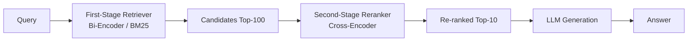
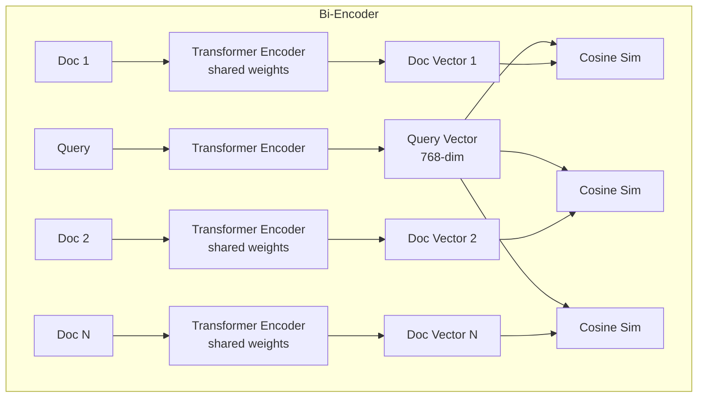
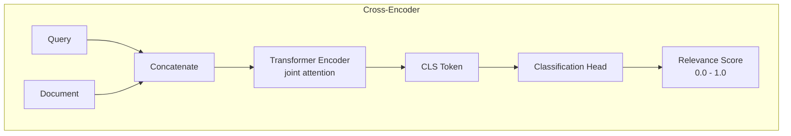
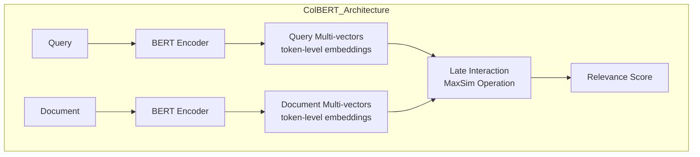

# Reranking

**Links**: [[Retrieval Strategies]] | [[RAG Architecture]] | [[Embedding Models for RAG]] | [[Prompt Engineering for RAG]] | [[Evaluation of RAG Systems]]

## What is Reranking?

Two-stage retrieval: a fast first-pass retriever gets Top-K candidates, then a more accurate model re-ranks them.

## Bi-Encoder vs Cross-Encoder

| Aspect | Bi-Encoder | Cross-Encoder |
|--------|------------|---------------|
| Architecture | Separate query/doc vectors | Joint model |
| Speed | Fast (pre-computed) | Slow (per pair) |
| Accuracy | Good | Best |
| Use | First-pass retrieval | Second-pass reranking |

## Cross-Encoder Scoring

```python
from sentence_transformers import CrossEncoder

model = CrossEncoder("cross-encoder/ms-marco-MiniLM-L-6-v2")

pairs = [(query, doc) for doc in candidates]
scores = model.predict(pairs)
ranked = [doc for _, doc in sorted(zip(scores, candidates), reverse=True)]
```

## Cohere Rerank

```python
import cohere
co = cohere.Client("api-key")

results = co.rerank(
    model="rerank-english-v3.0",
    query="What is machine learning?",
    documents=["ML is a subset of AI...", "Python is a language..."],
    top_n=3
)
```

Reranking typically improves RAG answer accuracy by 10-20%.

## Two-Stage Retrieval Pipeline



First stage prioritizes recall (get all potentially relevant docs). Second stage prioritizes precision (pick the best ones).

## Bi-Encoder vs Cross-Encoder: Architecture Deep Dive

### Bi-Encoder Architecture



- Query and documents encoded independently
- Document vectors can be pre-computed and indexed
- Inference: O(N) for N documents (single vector multiplication each)
- Storage: 768 floats per document (or ~3KB for fp32)

### Cross-Encoder Architecture



- Query and document processed together in one forward pass
- Full bidirectional attention between query and doc tokens
- Inference: O(N) separate forward passes for N documents
- No pre-computation possible — must process each pair at query time

| Aspect | Bi-Encoder | Cross-Encoder |
|--------|------------|---------------|
| Complexity per pair | O(Q+D) independent | O(Q×D) joint attention |
| Pre-compute docs | Yes | No |
| Latency for 100 docs | ~5ms | ~500–5,000ms |
| Memory per query | N×768 floats | N×full model |
| Accuracy (Recall@10) | ~80–85% | ~90–95% |
| Best for | First-pass retrieval | Second-pass reranking |

## Reranking Models Comparison

| Model | Parameters | Speed (docs/sec) | MRR@10 | Size | Notes |
|-------|-----------|-------------------|--------|------|-------|
| `cross-encoder/ms-marco-MiniLM-L-2-v2` | 22M | 2,000 | 34.2 | 88MB | Fastest cross-encoder |
| `cross-encoder/ms-marco-MiniLM-L-4-v2` | 44M | 1,200 | 36.4 | 170MB | Good speed/accuracy |
| `cross-encoder/ms-marco-MiniLM-L-6-v2` | 66M | 800 | 37.8 | 255MB | Popular default |
| `cross-encoder/ms-marco-MiniLM-L-12-v2` | 132M | 400 | 38.4 | 500MB | Most accurate MiniLM |
| `BAAI/bge-reranker-v2-m3` | 568M | 200 | 42.1 | 2.2GB | Multilingual |
| `BAAI/bge-reranker-v2-minicpm-layerwise` | 1.4B | 80 | 43.1 | 5.6GB | Layerwise freezing |
| `castorini/monot5-base-msmarco` | 220M | 150 | 38.8 | 850MB | T5-based reranker |
| `castorini/monot5-large-msmarco` | 770M | 60 | 40.1 | 3GB | More accurate T5 |
| `castorini/monot5-3b-msmarco` | 3B | 15 | 41.2 | 12GB | Best T5 reranker |

## MonoT5: LLM-Based Reranking

MonoT5 frames reranking as a text generation task. Given `query: [Q] document: [D]`, it generates "true" or "false".

```python
from transformers import AutoModelForSeq2SeqLM, AutoTokenizer

class MonoT5Reranker:
    def __init__(self, model_name="castorini/monot5-base-msmarco"):
        self.tokenizer = AutoTokenizer.from_pretrained(model_name)
        self.model = AutoModelForSeq2SeqLM.from_pretrained(model_name)

    def score(self, query: str, doc: str) -> float:
        input_text = f"Query: {query} Document: {doc}"
        inputs = self.tokenizer(input_text, return_tensors="pt",
                                truncation=True, max_length=512)

        # Score is probability of generating "true"
        with torch.no_grad():
            logits = self.model.generate(
                **inputs, max_new_tokens=1,
                output_scores=True, return_dict_in_generate=True
            )
        true_id = self.tokenizer.encode("true")[0]
        false_id = self.tokenizer.encode("false")[0]
        scores = logits.scores[0][0]
        prob_true = torch.softmax(scores, dim=-1)[true_id].item()
        return prob_true

    def rerank(self, query: str, docs: list[str], top_k: int = 10) -> list[tuple[str, float]]:
        scored = [(doc, self.score(query, doc)) for doc in docs]
        ranked = sorted(scored, key=lambda x: x[1], reverse=True)
        return ranked[:top_k]
```

### RankLLaMA

```python
from transformers import AutoModelForSequenceClassification, AutoTokenizer

class RankLLaMAReranker:
    def __init__(self, model_name="castorini/rankllama-v1-7b-lora"):
        self.tokenizer = AutoTokenizer.from_pretrained("meta-llama/Llama-2-7b-hf")
        self.model = AutoModelForSequenceClassification.from_pretrained(
            model_name, num_labels=1
        )

    def score(self, query: str, doc: str) -> float:
        text = f"Query: {query}\nDocument: {doc}\nRelevance:"
        inputs = self.tokenizer(text, return_tensors="pt",
                                truncation=True, max_length=2048)
        with torch.no_grad():
            outputs = self.model(**inputs)
        return outputs.logits.squeeze().item()
```

## ColBERT: Late Interaction for Efficient Reranking

ColBERT uses a late interaction mechanism: encode query and docs separately, then do a fine-grained matching step.



```python
import torch
from transformers import AutoTokenizer, AutoModel

class ColBERTReranker:
    def __init__(self, model_name="colbert-ir/colbertv2.0"):
        self.tokenizer = AutoTokenizer.from_pretrained(model_name)
        self.model = AutoModel.from_pretrained(model_name)
        self.compress_dim = 128

    def encode(self, texts: list[str]) -> torch.Tensor:
        inputs = self.tokenizer(texts, padding=True, truncation=True,
                                max_length=512, return_tensors="pt")
        outputs = self.model(**inputs).last_hidden_state
        mask = inputs["attention_mask"].unsqueeze(-1).float()
        embeddings = outputs * mask
        # Linear compression to 128 dims
        return embeddings[:, :, :self.compress_dim]

    def score(self, q_emb: torch.Tensor, d_emb: torch.Tensor) -> torch.Tensor:
        # Late interaction: MaxSim
        # q_emb: [1, num_q_tokens, 128]
        # d_emb: [1, num_d_tokens, 128]
        scores = torch.bmm(q_emb, d_emb.transpose(1, 2))  # [1, num_q, num_d]
        max_scores = scores.max(dim=-1).values  # [1, num_q]
        return max_scores.sum(dim=-1)  # scalar

    def rerank(self, query: str, docs: list[str], top_k: int = 10) -> list[tuple[str, float]]:
        q_emb = self.encode([query])
        # Docs can't be pre-computed with late interaction, but partial pre-computation helps
        scored = []
        for doc in docs:
            d_emb = self.encode([doc])
            s = self.score(q_emb, d_emb).item()
            scored.append((doc, s))
        ranked = sorted(scored, key=lambda x: x[1], reverse=True)
        return ranked[:top_k]
```

## Training Your Own Cross-Encoder

### Dataset Preparation

```python
from sentence_transformers import InputExample, losses
from torch.utils.data import DataLoader

def prepare_training_data():
    # Format: (query, document, label) where label is 1 (relevant) or 0 (irrelevant)
    train_examples = [
        InputExample(texts=["What is RAG?", "RAG stands for Retrieval Augmented Generation"],
                     label=1.0),
        InputExample(texts=["What is RAG?", "Python is a programming language"],
                     label=0.0),
    ]
    # For graded relevance: label can be 0.0, 1.0, 2.0, 3.0
    return train_examples
```

### Training Loop

```python
from sentence_transformers import CrossEncoder, models
import torch

def train_cross_encoder():
    model = CrossEncoder("microsoft/MiniLM-L12-H384-uncased",
                         num_labels=1,  # Single score regression
                         max_length=512)

    train_dataloader = DataLoader(train_examples, shuffle=True, batch_size=16)
    loss = losses.CosineSimilarityLoss(model)

    model.fit(
        train_dataloader=train_dataloader,
        epochs=5,
        warmup_steps=100,
        optimizer_params={"lr": 2e-5},
        output_path="./reranker-model",
        show_progress_bar=True
    )
    return model

def train_distilled_reranker(teacher_model_name, student_model_name):
    """Distill knowledge from a large reranker into a small one."""
    teacher = CrossEncoder(teacher_model_name)      # e.g. cross-encoder/ms-marco-electra-base
    student = CrossEncoder(student_model_name)       # e.g. cross-encoder/ms-marco-MiniLM-L-6

    # Generate soft labels from teacher on a large unlabeled corpus
    student.fit(
        train_dataloader=DataLoader(unlabeled_pairs, shuffle=True, batch_size=32),
        loss=losses.MSELoss(),
        evaluator=evaluator,
        epochs=3,
    )
```

## Reranking in Hybrid Search

```mermaid
flowchart TD
    Q[Query] --> D[Dense Retrieval]
    Q --> S[Sparse Retrieval (BM25)]
    D --> F[Fusion: RRF / Weighted Sum]
    S --> F
    F --> H[Top-100 Candidates]
    H --> R[Cross-Encoder Reranker]
    R --> T[Top-10 Re-ranked]
    T --> L[LLM]
```

```python
def hybrid_rerank_pipeline(query: str, dense_index, bm25_index, reranker, top_k: int = 100, final_k: int = 10):
    # Stage 1: Dense retrieval
    dense_results = dense_index.search(query, top_k)

    # Stage 1: Sparse retrieval
    sparse_results = bm25_index.get_scores(query.split())

    # Fusion
    fused = rrf_fusion(dense_results, sparse_results, k=60)[:top_k]

    # Stage 2: Reranking
    pairs = [(query, doc) for doc in fused]
    scores = reranker.predict(pairs)
    reranked = sorted(zip(fused, scores), key=lambda x: x[1], reverse=True)

    return reranked[:final_k]
```

## Positional Bias in Rerankers

Cross-encoders are prone to positional bias: the position of the document in the input list affects its score.

```python
# Test for positional bias
def detect_positional_bias(reranker, query: str, docs: list[str], num_permutations: int = 10):
    import random
    base_scores = []
    for _ in range(num_permutations):
        shuffled = random.sample(docs, len(docs))
        scores = reranker.predict([(query, d) for d in shuffled])
        base_scores.append(scores)

    # Check if a given doc's score varies with position
    for idx in range(len(docs)):
        doc_scores = [run[idx] for run in base_scores]
        variance = np.var(doc_scores)
        print(f"Document {idx}: score variance = {variance:.4f}")
```

### Mitigation Strategies

- **Query-aware normalization**: Subtract the mean score per query
- **Calibration**: Use temperature scaling on output logits
- **Ensemble**: Average scores from multiple position permutations
- **Sliding window**: For long document lists, rerank in overlapping windows

## Performance Impact: Recall@k Before and After Reranking

```mermaid
flowchart LR
    subgraph Without_Reranking
        A1[Recall@100: 0.95]
        A2[Recall@10: 0.72]
        A3[Precision@10: 0.45]
    end
    subgraph With_Reranking
        B1[Recall@100: 0.95<br/>&nbsp;unchanged]
        B2[Recall@10: 0.91<br/>&nbsp;+26% improvement]
        B3[Precision@10: 0.78<br/>&nbsp;+73% improvement]
    end
```

| Metric | Before Reranking | After Reranking | Improvement |
|--------|-----------------|-----------------|-------------|
| Recall@5 | 0.55 | 0.82 | +49% |
| Recall@10 | 0.72 | 0.91 | +26% |
| Recall@20 | 0.85 | 0.94 | +11% |
| Precision@5 | 0.38 | 0.71 | +87% |
| Precision@10 | 0.45 | 0.78 | +73% |
| MRR@10 | 0.62 | 0.87 | +40% |
| NDCG@10 | 0.58 | 0.83 | +43% |
| Answer Accuracy | 0.65 | 0.82 | +26% |

### Measuring Recall Improvement

```python
def measure_reranker_impact(retriever, reranker, queries: list[str], relevant_docs: dict):
    """Measure recall improvement from adding a reranker."""
    results = {"before": {}, "after": {}}

    for k in [5, 10, 20, 50, 100]:
        recall_before = []
        recall_after = []
        for query, relevant in relevant_docs.items():
            # First-stage retrieval
            candidates = retriever.retrieve(query, k=100)
            recall_before.append(recall_at_k(candidates, relevant, k=k))

            # Rerank
            reranked = reranker.rerank(query, candidates, top_k=k)
            recall_after.append(recall_at_k(reranked, relevant, k=k))

        results["before"][k] = np.mean(recall_before)
        results["after"][k] = np.mean(recall_after)

    return results
```

## Caching Strategies for Reranking

```python
from functools import lru_cache
import hashlib
import json

class CachedReranker:
    def __init__(self, reranker, cache_size: int = 10000):
        self.reranker = reranker
        self.cache = {}
        self.cache_size = cache_size

    def _make_key(self, query: str, doc: str) -> str:
        return hashlib.md5(f"{query}||{doc}".encode()).hexdigest()

    def score(self, query: str, doc: str) -> float:
        key = self._make_key(query, doc)
        if key in self.cache:
            return self.cache[key]

        score = self.reranker.score(query, doc)
        if len(self.cache) >= self.cache_size:
            # LRU eviction
            oldest = next(iter(self.cache))
            del self.cache[oldest]

        self.cache[key] = score
        return score

    def rerank(self, query: str, docs: list[str], top_k: int = 10) -> list[tuple[str, float]]:
        scored = [(doc, self.score(query, doc)) for doc in docs]
        return sorted(scored, key=lambda x: x[1], reverse=True)[:top_k]
```

### Cache Hit Rate Patterns

| Scenario | Cache Hit Rate | Why |
|----------|---------------|-----|
| Same query, different docs | Low | Query varies, docs vary |
| Same query, same docs (pagination) | High | Repeated top-K retrieval |
| Trending queries | Medium | Same query repeated by different users |
| Identical documents | High | Chunks from same source repeated |
| Fresh queries (unique) | Very Low | No prior pairs |

## When NOT to Use Reranking

| Scenario | Skip Reranking? | Alternative |
|----------|----------------|-------------|
| Simple factual lookup (e.g. password reset) | Yes | Direct retrieval is sufficient |
| Sub-50ms latency SLA | Yes | Use only first-stage retriever |
| Less than 10 candidate documents | Yes | LLM can handle small context directly |
| Extremely high query throughput (10K+ QPS) | Yes | Cost of reranking is prohibitive |
| Retrieval already highly precise (P@10 > 0.9) | Maybe | Marginal gain may not justify cost |
| Streaming / real-time processing | Yes | Use faster models or skip reranking |
| Offline batch processing (no latency constraints) | No | Always add reranker for best quality |
| Domain-specific retrieval (high accuracy needed) | No | Reranker often provides 10-20% gain |

```python
def should_use_reranker(query: str, num_candidates: int, latency_budget_ms: int) -> bool:
    """Decision function for whether to apply reranking."""
    if latency_budget_ms < 100:
        return False
    if num_candidates <= 10:
        return False
    if len(query.split()) <= 3:
        # Simple queries often don't benefit
        return False
    return True
```

---

**Next**: [[Prompt Engineering for RAG]] — Effective prompts