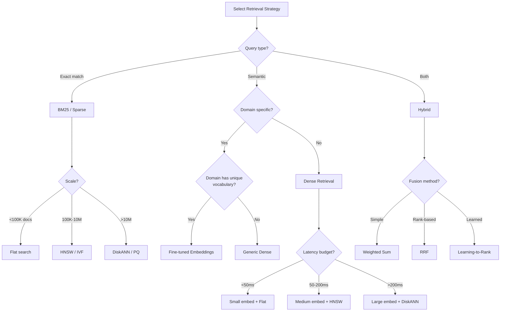
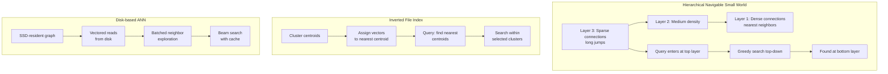
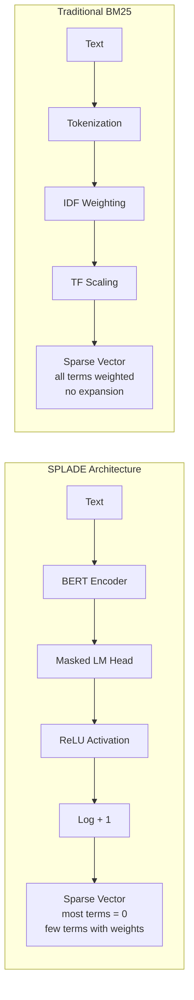
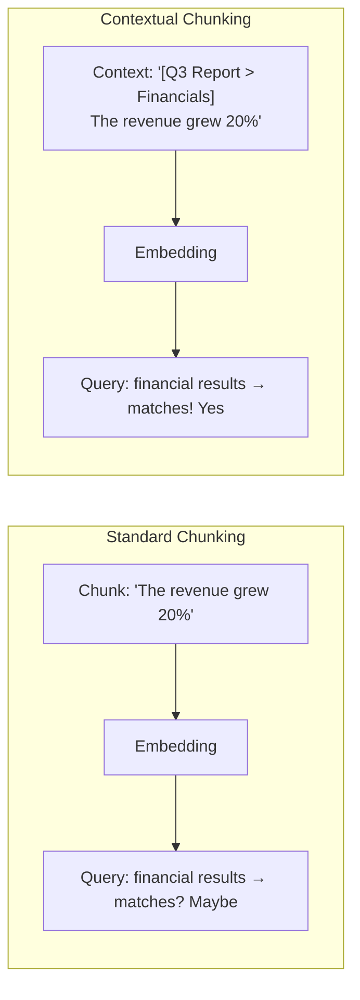
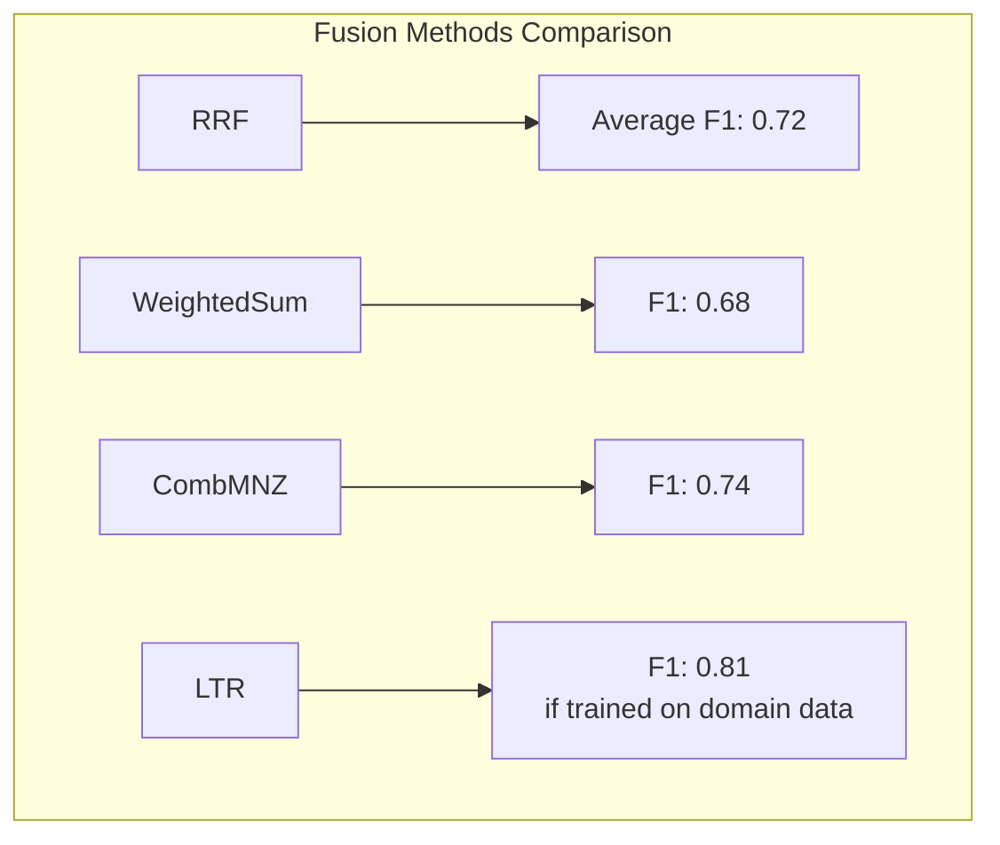

# Retrieval Strategies

**Links**: [[RAG Architecture]] | [[Embedding Models for RAG]] | [[Vector Databases for RAG]] | [[Reranking]] | [[Chunking Strategies]]

## Dense Retrieval (Semantic)

Uses neural embeddings to find documents by meaning, not keywords. Understands synonyms and paraphrases but may miss exact keyword matches.

## Sparse Retrieval (Keyword)

Uses BM25 or TF-IDF for exact term matching.

```python
from rank_bm25 import BM25Okapi

tokenized_docs = [doc.split() for doc in documents]
bm25 = BM25Okapi(tokenized_docs)
scores = bm25.get_scores(query.split())
```

Fast, no training needed, but can't handle synonyms.

## Hybrid Retrieval

Combines dense and sparse scores.

```python
def hybrid_search(query, dense_weight=0.5):
    dense_scores = min_max_normalize(dense_retrieve(query))
    sparse_scores = min_max_normalize(bm25_retrieve(query))
    return dense_weight * dense_scores + (1 - dense_weight) * sparse_scores
```

## Reciprocal Rank Fusion (RRF)

```python
def rrf(dense, sparse, k=60):
    scores = {}
    for rank, doc in enumerate(dense):
        scores[doc] = scores.get(doc, 0) + 1 / (k + rank + 1)
    for rank, doc in enumerate(sparse):
        scores[doc] = scores.get(doc, 0) + 1 / (k + rank + 1)
    return sorted(scores, key=scores.get, reverse=True)
```

## Strategy Comparison

| Strategy | Recall | Precision | Latency |
|----------|--------|-----------|---------|
| Dense | High | Medium | Low |
| Sparse | Medium | High | Low |
| Hybrid | Highest | Highest | Medium |
| Multi-query | Very high | Medium | High |

---

## Retrieval Strategy Decision Tree



## Dense Retrieval Deep Dive

### ANN Index Types



| Index Type | Build Time | Query Latency | Memory | Recall@10 | Best For |
|-----------|-----------|---------------|--------|-----------|----------|
| **Flat (brute force)** | None | O(n) — slow | Full | 1.0 (exact) | <10K docs, debugging |
| **IVF** (Inverted File) | Fast | Low | Medium | 0.85–0.95 | 100K–1M docs |
| **IVF+PQ** (Product Quant.) | Medium | Very low | Very low | 0.80–0.90 | >1M docs, memory bound |
| **HNSW** | Medium | Lowest | High | 0.95–0.99 | 100K–10M docs, high recall |
| **DiskANN** | Slow | Low | Low (disk) | 0.90–0.97 | >10M docs, large scale |

### HNSW Configuration

```python
import hnswlib

def build_hnsw_index(embeddings: np.ndarray, dim: int = 768,
                     ef_construction: int = 200, M: int = 16):
    """Build an HNSW index with tunable parameters."""
    index = hnswlib.Index(space='cosine', dim=dim)
    index.init_index(max_elements=len(embeddings),
                     ef_construction=ef_construction, M=M)
    index.add_items(embeddings, np.arange(len(embeddings)))

    # ef controls search speed/recall tradeoff
    index.set_ef(50)  # Higher = slower but more accurate
    return index

def search_hnsw(index, query_emb: np.ndarray, k: int = 10, ef: int = 100):
    """Search with dynamic ef for per-query tuning."""
    index.set_ef(ef)
    labels, distances = index.knn_query(query_emb, k=k)
    return labels[0], distances[0]

def tune_hnsw_ef(embeddings, queries, ground_truth, ef_values: list[int]):
    """Find optimal ef for your latency budget."""
    for ef in ef_values:
        index = build_hnsw_index(embeddings, ef_construction=200, M=16)
        index.set_ef(ef)
        recalls = []
        latencies = []
        for query, truth in zip(queries, ground_truth):
            start = time.time()
            labels, _ = index.knn_query(query, k=10)
            latencies.append(time.time() - start)
            recalls.append(len(set(labels[0]) & set(truth)) / len(truth))
        print(f"ef={ef}: Recall={np.mean(recalls):.3f}, "
              f"Latency={np.mean(latencies)*1000:.1f}ms")
```

## Sparse Retrieval Deep Dive

### BM25 Variants

```python
from rank_bm25 import BM25Okapi, BM25L, BM25Plus

def compare_bm25_variants(documents: list[list[str]], queries: list[list[str]]):
    """Compare BM25 variants on a test set."""
    variants = {
        "BM25": BM25Okapi(documents),
        "BM25L": BM25L(documents),
        "BM25+": BM25Plus(documents),
    }

    for name, model in variants.items():
        scores = [model.get_scores(q) for q in queries]
        avg_top_score = np.mean([np.max(s) for s in scores])
        print(f"{name}: avg top score = {avg_top_score:.3f}")
```

| Variant | Difference | When to Use |
|---------|-----------|-------------|
| **BM25** (Okapi) | Standard | General purpose |
| **BM25L** | Adjusts for document length | Long documents vary greatly |
| **BM25+** | Adds lower-bound delta | Short queries, long docs |
| **BM25-adpt** | Adaptive parameter tuning | Domain-specific collections |

### Field Boosting

```python
from rank_bm25 import BM25Okapi

class FieldBoostedBM25:
    """BM25 with per-field weights (e.g. title more important than body)."""

    def __init__(self, fields: dict[str, list[list[str]]], weights: dict[str, float]):
        self.fields = fields
        self.weights = weights
        self.models = {
            field: BM25Okapi(tokens)
            for field, tokens in fields.items()
        }

    def get_scores(self, query_tokens: list[str]) -> dict[int, float]:
        doc_scores = {}
        for field, weight in self.weights.items():
            field_scores = self.models[field].get_scores(query_tokens)
            for doc_id, score in enumerate(field_scores):
                doc_scores[doc_id] = doc_scores.get(doc_id, 0) + weight * score
        return doc_scores

# Usage
field_retriever = FieldBoostedBM25(
    fields={"title": title_tokens, "body": body_tokens, "tags": tag_tokens},
    weights={"title": 0.5, "body": 0.3, "tags": 0.2}
)
```

## Learned Sparse Retrieval

Learned sparse models learn term weighting directly, producing sparse vectors with meaningful term weights.

### SPLADE

```python
from transformers import AutoModelForMaskedLM, AutoTokenizer
import torch

class SPLADERetriever:
    """SPLADE: Sparse Lexical and Expansion Model."""

    def __init__(self, model_name: str = "naver/splade-v3"):
        self.tokenizer = AutoTokenizer.from_pretrained(model_name)
        self.model = AutoModelForMaskedLM.from_pretrained(model_name)

    def encode(self, text: str) -> dict[str, float]:
        inputs = self.tokenizer(text, return_tensors="pt",
                                truncation=True, max_length=512)
        with torch.no_grad():
            outputs = self.model(**inputs)

        # SPLADE uses ReLU + log on the MLM logits
        logits = torch.log(1 + torch.relu(outputs.logits))
        max_logits, _ = torch.max(logits, dim=1)

        # Create sparse term vector
        term_weights = {}
        for idx, weight in enumerate(max_logits[0]):
            if weight > 0:
                token = self.tokenizer.decode(idx)
                term_weights[token] = weight.item()

        return term_weights

    def similarity(self, query_vec: dict[str, float],
                   doc_vec: dict[str, float]) -> float:
        """Dot product of overlapping terms."""
        overlap = set(query_vec.keys()) & set(doc_vec.keys())
        return sum(query_vec[t] * doc_vec[t] for t in overlap)
```



### SPLADE vs uniCOIL vs Traditional

| Model | Expansion | Training | Index Size | Recall@1000 | Notes |
|-------|-----------|----------|------------|-------------|-------|
| BM25 | None | None | Small (terms only) | 0.65 | Baseline |
| SPLADE-v2-distil | Learned expansion | Distilled | 2x BM25 | 0.82 | Good general purpose |
| SPLADE-v3 | Learned expansion | Full training | 1.5x BM25 | 0.84 | Latest SPLADE |
| uniCOIL | Learned term weighting | Distilled | 1.2x BM25 | 0.78 | Simpler than SPLADE |
| COIL | Full attention | Full | 5x BM25 | 0.80 | Contextual matches |
| DeepImpact | Learned impact scores | Full | 1x BM25 | 0.76 | Fastest learned sparse |

```python
def compare_sparse_dense(documents, queries, relevant_docs):
    """Benchmark sparse vs dense vs learned sparse."""
    results = {}

    # BM25
    bm25 = BM25Okapi([d.split() for d in documents])
    results["BM25"] = evaluate(bm25, queries, relevant_docs)

    # SPLADE
    splade = SPLADERetriever()
    splade_index = [splade.encode(d) for d in documents]
    results["SPLADE"] = evaluate_splade(splade, splade_index, queries, relevant_docs)

    # Dense
    model = SentenceTransformer("BAAI/bge-base-en-v1.5")
    dense_index = model.encode(documents, normalize_embeddings=True)
    results["Dense"] = evaluate_dense(model, dense_index, queries, relevant_docs)

    return results
```

## Multi-Query Retrieval

### Query Expansion

```python
from typing import List

class QueryExpander:
    """Generate multiple query variants to improve recall."""

    def __init__(self, llm):
        self.llm = llm

    def expand_query(self, query: str, num_variants: int = 5) -> List[str]:
        prompt = f"""Generate {num_variants} different phrasings of the following search query.
Each variant should capture a different aspect or use different terminology.
Return one per line, no numbering.

Original: {query}
Variants:"""
        response = self.llm.generate(prompt)
        variants = [q.strip() for q in response.split("\n") if q.strip()]
        return [query] + variants[:num_variants]

    def retrieve_expanded(self, query: str, retriever, k: int = 10) -> List[str]:
        variants = self.expand_query(query)
        all_results = []
        for v in variants:
            all_results.extend(retriever.retrieve(v, top_k=k * 2))
        # Deduplicate and re-rank by frequency
        from collections import Counter
        doc_counts = Counter(all_results)
        return [doc for doc, _ in doc_counts.most_common(k)]
```

### HyDE (Hypothetical Document Embeddings)

HyDE generates a hypothetical ideal document for the query, then retrieves documents similar to that.

```python
class HyDERetriever:
    """Hypothetical Document Embeddings for improved retrieval."""

    def __init__(self, llm, embedder):
        self.llm = llm
        self.embedder = embedder

    def generate_hypothetical_doc(self, query: str, context: str = "") -> str:
        prompt = f"""Given the following question, write a paragraph that would be
the perfect answer. Be specific and detailed.

Question: {query}
{context}
Hypothetical answer:"""
        return self.llm.generate(prompt)

    def retrieve(self, query: str, k: int = 10) -> List[str]:
        hypothetical = self.generate_hypothetical_doc(query)
        hyde_emb = self.embedder.encode(hypothetical, normalize_embeddings=True)
        scores = hyde_emb @ self.index.T
        top_k = np.argsort(scores)[-k:][::-1]
        return [self.documents[i] for i in top_k]
```

```mermaid
flowchart TD
    subgraph HyDE_Pipeline
        Q[Query] --> LLM[LLM]
        LLM --> HD[Hypothetical Document<br/>"A relevant document would discuss..."]
        HD --> E[Embedder]
        E --> HE[HyDE Embedding]
        HE --> VS[Vector Search]
        VS --> R[Retrieved Docs]
    end
```

| Method | Recall@10 Gain | Latency Overhead | When to Use |
|--------|---------------|------------------|-------------|
| Query Expansion | +5-15% | 1 LLM call | Queries are short or ambiguous |
| HyDE | +10-20% | 1 LLM call + 1 embed | Domain has consistent document structure |
| Both combined | +15-25% | 2 LLM calls | Complex, multi-faceted queries |

## Multi-Hop Retrieval

For complex questions requiring multiple pieces of information assembled step by step.

```python
class MultiHopRetriever:
    """Retrieve → generate query → retrieve again for multi-hop questions."""

    def __init__(self, retriever, llm, max_hops: int = 3):
        self.retriever = retriever
        self.llm = llm
        self.max_hops = max_hops

    def retrieve(self, query: str, k_per_hop: int = 5) -> List[str]:
        context = []
        current_query = query

        for hop in range(self.max_hops):
            # Retrieve with current query
            docs = self.retriever.retrieve(current_query, top_k=k_per_hop)
            context.extend(docs)

            # Determine if another hop is needed
            needs_more = self._needs_more_info(query, context)
            if not needs_more:
                break

            # Generate next-hop query
            current_query = self._generate_next_query(query, context)

        return context[:10]

    def _needs_more_info(self, query: str, context: List[str]) -> bool:
        prompt = f"""Question: {query}
Current context: {' '.join(context[:3])}

Can this question be fully answered with the current context? Answer YES or NO.
If NO, what specific information is still missing? Be concise."""
        response = self.llm.generate(prompt)
        return "NO" in response.upper()[:5]

    def _generate_next_query(self, query: str, context: List[str]) -> str:
        prompt = f"""Original question: {query}
We already know: {' '.join(context[:3])}

What specific piece of information should we search for next? Query:"""
        return self.llm.generate(prompt)
```

```mermaid
flowchart TD
    Q[Initial Query<br/>"What caused the 2008 financial crisis?"] --> R1[Retrieve: Mortgage-backed securities]
    R1 --> A1[Analyze: Mentions CDOs]
    A1 --> NQ2[Next Query:<br/>"How did CDOs work?"]
    NQ2 --> R2[Retrieve: Collateralized Debt Obligations]
    R2 --> A2[Analyze: Mentions rating agencies]
    A2 --> NQ3[Next Query:<br/>"Role of rating agencies in 2008"]
    NQ3 --> R3[Retrieve: Credit rating failures]
    R3 --> S[Synthesize all evidence]
    S --> A[Final Answer]
```

## Contextual Retrieval

Augmenting chunks with metadata for better retrieval.

```python
def contextual_chunk(doc_title: str, section: str, chunk_text: str,
                     chunk_index: int, total_chunks: int) -> dict:
    """Create a rich context-augmented chunk."""
    return {
        "title": doc_title,
        "section": section,
        "chunk": chunk_index + 1,
        "total_chunks": total_chunks,
        "text": chunk_text,
        "embedding_text": f"{doc_title} | {section} | {chunk_text}",
        "metadata": {
            "source": doc_title,
            "section": section,
            "position": f"{chunk_index + 1}/{total_chunks}"
        }
    }

def contextual_embed(doc_title: str, section: str, chunk_text: str, embedder):
    """Embed chunk with context prefix for better retrieval."""
    # Prepend context to the text before embedding
    contextualized = f"[{doc_title} > {section}] {chunk_text}"
    return embedder.encode(contextualized, normalize_embeddings=True)
```



### Metadata Filtering

```python
class MetadataFilteredRetriever:
    """Hybrid search with structured metadata filters."""

    def __init__(self, vector_index, metadata_index):
        self.vector_index = vector_index
        self.metadata_index = metadata_index

    def search(self, query_emb: np.ndarray, filters: dict = None,
               k: int = 10, alpha: float = 0.5) -> List[dict]:
        # Dense search
        dense_scores, dense_ids = self.vector_index.search(query_emb, k=k * 3)

        # Sparse search (if applicable)
        sparse_scores, sparse_ids = self.metadata_index.search(query, k=k * 3)

        # Apply metadata filter
        if filters:
            dense_ids = self._apply_filters(dense_ids, filters)
            sparse_ids = self._apply_filters(sparse_ids, filters)

        # Hybrid fusion
        combined = rrf(dense_ids, sparse_ids, k=60)

        return combined[:k]

    def _apply_filters(self, doc_ids: List[int], filters: dict) -> List[int]:
        filtered = []
        for did in doc_ids:
            meta = self.metadata_index.get_metadata(did)
            if all(meta.get(k) == v for k, v in filters.items()):
                filtered.append(did)
        return filtered

# Usage
results = retriever.search(
    query_emb,
    filters={"date_range": ("2024-01-01", "2024-12-31"),
             "category": "technical_report",
             "language": "en"}
)
```

## Fusion Strategies Beyond RRF

| Method | Formula | When to Use |
|--------|---------|-------------|
| **RRF** | `score = Σ 1/(k + rank)` | Simple, robust default |
| **Weighted Sum** | `score = α*dense + (1-α)*sparse` | When scores are normalized |
| **Max Score** | `score = max(dense, sparse)` | Complementary strategies |
| **CombSUM** | `score = dense + sparse` | When scores are comparable |
| **CombMNZ** | `score = count_nonzero * (dense + sparse)` | Promotes docs found by both |
| **Learning-to-Rank** | `score = model(dense, sparse, features)` | When you have training data |

```python
import numpy as np
from sklearn.ensemble import GradientBoostingRegressor

class LearningToRankFusion:
    """Learn optimal fusion weights from training data."""

    def __init__(self):
        self.model = GradientBoostingRegressor(n_estimators=100, max_depth=3)

    def extract_features(self, dense_score: float, sparse_score: float,
                         dense_rank: int, sparse_rank: int) -> np.ndarray:
        return np.array([
            dense_score, sparse_score,
            dense_rank, sparse_rank,
            1.0 / (60 + dense_rank),
            1.0 / (60 + sparse_rank),
            dense_score * sparse_score,  # Interaction feature
            dense_rank + sparse_rank,      # Combined rank
            abs(dense_rank - sparse_rank), # Rank disagreement
        ]).reshape(1, -1)

    def train(self, queries, dense_results, sparse_results, relevance_labels):
        X, y = [], []
        for query, dense, sparse, labels in zip(queries, dense_results,
                                                 sparse_results, relevance_labels):
            for doc_id in set(dense.keys()) | set(sparse.keys()):
                features = self.extract_features(
                    dense.get(doc_id, 0), sparse.get(doc_id, 0),
                    dense.get(doc_id, {}).get("rank", 9999),
                    sparse.get(doc_id, {}).get("rank", 9999)
                )
                X.append(features[0])
                y.append(labels.get(doc_id, 0))
        self.model.fit(np.array(X), np.array(y))

    def predict(self, dense_score, sparse_score, dense_rank, sparse_rank):
        features = self.extract_features(dense_score, sparse_score,
                                          dense_rank, sparse_rank)
        return self.model.predict(features)[0]
```

### Fusion Strategy Benchmark



| Method | NDCG@10 | Recall@10 | Training Required | Robustness |
|--------|---------|-----------|-------------------|------------|
| RRF (k=60) | 0.72 | 0.85 | No | High |
| Weighted Sum (α=0.5) | 0.68 | 0.82 | No | Medium |
| CombMNZ | 0.74 | 0.87 | No | Medium |
| Borda Count | 0.70 | 0.83 | No | Medium |
| Condorcet Fuse | 0.71 | 0.84 | No | Low (expensive) |
| Learning-to-Rank | 0.81 | 0.91 | Yes | High (in-domain) |

## Late Chunking / ColBERT-Style Token-Level Retrieval

Instead of chunk-first-then-embed, ColBERT keeps all tokens and retrieves at the token level.

```python
class LateChunkingRetriever:
    """Token-level retrieval without lossy chunking."""

    def __init__(self, model):
        self.model = model  # ColBERT or similar

    def index_document(self, doc_id: str, text: str):
        # Store full token-level embeddings per document
        token_embs = self.model.encode(text, output_token_embeddings=True)
        self.index[doc_id] = token_embs

    def search(self, query: str, k: int = 10) -> List[dict]:
        q_embs = self.model.encode(query, output_token_embeddings=True)

        # MaxSim over all token pairs for each document
        scores = {}
        for doc_id, doc_embs in self.index.items():
            sim_matrix = torch.matmul(q_embs, doc_embs.T)  # [q_len, d_len]
            max_scores = sim_matrix.max(dim=-1).values      # [q_len]
            scores[doc_id] = max_scores.sum().item()        # scalar

        return sorted(scores.items(), key=lambda x: x[1], reverse=True)[:k]
```

## Caching Retrieved Results

```python
from functools import lru_cache
import time

class CachedRetriever:
    """Cache retrieval results for repeated queries."""

    def __init__(self, retriever, cache_ttl: int = 3600, max_size: int = 1000):
        self.retriever = retriever
        self.cache = {}
        self.cache_ttl = cache_ttl
        self.max_size = max_size

    def retrieve(self, query: str, top_k: int = 10) -> List[str]:
        cache_key = f"{query}:{top_k}"

        if cache_key in self.cache:
            cached_time, cached_results = self.cache[cache_key]
            if time.time() - cached_time < self.cache_ttl:
                return cached_results

        results = self.retriever.retrieve(query, top_k=top_k)

        # Manage cache size
        if len(self.cache) >= self.max_size:
            oldest_key = min(self.cache.keys(),
                             key=lambda k: self.cache[k][0])
            del self.cache[oldest_key]

        self.cache[cache_key] = (time.time(), results)
        return results
```

| Cache Strategy | Hit Rate | Memory | Complexity |
|---------------|----------|--------|------------|
| LRU (Last Recently Used) | Medium | Low | Low |
| TTL-based (time-to-live) | High (bursts) | Medium | Low |
| Semantic cache (similar queries) | Very high | High | High |
| No cache (baseline) | 0% | None | None |

## Performance Benchmarks: Recall@k vs Latency

```mermaid
flowchart LR
    subgraph Benchmarks[Recall@k vs Latency]
        BM25_1[BM25: 65% recall<br/>5ms latency] --> DENSE1[Dense: 78% recall<br/>20ms latency]
        DENSE1 --> HYBRID1[Hybrid: 85% recall<br/>30ms latency]
        HYBRID1 --> MQ1[Multi-query: 90% recall<br/>200ms latency]
        MQ1 --> LR1[+Rerank: 94% recall<br/>400ms latency]
    end
```

| Strategy | Recall@10 | Recall@100 | P50 Latency | P99 Latency | Throughput (QPS) |
|----------|-----------|------------|-------------|-------------|------------------|
| BM25 (Sparse) | 0.62 | 0.85 | 2ms | 10ms | 5,000 |
| Dense (HNSW, 768d) | 0.75 | 0.92 | 15ms | 50ms | 2,000 |
| Hybrid (BM25 + Dense) | 0.82 | 0.95 | 25ms | 80ms | 1,500 |
| Hybrid + Rerank | 0.91 | 0.97 | 300ms | 1,200ms | 200 |
| Multi-Query (3 variants) | 0.88 | 0.96 | 200ms | 800ms | 300 |
| Multi-Query + Rerank | 0.93 | 0.98 | 500ms | 2,000ms | 80 |
| Learned Sparse (SPLADE) | 0.80 | 0.94 | 10ms | 40ms | 3,000 |
| HyDE + Dense | 0.85 | 0.95 | 500ms | 1,500ms | 100 |

### Latency Budget Guidelines

```python
def select_strategy(latency_budget_ms: int, recall_target: float,
                    num_docs: int, qps: int) -> str:
    """Recommend retrieval strategy based on constraints."""
    if latency_budget_ms < 10:
        if recall_target < 0.7:
            return "BM25"
        elif num_docs < 100_000:
            return "Flat Dense (exact)"
        else:
            return "HNSW Dense"
    elif latency_budget_ms < 50:
        if recall_target < 0.85:
            return "Hybrid (BM25 + HNSW Dense)"
        else:
            return "Hybrid + SPLADE"
    elif latency_budget_ms < 200:
        if qps < 500:
            return "Hybrid + Cross-Encoder Rerank"
        else:
            return "Hybrid + Lightweight Rerank (MiniLM)"
    else:  # > 200ms
        return "Multi-Query + HyDE + Rerank (highest quality)"
```

### Scaling Guide

```python
def scaling_guide(num_documents: int, queries_per_day: int):
    """Provide infrastructure recommendations based on scale."""
    print(f"Scale: {num_documents:,} documents, {queries_per_day:,} QPD")

    if num_documents < 10_000:
        print("→ In-memory Flat index, no vector DB needed")
        print("→ BM25 or simple numpy cosine similarity")
    elif num_documents < 1_000_000:
        print("→ HNSW or IVF index")
        print("→ Single GPU for embedding, 16-32GB RAM")
        print("→ Recommended: Qdrant or Milvus (standalone)")
    elif num_documents < 100_000_000:
        print("→ DiskANN or IVF+PQ for memory efficiency")
        print("→ Distributed vector DB (Milvus, Weaviate)")
        print("→ Batch embedding with multi-GPU")
        print("→ Consider sharding by language or domain")
    else:
        print("→ Distributed DiskANN cluster")
        print("→ Tiered storage: hot (SSD) + cold (S3)")
        print("→ Query routing with domain-aware partitions")
        print("→ Consider learned sparse + dense hybrid")

    if queries_per_day > 1_000_000:
        print("\nHigh-throughput recommendations:")
        print("→ Add retrieval result caching (TTL-based)")
        print("→ Use smaller embedding model for first pass")
        print("→ Batch queries where possible")
        print("→ Consider skipping reranking for simple queries")
```

---

**Next**: [[Reranking]] — Improve precision