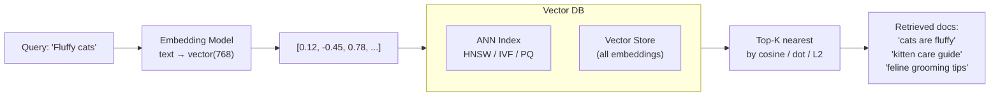
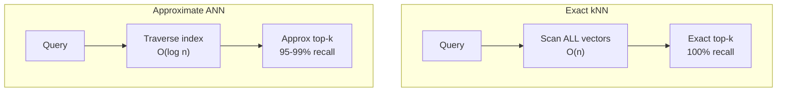
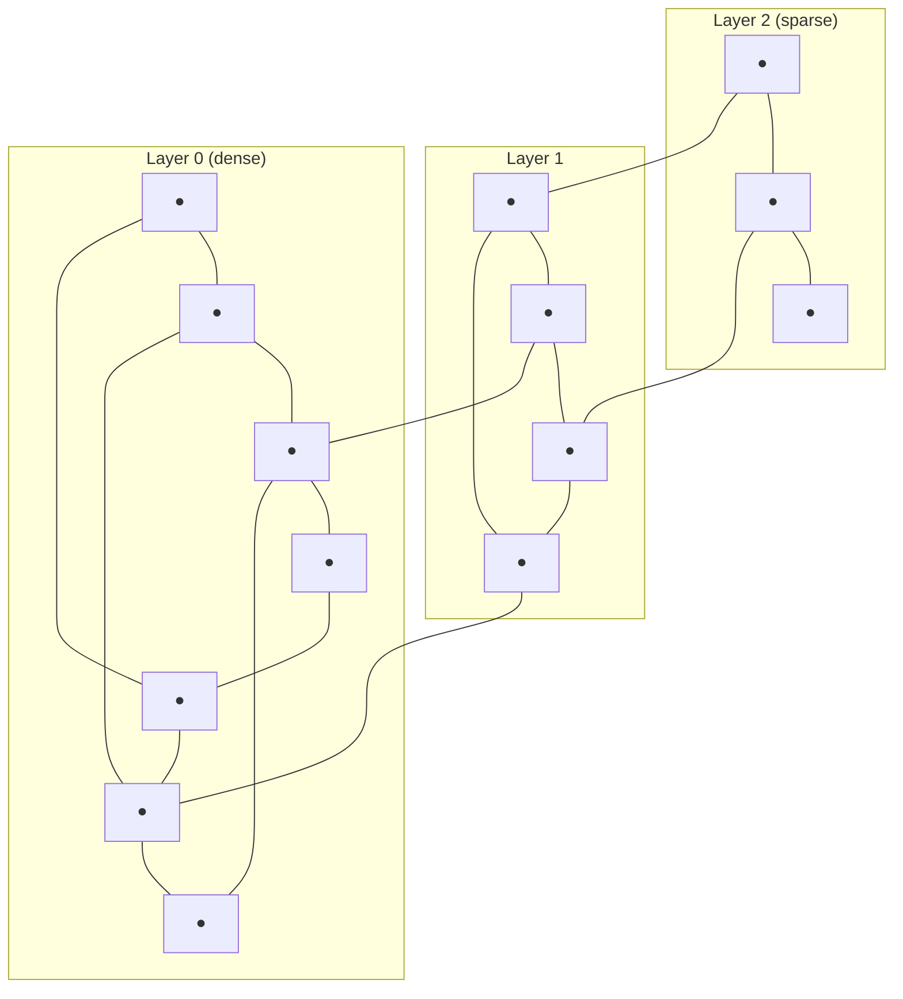
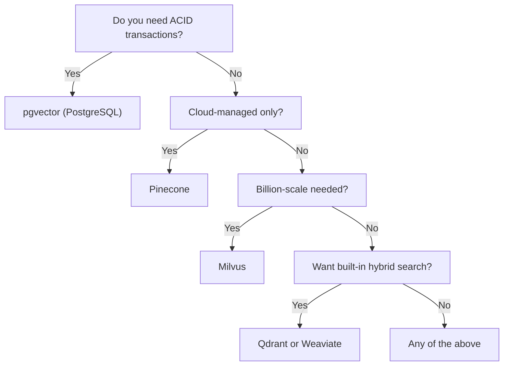
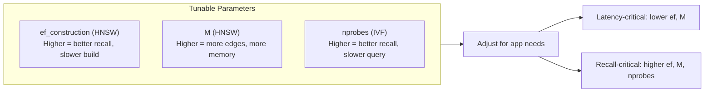

# Vector Databases for RAG

**Links**: [[RAG Architecture]] | [[Embedding Models for RAG]] | [[Retrieval Strategies]] | [[Database Indexing Deep Dive]] | [[Database Engines Compared]] | [[Hybrid Search for RAG]]

---

## What Problem Does a Vector Database Solve?

A regular database (PostgreSQL, MySQL) finds exact matches. For RAG you need **semantic** matches — documents whose *meaning* is similar to the query, even if they share no exact words.

```
Regular DB:   WHERE title = 'cat'        → exact match only
Vector DB:    ORDER BY similarity(embedding, query_vec) DESC  → "kitten", "feline", "pet" also match
```

The vector database converts this semantic search into a **nearest neighbor problem** in high-dimensional space.



---

## How ANN Search Works (vs Exact Search)

### Exact kNN

Compare the query vector against **every** stored vector. Guarantees perfect recall. But O(n) per query — unusable at scale.

```
For 1M vectors of dimension 768:
  Exact search: ~500ms (must scan all 1M)
  ANN search:   ~5ms   (uses index to skip most)
```

### Approximate Nearest Neighbor (ANN)

Trades a tiny amount of recall (95-99%) for massive speed gains (100x). The index organizes vectors so that only a fraction need to be compared.



---

## ANN Index Types — Deep Dive

### HNSW (Hierarchical Navigable Small World)

The gold standard. Builds multi-layer graphs where higher layers are sparse (long jumps) and lower layers are dense (fine-grained).



- **How search works**: Start at top layer (few nodes, long jumps to find neighborhood), descend through layers refining the search.
- **Pros**: Fastest query speed, highest recall
- **Cons**: High memory usage, slow index build
- **Best for**: Latency-sensitive apps, small-to-medium datasets (<10M)

### IVF (Inverted File Index)

Clusters vectors into Voronoi cells. Search only looks at the nearest cells.

```
Vectors → k-means clustering → N centroids
Query → find nearest centroid(s) → search within those cells
```

- **Pros**: Fast build, reasonable speed, low memory
- **Cons**: Lower recall than HNSW (unless many probes)
- **Best for**: Large datasets where build time matters

### IVF + PQ (Product Quantization)

Compresses vectors by splitting them into sub-vectors and quantizing each. Dramatically reduces memory.

```
Original:   vector(768) × float32 = 3072 bytes
After PQ:   vector(768) → 96 sub-vectors × 1 byte each = 96 bytes (32x compression)
```

- **Pros**: Very low memory, good for disk-based index
- **Cons**: Slower query, lower recall than pure IVF
- **Best for**: Memory-constrained environments, very large datasets

### DiskANN

Like HNSW but stores graph on SSD with smart caching. Designed for billion-scale datasets.

- **Pros**: Handles billion-scale on a single machine, good recall
- **Cons**: Higher latency (disk reads), more complex setup
- **Best for**: Billion-scale datasets, cost-sensitive deployments

### Comparison Matrix

| Index | Query Speed | Recall (top-10) | Memory | Build Time | Scale |
|-------|-------------|-----------------|--------|------------|-------|
| **HNSW** | ⚡ 2ms | 99% | High (20GB/1M) | Slow | <10M |
| **IVF** | ⚡ 10ms | 90-95% | Medium (8GB/1M) | Fast | <100M |
| **IVF+PQ** | ⚡ 20ms | 85-90% | Low (1GB/1M) | Fast | <1B |
| **DiskANN** | ⚡ 5ms | 95% | Low (disk) | Medium | >1B |

Values approximate for 768-dim vectors at 1M scale. Your mileage varies by data distribution.

---

## Vector Database Comparison

| Feature | pgvector | Qdrant | Weaviate | Pinecone | Milvus |
|---------|----------|--------|----------|----------|--------|
| **Open source** | ✅ | ✅ | ✅ | ❌ | ✅ |
| **Hosting** | Self (any PG) | Self + Cloud | Self + Cloud | Cloud-only | Self + Cloud |
| **Query language** | SQL + vector | REST/gRPC + client | GraphQL + client | REST + client | REST + gRPC + client |
| **Index types** | HNSW, IVF | HNSW | HNSW | HNSW | HNSW, IVF, DiskANN |
| **Filtering** | WHERE + index | Payload filter | Where filter | Metadata filter | Scalar filter |
| **Quantization** | ❌ | Scalar + Product | ❌ | ❌ | Product |
| **Multi-tenancy** | Schema per tenant | Collections | Tenancy | Namespaces | Collections |
| **Hybrid search** | ❌ (use external) | ✅ Sparse + Dense | ✅ Sparse + Dense | ✅ (2024) | ✅ Sparse + Dense |
| **ACID** | ✅ (PostgreSQL) | ❌ | ❌ | ❌ | ❌ |
| **GPU acceleration** | ❌ | ❌ | ❌ | ❌ | ✅ |

---

## Filtering Strategies

Vector search with metadata filters is the most common enterprise pattern. How each database handles it matters:

### Pre-filtering vs Post-filtering

```
Post-filter (naive):
  ANN search top-100 by similarity
  THEN filter by category = "programming"
  Problem: Might get 0 results if the top-100 don't match the filter

Pre-filter (smart):
  Identify which vectors match the filter FIRST
  THEN ANN search within that subset
  Problem: Hard to do efficiently with ANN indexes
```

**Qdrant's approach**: Pre-filtering with a separate bitmap index. Fastest for selective filters.

**pgvector's approach**: Combine HNSW with PostgreSQL's B-tree index on the filter column. Uses both indexes in parallel.

**Milvus's approach**: Scalar indexing on filter fields + vector index. Automatically chooses pre-filter or post-filter based on selectivity.

---

## Choosing a Vector Database



---

## Understanding Distance Metrics

| Metric | Formula | What It Measures | Best For |
|--------|---------|-----------------|----------|
| **Cosine** | 1 - cos(θ) | Angle between vectors | Text embeddings (default) |
| **Dot product** | Σ x_i × y_i | Similarity + magnitude | Normalized vectors, OpenAI ada |
| **Euclidean (L2)** | √Σ(x_i - y_i)² | Straight-line distance | Image embeddings, numeric data |
| **Inner product** | -Σ x_i × y_i | Maximizes dot product | Recommendation systems |

**Important**: OpenAI embeddings (text-embedding-3-*) use cosine by convention. Cohere embeddings use dot product. Always check the model's expected metric.

---

## Practical: pgvector with Node.js

```javascript
import pg from 'pg';

const client = new pg.Client({ connectionString: process.env.DATABASE_URL });
await client.connect();

// Create table with vector column
await client.query(`
  CREATE TABLE IF NOT EXISTS documents (
    id UUID PRIMARY KEY DEFAULT gen_random_uuid(),
    content TEXT,
    metadata JSONB,
    embedding vector(1536)
  )
`);

// Insert with embedding
await client.query(
  `INSERT INTO documents (content, metadata, embedding)
   VALUES ($1, $2, $3)`,
  [content, metadata, embedding]
);

// Create HNSW index (one-time, takes a while)
await client.query(`
  CREATE INDEX IF NOT EXISTS idx_docs_embedding
  ON documents USING hnsw (embedding vector_cosine_ops)
`);

// Search
const result = await client.query(
  `SELECT content, metadata, 1 - (embedding <=> $1) AS similarity
   FROM documents
   ORDER BY embedding <=> $1
   LIMIT 10`,
  [queryEmbedding]
);
```

## Practical: Qdrant with Python

```python
from qdrant_client import QdrantClient, models

client = QdrantClient("localhost", port=6333)

# Create collection
client.create_collection(
    collection_name="my_docs",
    vectors_config=models.VectorParams(
        size=768,
        distance=models.Distance.COSINE
    )
)

# Insert with payload
client.upsert(
    collection_name="my_docs",
    points=models.Batch(
        ids=[1, 2, 3],
        vectors=[vec1, vec2, vec3],
        payloads=[
            {"title": "doc1", "category": "ai"},
            {"title": "doc2", "category": "ml"},
            {"title": "doc3", "category": "ai"},
        ]
    )
)

# Search with filter
results = client.search(
    collection_name="my_docs",
    query_vector=query_vec,
    query_filter=models.Filter(
        must=[
            models.FieldCondition(
                key="category",
                match=models.MatchValue(value="ai")
            )
        ]
    ),
    limit=10
)
```

---

## Vector DB Performance Tuning

### Recall vs Latency Tradeoff



### Rule of Thumb Parameters

| Goal | HNSW ef | HNSW M | IVF nprobes |
|------|---------|--------|-------------|
| Max speed | 100 | 12 | 1 |
| Balanced | 200 | 16 | 10 |
| Max recall | 500+ | 32 | 50+ |

---

## Common Pitfalls

| Pitfall | Why It Hurts | Fix |
|---------|-------------|-----|
| Using wrong distance metric | Embedding model expects cosine, you use L2 — results are wrong | Check model docs |
| Not normalizing vectors | Dot product behaves differently on unnormalized vectors | Normalize to unit length |
| Creating index before loading data | HNSW build is slow on large datasets | Load 80%, build index, load 20% |
| Ignoring memory requirements | HNSW can use 20GB+ for 1M vectors | Use PQ quantization or DiskANN |
| Post-filtering with selective filters | Post-filter returns 0 results | Use pre-filtering |

---

## When NOT to Use a Vector Database

Vector DBs are not always the answer. Consider alternatives:

| Alternative | When to Use |
|-------------|-------------|
| Full-text search (Elasticsearch) | Exact keyword matching, prefix queries, fuzzy text |
| Graph DB (Neo4j) | Entity-relationship traversal, multi-hop reasoning |
| Relational DB | Filtering by structured fields, range queries, aggregation |
| Key-value store | Simple lookup by ID, no similarity needed |

Many systems combine vector search with full-text search — see [[Hybrid Search for RAG]].

---

## Key Takeaways

1. Vector databases solve **semantic similarity search** — finding meaning, not exact keywords
2. **ANN indexes** (HNSW, IVF, PQ) trade tiny recall loss for 100x speed gain vs exact search
3. **HNSW** is the default choice for most applications (best speed/recall balance)
4. **Distance metric** must match the embedding model — cosine for OpenAI, dot for Cohere
5. **Filtering strategy** (pre vs post) significantly impacts accuracy with metadata constraints
6. **pgvector** is excellent if you already use PostgreSQL — no new infrastructure needed
7. For **billion-scale**, use Milvus or DiskANN; for most apps, Qdrant or pgvector suffice

**Next**: [[Embedding Models for RAG]] — Choose the right embedding model to pair with your vector DB
