# 🔍 RAG (Retrieval-Augmented Generation) — Map of Content

Retrieval-Augmented Generation (RAG) combines information retrieval with large language models to produce grounded, up-to-date, and verifiable answers. This folder covers the full RAG stack: architecture patterns, embedding models, vector databases, chunking strategies, retrieval techniques (dense, sparse, hybrid), reranking, evaluation metrics, and advanced patterns (agentic RAG, graph RAG, corrective RAG). Start with [[AI-ML/RAG/RAG Architecture]] for a high-level overview.

**Parent**: [[AI-ML/_MOC|AI/ML]]

```mermaid
graph TD
  RAG["RAG"] --> FUND["Fundamentals"]
  RAG --> INDEX["Indexing"]
  RAG --> RET["Retrieval"]
  RAG --> ADV["Advanced Patterns"]
  RAG --> EVAL["Evaluation"]

  FUND --> ARCH["RAG Architecture"]
  FUND --> RVF["RAG vs Fine-tuning"]

  INDEX --> CHUNK["Chunking Strategies"]
  INDEX --> EMB["Embedding Models for RAG"]
  INDEX --> VDB["Vector Databases for RAG"]

  RET --> RET2["Retrieval Strategies"]
  RET --> RERANK["Reranking"]
  RET --> HYBRID["Hybrid Search for RAG"]

  ADV --> ARAG["Advanced RAG Patterns"]
  ADV --> AGENT["Agentic RAG"]
  ADV --> GRAG["Graph RAG"]
  ADV --> MM["Multi-Modal RAG"]
  ADV --> PER["Prompt Engineering for RAG"]
  ADV --> OPT["RAG Pipeline Optimization"]

  EVAL --> EVAL2["Evaluation of RAG Systems"]
  EVAL --> MET["RAG Evaluation Metrics"]
```

## Topics

| Category | Notes |
|----------|-------|
| **Fundamentals** | [[RAG Architecture]], [[RAG vs Fine-tuning]] |
| **Indexing** | [[Chunking Strategies]], [[Embedding Models for RAG]], [[Vector Databases for RAG]] |
| **Retrieval** | [[Retrieval Strategies]], [[Reranking]], [[Hybrid Search for RAG]] |
| **Advanced** | [[Advanced RAG Patterns]], [[Agentic RAG]], [[Graph RAG]], [[Multi-Modal RAG]], [[Prompt Engineering for RAG]], [[RAG Pipeline Optimization]] |
| **Evaluation** | [[Evaluation of RAG Systems]], [[RAG Evaluation Metrics]] |

## Cross-Domain Links

- [[AI-ML/RAG/Vector Databases for RAG]] → [[System-Design/Databases/Search Engines]], [[System-Design/Databases/Elasticsearch Deep Dive]]
- [[AI-ML/RAG/Graph RAG]] → [[System-Design/Databases/Neo4j and Graph Databases]], [[System-Design/Databases/Graph Databases]]
- [[AI-ML/RAG/Embedding Models for RAG]] → [[AI-ML/NLP/Text Embedding Models]]
- [[AI-ML/RAG/Agentic RAG]] → [[AI-ML/NLP/LLM Agents Framework]], [[AI-ML/NLP/Tool Use and Function Calling]]
- [[AI-ML/RAG/RAG Pipeline Optimization]] → [[DevOps/Monitoring/Monitoring and Observability]], [[DevOps/Infrastructure/Cloud Computing]]
