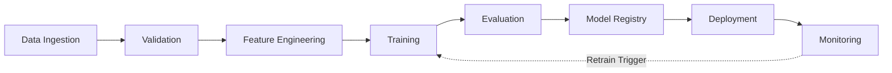

# 01 — MLOps

**Links**: [[_MOC]] | [[02 Model Serving]] | [[08 Infrastructure]] | [[07 Evaluation]]

Machine Learning Operations (MLOps) applies DevOps principles to ML workflows — automating the pipeline from data preparation through model deployment and monitoring.

## Core MLOps Pipeline



## Experiment Tracking

| Tool | Strengths | Best For |
|------|-----------|----------|
| **MLflow** | Lightweight, open-source, tracking + registry + serving | General purpose, any framework |
| **Weights & Biases** | Rich dashboards, collaboration, sweeps | Deep learning, hyperparameter search |
| **Neptune** | Metadata organization, team workspaces | Large teams, structured experiments |
| **Comet** | Auto-logging, compare experiments | Quick setup, PyTorch/TF integration |

Key metrics to log: loss curves, learning rate, gradient norms, validation metrics, GPU utilization, data distribution shifts.

## Model Registry

Central storage for model artifacts with versioning, metadata, and stage transitions (staging → production → archived).

```python
# MLflow example
import mlflow

with mlflow.start_run():
    mlflow.log_param("learning_rate", 0.001)
    mlflow.log_metric("accuracy", 0.95)
    mlflow.pytorch.log_model(model, "model")
    mlflow.register_model("runs:/<run_id>/model", "SentimentClassifier")
```

## CI/CD for ML

| Stage | What Happens | Tools |
|-------|-------------|-------|
| **CI** | Data validation, feature tests, training dry-run, eval threshold checks | GitHub Actions, Jenkins, Kubeflow |
| **CD** | Model deployment to staging, integration tests, canary rollout | ArgoCD, Flux, custom deploy scripts |
| **Continuous Training** | Scheduled retraining, drift-triggered retraining, data freshness checks | Airflow, Prefect, Dagster |

## Feature Stores

A feature store centralizes feature computation, storage, and serving:

- **Online serving**: Low-latency feature lookup at inference time (Redis, DynamoDB)
- **Offline serving**: Batch feature computation for training (Parquet, BigQuery)
- **Point-in-time correctness**: Avoids data leakage by joining features at the correct timestamp

| Feature Store | Strengths |
|---------------|-----------|
| **Feast** | Open-source, works with any infra, point-in-time joins |
| **Tecton** | Managed, streaming features, auto-engineering |
| **Vertex AI Feature Store** | GCP-native, integrated with BigQuery |

## A/B Testing & Rollout

- **Shadow deployment**: Run new model alongside old, compare outputs, no user impact
- **Canary deployment**: Route small % of traffic to new model, ramp up
- **Blue-green**: Swap entire traffic between two model versions
- **Feature flags**: Toggle model behavior without redeploying

**Links**: [[03 Distributed Training]] | [[08 Infrastructure]] | [[07 Evaluation]] | [[DevOps/CI-CD/_MOC]]

## External Resources

- [MLflow Documentation](https://mlflow.org/docs/latest/index.html)
- [Weights & Biases Docs](https://docs.wandb.ai/)
- [Feast Feature Store](https://feast.dev/)
- [Kubeflow Documentation](https://www.kubeflow.org/docs/)
- [DVC (Data Version Control)](https://dvc.org/)
- [Great Expectations — Data Validation](https://greatexpectations.io/)
- [MLOps Zoomcamp (DataTalksClub)](https://github.com/DataTalksClub/mlops-zoomcamp)
