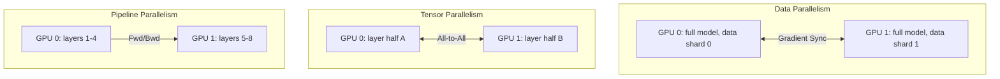

# 03 — Distributed Training & Scaling

**Links**: [[_MOC]] | [[01 MLOps]] | [[04 Model Optimization]] | [[08 Infrastructure]]

Training large models requires distributing compute across multiple GPUs and nodes. The right strategy depends on model size, GPU count, and memory constraints.

## Parallelism Strategies



| Strategy | How It Works | Best For | Communication |
|----------|-------------|----------|---------------|
| **Data Parallelism (DDP)** | Each GPU has full model, split data batches, sync gradients | Models that fit on one GPU (≤7B) | All-reduce gradients (frequent, small) |
| **Fully Sharded Data Parallel (FSDP)** | Shard model params, gradients, optimizer states across GPUs | Medium models (7B-70B) | All-gather weights per layer (frequent, medium) |
| **Tensor Parallelism (TP)** | Split each layer's weights across GPUs | Very large models (70B+) | All-reduce activations per layer (frequent, large) |
| **Pipeline Parallelism (PP)** | Split layers into stages, each GPU runs one stage | Large models, many GPUs | Point-to-point activations (infrequent, large) |
| **DeepSpeed ZeRO** | Stages 1-3: progressively shard optimizer, gradients, params | All sizes | Optimized with hybrid sharding |

## Training Memory Breakdown

For a model with P parameters at FP16 (2 bytes):

```
Weights:    2P  (FP16)
Gradients:  2P  (FP16)  ← ZeRO Stage 2 eliminates
Optimizer:  8P  (Adam: fp32 moments × 2)
Activations: Variable (checkpointing reduces)
─────────────────────────────────
Total:     12P + activations

With ZeRO-3: ~2P + activations (sharded across GPUs)
With QLoRA:  ~0.1P (4-bit base + LoRA adapters)
```

## Mixed Precision Training

| Precision | Memory | Range | Common Usage |
|-----------|--------|-------|-------------|
| **FP32** | 4 bytes/param | Full | Master weights, optimizer states |
| **FP16** | 2 bytes/param | Limited (±65k) | Forward/backward (w/ loss scaling) |
| **BF16** | 2 bytes/param | Wide (±3e38) | Forward/backward (no scaling needed) |
| **FP8** | 1 byte/param | Limited (E4/E5) | Forward pass, quantization-aware |

Always use BF16 when available (Ampere+ GPUs). It has the same range as FP32 with half the memory.

## Distributed Training Stack

```python
# FSDP: one flag to shard
from torch.distributed.fsdp import FullyShardedDataParallel as FSDP
from torch.distributed.fsdp import ShardingStrategy

model = FSDP(
    model,
    sharding_strategy=ShardingStrategy.FULL_SHARD,  # ZeRO-3
    mixed_precision=torch.distributed.fsdp.MixedPrecision(
        param_dtype=torch.bfloat16,
        reduce_dtype=torch.bfloat16,
        buffer_dtype=torch.bfloat16,
    ),
)
```

```python
# DeepSpeed: config-driven
# deepspeed_config.json
{
    "zero_optimization": { "stage": 3 },
    "fp16": { "enabled": true },
    "gradient_accumulation_steps": 4,
    "tensor_parallel": { "enabled": true, "tp_size": 8 },
    "flops_profiler": { "enabled": true }
}
```

## Checkpointing

- **Full checkpoint**: Save entire model state (weights + optimizer + scheduler). Slow but safe.
- **Sharded checkpoint** (FSDP/ZeRO): Each rank saves its shard. Fast, requires all ranks to restore.
- **LoRA checkpoint**: Save only adapter weights. Tiny (~10MB), flexible.
- **Resumability**: Save + load random states, dataloader state, and learning rate scheduler for exact resume.

## Hyperparameter Optimization

| Tool | Strategy | Strengths |
|------|----------|-----------|
| **Optuna** | TPE, CMA-ES, grid, random | Lightweight, pruning, distributed |
| **Ray Tune** | Population-based, ASHA, HyperOpt | Integrated with Ray, scalable |
| **Weights & Biases Sweeps** | Bayesian, grid, random | Easy setup, visualization |

**Links**: [[04 Model Optimization]] | [[02 Model Serving]] | [[08 Infrastructure]] | [[01 MLOps]]

## External Resources

- [PyTorch DDP Tutorial](https://pytorch.org/tutorials/intermediate/ddp_tutorial.html)
- [PyTorch FSDP Docs](https://pytorch.org/docs/stable/fsdp.html)
- [DeepSpeed GitHub](https://github.com/microsoft/DeepSpeed)
- [DeepSpeed ZeRO Paper](https://arxiv.org/abs/1910.02054)
- [Megatron-LM (Tensor/Pipeline Parallelism)](https://github.com/NVIDIA/Megatron-LM)
- [The Efficient Large Model Training Bible](https://github.com/mosaicml/llm-foundry)
- [Mixed Precision Training Paper](https://arxiv.org/abs/1710.03740)
- [Optuna](https://optuna.org/)
- [Ray Tune](https://docs.ray.io/en/latest/tune/)
